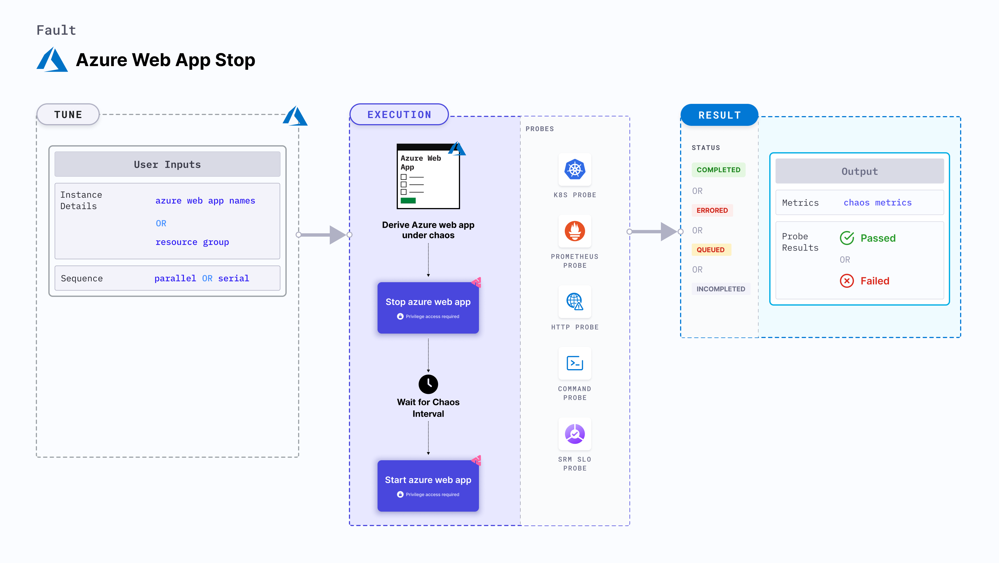

## Introduction
- It shutdowns the app and verify if the requests are re-routed to another instance on app service.
- It helps to check the performance of the web application when subjected to such chaos scenario.

:::tip Fault execution flow chart

:::

## Uses
<details>
<summary>View the uses of the fault</summary>
<div>
Web App stop is another very frequent scenario we find with Azure web app service which stops a running web app and impacts its delivery. Such scenarios can still occur despite whatever availability aids web app service provides.

Stopping the web app will disrupt its performance and impact the smooth working of the application. So this category of chaos experiment helps to build immunity to the application undergoing any such scenarios.
</div>
</details>

## Prerequisites
:::info
- Ensure that Kubernetes Version > 1.16.
- Ensure that you have sufficient Azure access to stop and start web apps. 
- We will use azure [ file-based authentication ](https://docs.microsoft.com/en-us/azure/developer/go/azure-sdk-authorization#use-file-based-authentication) to connect with the instance using Azure GO SDK in the experiment. For generating auth file run `az ad sp create-for-rbac --sdk-auth > azure.auth` Azure CLI command.
- Ensure to create a Kubernetes secret having the auth file created in the step in `CHAOS_NAMESPACE`. A sample secret file looks like:
```yaml
apiVersion: v1
kind: Secret
metadata:
  name: cloud-secret
type: Opaque
stringData:
  azure.auth: |-
    {
      "clientId": "XXXXXXXXX",
      "clientSecret": "XXXXXXXXX",
      "subscriptionId": "XXXXXXXXX",
      "tenantId": "XXXXXXXXX",
      "activeDirectoryEndpointUrl": "XXXXXXXXX",
      "resourceManagerEndpointUrl": "XXXXXXXXX",
      "activeDirectoryGraphResourceId": "XXXXXXXXX",
      "sqlManagementEndpointUrl": "XXXXXXXXX",
      "galleryEndpointUrl": "XXXXXXXXX",
      "managementEndpointUrl": "XXXXXXXXX"
    }
```
- If you change the secret key name (from `azure.auth`) please also update the `AZURE_AUTH_LOCATION` ENV value on `experiment.yaml`with the same name.
:::

## Default Validations
:::info
- Azure target web app should be in running state.
:::

## Fault tunables
<details>
    <summary>Check the Fault tunables</summary>
    <h2>Mandatory Fields</h2>
    <table>
        <tr>
            <th> Variables </th>
            <th> Description </th>
            <th> Notes </th>
        </tr>
        <tr> 
            <td> AZURE_WEB_APP_NAMES </td>
            <td> Name of azure web app services to target.</td>
            <td> Provide comma-separated names of the web apps </td>
        </tr>
        <tr>
            <td> RESOURCE_GROUP </td>
            <td> The resource group of the target web apps</td>
            <td> All the web apps must belong to the same resource group </td>
        </tr> 
    </table>
    <h2>Optional Fields</h2>
    <table>
        <tr>
            <th> Variables </th>
            <th> Description </th>
            <th> Notes </th>
        </tr>
        <tr> 
            <td> TOTAL_CHAOS_DURATION </td>
            <td> The total time duration for chaos insertion (sec) </td>
            <td> Defaults to 30s </td>
        </tr>
        <tr> 
            <td> CHAOS_INTERVAL </td>
            <td> The interval (in sec) between successive instance poweroff.</td>
            <td> Defaults to 30s </td>
        </tr>
        <tr>
            <td> SEQUENCE </td>
            <td> It defines sequence of chaos execution for multiple instance</td>
            <td> Default value: parallel. Supported: serial, parallel </td>
        </tr>
        <tr>
            <td> RAMP_TIME </td>
            <td> Period to wait before and after injection of chaos in sec </td>
            <td> Eg: 30 </td>
        </tr>
    </table>
</details>

## Fault Examples

### Common Fault Tunables

Refer the [common attributes](../common-tunables-for-all-experiments) to tune the common tunables for all the experiments.

### Stop Web App By Name

It contains comma separated list of web app names subjected to web app stop chaos. It can be tuned via `AZURE_WEB_APP_NAMES` ENV.

Use the following example to tune this:

[embedmd]:# (./static/manifests/azure-web-app-stop/web-app-stop.yaml yaml)
```yaml
# stop web app for a certain chaos duration 
apiVersion: litmuschaos.io/v1alpha1
kind: ChaosEngine
metadata:
  name: engine-nginx
spec:
  engineState: "active"
  annotationCheck: "false"
  chaosServiceAccount: litmus-admin
  experiments:
  - name: azure-web-app-stop
    spec:
      components:
        env:
        # comma separated names of the azure web app
        - name: AZURE_WEB_APP_NAMES
          value: 'webApp-01,webApp-02'
        # name of the resource group
        - name: RESOURCE_GROUP
          value: 'chaos-rg'
        - name: TOTAL_CHAOS_DURATION
          VALUE: '60'
```
