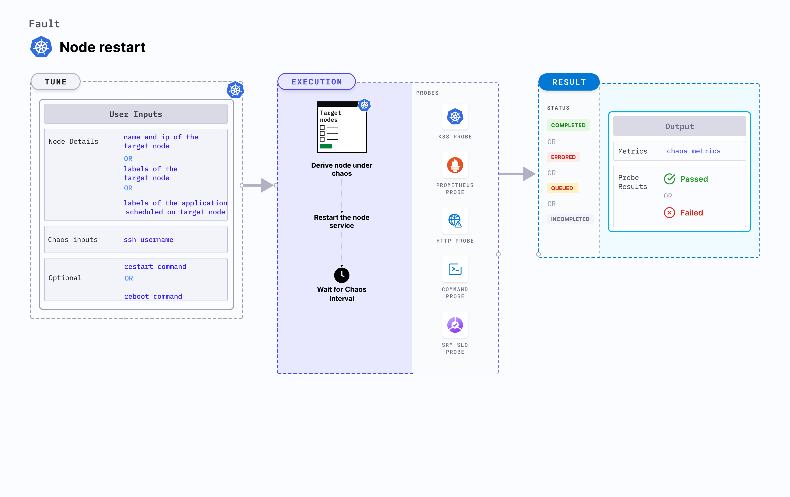

Node restart disrupts the state of the node by restarting it.
- It tests deployment sanity (replica availability and uninterrupted service) and recovery workflows of the application pod.





## Use cases
- This fault determines the deployment sanity (replica availability and uninterrupted service) and recovery workflows of the application pod in the event of an unexpected node restart. 
- It simulates loss of critical services (or node-crash). 
- It verifies resource budgeting on cluster nodes (whether request(or limit) settings honored on available nodes).
- It verifies whether topology constraints are adhered to (node selectors, tolerations, zone distribution, affinity(or anti-affinity) policies) or not.

**Note**
- Kubernetes > 1.16 is required to execute this fault.
- Create a Kubernetes secret named `id-rsa` where the fault will be executed. The contents of the secret will be the private SSH key for `SSH_USER` that will be used to connect to the node that hosts the target pod in the secret field `ssh-privatekey`. 
  - Below is a sample secret file:

    ```yaml
    apiVersion: v1
            kind: Secret
            metadata:
              name: id-rsa
            type: kubernetes.io/ssh-auth
            stringData:
              ssh-privatekey: |-
                # SSH private key for ssh contained here
    ```

    Creating the RSA key pair for remote SSH access for those who are already familiar with an SSH client, has been summarized below.
            
    1. Create a new key pair and store the keys in a file named `my-id-rsa-key` and `my-id-rsa-key.pub` for the private and public keys respectively: 
    ```
    ssh-keygen -f ~/my-id-rsa-key -t rsa -b 4096
    ```
    2. For each available node, run the below command that copies the public key of `my-id-rsa-key`:
    ```
    ssh-copy-id -i my-id-rsa-key user@node
    ```
            
    For further details, refer to [this](https://www.ssh.com/ssh/keygen/) documentation. After copying the public key to all nodes and creating the secret, you are all set to execute the fault.

- The target nodes should be in the ready state before and after injecting chaos.


## Fault tunables

  <h3>Mandatory fields</h3>
    <table>
      <tr>
        <th> Variables </th>
        <th> Description </th>
        <th> Notes </th>
      </tr>
      <tr>
        <td> TARGET_NODE </td>
        <td> Name of the target node subject to chaos. If this is not provided, a random node is selected. </td>
        <td> More information <a href = "https://developer.harness.io/docs/chaos-engineering/chaos-faults/kubernetes/node/common-tunables-for-node-faults#target-single-node">here.</a></td>
      </tr>
      <tr>
        <td> NODE_LABEL </td>
       <td> It contains the node label that is used to filter the target nodes.</td>
        <td>It is mutually exclusive with the <code>TARGET_NODES</code> environment variable. If both are provided, <code>TARGET_NODES</code> takes precedence. More information <a href="https://developer.harness.io/docs/chaos-engineering/chaos-faults/kubernetes/node/common-tunables-for-node-faults#target-nodes-with-labels">here.</a></td>
      </tr>
    </table>
    <h2>Optional fields</h2>
    <table>
      <tr>
        <th> Variables </th>
        <th> Description </th>
        <th> Notes </th>
      </tr>
       <tr>    
        <td> LIB_IMAGE </td>
        <td> Image used to run the stress command. </td>
        <td> Defaults to <code>litmuschaos/go-runner:latest</code>. More information <a href = "https://developer.harness.io/docs/chaos-engineering/chaos-faults/common-tunables-for-all-faults#image-used-by-the-helper-pod">here.</a></td>
      </tr>
      <tr>
        <td> SSH_USER </td>
        <td> Name of the SSH user. </td>
        <td> Defaults to <code>root</code>. More information <a href="https://developer.harness.io/docs/chaos-engineering/chaos-faults/kubernetes/node/node-restart/#ssh-user"> here.</a></td>
      </tr>
      <tr>
        <td> TARGET_NODE_IP </td>
        <td> Internal IP of the target node subject to chaos. If not provided, the fault uses the node IP of the <code>TARGET_NODE</code>. </td>
        <td> Defaults to empty. More information <a href="https://developer.harness.io/docs/chaos-engineering/chaos-faults/kubernetes/node/node-restart/#target-node-internal-ip"> here.</a></td>
      </tr>
      <tr>
        <td> REBOOT_COMMAND </td>
        <td> Command used to reboot. </td>
        <td> Defaults to <code>sudo systemctl reboot</code>. More information <a href="https://developer.harness.io/docs/chaos-engineering/chaos-faults/kubernetes/node/node-restart/#reboot-command"> here.</a></td>
      </tr>
      <tr>
        <td> TOTAL_CHAOS_DURATION </td>
        <td> Duration that you specify, through which chaos is injected into the target resource (in seconds). </td>
        <td> Default to 120s. More information <a href = "https://developer.harness.io/docs/chaos-engineering/chaos-faults/common-tunables-for-all-faults#duration-of-the-chaos">here.</a></td>
      </tr>
      <tr>
        <td> RAMP_TIME </td>
        <td> Period to wait before and after injecting chaos (in seconds). </td>
        <td> For example, 30s. More information <a href = "https://developer.harness.io/docs/chaos-engineering/chaos-faults/common-tunables-for-all-faults#ramp-time">here.</a></td>
      </tr>
    </table>

### Reboot command

It defines the command used to restart the targeted node. Tune it by using the `REBOOT_COMMAND` environment variable.

Use the following example to tune it:

[embedmd]:# (./static/manifests/node-restart/reboot-command.yaml yaml)
```yaml
# provide the reboot command
apiVersion: litmuschaos.io/v1alpha1
kind: ChaosEngine
metadata:
  name: engine-nginx
spec:
  engineState: "active"
  annotationCheck: "false"
  chaosServiceAccount: litmus-admin
  experiments:
  - name: node-restart
    spec:
      components:
        env:
        # command used for the reboot
        - name: REBOOT_COMMAND
          value: 'sudo systemctl reboot'
        # name of the target node
        - name: TARGET_NODE
          value: 'node01'
        - name: TOTAL_CHAOS_DURATION
          VALUE: '60'
```

### SSH user 

It defines the name of the SSH user for the targeted node. Tune it by using the `SSH_USER` environment variable.

Use the following example to tune it:

[embedmd]:# (./static/manifests/node-restart/ssh-user.yaml yaml)
```yaml
# name of the ssh user used to ssh into targeted node
apiVersion: litmuschaos.io/v1alpha1
kind: ChaosEngine
metadata:
  name: engine-nginx
spec:
  engineState: "active"
  annotationCheck: "false"
  chaosServiceAccount: litmus-admin
  experiments:
  - name: node-restart
    spec:
      components:
        env:
        # name of the ssh user
        - name: SSH_USER
          value: 'root'
        # name of the target node
        - name: TARGET_NODE
          value: 'node01'
        - name: TOTAL_CHAOS_DURATION
          VALUE: '60'
```

### Target node internal IP

It defines the internal IP of the targeted node. It is an optional field, if internal IP is not provided then it will derive the internal IP of the targeted node. Tune it by using the `TARGET_NODE_IP` environment variable.

Use the following example to tune it:

[embedmd]:# (./static/manifests/node-restart/target-node-ip.yaml yaml)
```yaml
# internal ip of the targeted node
apiVersion: litmuschaos.io/v1alpha1
kind: ChaosEngine
metadata:
  name: engine-nginx
spec:
  engineState: "active"
  annotationCheck: "false"
  chaosServiceAccount: litmus-admin
  experiments:
  - name: node-restart
    spec:
      components:
        env:
        # internal ip of the targeted node
        - name: TARGET_NODE_IP
          value: '10.0.170.92'
        # name of the target node
        - name: TARGET_NODE
          value: 'node01'
        - name: TOTAL_CHAOS_DURATION
          VALUE: '60'
```
