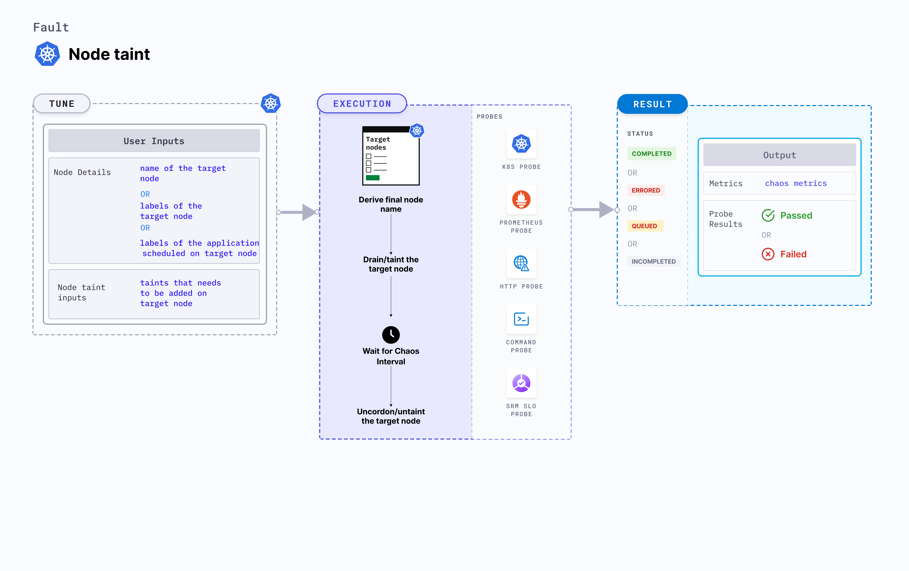

Node taint taints the node by applying the desired effect. 
- The resources that contain the corresponding tolerations only can bypass the taints.



## Use cases
- This fault verifies the resilience of applications when a certain taint is added to a node. 
- It simulates loss of critical services (or node-crash). 
- It verifies resource budgeting on cluster nodes (whether request(or limit) settings are honored on the available nodes).
- It verifies whether topology constraints are adhered to (node selectors, tolerations, zone distribution, affinity(or anti-affinity) policies) or not.

**Note**
- Kubernetes > 1.16 is required to execute this fault.
- Node specified in the <code>TARGET_NODE</code> environment variable (the node for which Docker service would be killed) should be cordoned before executing the chaos fault. This ensures that the fault resources are not scheduled on it (or subject to eviction). This is achieved by the following steps:
  - Get node names against the applications pods using command <code>kubectl get pods -o wide</code>.
  - Cordon the node using command <code>kubectl cordon &lt;nodename&gt;</code>.
- The target nodes should be in the ready state before and after injecting chaos.

## Fault tunables

### Mandatory Fields

| Variables   | Description                                                                                   | Notes                                                                                                                                                                                                                                                                                                                                |
|-------------|-----------------------------------------------------------------------------------------------|--------------------------------------------------------------------------------------------------------------------------------------------------------------------------------------------------------------------------------------------------------------------------------------------------------------------------------------|
| TARGET_NODE | Name of the target node subject to chaos. If this is not provided, a random node is selected. | More information <a href="https://developer.harness.io/docs/chaos-engineering/chaos-faults/kubernetes/node/common-tunables-for-node-faults/#target-single-node"> here.</a>                                                                                                                                                           |
| NODE_LABEL  | Node label that is used to filter the target nodes.                                           | It is mutually exclusive with the <code>TARGET_NODES</code> environment variable. If both are provided, <code>TARGET_NODES</code> takes precedence. More information <a href = "https://developer.harness.io/docs/chaos-engineering/chaos-faults/kubernetes/node/common-tunables-for-node-faults#target-nodes-with-labels">here.</a> |
| TAINT_LABEL | Label and the effect to be tainted on the application node.                                   | More information <a href="https://developer.harness.io/docs/chaos-engineering/chaos-faults/kubernetes/node/node-taint/#taint-label"> here.</a>                                                                                                                                                                                       |

### Optional fields

| Variables            | Description                                                                                       | Notes                                                                                                                                                                         |
|----------------------|---------------------------------------------------------------------------------------------------|-------------------------------------------------------------------------------------------------------------------------------------------------------------------------------|
| RAMP_TIME            | Period to wait before and after injecting chaos (in seconds).                                     | For example, 30s. More information <a href = "https://developer.harness.io/docs/chaos-engineering/chaos-faults/common-tunables-for-all-faults#ramp-time">here.</a>            |
| TOTAL_CHAOS_DURATION | Duration that you specify, through which chaos is injected into the target resource (in seconds). | Default to 120s. More information <a href = "https://developer.harness.io/docs/chaos-engineering/chaos-faults/common-tunables-for-all-faults#duration-of-the-chaos">here.</a> |


### Taint label

It contains the label and the effect to be tainted on the application node. Tune it by using the `TAINT_LABEL` environment variable.

Use the following example to tune it:

[embedmd]:# (./static/manifests/node-taint/taint-labels.yaml yaml)
```yaml
# node tainted with provided key and effect
apiVersion: litmuschaos.io/v1alpha1
kind: ChaosEngine
metadata:
  name: engine-nginx
spec:
  engineState: "active"
  annotationCheck: "false"
  chaosServiceAccount: litmus-admin
  experiments:
  - name: node-taint
    spec:
      components:
        env:
        # label and effect to be tainted on the targeted node
        - name: TAINT_LABEL
          value: 'key=value:effect'
        - name: TOTAL_CHAOS_DURATION
          VALUE: '60'
```
