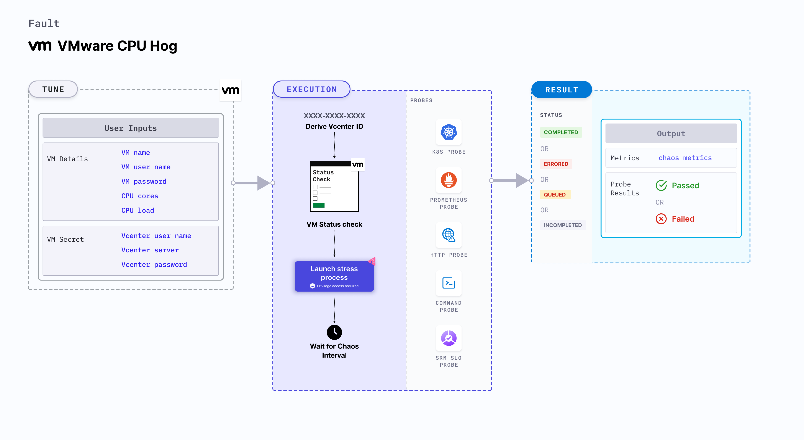

VMware CPU hog applies stress on the CPU resources on Linux OS based VMware VM.
- It checks the performance of the application running on the VMware VMs.



## Usage

<details>
<summary>View the uses of the fault</summary>
<div>
This fault helps determine how resilient an application is when stress is applied on the CPU resources of a VMware virtual machine.
</div>
</details>

## Prerequisites
- Kubernetes > 1.16
- Execution plane is connected to vCenter and the hosts on port 443. 
- VMware tool is installed on the target VM with remote execution enabled.
- Adequate vCenter permissions to access the hosts and the VMs.
- Create a Kubernetes secret that has the Vcenter credentials in the `CHAOS_NAMESPACE`. Below is a sample secret file:
```yaml
apiVersion: v1
kind: Secret
metadata:
  name: vcenter-secret
  namespace: litmus
type: Opaque
stringData:
    VCENTERSERVER: XXXXXXXXXXX
    VCENTERUSER: XXXXXXXXXXXXX
    VCENTERPASS: XXXXXXXXXXXXX
```

### Note
You can pass the VM credentials as secrets or as a `ChaosEngine` environment variable.


## Default validations
The VM should be in a healthy state.


## Fault tunables
<details>
    <summary>Fault tunables</summary>
    <h2>Mandatory fields</h2>
    <table>
      <tr>
        <th> Variables </th>
        <th> Description </th>
        <th> Notes </th>
      </tr>
      <tr>
        <td> VM_NAME </td>
        <td> Name of the target VM. </td>
        <td> For example, <code>ubuntu-vm-1</code>code>. </td>
      </tr>
    </table>
    <h2>Optional fields</h2>
    <table>
      <tr>
        <th> Variables </th>
        <th> Description </th>
        <th> Notes </th>
      </tr>
      <tr>
        <td> CPU_CORES </td>
        <td> Number of CPU cores subject to CPU stress. </td>
        <td> Default to 1. </td>
        </tr>
      <tr>
        <td> CPU_LOAD </td>
        <td> Load exerted on each CPU core (in percentage).</td>
        <td> Defaults to 100%.</td>
      </tr>
      <tr>
        <td> TOTAL_CHAOS_DURATION </td>
        <td> Duration that you specify, through which chaos is injected into the target resource (in seconds).</td>
        <td> Defaults to 30s. </td>
      </tr>
      <tr>
        <td> CHAOS_INTERVAL </td>
        <td> Time interval between two successive instance terminations. </td>
        <td> Defaults to 30s. </td>
      </tr>
      <tr>
        <td> RAMP_TIME </td>
        <td> Period to wait before and after injecting chaos (in seconds). </td>
        <td> For example, 30s. </td>
      </tr>
      <tr>
        <td> SEQUENCE </td>
        <td> Sequence of chaos execution for multiple instances. </td>
        <td> Defaults to parallel. Supports serial sequence as well. </td>
      </tr>
    </table>
</details>

## Fault examples

### Common fault tunables
Refer to the [common attributes](../common-tunables-for-all-faults) to tune the common tunables for all the faults.

### CPU_CORES
It stresses the `CPU_CORE` of the target VM for the duration defined by the `TOTAL_CHAOS_DURATION` environment variable.

Use the following example to tune it:

[embedmd]:# (./static/manifests/vmware-cpu-hog/vm-cpu-hog-core.yaml yaml)
```yaml
# CPU hog in the VMware VM
apiVersion: litmuschaos.io/v1alpha1
kind: ChaosEngine
metadata:
  name: engine-nginx
spec:
  engineState: "active"
  chaosServiceAccount: litmus-admin
  experiments:
  - name: VMware-cpu-hog
    spec:
      components:
        env:
        # Name of the VM
        - name: VM_NAME
          value: 'test-vm-01'
       # CPU cores for stress
        - name: CPU_CORES 
          value: '1'
```
### CPU load
It specifies the load exerted on each VM CPU core (in percentage). You can tune it using the `CPU_LOAD` environment variable.

Use the following example to tune it:

[embedmd]:# (./static/manifests/vmware-cpu-hog/vm-cpu-hog-load.yaml yaml)
```yaml
# CPU hog in the VMware VM
apiVersion: litmuschaos.io/v1alpha1
kind: ChaosEngine
metadata:
  name: engine-nginx
spec:
  engineState: "active"
  chaosServiceAccount: litmus-admin
  experiments:
  - name: VMware-cpu-hog
    spec:
      components:
        env:
        # Name of the VM
        - name: VM_NAME
          value: 'test-vm-01'
        # CPU load in percentage for the stress
        - name: CPU_LOAD
          value: '100'
```
