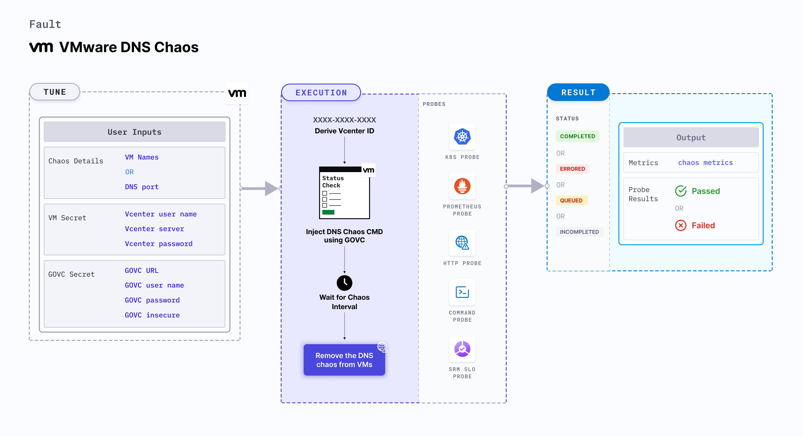

## Introduction
- It causes DNS errors in the provided VMWare VMs for a specified chaos duration. 
- It helps to check the performance of the application/process running on the VMWare VMs.

:::tip Fault execution flow chart

:::

## Uses
<details>
<summary>View the uses of the experiment</summary>
<div>
The experiment causes DNS errors on the target VMs which can result in unavailability/distorted network connectivity from the VM to the target hosts. This will also help to produce a hypothesis where some services of an application are unreachable from the VM. This will help the user to think the mitigation steps that should be taken to overcome such situation. This experiment can also be used to know how the DNS error can impact your infra and standalone tasks as well.
</div>
</details>

## Prerequisites
:::info
- Kubernetes > 1.16 
- Vcenter access to stop and start the VM.
- (Optional) A Kubernetes secret that has the Vcenter credentials in the `CHAOS_NAMESPACE`. A sample secret file looks like:
```yaml
apiVersion: v1
kind: Secret
metadata:
  name: vcenter-secret
  namespace: litmus
type: Opaque
stringData:
    VCENTERSERVER: XXXXXXXXXXX
    VCENTERUSER: XXXXXXXXXXXXX
    VCENTERPASS: XXXXXXXXXXXXX
```

### NOTE
You can pass the VM credentials as secrets or as a chaosengine environment variable.
:::

    
## Default Validations
:::info
- The VM should be in a healthy state before and after chaos.
:::
## Minimal RBAC configuration example (optional)

<details>
<summary>Minimal RBAC configuration</summary>
If you use this experiment as part of a litmus workflow that is scheduled, constructed, and executed from a chaos center, you may be using the <a href="https://litmuschaos.github.io/litmus/litmus-admin-rbac.yaml">litmus-admin</a> RBAC, which is pre-installed in the cluster as part of the agent setup.

```yaml
---
apiVersion: v1
kind: ServiceAccount
metadata:
  name: vm-poweroff-sa
  namespace: default
  labels:
    name: vm-poweroff-sa
    app.kubernetes.io/part-of: litmus
---
apiVersion: rbac.authorization.k8s.io/v1
kind: ClusterRole
metadata:
  name: vm-poweroff-sa
  labels:
    name: vm-poweroff-sa
    app.kubernetes.io/part-of: litmus
rules:
  # Create and monitor the experiment & helper pods
  - apiGroups: [""]
    resources: ["pods"]
    verbs: ["create","delete","get","list","patch","update", "deletecollection"]
  # Performs CRUD operations on the events inside chaosengine and chaosresult
  - apiGroups: [""]
    resources: ["events"]
    verbs: ["create","get","list","patch","update"]
  # Fetch configmaps & secrets details and mount it to the experiment pod (if specified)
  - apiGroups: [""]
    resources: ["secrets","configmaps"]
    verbs: ["get","list",]
  # Track and get the runner, experiment, and helper pods log 
  - apiGroups: [""]
    resources: ["pods/log"]
    verbs: ["get","list","watch"]  
  # for creating and managing to execute comands inside target container
  - apiGroups: [""]
    resources: ["pods/exec"]
    verbs: ["get","list","create"]
  # for configuring and monitor the experiment job by the chaos-runner pod
  - apiGroups: ["batch"]
    resources: ["jobs"]
    verbs: ["create","list","get","delete","deletecollection"]
  # for creation, status polling and deletion of litmus chaos resources used within a chaos workflow
  - apiGroups: ["litmuschaos.io"]
    resources: ["chaosengines","chaosexperiments","chaosresults"]
    verbs: ["create","list","get","patch","update","delete"]
---
apiVersion: rbac.authorization.k8s.io/v1
kind: ClusterRoleBinding
metadata:
  name: vm-poweroff-sa
  labels:
    name: vm-poweroff-sa
    app.kubernetes.io/part-of: litmus
roleRef:
  apiGroup: rbac.authorization.k8s.io
  kind: ClusterRole
  name: vm-poweroff-sa
subjects:
- kind: ServiceAccount
  name: vm-poweroff-sa
  namespace: default
```
You can use this sample RBAC manifest to create a `chaosServiceAccount` in the desired (app) namespace. This example contains the minimum role permissions necessary to execute the experiment.
</details>

## Experiment Tunables
<details>
    <summary>Check the Experiment Tunables</summary>
    <h2>Mandatory Fields</h2>
    <table>
      <tr>
        <th> Variables </th>
        <th> Description </th>
        <th> Notes </th>
      </tr>
      <tr> 
        <td> VM_USER_NAME </td>
        <td> Provide the username of the target VM(s).</td>
        <td> You can provide multiple usernames as  comma separated file(for more than one VM under chaos). It is used to run the 'govc' command.</td>
      </tr>
      <tr> 
        <td> VM_PASSWORD </td>
        <td> Provide the password for the target VM(s).</td>
        <td> It is used to run the 'govc' command.</td>
      </tr>
      <tr>
        <td> PORT </td>
        <td> Provide the DNS Port.</td>
        <td> Default value is 54. </td>
      </tr>
    </table>
    <h2>Optional Fields</h2>
    <table>
      <tr>
        <th> Variables </th>
        <th> Description </th>
        <th> Notes </th>
      </tr>
      <tr> 
        <td> TOTAL_CHAOS_DURATION </td>
        <td> The total duration to insert chaos (in seconds). </td>
        <td> Default value is 30s. </td>
      </tr>
      <tr> 
        <td> CHAOS_INTERVAL </td>
        <td> The interval between successive instance terminations (in seconds) . </td>
        <td> Default value is 30s. </td>
      </tr>
      <tr>
        <td> SEQUENCE </td>
        <td> It defines the sequence of the chaos execution for multiple instances. </td>
        <td> Its default value is 'parallel', and it supports 'serial' value too. </td>
      </tr>
      <tr>
        <td> RAMP_TIME </td>
        <td> The period of wait before and after injecting chaos (in seconds). </td>
        <td> </td>
      </tr>
    </table>
    <h2>Secret Fields</h2>
     <table>
      <tr>
        <th> Variables </th>
        <th> Description </th>
        <th> Notes </th>
      </tr>
      <tr>
        <td> GOVC_URL </td>
        <td> Provide the VMCenter Server URL.</td>
        <td> It is used to perform the VMware API calls using 'govc' command which is derived from a secret.</td>
      </tr>
      <tr>
        <td> GOVC_USERNAME </td>
        <td> Provide the username of the VMCenter Server</td>
        <td> This environment variable is used for authentication purpose and is setup using a secret.</td>
      </tr>
      <tr>
        <td> GOVC_PASSWORD </td>
        <td> Provide the password of VMCenter Server</td>
        <td> This environment variable is used for authentication purposes and is setup using a secret.</td>
      </tr>
      <tr>
        <td> GOVC_INSECURE </td>
        <td> Provide the value as <code>true</code> </td>
        <td> This environment variable is used to run the 'govc' in insecure mode and is setup using a secret.</td>
      </tr>
     </table>   
</details>

## Experiment Examples

### Common Experiment Tunables
Refer to the [common attributes](../common-tunables-for-all-experiments) to tune the common tunables for all the experiments.

### Run DNS Chaos With Port

It contains the DNS port where you can inject the DNS chaos. The value is provided using the `PORT` environment variable.

Use the following example to tune it:

[embedmd]:# (./static/manifests/vmware-dns-chaos/vmware-dns-port.yaml yaml)
```yaml
# induces dns chaos on the VMWare VM
apiVersion: litmuschaos.io/v1alpha1
kind: ChaosEngine
metadata:
  name: vmware-engine
spec:
  engineState: "active"
  annotationCheck: "false"
  chaosServiceAccount: litmus-admin
  experiments:
  - name: vmware-dns-chaos
    spec:
      components:
        env:
        # MOID of the VM
        - name: PORT
          value: '54'

        - name: VM_NAME
          value: 'vm-1,vm-2'

        - name: TOTAL_CHAOS_DURATION
          VALUE: '60'

        - name: VM_USER_NAME
          value: 'ubuntu,debian'

        - name: VM_PASSWORD
          value: '123,123'
```

