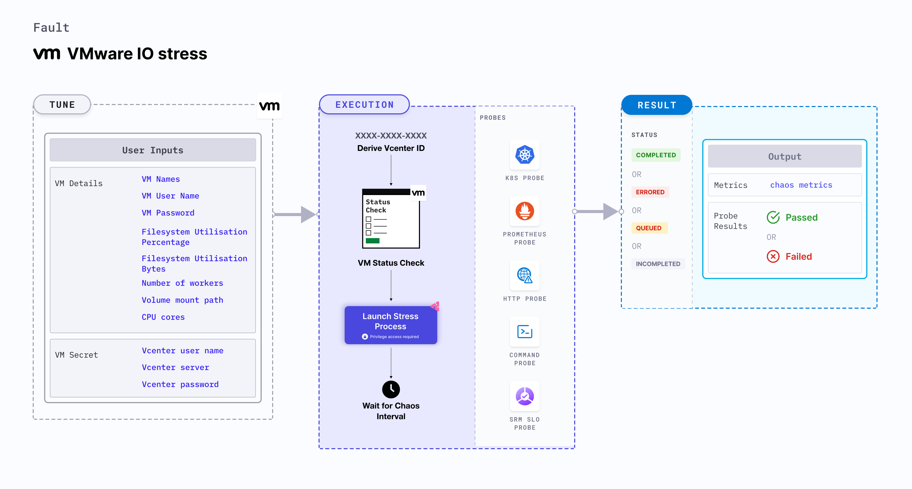

VMware IO stress causes disk stress on the target VMware VMs. It aims to verify the resilience of applications that share this disk resource with the VM. 



## Usage

<details>
<summary>View the uses of the fault</summary>
<div>
This fault helps determine how resilient an application is to unexpected spikes in resources. It determines how well an application handles unexpected stress at a given point in time.
</div>
</details>

## Prerequisites
- Kubernetes > 1.16
- Execution plane is connected to vCenter and the hosts on port 443. 
- VMware tool is installed on the target VM with remote execution enabled.
- Adequate vCenter permissions to access the hosts and the VMs.
- Create a Kubernetes secret that has the Vcenter credentials in the `CHAOS_NAMESPACE`. Below is a sample secret file:

```yaml
apiVersion: v1
kind: Secret
metadata:
  name: vcenter-secret
  namespace: litmus
type: Opaque
stringData:
    VCENTERSERVER: XXXXXXXXXXX
    VCENTERUSER: XXXXXXXXXXXXX
    VCENTERPASS: XXXXXXXXXXXXX
```
### Note
You can pass the VM credentials as secrets or as a `ChaosEngine` environment variable.

## Default validations
The VM should be in a healthy state.


## Fault tunables
<details>
    <summary>Fault tunables</summary>
    <h2>Mandatory fields</h2>
    <table>
      <tr>
        <th> Variables </th>
        <th> Description </th>
        <th> Notes </th>
      </tr>
      <tr>
        <td> VM_NAME </td>
        <td> Name of the target VM. </td>
        <td> For example, <code>ubuntu-vm-1</code>. </td>
      </tr>
    </table>
    <h2>Optional fields</h2>
    <table>
      <tr>
        <th> Variables </th>
        <th> Description </th>
        <th> Notes </th>
      </tr>
       <tr>
        <td> FILESYSTEM_UTILIZATION_PERCENTAGE </td>
        <td> Specify the size as a percentage of free space on the file system. </td>
        <td> For example, <code>40</code>. </td>
      </tr>   
       <tr>
        <td> FILESYSTEM_UTILIZATION_BYTES </td>
        <td> Specify the size in gigabytes(GB). FILESYSTEM_UTILIZATION_PERCENTAGE and FILESYSTEM_UTILIZATION_BYTES environment variables are mutually exclusive. If both are provided, FILESYSTEM_UTILIZATION_PERCENTAGE takes precedence. </td>
        <td> For example, <code>100</code></td>
      </tr>  
       <tr>
        <td> NUMBER_OF_WORKERS </td>
        <td> Number of I/O workers involved in I/O disk stress. </td>
        <td> Defaults to 4 </td>
      </tr>
       <tr>
        <td> VOLUME_MOUNT_PATH </td>
        <td> Location that points to the volume mount path used in I/O stress. </td>
        <td> For example, <code>/Users/admin/disk-02</code>. </td>
      </tr>   
      <tr>
        <td> CPU_CORES </td>
        <td> Number of CPU cores that are subject to CPU stress.</td>
        <td> Defaults to 1.</td>
        </tr>
      <tr>
        <td> TOTAL_CHAOS_DURATION </td>
        <td> Duration that you specify, through which chaos is injected into the target resource (in seconds). </td>
        <td> Defaults to 30s. </td>
      </tr>
      <tr>
        <td> CHAOS_INTERVAL </td>
        <td> Time interval between two successive instance terminations (in seconds). </td>
        <td> Defaults to 30s. </td>
      </tr>
      <tr>
        <td> SEQUENCE </td>
       <td> Sequence of chaos execution for multiple instances. </td>
        <td> Defaults to parallel. Supports serial sequence as well. </td>
      </tr>
      <tr>
        <td> RAMP_TIME </td>
        <td> Period to wait before and after injecting chaos (in seconds). </td>
        <td> For example, 30s. </td>
      </tr>
    </table>
</details>

## Fault examples

### Common fault tunables
Refer to the [common attributes](../common-tunables-for-all-faults) to tune the common tunables for all the faults.

### Filesystem utilization percentage
It specifes the size as a percentage of free space on the file system. You can tune it using the `FILESYSTEM_UTILIZATION_PERCENTAGE` environment variable. 

Use the following example to tune it:

[embedmd]:# (./static/manifests/vmware-io-stress/vm-io-stress-filesystem-utilization-percentage.yaml yaml)
```yaml
# io-stress in the VMware VM
apiVersion: litmuschaos.io/v1alpha1
kind: ChaosEngine
metadata:
  name: engine-nginx
spec:
  engineState: "active"
  chaosServiceAccount: litmus-admin
  experiments:
  - name: VMware-io-stress
    spec:
      components:
        env:
        # Name of the VM
        - name: VM_NAME
          value: 'test-vm-01'
        # percentage of free space of file system, need to be stressed
        - name: FILESYSTEM_UTILIZATION_PERCENTAGE
          value: '10'
```

### Filesystem utilization bytes
It specifies the amount of free space on the file system in gigabytes(GB). You can tune it using the `FILESYSTEM_UTILIZATION_BYTES` environment variable. `FILESYSTEM_UTILIZATION_BYTES` is mutually exclusive with the `FILESYSTEM_UTILIZATION_PERCENTAGE` environment variable. If both `FILESYSTEM_UTILIZATION_PERCENTAGE` and `FILESYSTEM_UTILIZATION_BYTES` environment variables are set, `FILESYSTEM_UTILIZATION_PERCENTAGE` takes precendence.

Use the following example to tune it:

[embedmd]:# (./static/manifests/vmware-io-stress/vm-io-stress-filesystem-utilization-bytes.yaml yaml)
```yaml
apiVersion: litmuschaos.io/v1alpha1
kind: ChaosEngine
metadata:
  name: engine-nginx
spec:
  engineState: "active"
  chaosServiceAccount: litmus-admin
  experiments:
  - name: VMware-io-stress
    spec:
      components:
        env:
        # Name of the VM
        - name: VM_NAME
          value: 'test-vm-01'
        # size of io to be stressed
        - name: FILESYSTEM_UTILIZATION_BYTES
          value: '1' #in GB
```
### Mount path
It specifies the location that points to the volume mount path used in I/O stress. You can tune it using the  `VOLUME_MOUNT_PATH` environment variable.

Use the following example to tune it:

[embedmd]:# (./static/manifests/vmware-io-stress/vm-io-stress-filesystem-mount-path.yaml yaml)
```yaml
# io-stress in the VMware VM
apiVersion: litmuschaos.io/v1alpha1
kind: ChaosEngine
metadata:
  name: engine-nginx
spec:
  engineState: "active"
  chaosServiceAccount: litmus-admin
  experiments:
  - name: VMware-io-stress
    spec:
      components:
        env:
        # Name of the VM
        - name: VM_NAME
          value: 'test-vm-01'
        # path need to be stressed/filled
        - name: VOLUME_MOUNT_PATH
          value: '/some-dir-in-container'
        # size of io to be stressed
        - name: FILESYSTEM_UTILIZATION_BYTES
          value: '1' #in GB
```
### Workers for stress
It specifies the worker's count for stress. You can tune it using the `NUMBER_OF_WORKERS` environment variable.
Use the following example to tune it:

[embedmd]:# (./static/manifests/vmware-io-stress/vm-io-stress-filesystem-worker.yaml yaml)
```yaml
# io-stress in the VMware VM
apiVersion: litmuschaos.io/v1alpha1
kind: ChaosEngine
metadata:
  name: engine-nginx
spec:
  engineState: "active"
  chaosServiceAccount: litmus-admin
  experiments:
  - name: VMware-io-stress
    spec:
      components:
        env:
        # Name of the VM
        - name: VM_NAME
          value: 'test-vm-01'
        # number of io workers
        - name: NUMBER_OF_WORKERS
          value: '4'
        # size of io to be stressed
        - name: FILESYSTEM_UTILIZATION_BYTES
          value: '1' #in GB
```
