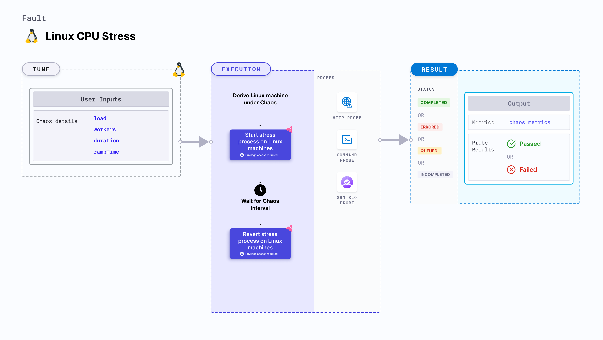

Linux CPU stress fault applies stress on the CPU of the target Linux machines for a specific duration.



## Use cases
- Induces CPU stress on the target Linux machines.
- Simulates a lack of CPU for processes running on the application, which degrades their performance.
- Simulates slow application traffic or exhaustion of the resources, leading to degradation in the performance of processes on the machine.

:::info note
- This fault can be executed on Ubuntu 16 or higher, Debian 10 or higher, CentOS 7 or higher, RHEL 7 or higher, and openSUSE LEAP 15.4 or higher.
- The `linux-chaos-infrastructure` systemd service should be in an active state, and the infrastructure should be in `CONNECTED` state.
:::

## Fault tunables
<h3>Optional tunables</h3>
<table>
  <tr>
    <th> Tunable </th>
    <th> Description </th>
    <th> Notes </th>
  </tr>
  <tr>
    <td> load </td>
    <td> Percentage load to be exerted on a single CPU core. </td>
    <td> Default: 100 %. </td>
  </tr>
  <tr>
    <td> workers </td>
    <td> Number of worker processes to start. Corresponds to the number of CPU cores to consume. </td>
    <td> Default: 1. </td>
  </tr>
  <tr>
    <td> duration </td>
    <td> Duration through which chaos is injected into the target resource (in seconds). </td>
    <td> Default: 30 s. </td>
  </tr>
  <tr>
    <td> rampTime </td>
    <td> Period to wait before and after injecting chaos (in seconds). </td>
    <td> Default: 0 s. </td>
  </tr>
</table>

### Workers

The `workers` input variable utilizes a specific number of workers for the CPU stress fault.

The following YAML snippet illustrates the use of this environment variable:

[embedmd]:# (./static/manifests/linux-cpu-stress/workers.yaml yaml)
```yaml
# workers to utilize
apiVersion: litmuchaos.io/v1alpha1
kind: LinuxFault
metadata:
  name: linux-cpu-stress
  labels:
    name: cpu-stress
spec:
  stressChaos/inputs:
    workers: 1
    load: 100
```

### Load percentage

The `load` input variable exerts the CPU load (in percentage) per core.

The following YAML snippet illustrates the use of this environment variable:

[embedmd]:# (./static/manifests/linux-cpu-stress/load.yaml yaml)
```yaml
# percentage load to exert per core
apiVersion: litmuchaos.io/v1alpha1
kind: LinuxFault
metadata:
  name: linux-cpu-stress
  labels:
    name: cpu-stress
spec:
  stressChaos/inputs:
    workers: 3
    load: 70
```
