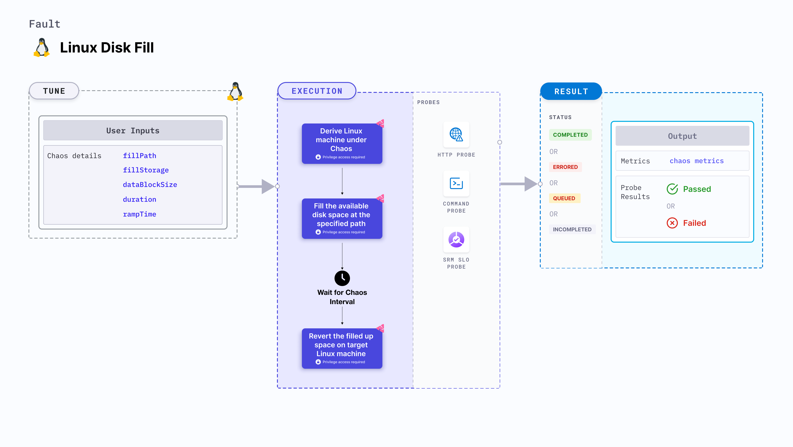

Linux disk fill fault fills up the available disk space at a given system path for a given duration.

<!--  -->

## Use cases
- Induces heavy disk usage scenario on the target Linux machines.
- Simulates a lack of storage space for the underlying applications in the system.
- Validates application failover and data resiliency in the scenario of low disk space.

:::note
- This fault is compatible with Ubuntu 16 or higher, Debian 10 or higher, CentOS 7 or higher, RHEL 7 or higher, and openSUSE LEAP 15.4 or higher.
- The `linux-chaos-infrastructure` systemd service should be in active state and the infrastructure should be in `CONNECTED` state.
:::

## Fault tunables
<h3>Optional fields</h3>
<table>
  <tr>
    <th> Variables </th>
    <th> Description </th>
    <th> Notes </th>
  </tr>
  <tr>
    <td> fillPath </td>
    <td> The system path to fill. </td>
    <td> It must be a path to a valid directory. </td>
  </tr>
  <tr>
    <td> fillPercentage </td>
    <td> The percentage of available storage space to fill. </td>
    <td> Mutually exclusive to <code>fillStorageMebibytes</code>. Defaults to <code>50%</code>. </td>
  </tr>
  <tr>
    <td> fillStorageMebibytes </td>
    <td> The amount of storage to be filled in mebibytes. </td>
    <td> Mutually exclusive to <code>fillPercentage</code>. </td>
  </tr>
  <tr>
    <td> dataBlockSize </td>
    <td> The size of each block of data to be used for filling up the disk in kilobytes. </td>
    <td> Defaults to 256 KB. </td>
  </tr>
  <tr>
    <td> duration </td>
    <td> Duration through which chaos is injected into the target resource (in seconds). </td>
    <td> Default: 30s </td>
  </tr>
  <tr>
    <td> rampTime </td>
    <td> Period to wait before and after injecting chaos (in seconds). </td>
    <td> Default: 0s </td>
  </tr>
</table>

### Fill Path

The `fillPath` input variable determines the system path to be filled up.

Use the following example to tune fill path:

[embedmd]:# (./static/manifests/linux-disk-fill/fill-path.yaml yaml)
```yaml
# specify the fill path
apiVersion: litmuchaos.io/v1alpha1
kind: LinuxFault
metadata:
  name: linux-disk-fill
  labels:
    name: disk-fill
spec:
  diskFillChaos/inputs:
    fillPath: "/"
    duration: 30
```

### Fill Percentage

The `fillPercentage` input variable determines the percentage of available storage space to be filled up at the given `fillPath`.

Use the following example to tune fill percentage:

[embedmd]:# (./static/manifests/linux-disk-fill/fill-percentage.yaml yaml)
```yaml
# specify the fill percentage
apiVersion: litmuchaos.io/v1alpha1
kind: LinuxFault
metadata:
  name: linux-disk-fill
  labels:
    name: disk-fill
spec:
  diskFillChaos/inputs:
    fillPath: "/"
    fillPercentage: 80
    duration: 30
```

### Fill Storage Mebibytes

The `fillStorageMebibytes` input variable determines the amount of storage space to be filled up at the given `fillPath` in mebibytes.

Use the following example to tune fill storage mebibytes:

[embedmd]:# (./static/manifests/linux-disk-fill/fill-storage-mebibytes.yaml yaml)
```yaml
# specify the fill percentage
apiVersion: litmuchaos.io/v1alpha1
kind: LinuxFault
metadata:
  name: linux-disk-fill
  labels:
    name: disk-fill
spec:
  diskFillChaos/inputs:
    fillPath: "/"
    fillStorageMebibytes: 8048
    duration: 30
```

### Data Block Size

The `dataBlockSize` input variable determines the size of a single block of data, which will be used for filling up the disk in kilobytes. A larger block size results in faster completion of the disk fill operation and vice versa.

Use the following example to tune the block size:

[embedmd]:# (./static/manifests/linux-disk-fill/data-block-size.yaml yaml)
```yaml
# specify the data block size
apiVersion: litmuchaos.io/v1alpha1
kind: LinuxFault
metadata:
  name: linux-disk-fill
  labels:
    name: disk-fill
spec:
  diskFillChaos/inputs:
    fillPath: "/"
    fillPercentage: 80
    dataBlockSize: 1000
    duration: 30
```
