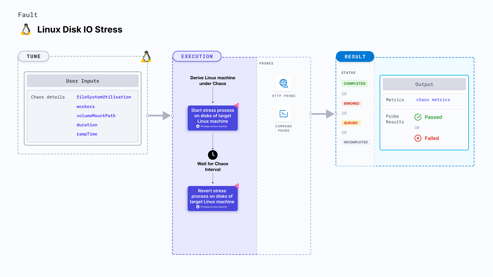

Linux disk IO stress applies stress on the disk of the target Linux machines over I/O operations for a specific duration.



## Use cases
- Simulates slower disk operations for the applications.
- Simulates noisy neighbour problems by exhausting the disk bandwidth.
- Verifies the disk performance on increasing I/O threads and varying I/O block sizes.
- Checks how the application functions under high disk latency conditions, when I/O traffic is high and includes large I/O blocks, and when other services monopolize the I/O disks.

:::info note
- This fault can be executed on Ubuntu 16 or higher, Debian 10 or higher, CentOS 7 or higher, RHEL 7 or higher, and openSUSE LEAP 15.4 or higher.
- The `linux-chaos-infrastructure` systemd service should be in an active state, and the infrastructure should be in `CONNECTED` state.
:::

## Fault tunables
<h3>Optional tunables</h3>
<table>
  <tr>
    <th> Tunable </th>
    <th> Description </th>
    <th> Notes </th>
  </tr>
   <tr>
    <td> fileSystemUtilisation </td>
    <td> File size consumed during the disk I/O operations. </td>
    <td> Can be specified in bytes(b/B), kilobytes(k/K), megabytes(m/M) or gigabytes(g/G) to be filled or percentage(%) of available disk space to be filled. The unit can be suffixed with the corresponding value or else, if no unit is provided, the value is assumed to be in bytes. For example: <code>30m</code>, <code>1G</code>, <code>35%</code>, etc. Default: 10%. </td>
  </tr>
  <tr>
    <td> workers </td>
    <td> Number of worker processes to start. </td>
    <td> Default: 1 </td>
  </tr>
  <tr>
    <td> volumeMountPath </td>
    <td> Volume mount path used for the disk I/O operations. </td>
    <td> Default: user HOME directory </td>
  </tr>
  <tr>
    <td> duration </td>
    <td> Duration through which chaos is injected into the target resource (in seconds). </td>
    <td> Default: 30 s </td>
  </tr>
  <tr>
    <td> rampTime </td>
    <td> Period to wait before and after injecting chaos (in seconds). </td>
    <td> Default: 0 s </td>
  </tr>
</table>

### Workers

The `workers` input variable utilizes a specific number of workers during the disk I/O stress.

The following YAML snippet illustrates the use of this environment variable:

[embedmd]:# (./static/manifests/linux-disk-io-stress/workers.yaml yaml)
```yaml
# workers to utilize
apiVersion: litmuchaos.io/v1alpha1
kind: LinuxFault
metadata:
  name: linux-disk-io-stress
  labels:
    name: disk-io-stress
spec:
  stressChaos/inputs:
    workers: 1
    fileSystemUtilisationPercentage: 10
```

### File system utilization in bytes

The `fileSystemUtilisationBytes` input variable utilizes a specific amount of file system disk space or bandwidth as a part of the disk I/O operations in bytes.

The following YAML snippet illustrates the use of this environment variable:

[embedmd]:# (./static/manifests/linux-disk-io-stress/file-system-bytes.yaml yaml)
```yaml
# file system amount to be utilized
apiVersion: litmuchaos.io/v1alpha1
kind: LinuxFault
metadata:
  name: linux-disk-io-stress
  labels:
    name: disk-io-stress
spec:
  stressChaos/inputs:
    workers: 3
    fileSystemUtilisationBytes: 10000
```

### File system utilization in percentage

The `fileSystemUtilisationPercentage` input variable utilizes a specific amount of file system disk space or bandwidth as a part of the disk I/O operations in terms of percentage of the total available disk space.

The following YAML snippet illustrates the use of this environment variable:

[embedmd]:# (./static/manifests/linux-disk-io-stress/file-system-percentage.yaml yaml)
```yaml
# file system percentage to be utilized
apiVersion: litmuchaos.io/v1alpha1
kind: LinuxFault
metadata:
  name: linux-disk-io-stress
  labels:
    name: disk-io-stress
spec:
  stressChaos/inputs:
    workers: 3
    fileSystemUtilisationPercentage: 70
```

### Volume mount path
The `volumeMountPath` input variable utilizes the volume mount path where the disk I/O operations are performed.

The following YAML snippet illustrates the use of this environment variable:

[embedmd]:# (./static/manifests/linux-disk-io-stress/volume-mount-path.yaml yaml)
```yaml
# configure volume mount path
apiVersion: litmuchaos.io/v1alpha1
kind: LinuxFault
metadata:
  name: linux-disk-io-stress
  labels:
    name: disk-io-stress
spec:
  stressChaos/inputs:
    workers: 1
    fileSystemUtilisationPercentage: 50
    volumeMountPath: "/tmp"
```
