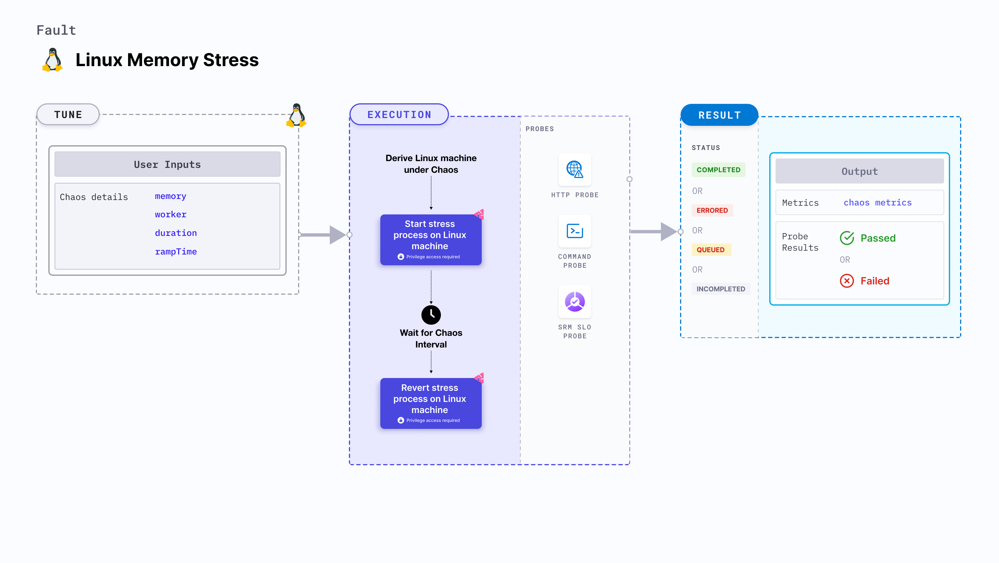

Linux memory stress causes memory consumption of the target Linux machines for a specific duration.



## Use cases
- Induces memory consumption and exhaustion on the target Linux machines.
- Simulates a lack of memory for processes running on the application, which degrades their performance.
- Simulates application slowness due to memory starvation, and noisy neighbour problems due to excessive consumption of memory.

:::info note
- This fault can be executed on Ubuntu 16 or higher, Debian 10 or higher, CentOS 7 or higher, RHEL 7 or higher, and openSUSE LEAP 15.4 or higher.
- The `linux-chaos-infrastructure` systemd service should be in an active state, and the infrastructure should be in `CONNECTED` state.
:::

## Fault tunables
<h3>Optional tunables</h3>
<table>
  <tr>
    <th> Tunable </th>
    <th> Description </th>
    <th> Notes </th>
  </tr>
  <tr>
    <td> memoryBytes </td>
    <td> Amount of memory consumed (in bytes). </td>
    <td> Mutually exclusive to <code>memoryPercentage</code>. Default: 256 MB </td>
  </tr>
   <tr>
    <td> memoryPercentage </td>
    <td> Amount of memory consumed (in percentage of the total available memory). </td>
    <td> Mutually exclusive to <code>memoryBytes</code>. </td>
  </tr>
  <tr>
    <td> workers </td>
    <td> Number of worker processes to start. </td>
    <td> Default: 1 </td>
  </tr>
  <tr>
    <td> duration </td>
    <td> Duration through which chaos is injected into the target resource (in seconds). </td>
    <td> Default: 30 s </td>
  </tr>
  <tr>
    <td> rampTime </td>
    <td> Period to wait before and after injecting chaos (in seconds). </td>
    <td> Default: 0 s </td>
  </tr>
</table>

### Workers

The `workers` input variable utilizes a specific number of workers for the memory stress fault.

The following YAML snippet illustrates the use of this environment variable:

[embedmd]:# (./static/manifests/linux-memory-stress/workers.yaml yaml)
```yaml
# workers to utilize
apiVersion: litmuchaos.io/v1alpha1
kind: LinuxFault
metadata:
  name: linux-memory-stress
  labels:
    name: memory-stress
spec:
  stressChaos/inputs:
    workers: 1
    memoryPercentage: 50
```

### Memory consumption in bytes

The `memoryBytes` input variable utilizes a specific amount of memory (in bytes). 

The following YAML snippet illustrates the use of this environment variable:

[embedmd]:# (./static/manifests/linux-memory-stress/memory-bytes.yaml yaml)
```yaml
# memory bytes to consume
apiVersion: litmuchaos.io/v1alpha1
kind: LinuxFault
metadata:
  name: linux-memory-stress
  labels:
    name: memory-stress
spec:
  stressChaos/inputs:
    workers: 1
    memoryBytes: 5000
```

### Memory consumption in percentage

The `memoryPercentage` input variable utilizes a specific amount of memory (in percentage). 

The following YAML snippet illustrates the use of this environment variable:

[embedmd]:# (./static/manifests/linux-memory-stress/memory-percentage.yaml yaml)
```yaml
# memory percentage to consume
apiVersion: litmuchaos.io/v1alpha1
kind: LinuxFault
metadata:
  name: linux-memory-stress
  labels:
    name: memory-stress
spec:
  stressChaos/inputs:
    workers: 1
    memoryPercentage: 70
```
