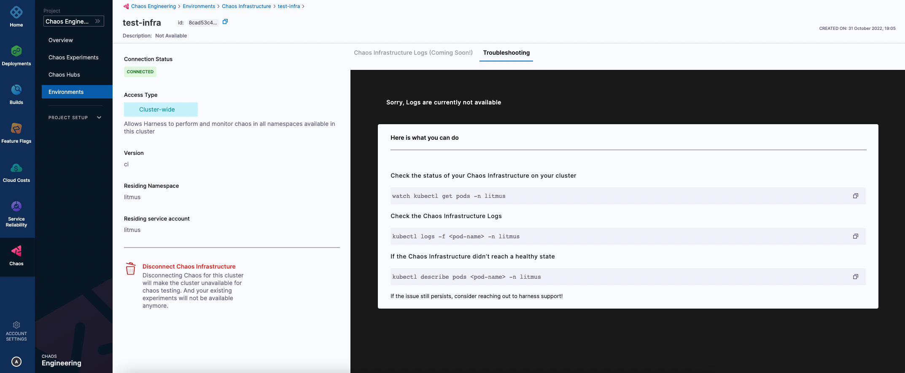

Chaos infrastructure is a service that runs in your target environment and aids HCE in accessing and injecting chaos at cloud-native scale. There are different types of chaos infrastructures based on the target environments, such as Kubernetes, Linux VMs, etc. Therefore, these chaos infrastructures might install as a Kubernetes service or a Linux daemon and so on, based on their type.

- Currently only Kubernetes chaos infrastructure is available, the other chaos infrastructures will be available soon.
- All the chaos infrastructure services adhere to the principle of least privilege where they execute only with the minimum number of permissions required.

## Create Environment
To add a chaos infrastructure for your target environment, first we need to create a new environment as part of which the chaos infrastructures will exist. Head to the **Environments** page, which lists all the environments added as part of your project. Choose **New Environment**.

In the **Create a new environment** modal, provide a name for the environment, optionally you can also add a description and tags. Then select an environment type i.e. **Production** or **Non-Production**. Then select **Create**. This will instantly create a new environment.

## Add Chaos Infrastructure
Now we can add a chaos infrastructure to our environment. Select **New Chaos Infrastructure**.

You can either setup a chaos infrastructure on existing infrastructures that uses a Harness cluster connector i.e. Harness Kubernetes connector or install the chaos infrastructure in a new infrastructure.

### On Existing Infrastructures
To use an existing Harness Kubernetes connector to install your chaos infrastructure, select **On Existing Infrastructures** in the modal. You can use any connector under the Project, Organization, and Account scope.

:::info
1. A Harness Kubernetes connector with cluster-wide read/write access can setup both cluster-scoped and namespaced-scoped chaos infrastructures.
2. A Harness Kubernetes connector with cluster-wide read access **can't** be used to setup a chaos infrastructures.
3. A Harness Kubernetes connector with specific namespace access can only be used to setup a namespace-scoped chaos infrastructure in that specific Kubernetes namespace.
:::

### On a New Infrastructure
To install chaos infrastructure on a new infrastructure, select **On New Infrastructures**. Then, select **Continue**.
Provide a name for the infrastructure. Optionally, you can also provide a description and tags. Then, select **Next**.

Under the installation mode, choose either **Cluster Wide** or **Namespace Mode** for installing the chaos infrastructure.
:::info
**Cluster Wide:** Cluster Wide infrastructure installation allows targeting resources across the entire cluster, i.e. all the namespaces, as part of an experiment.

**Namespace Mode:** Namespace Mode infrastructure installation allows targeting resources in only the namespace where the chaos infrastructure itself is deployed.
:::

By default the installation will take place in the `hce` namespace and uses `hce` service account, which can be configured. Optionally, you can also specify node selectors and K8s tolerations for chaos infrastructure deployment.

- There can only be one cluster-wide chaos infrastructure per cluster.
- There may be multiple namespace-scoped chaos infrastructures per cluster.

Then, select **Next**. In the final step, if you're deploying to an existing infrastructure with Harness Kubernetes Delegate, then Harness will install the chaos infrastructure on your behalf. Otherwise, if you're setting up the chaos infrastructure on a new infrastructure, then you will need to execute the given commands and/or download and apply the installation manifest.

For the cluster wide setup, you'll be presented with a single command which you need to apply.

On the other hand, for the namespace mode setup, you'll be presented with three distinct command which you need to apply, which undertakes:
1. Creating the target namespace
2. Applying the Chaos CRDs
3. Installing the Chaos Infrastructure

Finally, select **Done**.

## Validating Chaos Infrastructure Installation
Upon applying the manifest, it will take a while to setup all the chaos infrastructure resources. After a while, the chaos infrastructure's connection state should reflect as `CONNECTED`.

If the chaos infrastructure remains in an `INACTIVE` or `PENDING` state, follow the suggestions on the **Troubleshooting** tab to resolve it.

That's it! Now you're ready to inject chaos into your infrastructure.
