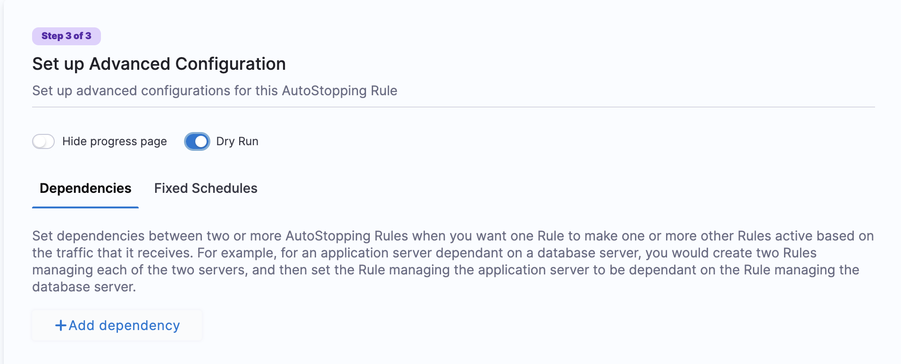
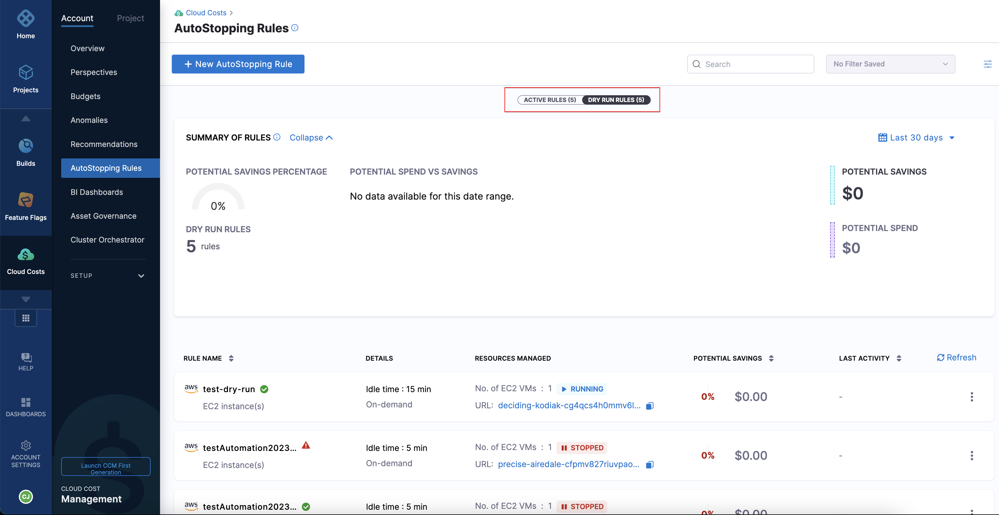
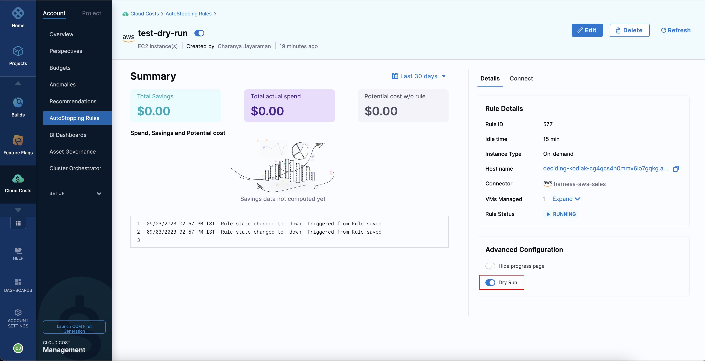

AutoStopping Rules make sure that your non-production resources run only when used, and never when idle. It also allows you to run your workloads on fully orchestrated spot instances without any worry of spot interruptions.

The dry-run mode is a feature that enables you to try out AutoStopping without actually stopping your cloud resources. This option allows you to evaluate the impact of AutoStopping and estimate the costs saved before enabling the feature.

To create an AutoStopping rule, go to one of the following topics depending on the cloud service provider:
* [Create AutoStopping Rules for Azure](/docs/cloud-cost-management/2-use-cloud-cost-management/1-optimize-cloud-costs-with-intelligent-cloud-auto-stopping-rules/3-create-auto-stopping-rules/create-auto-stopping-rules-for-azure.md)
* [Create AutoStopping Rules for Amazon ECS](/docs/cloud-cost-management/2-use-cloud-cost-management/1-optimize-cloud-costs-with-intelligent-cloud-auto-stopping-rules/3-create-auto-stopping-rules/create-auto-stopping-rules-for-ecs.md)
* [Create AutoStopping Rules for GCP](/docs/cloud-cost-management/2-use-cloud-cost-management/1-optimize-cloud-costs-with-intelligent-cloud-auto-stopping-rules/3-create-auto-stopping-rules/create-auto-stopping-rules-for-gcp.md)
* [Create AutoStopping Rules for RDS](/docs/cloud-cost-management/2-use-cloud-cost-management/1-optimize-cloud-costs-with-intelligent-cloud-auto-stopping-rules/3-create-auto-stopping-rules/create-auto-stopping-rules-for-rds.md)
* [Create AutoStopping Rules for AWS](/docs/cloud-cost-management/2-use-cloud-cost-management/1-optimize-cloud-costs-with-intelligent-cloud-auto-stopping-rules/3-create-auto-stopping-rules/create-autostopping-rules-aws.md)
* [Create AutoStopping Rules for a Kubernetes Cluster](/docs/cloud-cost-management/2-use-cloud-cost-management/1-optimize-cloud-costs-with-intelligent-cloud-auto-stopping-rules/3-create-auto-stopping-rules/create-autostopping-rules-for-kubernetes.md)

While creating the AutoStopping rule, in the **Set up Advanced Configuration** step, turn on the **Dry Run** toggle switch as shown in the screenshot: 

After creating the AutoStopping rule in the dry-run mode, you can view the rules on the summary page.

A dry run rule is similar to a regular AutoStopping rule, but it does not involve the actual shutdown of cloud resources. This approach allows you to simulate the effects of the rule without any actual impact on the resources.

Generating the estimated savings data may take up to 24 hours. You can view the savings data either in the rules summary page or in the rule details page, where you can verify if the savings data is satisfactory.

If the data is satisfactory, you can turn off the **Dry Run** mode to start saving costs.

