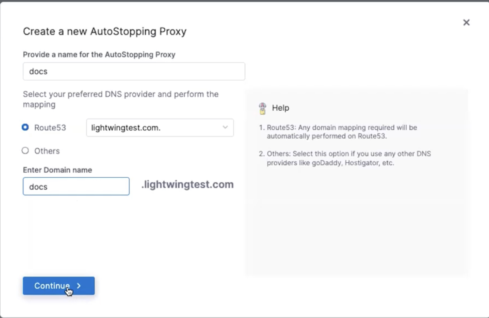

A load balancer distributes user traffic across multiple instances of your applications. Load balancing reduces the chances of performance issues in your applications by spreading the load.

You can create a custom load balancer using the AutoStopping proxy option. This feature allows you to launch a VM with the load balancer.

Perform the following steps to create an AutoStopping proxy for your resources in AWS:

1. In the **Harness** application, go to **Cloud Costs**.
2. Under **Setup**, click **Load Balancers**.
3. Click **Create New Load Balancer**.
4. Select **AWS**.
5. Choose an existing connector or [create a new one](/docs/cloud-cost-management/2-use-cloud-cost-management/1-optimize-cloud-costs-with-intelligent-cloud-auto-stopping-rules/1-add-connectors/connect-to-an-aws-connector.md).
6. Click **Continue**.
7. Click **Create AutoStopping Proxy**. 
8. Click **Continue**.
9. In the** Create a new AutoStopping Proxy **window, enter the following information:
    1. Provide a name for the AutoStopping Proxy.
    2. Select your preferred DNS provider and perform the mapping:
        *  If you select **Route 53**, you must choose a hosted zone from the available zones and enter the domain name. AutoStopping manages Route 53 configuration automatically. 
        * If you select **Others**, enter the URL of the DNS provider.
    3. Click **Continue**.

    

10.  Select the region where you have your cloud resources hosted.
11.  Select the **VPC** from the dropdown list.
12.  Select the instance family type from the dropdown list.
13.  Enter the **TLS Certificate Secret Version**: On the AWS console, go to **Secrets Manager**, and store a secret. You must choose the **Other type of secret** option. Go to [https://docs.aws.amazon.com/secretsmanager/latest/userguide/create_secret.html](https://docs.aws.amazon.com/secretsmanager/latest/userguide/create_secret.html) for more information. After successfully storing the secret, enter the **Secret ARN** in this field. 

14.  Enter the API key generated in Harness New Generation. Go to [Create an API Key](/docs/platform/16_APIs/api-quickstart.md) for more information.
15.  Select the **Security Group** of your instance.
16.  Select the SSH key pair to connect to your VM.
17.  Enter the **Secret ARN** in the **TLS Private Key Secret Version **field**.**
18.  Enable **Allocate Static IP** if you need to access the VM outside the VPC. Ensure that the DNS resolves.
19.  Click **Save Load Balancer**.