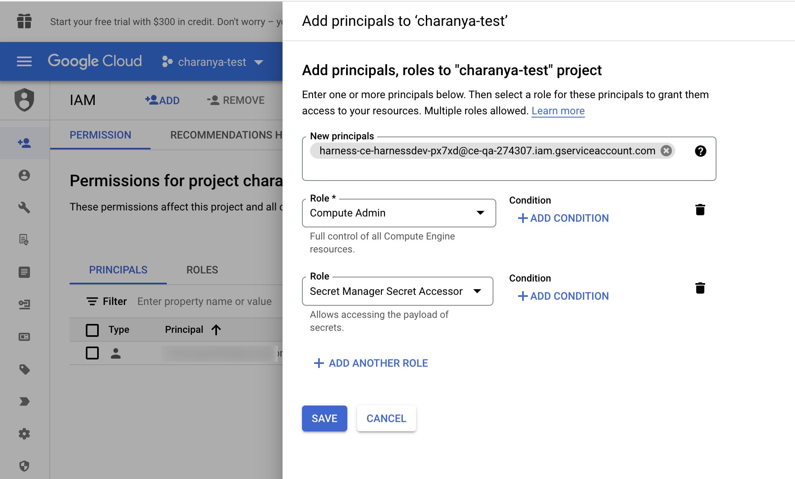
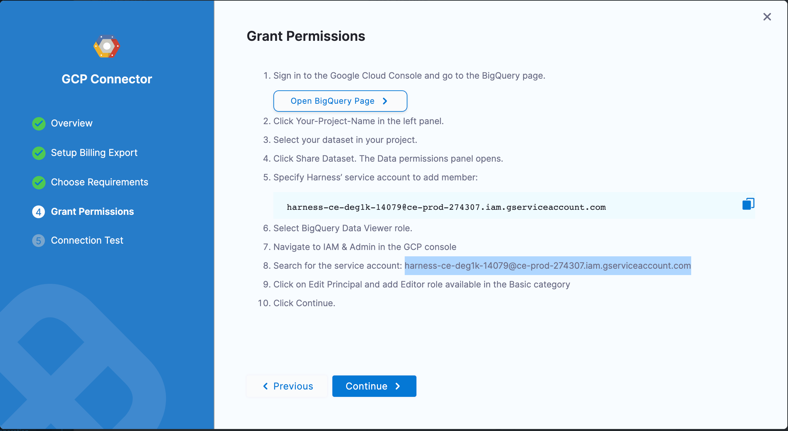
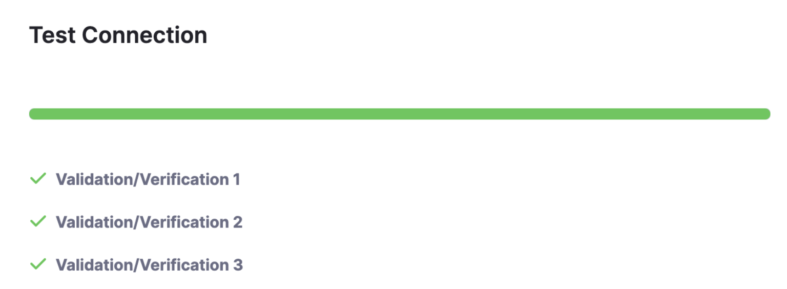

Connectors allow Harness to connect to your deployment environments, such as Kubernetes Clusters, AWS, Google Cloud Platform, Azure, etc. To create an AutoStopping Rule for your GCP instances, you first need to connect Harness to your GCP account.

This topic describes how to connect your GCP cloud account to Harness.

### Before you begin

* [AutoStopping Rules Overview](../1-auto-stopping-rules.md.md)

### Add a GCP Connector

Perform the following steps to add a GCP connector for AutoStopping Rules:

1. In **Cloud Costs**, click **New AutoStopping Rule**.[
   
     
2. In **AutoStopping Rules**, select **GCP**. It is the cloud account in which your workloads are running that you want to manage using AutoStopping Rules.
3. Click **Connect to your GCP account** drop-down list and then click **New Connector**.
4. See [Setting up a connector for your GCP account](../../../2-getting-started-ccm/4-set-up-cloud-cost-management/set-up-cost-visibility-for-gcp.md) to create the CCM connector.
5. You have to add the following permissions in the **Grant Permissions** step to be able to use the AutoStopping feature:
	1. To add AutoStopping permissions, navigate to the **IAM & Admin** page on the GCP console.
	2. Click **IAM** on the right pane.
	3. Click **Add** in the **PERMISSION** tab.
	4. In the **Add Principals to [Project name]** window, enter the service principal.
	5. Select the required roles and click **Save.**  
	When a connector is created, a service account is created in Harness' GCP project that is unique for each customer. This service account is created only once per customer. You need to assign two roles to this service account in the GCP project that they are connecting to Harness CCM.  
	**Compute Admin** - Assign this role to Harness' service account. This allows Harness CCM to be able to perform AutoStopping actions such as starting and stopping of VMs and Instance groups. Also, GCP AutoStopping involves the usage of a custom VM with configurations as per your preference (instance type configuration). This requires access to create and launch a VM in which a custom load balancer for AutoStopping is installed.  
	**Secret Manager Secret Accessor** - Assign this role if you intend to use TLS/HTTPS in the routing configurations of the AutoStopping Rule. You need to upload the certificate's *private key* and the *public certificate* as secrets in GCP. Harness needs access to these secrets to be able to configure the custom load balancer. This role provides access to **only** the particular versions of the secrets, provided the complete path is entered during the creation of the custom load balancer. It does **not** let Harness view or list all the secrets in your GCP project. You can also add additional protection in the GCP on your end to provide conditional access to secrets as necessary. For example, provide access to Harness' service account to versions of only those secrets with a naming convention like "Harness-".  
	
	  
6. Click **Continue** in Harness.

 
 ### Test your connection

The connection is validated and verified in this step. After successfully testing the connection, click **Finish**.

  Your connector is now listed in the **Connectors**.

### Next Steps

* [Create AutoStopping Rules for GCP](../4-create-auto-stopping-rules/create-auto-stopping-rules-for-gcp.md)

