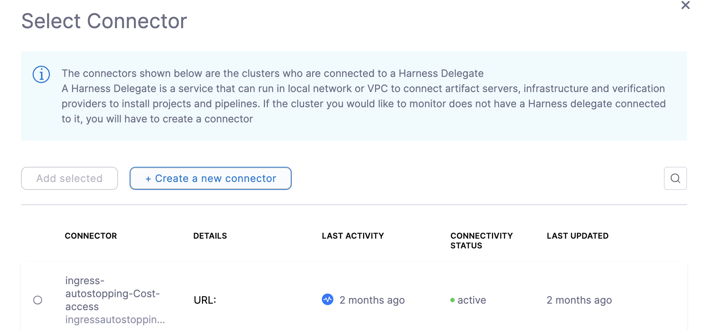
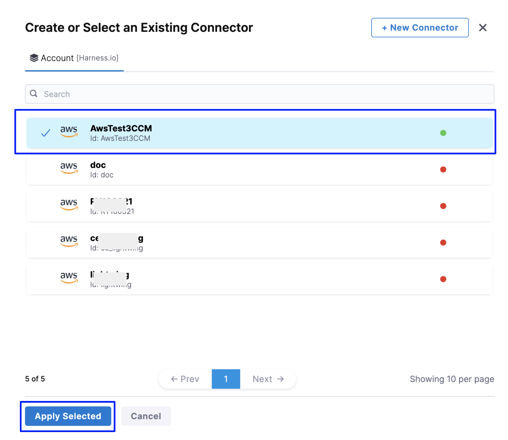

Connectors allow Harness to connect to your deployment environments, such as Kubernetes Clusters, AWS, Google Cloud Platform, Azure, etc. To create an AutoStopping Rule for your Kubernetes clusters, you first need to connect Harness to your cluster.

This topic describes how to connect your Kubernetes cluster to Harness for creating AutoStopping Rules.

## Before you begin

Make sure you have the following set up before you create a Kubernetes connector for AutoStopping Rules:

* Make sure that you have access to your Kubernetes cluster.
* Make sure that you've added a cloud provider connector depending on the type of Kubernetes cluster for which you want to create AutoStopping rules:
	+ EKS (AWS): [Create an AWS Connector for AutoStopping Rules](../1-add-connectors/connect-to-an-aws-connector.md)
	+ AKS (Azure): [Create an Azure Connector for AutoStopping Rules](../1-add-connectors/add-azure-connector.md)
	+ GKE (GCP): [Create a GCP Connector for AutoStopping Rules](../1-add-connectors/create-a-gcp-connector-for-auto-stopping-rules.md)
* Make sure that you have added a **Kubernetes Cluster** in **Cloud Providers Connector.** See [Add a Kubernetes Cluster Connector](../../../../platform/7_Connectors/add-a-kubernetes-cluster-connector.md).


:::note
You must not rename the cluster. If you're setting up a new connector with the cluster, it is identified by the `clustername`. Renaming the cluster results in duplicate entries in the dashboard. 
:::
 
**​Set up your Kubernetes Cluster**

You need a target Kubernetes cluster for the Harness Delegate and deployment. Make sure your cluster meets the following requirements:
  * **Number of nodes**: 2
  * **vCPUs, Memory, Disk Size**: 4vCPUs, 16GB memory, 100GB disk. In GKE, the **e2-standard-4** machine type is enough for this quickstart.
  * **Networking**: outbound HTTPS for the Harness connection to **app.harness.io**, **github.com**, and **hub.docker.com**. Allow TCP port 22 for SSH.
  * **Kubernetes service account** with permission to create entities in the target namespace is required. The set of permissions should include `list`, `get`, `create`, and `delete` permissions. In general, the cluster-admin permission or namespace admin permission is enough.  
	For more information, see [User-Facing Roles](https://kubernetes.io/docs/reference/access-authn-authz/rbac/#user-facing-roles) from Kubernetes.
  
**Delegate Size**

  Your Kubernetes cluster must have unallocated resources required to run the Harness Delegate workload:

  - Laptop - 1.6GB memory, 0.5CPU
  - Small - 3.3GB memory, 1CPU
  - Medium - 6.6GB memory, 2CPU
  - Large - 13.2GB memory, 4CPU

:::important
These sizing requirements are for the Delegate only. Your cluster will require more memory for Kubernetes, the operating system, and other services. Ensure that the cluster has enough memory, storage, and CPU for all of its resource consumers.
:::
* Make sure you are a member of the Harness Administrator Group in the Harness FirstGen version. This is required to [create an API key](https://developer.harness.io/docs/platform/role-based-access-control/add-and-manage-api-keys/).
* **Metrics Server**: Metrics Server must be running on the Kubernetes cluster where your Harness Kubernetes Delegate is installed. Before enabling CCM for Kubernetes, you must make sure the utilization data for pods and nodes is available.
  
  
:::note
Metrics Server is installed by default on GKE and AKS clusters; however, you need to install it on the AWS EKS cluster.
:::
 
  
  Metrics Server is a cluster-wide aggregator of resource usage data. It collects resource metrics from kubelets and exposes them in the Kubernetes API server through Metrics API. CCM polls the utilization data every minute on the Delegate. The metrics are aggregated for 20 minutes and then CCM keeps one data point per 20 minutes. For more information, see [Installing the Kubernetes Metrics Server](https://docs.aws.amazon.com/eks/latest/userguide/metrics-server.html) from AWS.  
To install a metrics server on your EKS clusters, run the following command
```
kubectl apply -f https://github.com/kubernetes-sigs/metrics-server/releases/download/v0.5.0/components.yaml
```

For a list of supported ingress controllers, go to [Supported Ingress Controllers for Kubernetes AutoStopping](../../../../getting-started/supported-platforms-and-technologies.md#cloud-cost-management).

### Kubernetes Coverage

The following section lists the support for Kubernetes clusters for AutoStopping Rules:

* EKS (AWS)
* GKE (GCP)
* AKS (Azure)
* kOps

### Kubernetes Cluster Connector Setup Options

There are two ways to add a Kubernetes cluster connector:

* **When Setting Up the Connectors**: You can create Connectors from the Account Resources option in the Account Setup. See [Connect Your Kuberenetes Cluster to CCM](../../../2-getting-started-ccm/4-set-up-cloud-cost-management/set-up-cost-visibility-for-kubernetes.md).
* **When Creating an AutoStopping Rule**: You can also add a Connector inline when creating an AutoStopping Rule. If you've added a Kubernetes Connector already as described in the [Connect Your Kuberenetes Cluster to CCM](../../../2-getting-started-ccm/4-set-up-cloud-cost-management/set-up-cost-visibility-for-kubernetes.md), you can simply select your Kubernetes Connector for which you want to create AutoStopping Rules. This topic explains how to add a Kuberenetes cluster inline when creating an AutoStopping Rule.
  
    

### Connect Your Kubernetes Cluster Connector to CCM for AutoStopping Rules

Perform the following steps to connect your Kubernetes cluster connector inline when creating AutoStopping Rules:

1. In **Cloud Costs**, in **AutoStopping Rules**, click **New AutoStopping Rule**.
   
     
2. In **AutoStopping Rules**, select the cloud account. It is the cloud account in which your workloads are running that you want to manage using AutoStopping Rules.  
  
You can select any of the following cloud account types:  
- AWS  
- Azure  
- GCP
  
    

3. Click **Connect to your** ***Cloud Account*** drop-down list. The name of the drop-down list depends on the cloud account type selection. For example, if you select AWS, then the label reads as **Connect to your AWS account**.
4. In **Create or Select an Existing Connector** page, select your Conenctor from the list.  
  
If you have not created a cloud provider connector already, click **New Connector**. Refer to the following topics to add your cloud account Connector (depending on the type of cloud account you have selected):  

* AWS: [Create an AWS Connector for AutoStopping Rules](../1-add-connectors/connect-to-an-aws-connector.md)
* Azure: [Create an Azure Connector for AutoStopping Rules](../1-add-connectors/add-azure-connector.md)
* GCP: [Create a GCP Connector for AutoStopping Rules](../4-create-auto-stopping-rules/create-auto-stopping-rules-for-gcp.md)
  
    
1. After creating your cloud account type Connector, select the Connector, and click **Apply Selected**.
   
     
2. In **Let's get you started** page, click **Next**.
3. In **Configurations**, in **Define your AutoStopping rule**, in **Name your Rule**, enter a name for your rule. This is the name of your AutoStopping rule.
4. In **Idle time**, enter the idle time in minutes. This is the time that the AutoStopping rule will wait before stopping the idle instances.
5.  In **Resources to be managed by the AutoStopping rules** step, select **Kubernetes Cluster** and then click **Add a cluster**.
    
	  
10. Click **Create a new connector**.
11. See [Set up CCM for Kubernetes](../../../2-getting-started-ccm/4-set-up-cloud-cost-management/set-up-cost-visibility-for-kubernetes.md) for instructions on creating a new connector.

### Next Step

* [Create AutoStopping Rules for a Kubernetes Cluster](../4-create-auto-stopping-rules/create-autostopping-rules-for-kubernetes.md)

