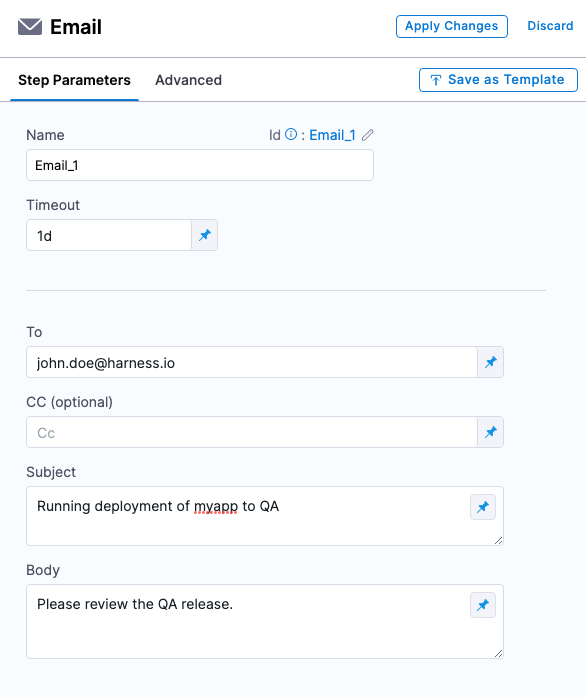

This topic describes the settings for the Email step available in Continuous Delivery (CD) and custom stages.

The Email step lets you easily send emails to users and teams during a pipeline execution.

  

The Email step has the following features:

- Send emails during pipeline executions.
- You can use the Harness SMTP Server included with your Harness account.
- Use your own SMTP server by adding it to Harness. For more information, go to [Add SMTP Configuration](https://developer.harness.io/docs/platform/notifications/add-smtp-configuration/).
- You can use this step as a [step template](https://developer.harness.io/docs/platform/templates/run-step-template-quickstart/) or as part of a [stage template](https://developer.harness.io/docs/platform/Templates/add-a-stage-template). 
- You can manage this step's configuration via [Harness Git Experience](https://developer.harness.io/docs/platform/git-experience/git-experience-overview/).


## YAML example

```YAML
           steps:
              - step:
                  type: Email
                  name: Update Status
                  identifier: Update_Status
                  spec:
                    to: rohan.gupta@harness.io 
                    cc: srinivas@harness.io
                    subject: Deployment Status
                    body: "Pipeline: <+pipeline.name> is complete. Harness deployed service <+service.name> into environment <+env.name>"
                  timeout: 10m
```

## To

The email address(es) where you want this Harness pipeline to send an email. 

This setting can use be a comma-separated string of addresses. For example, `john.doe@harness.io, bill.smith@harness.io`.

You can set **To** as a runtime input.
  
You can pass in the email as a Harness expression, such as `<+pipeline.triggeredBy>`.

For more information on runtime inputs and expressions, go to [Fixed Values, Runtime Inputs, and Expressions](https://developer.harness.io/docs/platform/references/runtime-inputs/).

## CC
 
You can add email addresses to the **CC** section to carbon copy addresses on the email that will be sent with the pipeline execution.

## Subject

You can provide a subject for the email. 

This subject can be a fixed string (for example, `Prod Deployment Notification`), a string with expressions (for example, `<+env.name> Deployment Notification`), or a runtime input.

For more information on runtime inputs and expressions, go to [Fixed Values, Runtime Inputs, and Expressions](https://developer.harness.io/docs/platform/references/runtime-inputs/).

## Body

The **Body** is a string field. You can enter in text and Harness expressions. Harness will resolve the expressions before sending the email.

For more information on runtime inputs and expressions, go to [Fixed Values, Runtime Inputs, and Expressions](https://developer.harness.io/docs/platform/references/runtime-inputs/).

## Advanced settings

In **Advanced**, you can use the following options:

* [Delegate Selector](/docs/platform/Delegates/manage-delegates/select-delegates-with-selectors.md)
* [Conditional Execution](../../../platform/8_Pipelines/w_pipeline-steps-reference/step-skip-condition-settings.md)
* [Failure Strategy](../../../platform/8_Pipelines/w_pipeline-steps-reference/step-failure-strategy-settings.md)
* [Looping Strategy](../../..//platform/8_Pipelines/looping-strategies-matrix-repeat-and-parallelism.md)

## Options

You can send emails using your own SMTP Server. For more information, go to [Add SMTP Configuration](https://developer.harness.io/docs/platform/notifications/add-smtp-configuration/).


