# Continuous Delivery Helm Tutorial


```mdx-code-block
import KubernetesDelegateInstall from '/docs/docs-shared-components/kubernetes-delegate-install-includes.md';
```

## Background on Helm
Introduced during the first KubeCon, [Helm](https://harness.io/blog/what-is-helm) has been a stalwart in the Kubernetes ecosystem almost since the inception of Kubernetes. If you are unfamiliar with Helm, Helm is a package manager for Kubernetes; similarly to Homebrew on your Mac or Chocolatey on your Windows machine. 

A Helm Chart is the unit of packaging that Helm creates/applies. Helm also has templating abilities so interactions or reuse with Helm Charts can be templated out. 

*Example structure of a Wordpress Helm Chart:*


Having a Helm Chart(s) as part of your Continuous Delivery Pipeline when deploying to Kubernetes is simple with Harness. From installing third party pieces of software/platforms to deploying your own application represented with Helm, this example will get your Helm Deployment integrated into a Pipeline. 

## Building Blocks of a Helm Deployment Pipeline
To leverage Helm, you do need a few pieces. The first would be a Kubernetes Cluster and then Helm Resources to deploy. 


Harness does simplify this experience that you do not need to install a Helm Client on your machine to leverage Helm. There are several great Helm Chart Repositories out there, [Bitnami](https://bitnami.com/stacks/helm) being a great host to many Helm Charts. In this example, let’s wire a Bitnami Helm Chart into a Continuous Delivery Pipeline.  

## Getting Started with Harness Continuous Delivery to Deploy a Helm Chart
Getting started with Harness CD is simple, first if you do not have a Harness Account, you can sign up for [free for Harness CD Account](https://app.harness.io/auth/#/signup/?module=cd).  

Once signed up, navigate to the Deployments icon on the left hand navigation and create your start your free forever CD Free Plan. 


Once you have clicked on “Start CD Free Plan”, a default Harness Project will be created for you automatically. Projects are logical groupings of resources. The generated default project is perfect for the first time deployment. 

When navigating back to Deployments, can set the project context to the Default Project by clicking on the blue chevrons >> and selecting Default Project. 


With the Default Project selected, clicking on Overview will bring up a wizard to create your first Pipeline/Deployment.

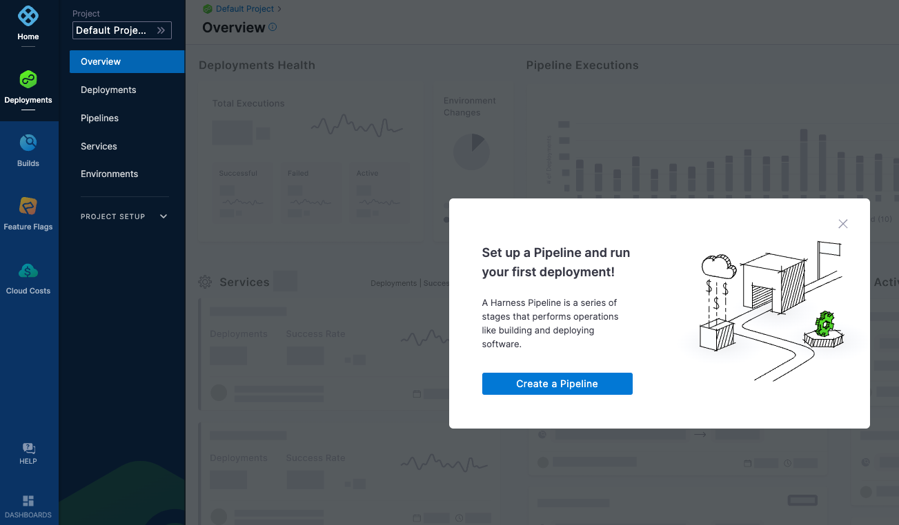

There are a few Harness Objects that will need to be created in Harness. Harness works on a concept of worker nodes called [Harness Delegates](https://docs.harness.io/article/2k7lnc7lvl-delegates-overview). These Delegates can perform work on your behalf. One will need to be set up to deploy into a Kubernetes cluster. The second will be access to the Helm Chart Repository. Let’s set up the Harness Delegate first. 

### Deploying the Harness Delegate into a Kubernetes Cluster

```mdx-code-block
<KubernetesDelegateInstall />
```

## Creating Your First Harness Pipeline with Helm

With the Delegate install out of the way, you are now ready to create your first Harness Pipeline. You will be deploying a [WildFly](https://www.wildfly.org/) Helm Chart coming from a [public Helm Chart Repository](https://github.com/bitnami/charts/tree/master/bitnami/wildfly/#installing-the-chart). The following steps will walk you through how to create a Pipeline with those resources. 

* Deployments -> Pipelines + Create new Pipeline
* Name: helm-pipeline
* Setup Pipeline: Inline


Click Start and now can add a Pipeline Stage by clicking the +Add Stage icon. 


Select Deploy as the Stage. 
Next name the stage “Deploy Wildfly” as a type Service. 

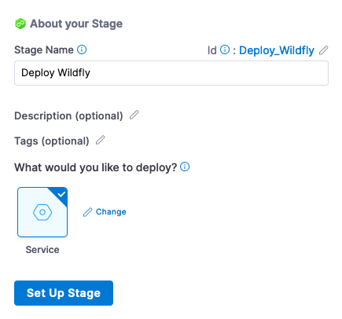

Then click Set Up Stage. 

The first step is to define the Service e.g the “what” you are deploying by clicking on + New Service


Name: my-wildfly-instance

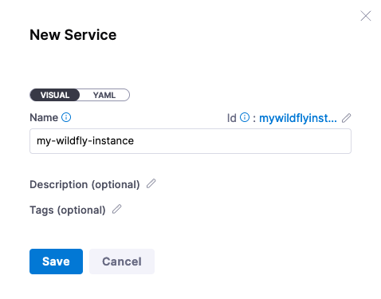

Once Saved, the next step is to point to Bitnami’s WildFly Helm Chart. In the Service Definition section, select Native Helm as the Deployment Type. Then you can wire in the Helm Chart Repository information in the Manifest section.

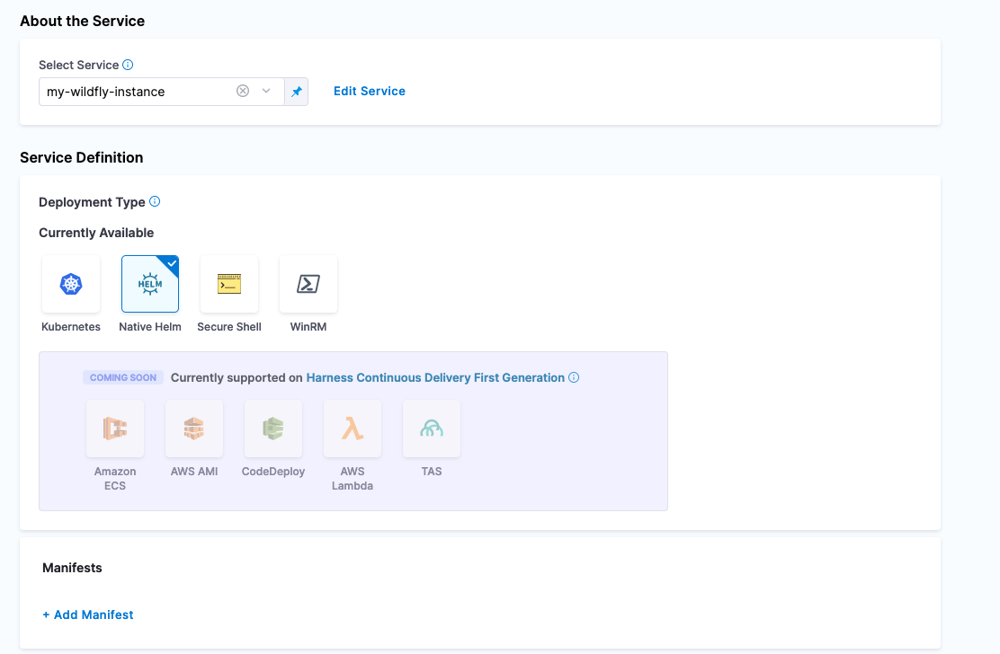

Click on + Add Manifest in the Manifests Section then select Helm Chart as the Manifest Type. 


Click Continue and then select HTTP Helm as the Helm Chart Store. Create a new HTTP Helm Repo to connect to Bitnami’s Helm Chart Repository by clicking + New HTTP Helm Repo Connector. Follow the wizard.

* Name: bitnami-helm
* Helm Repository URL: https://charts.bitnami.com/bitnami
* Authentication: Anonymous 

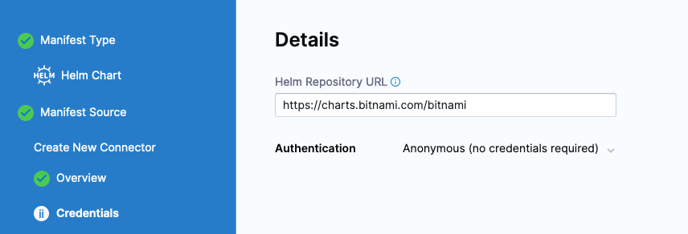

Click Continue and can specify which Harness Delegate you would want to run the Helm operations on. If using this example, can select “Use any available Delegate”. 

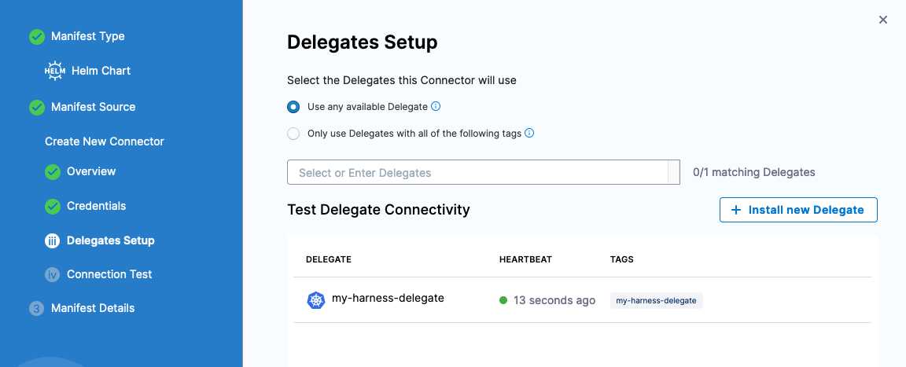

Click Save and Continue which will run through a Connection Test.

Now you can enter the Helm Chart information. 

* Manifest Name: wildfly
* Chart Name: wildfly
* Helm Version: Version 3

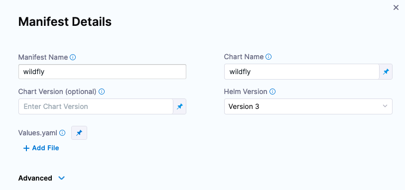

Click Submit, and the WildFly Helm Chart will be wired to your Harness Pipeline Stage. 


With the Helm Chart wired in, now you can define the “where” or the target Kubernetes cluster to deploy your Helm Chart to. 

## Setting Your Deployment Target

With the “what” out of the way, the next two steps are the “where” and “how”. Click Continue after wiring in the Helm Chart, and you will be brought to the Infrastructure configuration. 


The object being set up here is a [Harness Environment](https://docs.harness.io/article/n39w05njjv-environment-configuration); naming and saving the “where” you are deploying. 

You can create a new Harness Environment via the wizard by clicking on + New Environment. 

* Name: my-k8s-environment
* Environment Type: Pre-Production


Click Save and now you are ready to wire in your Kubernetes cluster. Since your Delegate should be running in a Kubernetes cluster, you can create a reference to this cluster with a Cluster Connector. 

Select “Direct Connection” Kubernetes then can fill out the Cluster Details with a New Connector. 


Click on Select Connector and then + New Connector 

Once clicked on + New Connector, can give a name to your Kubernetes cluster. 

Name: my-k8s-cluster

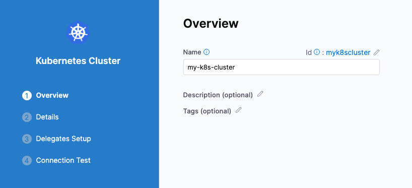

Click Continue and select “Use the credentials of a specific Harness Delegate” to connect. 


Click Continue and select the Harness Delegate you installed into your Kubernetes Cluster e.g my-harness-delegate. 


Click Save and Continue and a connectivity test will occur. 
Click Finish and you can enter a namespace that is available on the Kubernetes cluster. 

* Namespace: default


Click Continue and now you are ready to configure how you want your deployment to execute. 

## How Your Pipeline Deploys

Clicking Continue, you are now ready to configure the Execution Strategy or the “how” your Pipeline executes.  For the example, a Rolling Deployment is simplest. 

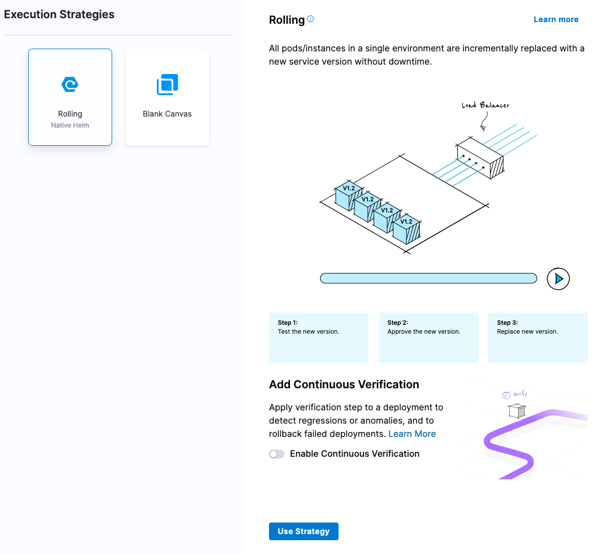

Select “Rolling” then click on Use Strategy. Now you are ready to save this Pipeline and execute the Pipeline to create a deployment e.g a [Helm Release](https://helm.sh/docs/intro/using_helm/). 


Click Save and you are now ready to run your Pipeline executing the Helm Chart. 

## Your First Pipeline Execution with Helm

Executing your Pipeline is easy. Just click Run back in the Pipelines menu and you are on your way to a Helm Release. 


Click Run Pipeline and your Pipeline will execute. In the “Install/Upgrade” section of the console output, you will see commands to visit your new Wildfly instance. 

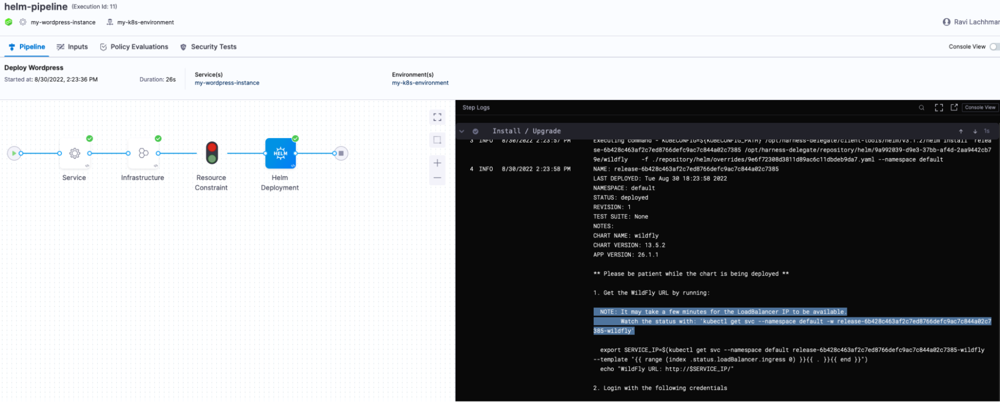

E.g.

```
kubectl get svc --namespace default release-6b428c463af2c7ed8766defc9ac7c844a02c7385-wildfly
```

Head to the External-IP and check out your new Helm Release. 


Heading to http://34.123.210.140

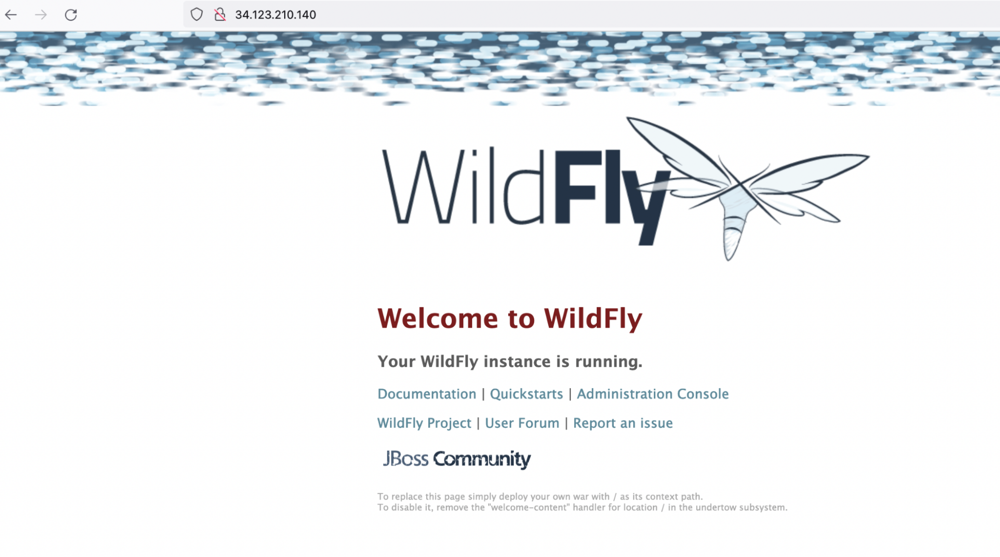

Congratulations on your first Harness Helm Deployment [release]!

