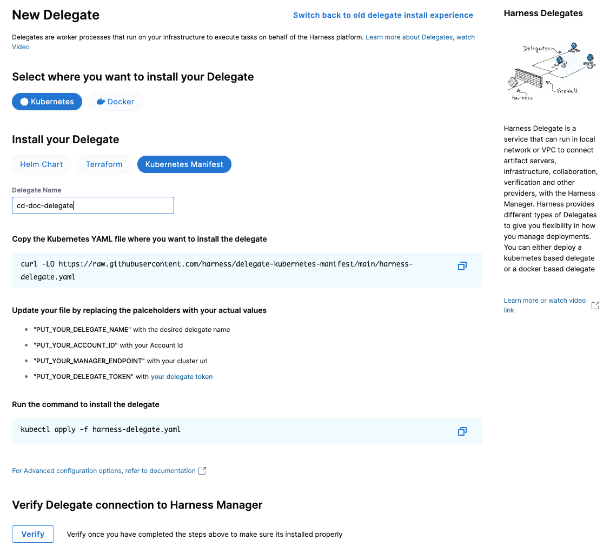
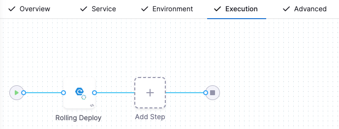
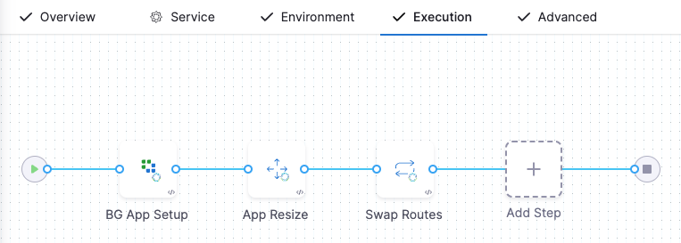
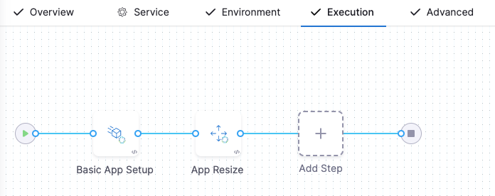
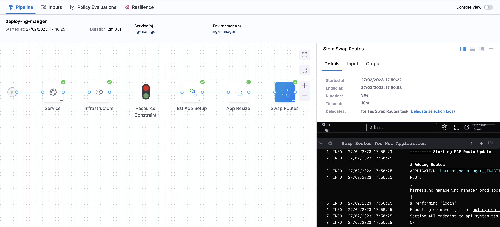

This tutorial shows you how to deploy a publicly available application to your Tanzu Application Service (TAS, formerly PCF) space using any [deployment strategy](../../cd-execution/kubernetes-executions/create-a-kubernetes-rolling-deployment.md) in Harness.

:::note
Currently, this feature is behind feature flags `NG_SVC_ENV_REDESIGN`, `CDS_TAS_NG`. Contact [Harness Support](mailto:support@harness.io) to enable this feature. 
:::

## Objectives

You'll learn how to:

* Install and launch a Harness delegate in your target cluster.
* Connect Harness with your TAS account.
* Connect Harness with a public image hosted on Artifactory.
* Specify the manifest to use for the app.
* Set up a TAS pipeline in Harness to deploy the app.

## Important notes

* For TAS deployments, Harness supports the following artifact sources: Artifactory, Nexus, Amazon S3, GCR, ECR, ACR, Google Artifact Registry, GitHub Package Registry, Custom registry, and any Docker Registry such as DockerHub. You connect Harness to these registries using your registry account credentials.
* To create a TAS pipeline in Harness, make sure that you have the **Continuous Delivery** module in your Harness account. For more information, go to [Create Organizations and Projects](https://developer.harness.io/docs/platform/organizations-and-projects/create-an-organization/). 

## Connect to a TAS provider

You can connect Harness to a TAS space by adding a TAS connector.
1. Open a Harness project and select the **Deployments** module.
2. In **Project Setup**, select **Connectors**, then select **New Connector**.
3. In **Cloud Providers**, select **Tanzu Application Service**. The TAS connector settings appear. 
4. Enter a connector name and select **Continue**.
5. Enter the TAS **Endpoint URL**. For example, `https://api.system.tas-mycompany.com`.
6. In **Authentication**, select:
    1. **Plaintext** and enter the username and password. For password, you can either create a new secret or use an existing one.
    2. **Encrypted** and enter the username and password. You can create a new secret for username and password or use exiting ones.
7. Select **Continue**.
8. In **Connect to the provider**, select **Connect through a Harness Delegate**, and then click **Continue**.
   We don't recommend using the **Connect through Harness Platform** option here simply because you'll need a delegate later for the connection to your TAS environment. Typically, the **Connect through Harness Platform** option is a very quick way to make connections without having to use delegates.
9. In **Delegates Setup**, click **Install new Delegate**. The delegate wizard appears.
    
      
      
10. In the **New Delegate** dialog, select **Kubernetes** in **Select where you want to install your Delegate**, then select **Kubernetes Manifest** in **Install your Delegate**.
11. Enter a delegate name.
    - Delegate names must be unique within a namespace and should be unique in your cluster. 
    - A valid name includes only lowercase letters and does not start or end with a number. 
    - The dash character (“-”) can be used as a separator between letters.
12. In a Terminal, run the following cURL command to copy the Kuberntes YAML file to the target location for installation.

    `curl -LO https://raw.githubusercontent.com/harness/delegate-kubernetes-manifest/main/harness-delegate.yaml`

13. Open the harness-delegate.yaml file. Find and specify the following placeholder values as described.

| **Value** | **Description** |
| :-- | :-- |
| `PUT_YOUR_DELEGATE_NAME` | The name of the delegate. |
| `PUT_YOUR_ACCOUNT_ID` | Your Harness account ID. |
| `PUT_YOUR_MANAGER_ENDPOINT` | The URL of your cluster. See the following table of Harness clusters and endpoints. |
| `PUT_YOUR_DELEGATE_TOKEN` | Your delegate token. To find it, go to **Account Settings > Account Resources**, select **Delegate**, and select **Tokens**. For more information on how to add your delegate token to the harness-delegate.yaml file, go to [Secure delegates with tokens](/docs/platform/delegates/secure-delegates/secure-delegates-with-tokens/). |

Your Harness Manager endpoint depends on your Harness cluster location. Use the following table to find your Harness Manager endpoint on your Harness cluster.

| **Harness cluster location** | **Harness Manager endpoint** |
| :-- | :-- |
| SaaS prod-1 | https://app.harness.io |
| SaaS prod-2 | https://app.harness.io/gratis |
| SaaS prod-3 | https://app3.harness.io |

14.  Install the delegate by running the following command.

    `kubectl apply -f harness-delegate.yaml`

    The successful output looks something like this.
    
    ```
    namespace/harness-delegate-ng unchanged
    clusterrolebinding.rbac.authorization.k8s.io/harness-delegate-cluster-admin unchanged
    secret/cd-doc-delegate-account-token created
    deployment.apps/cd-doc-delegate created
    service/delegate-service configured
    role.rbac.authorization.k8s.io/upgrader-cronjob unchanged
    rolebinding.rbac.authorization.k8s.io/upgrader-cronjob configured
    serviceaccount/upgrader-cronjob-sa unchanged
    secret/cd-doc-delegate-upgrader-token created
    configmap/cd-doc-delegate-upgrader-config created
    cronjob.batch/cd-doc-delegate-upgrader-job created
    ```
    
    

15. Select **Verify** to make sure the delegate is installed properly.

16. Back in **Set Up Delegates**, you can select the new delegate.  
   In the list of delegates, you can see your new delegate and its tags.  
17. Select the **Connect using Delegates with the following Tags** option.
18. Enter the tag of the new delegate and select **Save and Continue**.
19. Once the test connection succeeds, select **Finish**. The connector now appears in the **Connectors** list.

## Install CF CLI v6 or v7 on your Harness delegate

Harness supports CF CLI v6 and v7. Currently v7 support is behind feature flag, `CF_CLI7`. Contact [Harness Support](mailto:support@harness.io) to enable CF CLI v7 support. 

You can install CF CLI v6 or v7 on your Harness delegate using a package manager or compressed binary.

```mdx-code-block
import Tabs from '@theme/Tabs';
import TabItem from '@theme/TabItem';
```
```mdx-code-block
<Tabs>
  <TabItem value="Package manager" label="Package manager" default>
```

1. Copy the following script install CF CLI, `autoscaler` and `Create-Service-Push` plugins on your delegate profile.
   
   ```
   apt-get install wget
   wget -q -O - https://packages.cloudfoundry.org/debian/cli.cloudfoundry.org.key | apt-key add -
   echo "deb https://packages.cloudfoundry.org/debian stable main" | tee /etc/apt/sources.list.d/cloudfoundry-cli.list
   apt-get update
   apt-get install cf-cli
   
    # autoscaler plugin
    # download and install pivnet
    wget -O pivnet github.com/pivotal-cf/pivnet-cli/releases/download/v0.0.55/pivnet-linux-amd64-0.0.55 && chmod +x pivnet && mv pivnet /usr/local/bin;
    pivnet login --api-token=<replace with api token>

    # download and install autoscaler plugin by pivnet
    pivnet download-product-files --product-slug='pcf-app-autoscaler' --release-version='2.0.295' --product-file-id=912441
    cf install-plugin -f autoscaler-for-pcf-cliplugin-linux64-binary-2.0.295

    # install Create-Service-Push plugin from community
    cf install-plugin -r CF-Community "Create-Service-Push"

    # verify cf version
    cf --version

    # verify plugins
    cf plugins
   ```
   
   To install CF CLI v7, replace `apt-get install cf-cli` with `apt-get install cf7-cli` in the above script.
   
2. Apply the profile to the delegate profile and check logs.
   
   

   The output for `cf --version` for v6 looks like this.

   `cf version 6.53.0+8e2b70a4a.2020-10-01`

   The output for `cf --version` for v7 looks like this.

   `cf version 7.2.0+be4a5ce2b.2020-12-10`

   The output for `cf plugins` looks like this for v6 and v7.
   
   ```
   App Autoscaler        2.0.295   autoscaling-apps              Displays apps bound to the autoscaler
   App Autoscaler        2.0.295   autoscaling-events            Displays previous autoscaling events for the app
   App Autoscaler        2.0.295   autoscaling-rules             Displays rules for an autoscaled app
   App Autoscaler        2.0.295   autoscaling-slcs              Displays scheduled limit changes for the app
   App Autoscaler        2.0.295   configure-autoscaling         Configures autoscaling using a manifest file
   App Autoscaler        2.0.295   create-autoscaling-rule       Create rule for an autoscaled app
   App Autoscaler        2.0.295   create-autoscaling-slc        Create scheduled instance limit change for an autoscaled app
   App Autoscaler        2.0.295   delete-autoscaling-rule       Delete rule for an autoscaled app
   App Autoscaler        2.0.295   delete-autoscaling-rules      Delete all rules for an autoscaled app
   App Autoscaler        2.0.295   delete-autoscaling-slc        Delete scheduled limit change for an autoscaled app
   App Autoscaler        2.0.295   disable-autoscaling           Disables autoscaling for the app
   App Autoscaler        2.0.295   enable-autoscaling            Enables autoscaling for the app
   App Autoscaler        2.0.295   update-autoscaling-limits     Updates autoscaling instance limits for the app
   Create-Service-Push   1.3.2     create-service-push, cspush   Works in the same manner as cf push, except that it will create services defined in a services-manifest.yml file first before performing a cf push.
   ```  

:::note
Two different CF CLI versions can't be installed on the same delegate using package manager. It can be done using a custom compresse binary.
:::

```mdx-code-block
  </TabItem>
  <TabItem value="Compressed binary" label="Compressed binary">
```

You can install CF CLI using custom compressed binary when you want to:
* Install both versions of CF CLI custom Compressed Binary on the same delegate.
* Install one version of CF CLI using package manager and another using a custom compressed binary on the same delegate. 
* Install a custom binary when a security scan is done and included in a security fix.
  
1. Copy the following script install CF CLI, `autoscaler` and `Create-Service-Push` plugins on your delegate profile.
   
   ```
    # download compresed binary, provide url to compressed binary
    curl -L "<url-to-custom-commpressed-cli6-binary>" | tar -zx

    # ...move it to path on your file system
    mv cf /<path-to-cli6-binary>

    # autoscaler plugin
    # download and install pivnet
    apt-get install wget
    wget -O pivnet github.com/pivotal-cf/pivnet-cli/releases/download/v0.0.55/pivnet-linux-amd64-0.0.55 && chmod +x pivnet && mv pivnet /usr/local/bin;
    pivnet login --api-token=<replace with api token>

    # download and install autoscaler plugin by pivnet
    pivnet download-product-files --product-slug='pcf-app-autoscaler' --release-version='2.0.295' --product-file-id=912441
    <path-to-cli6-binary> install-plugin -f autoscaler-for-pcf-cliplugin-linux64-binary-2.0.295

    # install Create-Service-Push plugin from community
    <path-to-cli6-binary> install-plugin -r CF-Community "Create-Service-Push"

    # verify cf version
    <path-to-cli6-binary> --version

    # verify plugins
    <path-to-cli6-binary> plugins
   ```

   To install CF CLI v7, replace `mv cf /<path-to-cli6-binary>` with the following in the above script.
   
   ```
   mv cf7 /<path-to-cli7-binary>
   mv cf /<path-to-cli7-binary>
   ```

   :::note
   The `<path-to-cli6-binary>` must include the full path to the CF location. For example, if you install CF on the location `/home/cflibs/v6/`, replace `<path-to-cli6-binary>` with path, `/home/cflibs/v6/cf`. This applied to CF CLI v7 as well. For example, `home/cflibs/v7/cf`.
   :::
   
2. Apply the profile to the delegate profile and check logs.
   
   

3. Update the `CF_CLI_PATH` environment variable in the delegate config file, the start or restart the delegate. 
   
   The `CF_CLI_PATH` value must be the `<path-to-cli6-binary>` for v6 and `<path-to-cli7-binary>` for v7. For example, `CF_CLI6_PATH=/home/cflibs/v6/cf`, `CF_CLI7_PATH=/home/cflibs/v7/cf` respectively.

## Important notes
* Plugun are compatible with CF CLI v6 and v7. If you install plugins using one CF CLI version, you need not install another version. 
* When a compressed CF CLI v7 binary is downloaded on a delegate, a `cf` symlink is also downloaded with it. Move both to `<path-to-cli7-binary>` folder. `cf` will be referenced in the CF command step. The CF command step always reference `cf` regardless of the CF CLI version.
* The v6 and v7 versions must be kept in different locations because if you keep them in the same folder the CF command will always reference the v6 `cf` regardless of the version.
* When you install same CF CLI version on a single delegate, one using package manager and other using cutsom compressed binary, the `cf` installed by the package manager takes precedence during the delegate capabilty check.

```mdx-code-block
  </TabItem>    
</Tabs>
```

## Create the deploy stage

Pipelines are collections of stages. For this tutorial, we'll create a new pipeline and add a single stage.

1. In your Harness project, select **Pipelines**, select **Deployments**, then select **Create a Pipeline**.
2. Enter the name **TAS Quickstart** and click **Start**.
   
   

   Your pipeline appears.
3. Click **Add Stage** and select **Deploy**.
4. Enter the stage name **Deploy TAS Service**, select the **Tanzu Application Services** deployment type, and select **Set Up Stage**.
   
   

   The new stage settings appear. 

## Create a Harness service

Harness services represent your microservices or applications. You can add the same service to as many stages as you need. Services contain your artifacts, manifests, config files, and variables. For more information, go to [Services and environments overview](https://developer.harness.io/docs/continuous-delivery/onboard-cd/cd-concepts/services-and-environments-overview).

### Create a new service

1. Select the **Service** tab, then select **Add Service**.  
2. Give the service the name **TAS**.  
Once you have created a service, it is persistent and can be used throughout the stages of this or any other pipeline in the project.


1. In **Service Definition**, in **Deployment Type**, verify if **Tanzu Application Services** is selected.

### Add the manifest

1. In **Manifests**, select **Add Manifest**.  
   Harness uses **TAS Manifest**, **Vars**, and **AutoScaler** manifest types for defining TAS applications, instances, and routes.  
   You can use one TAS manifest and one autoscaler manifest only. You can use unlimited vars file manifests. 

   
 
2. Select **TAS Manifest** and select **Continue**.
3. In **Specify TAS Manifest Store**, select **Harness** and select **Continue**.
4. In **Manifest Details**, enter a manifest name. For example, `nginx`.
5. Select **File/Folder Path**. 
6. In **Create or Select an Existing Config file**, select **Project**. This is where we will create the manifest.
    1. Select **New**, then select **New Folder** and enter a folder name, then select **Create**.
    2. Select the new folder, select **New**, then select **New File** and enter a file name. For example, `manifest`.
    3. Enter the following in the `manifest` file, then click **Save**.
       
       ```
       applications:
       - name: ((NAME))
       health-check-type: process
       timeout: 5
       instances: ((INSTANCE))
       memory: 750M
       routes:
         - route: ((ROUTE))
       ```
7. Select **Apply Selected**.
   
   You can add only one `manifest.yaml` file.  

8. Select **Vars.yaml path** and repeat Steps 6.1 to 6.2 to create a `vars` file and enter follwoing information.
   
   ```
   NAME: harness_<+service.name>
   INSTANCE: 1
   ROUTE: harness_<+service.name>_<+infra.name>.apps.tas-harness.com
   ```
9.  Select **Apply Selected**.
    
   You can add any number of `vars.yaml` files.  

11. Select **AutoScaler.yaml** and repeat step 6.1 to 6.2 to create an `autoscaler` file and enter the following information.
    
    ```
    instance_limits:
      min: 1
      max: 2
    rules:
    - rule_type: "http_latency"
      rule_sub_type: "avg_99th"
      threshold:
        min: 100
        max: 200
    scheduled_limit_changes:
    - recurrence: 10
      executes_at: "2032-01-01T00:00:00Z"
      instance_limits:
        min: 1
        max: 2
    ```
12. Select **Apply Selected**.
    
    You can add only one `autoscaler.yaml` file. 

13. Select **Submit**.

### Add the artifact for deployment

1. In **Artifacts**, select **Add Artifact Source**.
2. In **Specify Artifact Repository Type**, select **Artifactory**, and select **Continue**.
3. In **Artifactory Repository**, click **New Artifactory Connector**.
4. Enter a name for the connector, such as **JFrog Serverless**, then select **Continue**.
5. In **Details**, in **Artifactory Repository URL**, enter `https://harness.jfrog.io/artifactory/`.
6. In **Authentication**, select **Anonymous**, and select **Continue**.
   
   

7. In **Delegates Setup**, select **Only use Delegate with all of the following tags** and enter the name of the delegate created in [connect to a TAS provider (steps 8 to 16)](#connect-to-a-tas-provider).
8. Select **Save and Continue**
9.  Once the test connection succeeds, select **Continue**.
10. In **Artifact Details** enter the following details.
    1.  Enter an **Artifact Source Name**
    2.  Select **Generic** or **Docker** repository format.
    3.  Select a **Repository** where the artifact is located.
    4.  Enter the name of the folder or repository where the artifact is located.
    5.  Select **Value** to enter a specific artifact name. You can also select **Regex** and enter a tag regex to filter the artifact.
    6.  Enter the image tag artifact name.
11. Select **Submit**.

## Define your target space

The target space is your TAS space. This is where you will deploy your application.

1. In **Specify Environment**, select **New Environment**.  
2. Enter the environment name **TAS tutorial** and select **Pre-Production**.
4. Select **Save**.
5. In **Specify Infrastructure**, select **New Infrastructure**.
6. Enter a name, and verify if **Tanzu Application Type** deployment type is selected.
7. Select the TAS connector you created [here](#connect-to-a-tas-provider).
8. In **Organization**, select the org where you want to deploy.
9. In **Space**, select the space where you want to deploy.
    
    

11. Select **Save**.

## Add a deployment step

Now you can select the [deployment strategy](../../cd-deployments-category/deployment-concepts.md) for this stage of the pipeline.

```mdx-code-block
import Tabs2 from '@theme/Tabs';
import TabItem2 from '@theme/TabItem';
```
```mdx-code-block
<Tabs2>
  <TabItem2 value="Rolling" label="Rolling" default>
```

1. In Execution Strategies, select **Rolling**, and then click **Use Strategy**.
2. The **Rollout Deployment** step is added. 
   
   

You can see that the **TAS Rolling Deploy** step is added automatically. You can open this step, but no additional configuration is needed.
5. Toggle the **Rollback** setting in **Execution**. A **Rolling Rollback** step is added automatically to your stage.
6. Select **Save**.

Now the pipeline stage is complete and you can deploy.

```mdx-code-block
  </TabItem2>
  <TabItem2 value="Blue Green" label="Blue Green">
```
1. In Execution Strategies, select **Blue Green**, and then click **Use Strategy**.
2. The blue green execution steps are added. 
   
   

3. Select the **BG App Setup** step to define **Step Parameters**.
    1. **Name** - Edit the deployment step name.
    2. **Timeout** - Define the timeout interval.
    3. **Instance Count** - Select whether to **Read from Manifest** or **Match Running Instances**.
    4. **Existing Versions to Keep** - The number of previous app versions to downsize and keep. You can upsize these versions later if needed. The most recent app version will not be downsized.
    5. **Additional Routes** - Enter additional routes if you want to add routes other than the ones defines in the manifests.
    6. **Temporarty Routes** - Add temporary routes in addition to additional routes.
    7. Select **Apply Changes**.

4. Select the **App Resize** step to define **Step Parameters**.
    1. **Name** - Edit the deployment step name.
    2. **Timeout** - Define the timeout interval.
    3. **Total Instances** - Enter the number or percentage of instances you want to keep.
    4. **Desired Instances - Old Version** - Enter the number or percentage of old instances you want to keep.
    5. Select **Apply Changes**.

5. Select the **Swap Routes** step to define **Step Parameters**.
    1. **Name** - Edit the deployment step name.
    2. **Timeout** - Define the timeout interval.
    3. **Downsize Old Application** - Select this option to down size older applications.
    4. Select **Apply Changes**.
   
6. Add a **App Rollback** step to your stage if you want to roll back the workloads deployed in this step.
7. Select **Save**.

Now the pipeline stage is complete and you can deploy.

```mdx-code-block
  </TabItem2>
  <TabItem2 value="Canary" label="Canary">
```
1. In Execution Strategies, select **Canary**, and then click **Use Strategy**.
2. The canary execution steps are added. 
   
   

3. Select the **Canary App Setup** step to define **Step Parameters**.
    1. **Name** - Edit the deployment step name.
    2. **Timeout** - Define the timeout interval.
    3. **Instance Count** - Select whether to **Read from Manifest** or **Match Running Instances**.
    4. **Resize Strategy** - Select **Add new instances first, then downsize old instances** or **Downsize old instances first, then add new instances** strategy.
    5. **Existing Versions to Keep** - Enter the number of existing versions you want to keep. This is to roll back to a stable version if the deployment fails.
    6. **Additional Routes** - Enter additional routes if you want to add routes other than the ones defines in the manifests.
    7. Select **Apply Changes**.

4. Select the **App Resize** step to define **Step Parameters**.
    1. **Name** - Edit the deployment step name.
    2. **Timeout** - Define the timeout interval.
    3. **Total Instances** - Enter the number or percentage of instances you want to keep.
    4. **Desired Instances - Old Version** - Enter the number or percentage of old instances you want to keep.
    5. Select **Apply Changes**.
   
5. Add a **App Rollback** step to your stage if you want to roll back the workloads deployed in this step.
6. Select **Save**.

Now the pipeline stage is complete and you can deploy.

```mdx-code-block
  </TabItem2>
  <TabItem2 value="Basic" label="Basic">
```
1. In Execution Strategies, select **Basic**, and then click **Use Strategy**.
2. The basic execution steps are added. 
   
   

3. Select the **Basic App Setup** step to define **Step Parameters**.
    1. **Name** - Edit the deployment step name.
    2. **Timeout** - Define the timeout interval.
    3. **Instance Count** - Select whether to **Read from Manifest** or **Match Running Instances**.
    4. **Existing Versions to Keep** - Enter the number of existing versions you want to keep. This is to roll back to a stable version if the deployment fails.
    5. **Additional Routes** - Enter additional routes if you want to add routes other than the ones defines in the manifests.
    6. Select **Apply Changes**.

4. Select the **App Resize** step to define **Step Parameters**.
    1. **Name** - Edit the deployment step name.
    2. **Timeout** - Define the timeout interval.
    3. **Total Instances** - Enter the number or percentage of instances you want to keep.
    4. **Desired Instances - Old Version** - Enter the number or percentage of old instances you want to keep.
    5. Select **Apply Changes**.
   
5. Add a **App Rollback** step to your stage if you want to roll back the workloads deployed in this step.
6. Select **Save**.

Now the pipeline stage is complete and you can deploy.

```mdx-code-block
  </TabItem2>
  <TabItem2 value="Black Canvas" label="Black Canvas">
```
1. In Execution Strategies, select **Black Canvas**, and then click **Use Strategy**.
2. Select **Add Step** to add steps from the **Steps Library**. 
3. Select each step and define **Step Parameters**.
4. Select **Apply Changes**.
5. Select **Save**.
   
```mdx-code-block
  </TabItem2>    
</Tabs2>
```

## Deploy and review

1. Click **Save** **> Save Pipeline**, then select **Run**.
   Now you can select the specific artifact to deploy.
2. Select a **Primary Artifact**.
3. Select a **Tag**.
4. Select the following **Infrastructure** parameters.
    1. **Connector**
    2. **Organization**
    3. **Space**
5. Click **Run Pipeline**. Harness will verify the pipeline and then run it.
   You can see the status of the deployment, pause or abort it.

   

6. Toggle **Console View** to watch the deployment with more detailed logging.  

The deployment was successful.

In your project's **Deployments**, you can see the deployment listed.


## Next Steps

See [CD tutorials](/docs/category/cd-tutorials) for other deployment features.


