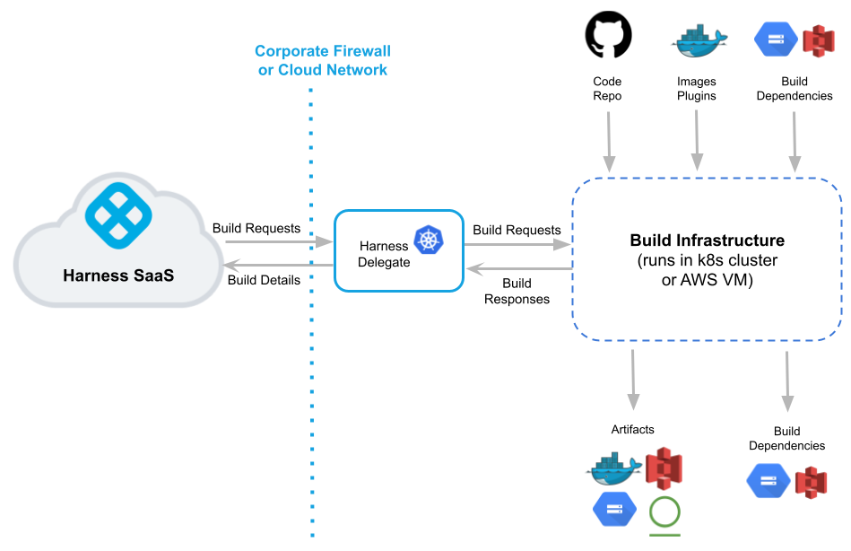
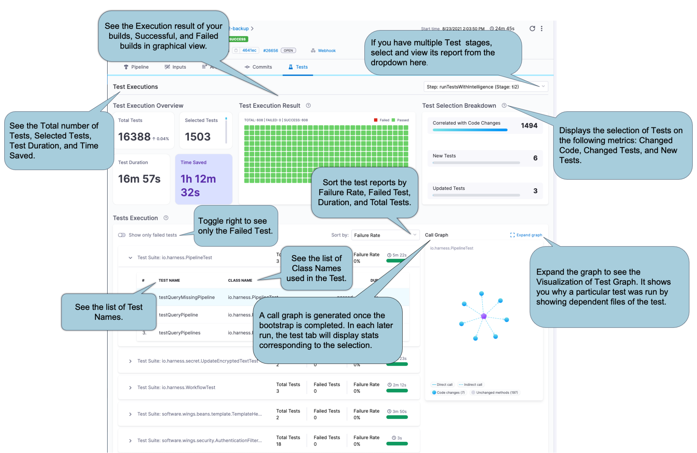
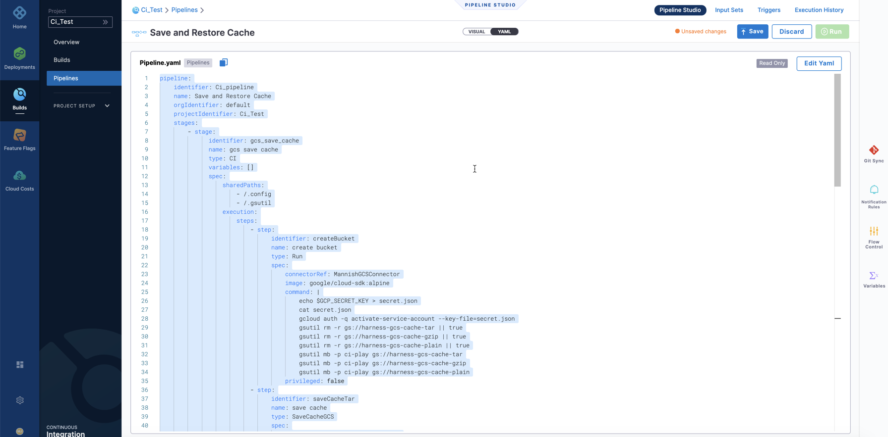

Harness CI simplifies the development and testing of code. In Harness Pipelines, you visually model your build and test processes as CI Stages. Each Stage includes steps for building, testing, and pushing your code.

CI executes steps as containers, packaging code, and dependencies in isolation from other steps. You simply specify a container to use, and Harness locates and launches the container in which the job will run. There is no longer a dependency chain to manage with Steps and Plugins running in their own containers.

This topic describes CI concepts and provides a summary of the benefits of CI.

### Before You Begin

Before learning about Harness CI, you should have an understanding of the following:

* [Harness Key Concepts](../../getting-started/learn-harness-key-concepts.md)
* [Drone and Harness](drone-and-harness.md)

### Visual Summary

The following video walks you through Harness CI.

<!-- Video:
https://harness-1.wistia.com/medias/rpv5vwzpxz-->
<docvideo src="https://harness-1.wistia.com/medias/fsc2b05uxz" />

<!-- div class="hd--embed" data-provider="Wistia" data-thumbnail="">
   <iframe src="//fast.wistia.net/embed/iframe/fsc2b05uxz" allowtransparency="true" frameborder="0" scrolling="no" class="wistia_embed" name="wistia_embed" allowfullscreen="" mozallowfullscreen="" webkitallowfullscreen="" oallowfullscreen="" msallowfullscreen="" width="620" height="349"></iframe>

### CI Overview

Harness is a leading provider of the Continuous Delivery-as-a-Service platform. Harness CI extends this functionality with Continuous Integration-as-a-Service. Harness CI simplifies CI Pipelines, enabling you to model stages visually, and automates all processes of building and testing software.

### Architecture

The architecture diagram of the Harness CI setup is as follows:

The [Harness Delegate](../../platform/2_Delegates/delegates-overview.md) is central to all CI processes and is in charge of all CI operations. It runs in your environment, such as your local network, virtual private cloud, or cluster. It connects the Harness Manager in your SaaS instance to all of your code repositories, artifacts, infrastructure, and cloud providers. See also [Harness Key Concepts](../../first-gen/starthere-firstgen/harness-key-concepts.md).

The build infrastructure communicates directly with your repos, repositories, and cloud providers. You can maintain your code and artifacts internally or on public platforms such as GitHub or DockerHub.

The Delegate manages your build instructure to run build jobs and tests as needed, and sends data back to the Harness Manager. You can use this data for DAG orchestration, debugging, health checks, analytics, notifications, and the generation of ML models.

When a Build finishes successfully, the build infrastructure then sends the artifacts to the registry of your choice.

### Demo: Set Up a CI Pipeline

Here's a an end-to-end demo that shows how to set up a CI pipeline and run a build. You can go through this workflow yourself in the [CI Tutorial](ci-pipeline-quickstart.md).

<!-- Video:
https://harness-1.wistia.com/medias/rpv5vwzpxz-->
<docvideo src="https://www.youtube.com/embed/r1GLYtOmJmM?feature=oembed" />

<!--div class="hd--embed" data-provider="YouTube" data-thumbnail="https://i.ytimg.com/vi/kZmOCLCpvmk/hqdefault.jpg"><iframe width=" 480" height="270" src="https://www.youtube.com/embed/r1GLYtOmJmM?feature=oembed" frameborder="0" allowfullscreen="allowfullscreen"></iframe>

### Harness CI Features

#### Test Intelligence

Test Intelligence (TI) reduces test time significantly by running only the tests required to confirm the quality of the code changes that triggered the build. TI selects tests that are needed to confirm the quality of the code changes that triggered the build and ranks them in the best possible order to increase the rate of fault detection. See [Test Intelligence Overview](test-intelligence-concepts.md). 

#### Integrated Platform

Harness is seamlessly integrated with other Harness modules such as [Continuous Delivery](https://ngdocs.harness.io/article/0zsf97lo3c-deployment-concepts), [Cloud Cost Management](https://ngdocs.harness.io/category/7vy86n7cws-set-up-cloud-cost-management), and [Feature Flags](../../feature-flags/1-ff-onboarding/1-cf-feature-flag-overview.md). You no longer have to navigate from application to application to follow the steps of the Pipeline. Harness platform offers unified CI/CD Pipelines with visual controls and approval gates.  

#### Containerized Steps

CI uses [Kubernetes](https://kubernetes.io/) to run Pipeline Steps as containers, making it language-agnostic. Containers are lightweight abstractions of the host operating system that can package code and dependencies independently of the steps. You can specify a container in the pipeline itself, and the agent will fetch and start the container where the job runs. Because all of the steps run in containers, and plugins have their own containers, you don't need to worry about dependencies.

#### Visual Pipeline Builder

Scripting Pipelines can be time-consuming and tedious. You may also be unaware of the sequence of events. It's possible that things will get worse as the Pipeline becomes more complicated. As a result, CI provides a graphical representation of the Pipeline with nested steps. You can build directly from the UI, or you can use the YAML editor if you prefer. The YAML editor functions similarly to any other IDE. With YAML, you can easily configure it as code.

#### Harness Git Experience

Harness Git Experience provides seamless integration between your Harness Projects, Pipelines, and resources and your Git repos. You can work entirely from Git or use a hybrid method of Git and the Harness Manager. Harness CI integrates with all the popular source control management tools including GitHub, GitLab, and Bitbucket. To get started, you need to activate the repository and include a `.harness` folder for the configuration files. This will trigger a build within Harness CI once a commit is detected. See [Git Experience](../../platform/10_Git-Experience/harness-git-experience-overview.md).

### Harness CI Components

#### Stages

Harness CI allows you to create complex pipelines by breaking them down into Stages. You can create multiple Stages by combining various CI Steps. Each Stage includes Steps for building, pushing, and testing your code. The Codebase configured in the first stage can be imported into subsequent stages. This reduces redundancy and simplifies pipeline creation. For details, see [CI Stage Settings](../ci-technical-reference/ci-stage-settings.md).

#### Steps

A Pipeline Step is defined as a series of commands that carry out an action. For example, the Run and Run Tests steps execute one or more commands on a container image. The commands are run within your git repository's root directory. All steps in your Pipeline share the root of your Git repository, also known as the Workspace. In Harness CI, you can add a Step or a combination of Steps to create a Pipeline tailored to your specific requirements.

Harness CI provides the following options as Step Library.

#### Shared Path

Shared Path in a Stage allows you to share data in the Stage. By default, all of a Stage’s Steps use the same workspace to share data. By default, `/harness` is the working directory and is shared by all the Steps of the Stage. For example, the Maven m2 repo is stored in `/root/.m2` by default. So you can specify the same shared paths `/root/.m2` when using the Maven install in a later Step.

If you need to share additional volumes, you can add Shared Paths.

#### Service Dependencies

If you decide to split your pipeline into multiple stages, you need to make sure each Stage has access to any dependencies. A typical use case for services is when your unit tests require a running Redis server. Service Dependencies are also run in an isolated container, so you don't need to handle the dependencies. See [Configure Service Dependency](../ci-technical-reference/configure-service-dependency-step-settings.md).

#### Plugins

Plugins are Docker containers that perform predefined tasks and are configured as Steps in your Stage. Plugins can be used to deploy code, publish artifacts, send notifications, and more. See [Plugin Step Settings](../ci-technical-reference/plugin-step-settings-reference.md).

#### Caching

Caching ensures faster job execution by reusing data from previous jobs' expensive fetch operations. Using the [Save Cache steps](https://docs.harness.io/category/share-and-cache-ci-data) in Harness CI, you can save the cache to a cloud storage bucket and later restore it using the [Restore Cache steps](https://docs.harness.io/category/share-and-cache-ci-data).

#### Remote Docker Layer Caching

Harness enables remote Docker Layer Caching where each Docker layer is uploaded as an image to a Docker repo you identify. If the same layer is used in subsequent builds, Harness downloads the layer from the Docker repo.

This is different from other CI vendors that are limited to local caching and persistent volumes.

You can also specify the same Docker repo for multiple Build and Push steps, which enables them to share the same remote cache.

Remote Docker Layer Caching can dramatically improve build time by sharing layers across Pipelines, Stages, and Steps.

#### Artifact Repos

Harness CI offers popular object storage options such as JFrog, Amazon S3, and Google GCS to which you can push your artifacts. Object storage repos are set up as Pipeline Steps by using the Upload Artifacts step from the Step library.

### Try It Yourself

Interested in trying CI yourself? No need to wait any longer! Book your [Demo](https://harness.io/demo) and give it a spin! The [CI Pipeline Quickstart](ci-pipeline-quickstart.md) should assist you in getting started.

### See Also

[CI Pipeline Quickstart](ci-pipeline-quickstart.md)

[Test Intelligence](test-intelligence-concepts.md)

