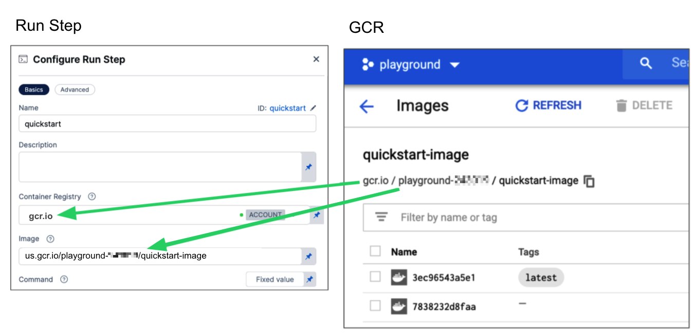
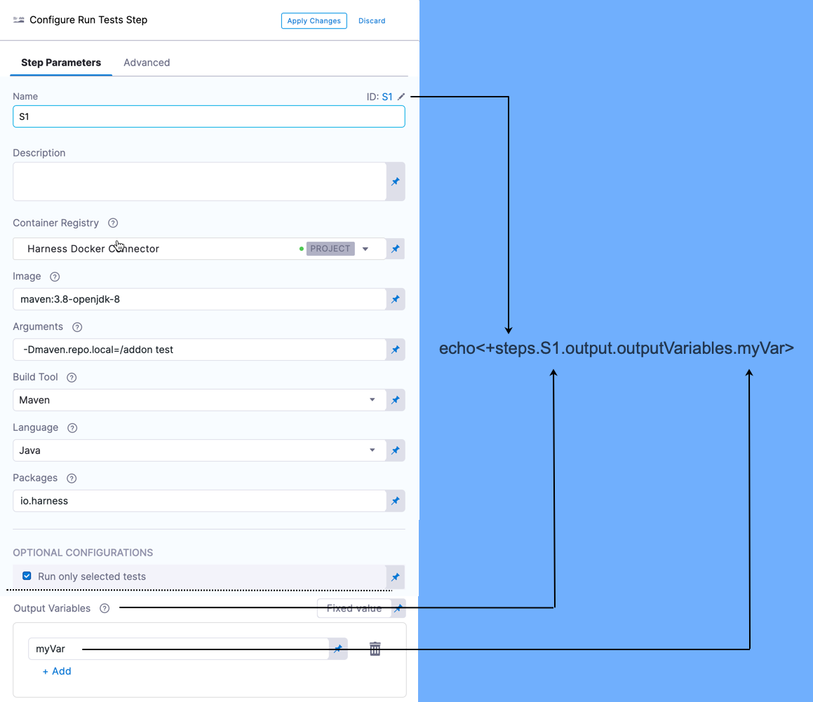

This topic provides settings and permissions for the Harness CI Run step.

The Build stage **Run** step can be used to run scripts in your CI stages.

The **Run** step pulls in a Docker image, such as a Docker image for Maven, and then runs a script with the tool, like `mvn clean install`. Note that you may use any Docker image from any public or private Docker registry.

### Name

The unique name for this step.

### ID

See [Entity Identifier Reference](https://docs.harness.io/article/li0my8tcz3-entity-identifier-reference).

### Description

Text string.

### Container Registry

The Harness Connector for a container registry. This is the container registry for the image Harness will use to run build commands on, such as DockerHub.

### Image

The FQN (fully-qualified name) of the Docker image to use when running build commands. For example: `us.gcr.io/playground-123/quickstart-image`.

The image name should include the tag and will default to the latest tag if unspecified. You can use any Docker image from any D registry, including Docker images from private registries.

Different container registries require different name formats:

* **Docker Registry:** enter the name of the artifact you want to deploy, such as **library/tomcat**. Wildcards are not supported.
* **GCR:** enter the FQN (fully-qualified name) of the artifact you want to deploy. Images in repos need to reference a path, for example: **us.gcr.io/playground-123/quickstart-image:latest**.

* **ECR:** enter the FQN (fully-qualified name) of the artifact you want to deploy. Images in repos need to reference a path, for example: **40000005317.dkr.ecr.us-east-1.amazonaws.com/todolist:0.2**.

### Commands

[POSIX](https://www.grymoire.com/Unix/Sh.html) shell script executed inside the container. In the Shell setting, you can select **Bash** or **Shell**.

The script is invoked as if it were the container’s entry point.

### Optional Configuration

Configure the following options to add additional configuration for the step.

#### Privileged

Enable this option to run the container with escalated privileges. This is the equivalent of running a container with the Docker `--privileged` flag.

#### Report Paths

The path to the file(s) that store test results in the JUnit XML format. You can enter multiple paths. [Glob](https://en.wikipedia.org/wiki/Glob_(programming)) is supported.

This variable must be set for the Run step to publish test results.#### Environment Variables

Environment variables may be injected into the container and used in the script in **Command**. When using these environment variables, make sure to enter a **Name** and **Value** for each variable.

You may also reference environment variables in the script by their name. For example, in Bash, this would be ( `$var_name` or `${var_name}`). In Windows PowerShell, the reference would be (`$Env:varName`).

For **Value**, you may enter [Fixed Values, Runtime Inputs, and Expressions](https://docs.harness.io/article/f6yobn7iq0-runtime-inputs). For example, you can set **Value** as an expression and reference the value of some other setting in the stage or pipeline.


See [Built-in Harness Variables Reference](https://docs.harness.io/article/lml71vhsim-harness-variables).

#### Output Variables

Output variables expose environment variables for use by other steps/stages of the pipeline. You may reference the output variable of a step using the step ID and the name of the variable in output variables.

Let's look at a simple example.

In the **Command** in a step, export a new variable using the following syntax:


```
export myVar=varValue
```
In the **Output Variables**, list the exported variable name:


In a later **Run** step, in **Command**, reference the output variable:

```
echo <+steps.S1.output.outputVariables.myVar>
```
Here is how the S1 step's output variable is referenced:



The syntax for referencing output variables between steps in the same stage looks similar to the example below.

`<+[stepID].output.outputVariables.[varName]>`

The syntax for referencing output variables between steps in different stages looks similar to the example below.

`<+stages.[stageID].execution.steps.[stepID].output.outputVariables.[varName]>`

The subsequent build job fails when exit 0 is present along with output variables.##### Accessing Environment Variables Between Stages

If you would like to access environment variables between stages, use an expression similar to the example listed below.

`<+pipeline.stages.<stage name>.spec.execution.steps.<step name>.output.outputVariables.variablename>`

You may also output the step variable to the stage/pipeline variable as they are available through the pipeline. For example, output the variable to `BUILD_NUM` and reference it later like the example shown below.

`<+pipeline.stages.[stage Id].variables.BUILD_NUM>`

Environment variables may also be accessed when selecting the auto-suggest/ auto-complete feature in the Harness UI.#### Image Pull Policy

Select an option to set the pull policy for the image.

* **Always**: the kubelet queries the container image registry to resolve the name to an image digest every time the kubelet launches a container. If the kubelet encounters an exact digest cached locally, it uses its cached image; otherwise, the kubelet downloads (pulls) the image with the resolved digest, and uses that image to launch the container.
* **If Not Present**: the image is pulled only if it is not already present locally.
* **Never**: the image is assumed to exist locally. No attempt is made to pull the image.

#### Shell

Select the shell script. If a Run Step includes commands that aren’t supported for the selected shell type, the build will fail.

You can run PowerShell Core (`pwsh`) commands in pods or containers that have `pwsh` installed. You can run PowerShell commands on Windows VMs running in AWS build farms.

#### Run as User

Set the value to specify the user ID for all processes in the pod, running in containers. For more information about how to set the value, see [Set the security context for a pod](https://kubernetes.io/docs/tasks/configure-pod-container/security-context/#set-the-security-context-for-a-pod).

#### Set container resources

The maximum resources limit values for the resources used by the container at runtime.

##### Limit Memory

The maximum memory that the container can use. You may express memory as a plain integer or as a fixed-point number using the suffixes `G` or `M`. You may also use the power-of-two equivalents `Gi` and `Mi`.

##### Limit CPU

The maximum number of cores that the container can use. CPU limits are measured in cpu units. Fractional requests are allowed; you can specify one hundred millicpu as `0.1` or `100m`. For more information, see [Resource units in Kubernetes](https://kubernetes.io/docs/concepts/configuration/manage-resources-containers/#resource-units-in-kubernetes).

##### Timeout

The timeout for the step. Once the timeout is reached, the step fails, and the pipeline execution continues.

### See Also

* [Step Skip Condition Settings](https://docs.harness.io/article/i36ibenkq2-step-skip-condition-settings)
* [Step Failure Strategy Settings](https://docs.harness.io/article/htrur23poj-step-failure-strategy-settings)

