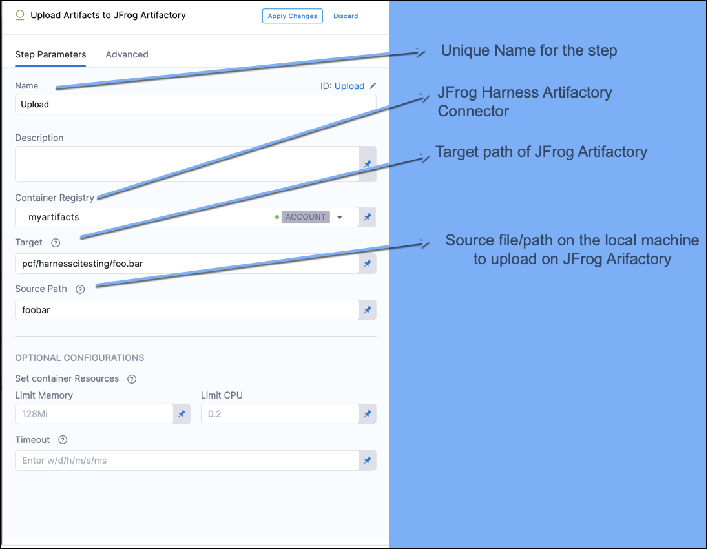
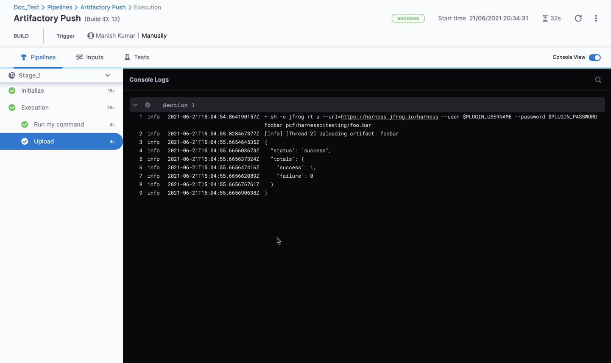

This topic provides settings to upload artifacts to [JFrog Artifactory](https://www.jfrog.com/confluence/display/JFROG/JFrog+Artifactory).

The following steps run SSH commands and push the artifacts to JFrog Artifactory.

### Before you Begin

* [CI Pipeline Quickstart](../../ci-quickstarts/ci-pipeline-quickstart.md)
* [CI Stage Settings](../../ci-technical-reference/ci-stage-settings.md)
* [Set Up Build Infrastructure](/docs/category/set-up-build-infrastructure)
* [Learn Harness' Key Concepts](../../../getting-started/learn-harness-key-concepts.md)

### Step 1: Create the CI Stage

In your Harness Pipeline, click **Add Stage**, and then click CI.

### Step 2: Define the Build Farm Infrastructure

In the CI stage Infrastructure, define the build farm for the codebase. See [Set up a Kubernetes cluster build infrastructure](../set-up-build-infrastructure/set-up-a-kubernetes-cluster-build-infrastructure.md).

### Step 3: Configure the Run Step

In the stage's Execution tab, add a **Run** step. The Run step executes one or more commands on a container image. See [Run step settings](../../ci-technical-reference/configure-run-tests-step-settings.md).

### Step 4: Upload Artifacts to JFrog Artifactory

Add an **Upload Artifacts to JFrog Artifactory** step.

To configure this step, select the Harness Artifactory connector, enter the source file/path, and the target path. For more information about these settings, go to the [Upload Artifacts to JFrog Artifactory step settings reference](../../ci-technical-reference/upload-artifacts-to-jfrog-artifactory-step-settings.md).

The JFrog Account associated with the connector must have read/write permission. For more information, go to the [Artifactory connector settings reference](../../../platform/7_Connectors/ref-cloud-providers/artifactory-connector-settings-reference.md).

### Step 5: View the Results

Save the Pipeline and click **Run**.

You can see the logs for the Run and Upload step in the pipeline as it runs.

In your Harness project's Builds, you can see the build listed.

On JFrog, you can see the file that you pushed.

