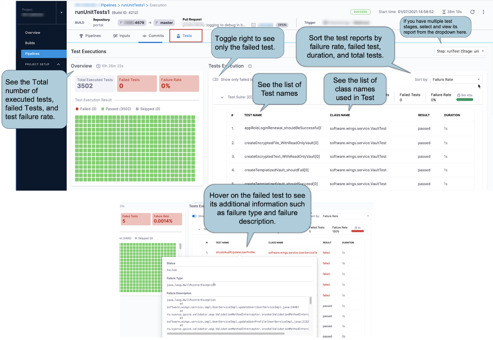

The Build stage **Run** step can be used to run scripts in your CI stages.

The **Run** step pulls in a Docker image such as the Docker image for Maven. Then you run a script such as`mvn package` with the tool. You can use any Docker image from any public or private Docker registry.

This topic describes how to run a simple script in a CI stage.

### Before You Begin

To go through this workflow, you need the following:

* A familiarity with basic Harness CI concepts:
	+ [CI Pipeline Tutorial](../../ci-quickstarts/ci-pipeline-quickstart.md)
	+ [Learn Harness' Key Concepts](https://ngdocs.harness.io/article/hv2758ro4e-learn-harness-key-concepts)
* A familiarity with Build Stage settings:
	+ [CI Build Stage Settings](../../ci-technical-reference/ci-stage-settings.md)
* A familiarity with how Pipelines use Codebases:
	+ [Create and Configure a Codebase](../codebase-configuration/create-and-configure-a-codebase.md)

### Step 1: Create the CI Stage

In your Harness Pipeline, click **Add Stage** and then click CI.

### Step 2: Add the Codebase

Do one of the following:

* If this is the first CI stage in the Pipeline, in the CI stage settings enable **Clone Codebase**.
* If you have an existing Pipeline with a CI stage, click **Codebase**. See [Edit Codebase Configuration](../codebase-configuration/create-and-configure-a-codebase.md).

### Step 3: Define the Build Farm Infrastructure

In the CI stage Infrastructure, define the build farm for the codebase. See [Set Up Build Infrastructure](/category/set-up-build-infrastructure).

### Step 4: Configure the Run Step

In the Execution tab, click **Add** **step** and then click **Run**.

The Run step executes one or more commands on the image you added from any public or private Docker registry.

In **Container Registry**, select a Connector to a container registry for the image needed to run your script. For example, if you are running a cURL script in this step, you might add or select a Connector to DockerHub so Harness can pull the image for cURL.

In **Image**, enter the name of the image to pull and run for this step. For example, if you are running a cURL script, you might use `curlimages/curl:7.73.0`.

In **Commands**, you enter the script you want to run on the container.

See [Run Step Settings](../../ci-technical-reference/run-step-settings.md).

### Step 5: Run the Pipeline

Now you can run your Pipeline. You simply need to select the codebase.

1. Click **Save and Publish**.
2. Click **Run**. The Pipeline Inputs settings appear.
3. In **CI Codebase**, click **Git branch**.
4. In Git Branch, enter the name of the branch where the codebase is, such as a master.
5. Click **Run Pipeline**.

### Example: View a Test Report

Once the Pipeline is executed in CI, Click **Tests**. The Tests show the test report of the unit test that you configured and ran. 

### See Also

* [View Test Report](../view-your-builds/viewing-tests.md)

