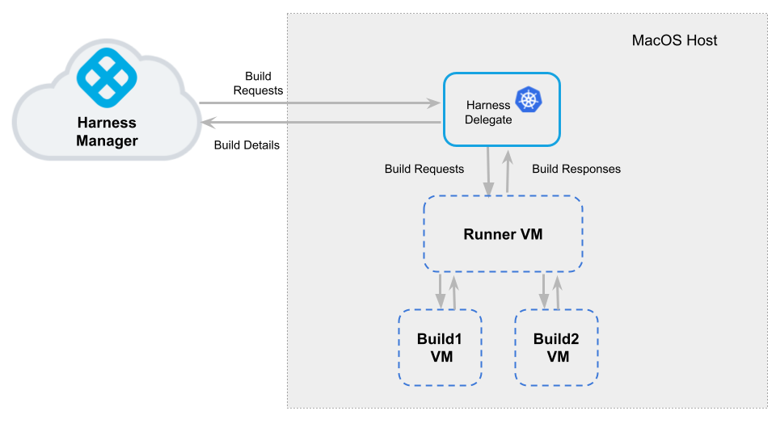
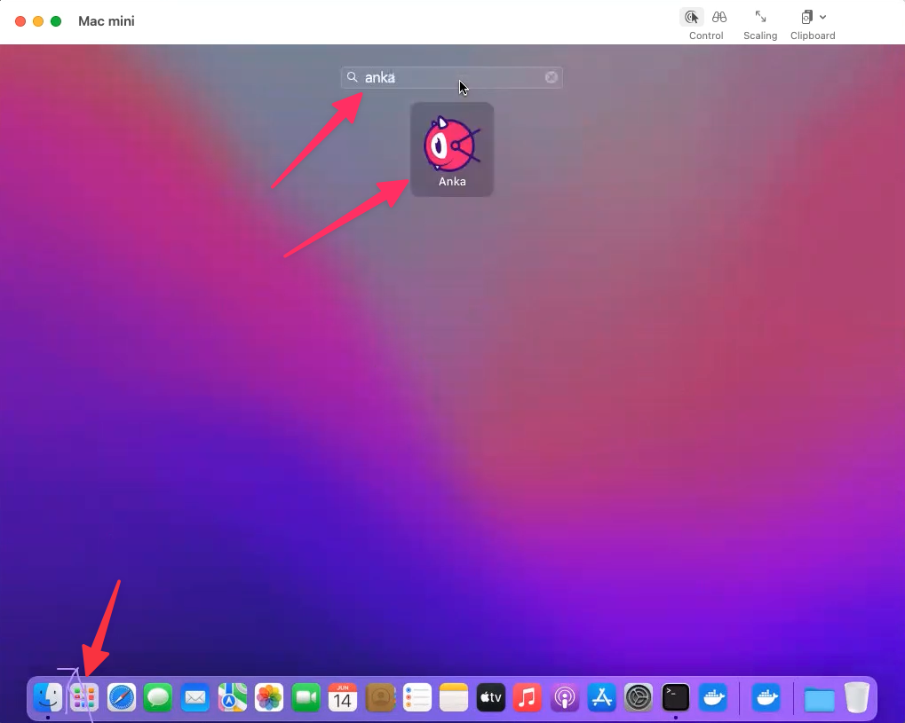
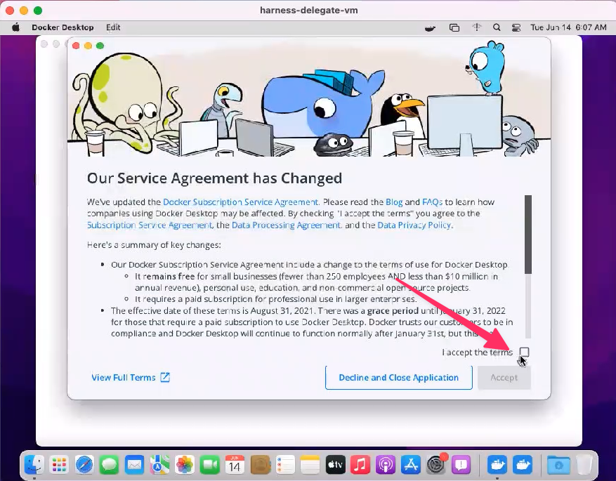

> **NOTE**: Currently, this feature is behind the Feature Flag `CI_VM_INFRASTRUCTURE` Contact [Harness Support](mailto:support@harness.io) to enable the feature.

This topic describes how to set up a build infrastructure using VMs on an MacOS EC2. Once you set up this infrastructure, your Harness Pipelines can use these VMs to build your software and run your tests safely and at scale. You can also [define MacOS build infrastructures on hardware devices such as MacBook Pros and Mac minis](define-a-mac-os-build-infrastructure.md). 

The following diagram shows the architecture of a CI build infrastructure on MacOS. The Delegate receives build requests from your Harness Manager. Then it forwards the requests to a Runner VM that starts, runs, and terminates the build VMs as needed.

### Before You Begin

This topic assumes you're familiar with the following:

* [CI Pipeline Quickstart](../../ci-quickstarts/ci-pipeline-quickstart.md)
* [Delegates Overview](https://docs.harness.io/article/2k7lnc7lvl-delegates-overview)
* [CI Stage Settings](../../ci-technical-reference/ci-stage-settings.md)
* [Learn Harness' Key Concepts](https://ngdocs.harness.io/article/hv2758ro4e-learn-harness-key-concepts)
* [VM Runner](https://docs.drone.io/runner/vm/overview/)

### Step 1: Set up the MacOS EC2 Instance

#### AWS EC2 Requirements

* Each MacOS EC2 instance requires a [Dedicated Host](https://docs.aws.amazon.com/AWSEC2/latest/UserGuide/dedicated-hosts-overview.html) fully dedicated to that EC2. See [Amazon EC2 Mac Instances](https://docs.aws.amazon.com/AWSEC2/latest/UserGuide/ec2-mac-instances.html) in the AWS docs for pricing information, additional requirements, and best practices.
* EC2 instance type = **mac1.metal**
* While not required, enabling **Instance auto-placement** can be useful if you have multiple available hosts and don’t want to explicitly specify the host for each EC2.
* Minimum requirements for the root volume of your EC2:
	+ Type: **gp3**
	+ Size: **500GB**
	+ IOPS: **6000**
	+ Throughput: **256**
* The EC2 should have TCP ports **22,** **5900**, and **9079** open to inbound connections from hosts that interact with the EC2.
* This workflow uses [Anka software](https://docs.veertu.com/anka/intel/) by [Veertu](https://veertu.com/) to create and manage VMs on the EC2. Anka is [licensed](https://docs.veertu.com/anka/licensing/) software and requires a license key to activate. For a trial license, go to: <https://veertu.com/anka-build-trial/>  
Veertu maintains a set of Anka Community AMIs in AWS. These AMIs are preconfigured with all required hardware and software to create and manage VMs using Anka. You can use Marketplace AMIs with an hourly billing option, in which case a license key is not required.  
See [Running on AWS EC2 Mac](https://docs.veertu.com/anka/intel/getting-started/aws-ec2-mac/) in the Anka docs for more useful information.

#### Set Up the EC2

If you want to use a standard MacOS AMI, rather than an Anka Community AMI, do the following:

* Launch a new EC2 based on the hardware and software requirements above.
* SSH into the EC2.
* Download and install the Anka software on the EC2:

```
FULL_FILE_NAME="$(curl -Ls -r 0-1 -o /dev/null -w %{url_effective} https://veertu.com/downloads/anka-virtualization-latest | cut -d/ -f5)" curl -S -L -o ./$FULL_FILE_NAME https://veertu.com/downloads/anka-virtualization-latest sudo installer -pkg $FULL_FILE_NAME -tgt /
```

The following steps are required for all EC2s, regardless of the AMI type, except as noted. Run these commands on the EC2 unless otherwise specified.

* In some cases, your EC2's disk might be split into multiple volumes. Make sure that your EC2 can access all the storage in its attached volume. See [Increase the size of an EBS volume on your Mac instance](https://docs.aws.amazon.com/AWSEC2/latest/UserGuide/ec2-mac-instances.html#mac-instance-increase-volume) in the AWS docs.
* Make sure your software is up to date:
```
# get the list of installers  
softwareupdate --list-full-installers  
  
# install the latest version, such as 12.4, 12.3.1, etc.  
softwareupdate --fetch-full-installer --full-installer-version {LATEST_VERSION}
```
* Change the AWS EC2 password:
```
# To find the default password, search for "/usr/bin/dscl" in the install script output  
sudo /usr/bin/dscl . -passwd /Users/ec2-user {DEFAULT_PASSWORD} {NEW_PASSWORD}
```
* Go to a separate terminal window (i.e., not SSH’d with your EC2). Then VNC into the EC2 with your new password:
```
open vnc://ec2-user:{NEW_PASSWORD}@{EC2_IP}
```
Leave this window open. You will use it to install Docker Desktop and the Drone Runner in a later step.
* Activate your license key. Return to your SSH session with the EC2, activate your Anka license, and accept the EULA. Here's an example session.
```
sudo anka license activate {LICENSE}  
# License activated. The fulfillment ID: {FULFILLMENT_ID}
```
* Save the fulfillment ID that gets returned. Veertu will request this if your EC2  gets terminated unexpectedly. See [Licensing](https://docs.veertu.com/anka/licensing/) in the Veertu docs.


### Step 2: Create a VM on the EC2

In this step, you will create the VM that the Harness Runner will use to create new VMs. See also [Getting Started](https://docs.veertu.com/anka/intel/getting-started/) in the Anka 2.5.x docs.

Note the following before you create this VM:

* For the `--ram-size`, Harness recommends that you specify half the physical RAM on the host so it can run two VMs at once with reasonable performance. The following example assumes that the physical host has 16GB of RAM.
* To determine the path to your MacOS installer:
	+ Go to the Mac UI > Finder > Applications folder. You should see an installer such as **Install MacOS Monterey** in the list.
	+ Right-click on the Installer and choose **New Terminal at Folder**.
	+ In the terminal, enter `pwd`. Include the output as the `--app` argument value and include quotes if the path has spaces. For example: `--app "/Applications/Install macOS Monterey.app"`

To create the master VM, open a CLI window in the Mac UI and enter the following:


```
anka --debug  create {VM_NAME} --ram-size 8G --cpu-count 4 --disk-size 100G --app {PATH_TO_MACOS_INSTALLER}
```
This process can take an hour or more. There will be extended periods where the script doesn't generate any messages or notifications. Be patient and do not kill the process. To verify that the create process is still running, open a new SSH session on the EC2 and enter `ps`.

When the script finishes, enter `anka list` and `anka show {VM_UUID}` to confirm that the VM was created and is running. To start a VM, enter `anka start {VM_NAME}`. Here's an example session:


```
anka list  
+---------------------+--------------------------------------+----------------------+---------+  
| name                | uuid                                 | creation_date        | status  |  
+---------------------+--------------------------------------+----------------------+---------+  
| harness-delegate-vm | bc7210af-8fe8-48cd-82af-a994f5cf1bea | Jun 13 14:07:18 2022 | running |  
+---------------------+--------------------------------------+----------------------+---------+  
  
# use the uuid shown in the ‘anka list’ output  
  
anka show bc7210af-8fe8-48cd-82af-a994f5cf1bea  
+---------+-----------------------------------------+  
| uuid    | bc7210af-8fe8-48cd-82af-a994f5cf1bea    |  
+---------+-----------------------------------------+  
| name    | harness-delegate-vm                     |  
+---------+-----------------------------------------+  
| created | Jun 13 14:07:18 2022                    |  
+---------+-----------------------------------------+  
| vcpu    | 4 - sys:0.2%, usr:0.1%, idle:99.7%      |  
+---------+-----------------------------------------+  
| memory  | 8G                                      |  
+---------+-----------------------------------------+  
| display | 1024x768 vnc://:admin@172.31.41.30:5901 |  
+---------+-----------------------------------------+  
| disk    | 100GiB (22.16GiB on disk)               |  
+---------+-----------------------------------------+  
| addons  | 2.5.5.143                               |  
+---------+-----------------------------------------+  
| network | shared 192.168.64.2                     |  
+---------+-----------------------------------------+  
| status  | running since Jun 13 16:17:43 2022      |  
+---------+-----------------------------------------+  

```
### Step 3: Set Up the VM on the EC2

Return to the VNC window you opened previously. If you closed it, open a CLI on your local host (not SSH’d into the EC2) and enter: `open vnc://ec2-user:{NEW_PASSWORD}@{EC2_IP}`

In the VNC window, click the Launchpad button in the Dock (bottom). Then search for Anka (top) and click the Anka icon. The Welcome to Anka screen appears.

In the Welcome to Anka screen, click the button for the VM you just created on the right. This opens a second VNC window, for the VM, within the VNC window for the EC2.

In the new VNC window, do the following:

* Open a CLI and install Homebrew and wget on the VM:
```
/bin/bash -c "$(curl -fsSL https://raw.githubusercontent.com/Homebrew/install/HEAD/install.sh)"   
brew install wget
```
* Open a browser window in the UI, go to the Docker website, and download Docker Desktop for Mac Intel Chip: <https://docs.docker.com/desktop/mac/install/>
* Run the Docker installer and accept the EULA that appears at the end of the install process.
* In a CLI, enter the following to make sure that Docker is running correctly: `docker run hello-world`
* Install any additional tools that will be used by your builds on the VM, such xcode.
* Harness recommends that you suspend the master VM after you set it up. This will speed up the creation of new VMs.
	+ On the VM, do this:
		- Quit Docker Desktop.
		- Open a CLI window and run the following:  
		`docker kill $(docker ps -q)`  
		`docker stop`
		- On the host, run the following: `anka suspend {VM_NAME}`
* Close the VM VNC window *but leave the EC2 VNC window open*. You will use this window in the next step.

### Step 4: Install Docker Desktop and the Drone Runner on the EC2

In the EC2 VNC window, open a browser window in the UI, go to the Docker website, and download **Docker Desktop for Mac Intel Chip**: <https://docs.docker.com/desktop/mac/install/>

Run the installer and accept the Docker EULA that appears at the end of the install process.

Open a CLI and enter the following to make sure that Docker is installed and running: `docker run hello-world`

In the CLI, install tmux: `brew install tmux` 

In the browser window, go to the following page: <https://github.com/drone-runners/drone-runner-aws/releases>

 Download the latest **drone-runner-aws-darwin-amd64** executable:

Copy the binary from the Downloads folder and make sure it has the correct permissions to run. In a CLI, run the following:


```
mkdir ~/runner  
cd ~/runner  
cp ~/Downloads/drone-runner-aws-darwin-amd64 .  
chmod +x drone-runner-aws-darwin-amd64
```
### Step 5: Set Up Your Drone Environment on the EC2

To start the Drone Runner, you need to specify your environment variables (`.env` file) and your runner pool definition (`pool.yml` file). You should save these in your `~/runner` folder.

#### Environment File

Your `.env` file should look like this:


```
DRONE_RUNNER_HOST=drone.runner.host  
DRONE_RUNNER_NAME=droneRunnerName  
DRONE_RUNNER_SECRET=bea26a2221fd8090ea38720fc445eca6  
DRONE_DEBUG=true  
DRONE_TRACE=true
```
`DRONE_DEBUG` and `DRONE_DEBUG` are optional. You can define the other settings as needed. The `DRONE_RUNNER_SECRET` is the [default secret](https://docs.drone.io/runner/vm/configuration/reference/drone-rpc-secret/) used by the Drone server to authenticate http requests.

#### Pool File

Your `pool.yml` file should look like this:


```
version: "1"  
instances:  
- name: osx-anka  
  default: true  
  type: anka     
  pool: 2      
  limit: 100    
  platform:  
    os: darwin  
    arch: amd64  
  spec:  
    account:  
      username: {ANKA_VM_USERNAME}  
      password: {ANKA_VM_PASSWORD}  
    vm_id: {VM_NAME}  

```
You can leave all fields at their defaults except for `username`, `password`, and `vm_id`. Note the `name` field: you will specify this name when you set up your Harness Pipeline.

### Step 6: Start the Drone Runner on the EC2

In a CLI window, enter the following:


```
cd ~/runner  
brew install tmux  
tmux new -d './drone-runner-aws-darwin-amd64 delegate --envfile=.env --pool=pool.yml |& tee runner.log'
```
The Runner might take a few minutes before it is completely up and running. When it is ready, you will see output like this:


```
DEBU[4334] got IP 192.168.64.5 cloud=anka name=droneRunnerName--4037200794235010051 pool=osx-anka  
INFO[4335] Running script in VM cloud=anka name=droneRunnerName--4037200794235010051 pool=osx-anka
```
### Step 7: Install the Harness Delegate on the EC2

In the Harness UI, go to the project where you want to install the Delegate.

Choose **Project Setup** > **Delegate** on the left. 

In the Project Delegates page, click **+New Delegate**.

Select **Docker** for the Delegate type. Click Continue. 

Enter a **Delegate Name** (must be unique). Click Continue.

Download the `docker-compose.yml` file.

Add the `extra-hosts` attribute and `RUNNER_URL` environment setting as follows:


```
version: "3.7"  
services:  
  harness-ng-delegate:  
    restart: unless-stopped  
    deploy:  
      resources:  
        limits:  
          cpus: "0.5"  
          memory: 2048M  
    image: harness/delegate:latest  
    # —---------------------------------------  
    extra_hosts:  
      - "host.docker.internal:host-gateway"  
    # ----------------------------------------  
    environment:  
      - ACCOUNT_ID=XXXXXXXXXXXXXXXX  
      - DELEGATE_TOKEN=XXXXXXXXXXXXXXXX  
      - MANAGER_HOST_AND_PORT=https://app.harness.io  
      - WATCHER_STORAGE_URL=https://app.harness.io/public/prod/premium/watchers  
      - WATCHER_CHECK_LOCATION=current.version  
      - DELEGATE_STORAGE_URL=https://app.harness.io  
      - DELEGATE_CHECK_LOCATION=delegateprod.txt  
      - CDN_URL=https://app.harness.io  
      - REMOTE_WATCHER_URL_CDN=https://app.harness.io/public/shared/watchers/builds  
      - DEPLOY_MODE=KUBERNETES  
        # —-----------------------------------------  
      - RUNNER_URL=http://host.docker.internal:3000/  
        # --------------------- --------------------  
      - DELEGATE_NAME=osx-delegate  
      - NEXT_GEN=true  
      - DELEGATE_DESCRIPTION=  
      - DELEGATE_TYPE=DOCKER  
      - DELEGATE_TAGS=  
      - PROXY_MANAGER=true  
      - INIT_SCRIPT=echo "Docker delegate init script executed."  

```
Upload the modified `docker-compose.yml` file to your EC2 and move it to your `~/runner` folder.

Start the Delegate in the EC2. Run the following in the `/runner` folder:


```
docker-compose -f docker-compose.yml up -d
```
 

In the Harness UI > Delegate Setup wizard, click **Continue** and wait for your Harness instance to connect to the Delegate. It might take a few minutes to verify the Delegate.

Once it is verified, close the wizard.

### Step 7: Specify the Delegate in the Pipeline

In your Harness Project, go to a Pipeline that includes a Build Stage.

In the Infrastructure tab of the Build Stage, define your infrastructure as follows:

* Type = **AWS VMs**
* Pool Name = The `name` field in your `pool.yml` file.
* OS = **MacOS**

Your MacOS build infrastructure is set up. You can now run your Build Stages on MacOS VMs. 

