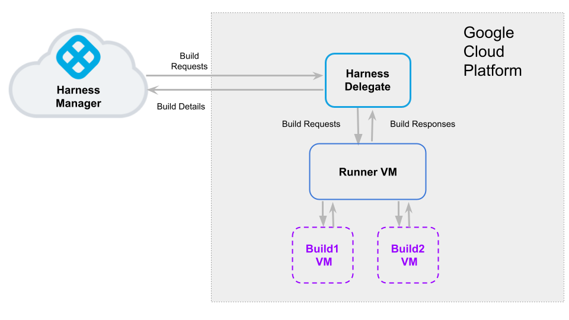
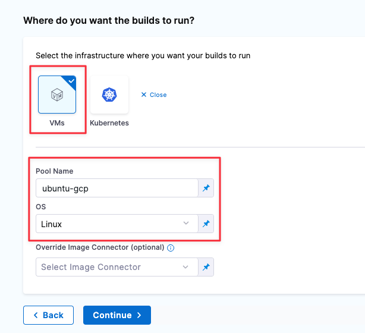

:::note 
Currently, this feature is behind the Feature Flag `CI_VM_INFRASTRUCTURE`. Contact [Harness Support](mailto:support@harness.io) to enable the feature.
:::

This topic describes how to set up a CI build infrastructure in Google Cloud Platform. You will create an Ubuntu VM and install a CI Delegate and Drone Runner on it. The Delegate creates VMs dynamically in response to CI build requests.

Running builds in your infrastructure, rather than in a vendor's cloud, has significant benefits. Vendor clouds often experience outages that can result in backlogs and delayed builds. You can build software and run tests, repeatedly and automatically, on a scalable platform with no outages or backlogs.

For information on using Kubernetes as a build farm, see [Define Kubernetes Cluster Build Infrastructure](../set-up-a-kubernetes-cluster-build-infrastructure.md).

The following diagram illustrates a build farm. The [​Harness Docker Delegate](/docs/platform/2_Delegates/install-delegates/docker-delegates/install-a-docker-delegate.md) communicates directly with your Harness instance. The [VM Runner](https://docs.drone.io/runner/vm/overview/) maintains a pool of VMs for running builds. When the Delegate receives a build request, it forwards the request to the Runner, which runs the build on an available VM.

##### CI build infrastructure in Google Cloud Platform


### Important Notes

* Google Cloud VM configuration:
	+ For the Delegate VM, use a machine type with 4 vCPU and 16 GB memory or more.
	+ Harness recommends the [Ubuntu 18.04 LTS (Bionic)](https://console.cloud.google.com/marketplace/product/ubuntu-os-cloud/ubuntu-bionic?project=docs-play) machine image.
	+ The VM must allow ingress access on ports 22 and 9079.

To find images to use on google compute engine, use the following command:

```
gcloud compute images list
```

A valid image reference looks like this: `projects/{PROJECT}/global/images/{IMAGE}` 

For example: `projects/docs-test/global/images/ubuntu-pro-1804-bionic-v20220131`

### Step 1: Set up the delegate VM

1. Log into the [Google Cloud Console](https://console.cloud.google.com/) and launch the VM that will host your Harness delegate.
2. [Install Docker](https://docs.aws.amazon.com/AmazonECS/latest/developerguide/docker-basics.html#install_docker) on the VM.
3. [Install Docker Compose](https://docs.docker.com/compose/install/) on the VM. You must have [Docker Compose version 3.7](https://docs.docker.com/compose/compose-file/compose-versioning/#version-37) or higher installed.
4. Run this command on the VM:

   ```
   gcloud auth application-default login
   ```
   This creates the following credentials file:  

   `/home/$(whoami)/.config/gcloud/application_default_credentials.json`

5. Create a `/runner` folder on your VM and `cd` into it:

   ```
   mkdir /runner  
   cd /runner
   ```

### Step 2: Configure the Drone pool on the Google VM

The **.drone\_pool.yml** file defines the VM spec and pool size for the VM instances used to run the Pipeline. A pool is a group of instantiated VMs that are immediately available to build CI Pipelines.

1. In the `/runner` folder, create a new **.drone\_pool.yml** file.
2. Set up the file as described in the following example. Note the following:
	1. To avoid latency issues between delegate and build VMs, specify the same zone where your delegate is running in the `spec: zone:` field.
	2. Set up `spec: account:` with your Google project ID and your JSON credentials file.
	3. See [pool.yml Settings Reference](set-up-an-aws-vm-build-infrastructure.md#pool-yml-settings-references) below for details on specific settings. See also [Drone Pool](set-up-an-aws-vm-build-infrastructure.md#runner-settings-reference-advanced)) and [Google](https://docs.drone.io/runner/vm/drivers/google/) in the Drone docs.

##### Example pool.yaml

```
version: "1"  
instances:  
  - name: ubuntu-gcp  
    default: true  
    type: google  
    pool: 1  
    limit:  
    platform:  
      os: linux  
      arch: amd64  
    spec:  
      account:  
        project_id: docs-play  
        key: /path/to/application_default_credentials.json  
      image: projects/ubuntu-os-pro-cloud/global/images/ubuntu-pro-1804-bionic-v20220510  
      machine_type: e2-small  
      zone:  
        - us-west1-a
```

Later in this workflow, you'll reference the pool identifier in Harness Manager to map the pool with a Stage Infrastructure in a CI Pipeline. This is described later in this topic.

### Step 3: Create the Docker-Compose YAML

1. Navigate to the Delegates page for your Harness account, organization, or project.
2. Click **New Delegate** and select **Docker**.
3. Follow the steps in [Install the Docker Delegate](/docs/platform/2_Delegates/install-delegates/docker-delegates/install-a-docker-delegate.md) and download the **docker-compose.yaml** file to your local machine.

### Step 4: Configure the 'docker-compose.yml' file

The runner and delegate are both hosted on the same VM. The Runner communicates with the Harness Delegate on `localhost` and port 3000 of your VM. 

In this step, you'll add the Runner spec to the new Delegate definition. 

1. Copy your local **docker-compose.yaml** to the `/runner` folder on the VM. This folder should now have **docker-compose.yaml** and **.drone\_pool.yml**.

2. Append the following to **docker-compose.yaml**.  

   ```
   drone-runner-aws:  
       restart: unless-stopped  
       image: drone/drone-runner-aws:latest  
       volumes:  
         - /runner:/runner  
         - /path/to/google/credentials/file/:/key  
           # example: /home/jsmith/.config/gcloud/:/key  
       entrypoint: ["/bin/drone-runner-aws", "delegate", "--pool", "pool.yml"]  
       working_dir: /runner  
       ports:  
         - "3000:3000"
   ```

3. In the **docker-compose.yaml** file, add the following under `services: harness-ng-delegate: restart: unless-stopped`:

   ```
   network_mode: "host"
   ```

Your Docker Compose file now looks something like this:

##### Updated docker-compose.yml

```
version: "3.7"  
services:  
  harness-ng-delegate:  
    restart: unless-stopped  
    network_mode: "host"  
    deploy:  
      resources:  
        limits:  
          cpus: "0.5"  
          memory: 2048M  
    image: harness/delegate:latest  
    environment:  
      - ACCOUNT_ID=XXXXXXXXXXXXXXXX  
      - ACCOUNT_SECRET=XXXXXXXXXXXXXXXX  
      - MANAGER_HOST_AND_PORT=https://qa.harness.io  
      - WATCHER_STORAGE_URL=https://app.harness.io/public/qa/premium/watchers  
      - WATCHER_CHECK_LOCATION=current.version  
      - REMOTE_WATCHER_URL_CDN=https://app.harness.io/public/shared/watchers/builds  
      - DELEGATE_STORAGE_URL=https://app.harness.io  
      - DELEGATE_CHECK_LOCATION=delegateqa.txt  
      - USE_CDN=true  
      - CDN_URL=https://app.harness.io  
      - DEPLOY_MODE=KUBERNETES  
      - DELEGATE_NAME=qwerty  
      - NEXT_GEN=true  
      - DELEGATE_DESCRIPTION=  
      - DELEGATE_TYPE=DOCKER  
      - DELEGATE_TAGS=  
      - DELEGATE_TASK_LIMIT=50  
      - DELEGATE_ORG_IDENTIFIER=  
      - DELEGATE_PROJECT_IDENTIFIER=  
      - PROXY_MANAGER=true  
      - VERSION_CHECK_DISABLED=false  
      - INIT_SCRIPT=echo "Docker delegate init script executed."  
  drone-runner-aws:  
    restart: unless-stopped  
    image: drone/drone-runner-aws:latest  
    volumes:  
      - /runner:/runner  
      - /home/jsmith/.config/gcloud/:/key  
    entrypoint: ["/bin/drone-runner-aws", "delegate", "--pool", "pool.yml"]  
    working_dir: /runner  
    ports:  
      - "3000:3000"
```

### Step 5: Install the Delegate and Runner

1. [SSH](https://docs.aws.amazon.com/AWSEC2/latest/UserGuide/AccessingInstancesLinux.html) into the Delegate VM and **`cd`** to `/runner`.

2. Confirm that the folder has both setup files:
	 ```
	 $ ls -a  
	 .  ..  docker-compose.yml  .drone_pool.yml 
	 ```
3. Install the Delegate and Runner:
	 ```
	 $ docker-compose -f docker-compose.yml up -d
	 ```
4. Verify that both containers are running correctly. You might need to wait a few minutes for both processes to start.
	 ```
	 $ docker ps  
	 $ docker logs <delegate-container-id>  
	 $ docker logs <runner-container-id>
	 ```
5. In the Harness UI, verify that the delegate appears in the delegates list. This might take two or three minutes. You should see **Connected** next to the Delegate listing.

6. If you see **Not Connected**, make sure the Docker host can connect to **https://app.harness.io**.

	 The Delegate and Runner have now been successfully installed, registered, and connected.

	 To configure the Harness Docker Delegate, see [Harness Docker Delegate Environment Variables](/docs/platform/2_Delegates/install-delegates/docker-delegates/install-a-docker-delegate.md#harness-docker-delegate-environment-variables).

### Step 6: Run a CI build

1. In the Harness CI Stage, in **Infrastructure**, select **VMs**.
2. In the **Pool ID**, enter the pool name `<pool_id>` that you added in [Step 2: Configure the Drone Pool on the Google VM](set-up-an-aws-vm-build-infrastructure.md#step-2-configure-the-drone-pool-on-the-google-vm).

   

You can now run builds in your GCP build infrastructure.

### Pool Settings Reference

You can configure the following settings in your pool.yml file.

|  |  |  |
| --- | --- | --- |
| **Subfields** | **Examples** | **Description** |
| `name` (String) | NA | `name: windows_pool` | Unique identifier of the pool. You will need to specify this pool name in the Harness Manager when you set up the CI Stage Infrastructure. |
| `pool` (Integer) | NA | `pool: 1` | Minimum pool size number. Denotes the minimum number of cached VMs in ready state to be used by the Runner. |
| `limit` (Integer) | NA | `limit: 3` | Maximum pool size number. Denotes the maximum number of cached VMs in ready state to be used by the Runner. |
| `platform` | os (String) | `platform: os: windows`arch (String) |`platform: arch:`  variant (String) |`platform: variant:` version (String) |`platform: version:`  | Configure the details of your VM platform.  |
| `spec` |  | Configure the settings of your build VMs as described in [Build VM Settings](#build-vm-settings). |

#### Build VM Settings

* `account`  — Specify your GCP project Id and the full path and filename of your local Google credentials file.
* `image`  — The image type to use for the build VM.
* `machine_type`  — The google machine type. See [About Machine Families](https://cloud.google.com/compute/docs/machine-types) in the Google Cloud docs.
* `zone`  —  To minimize latency, specify the zone where the Delegate is running.

### Troubleshooting (Advanced)

If you have problems running the delegate, runner, or VMs, you can collect debug and trace information in your container logs.

1. Create a `.env` file with the following options in your `/runner` folder:
   ```
   DRONE_DEBUG=true  
   DRONE_TRACE=true
   ```
2. Shut down the delegate and runner: `docker-compose down`
3. In your `docker-compose.yml` file, update the `drone-runner-aws: entrypoint` to include the `.env` file:
   ```
    drone-runner-aws:  
    restart: unless-stopped  
    image: drone/drone-runner-aws:1.0.0-rc.9  
    volumes:  
      - /runner:/runner  
      - /home/jsmith/.config/gcloud/:/key  
    entrypoint: ["/bin/drone-runner-aws", "delegate", "--envfile", ".env", "--pool", "pool.yml"]  
    working_dir: /runner  
    ports:  
      - "3000:3000"      
   ```
4. Restart the delegate and runner: `docker-compose up`

### See Also

* [Set Up a Kubernetes Cluster Build Infrastructure](../set-up-a-kubernetes-cluster-build-infrastructure.md)
* For more details on VM Runner, visit this [GitHub](https://github.com/drone-runners/drone-runner-aws) page.

