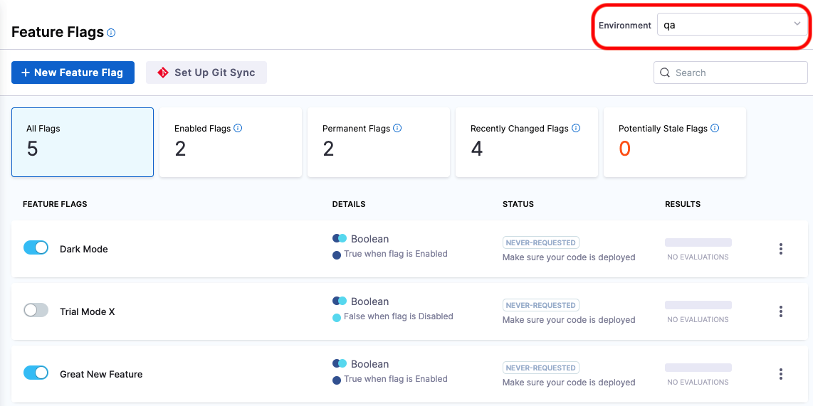
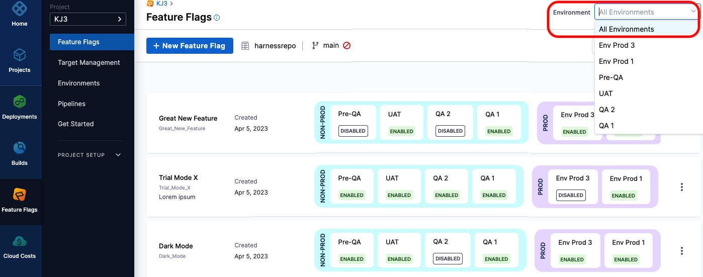

The Feature Flags dashboard lets you filter flags by state (for example, **Enabled**) and see the state of flags in different environments.

## Filter flags by state

**To filter your flags:**

1. In Harness, go to your project, and then select **Feature Flags**.

    The dashboard displays the total number of flags, and the number of flags in each state. For details, go to [Flag states](#flag-states). 

    

1. Select **All Flags**, or use one of the available filters, for example, **Permanent Flags**.

    The dashboard displays the flags for your selected filter.

### Flag states

| **State** | **Description** |
| --- | --- |
| **Enabled Flags** | Flags that are currently toggled on. |
| **Permanent Flags** | Flags you intend to keep in your systems indefinitely and that you marked as permanent when creating them. Permanent flags are never marked as stale. |
| **Recently Changed Flags** | Flags that have been changed in the last 24 hours. Changes include enabling or disabling a flag, or adding new Rules or Targets. |
| **Active Flags** | Flags that have been evaluated in the last 7 days |
| **Potentially Stale Flags** | Flags are marked as potentially stale if in the past 60 days they haven't been changed or evaluated, their default rules or target rules haven’t been added to or updated, or they haven’t been toggled on or off.|

:::info note
 A flag can be marked as both **Active** and **Potentially Stale** if it has been evaluated via an SDK but no other changes have been made in over 60 days. For example, if you evaluated `Flag_A` yesterday using an SDK, but haven’t made any changes on the Harness Platform in over three months, the flag will be marked as **Active** and **Potentially Stale** on the Harness Platform.
:::

## View flag states in different environments

The Feature Flags dashboard can display the flag states and details for a selected environment, or a summary of flag states across all environments.

To view flag states in different environments:

1. In Harness, go to your project, and then select **Feature Flags**.
 
2. In **Environments**, select a specific environment, or **All Environments**.

    * If you choose one environment, you'll see this detailed view:

        

    * If you choose **All Environments**, this view shows you each flag's state in each environment, grouped by **Prod** or **Non-Prod** environments. If needed, you can scroll right on each row to see more environments.

        

