Harness Cloud Cost Management (CCM) Cost Explorer allows you to view, understand, and analyze your cloud costs in a simple and intuitive interface. You can add business context to all this data using Perspectives. Perspectives allow you to group your resources in ways that are more meaningful to your business needs.

In this topic:

* [Before You Begin](https://docs.harness.io/article/0yt4i7m7nz-custom-views#before_you_begin)
* [CE Perspective Concepts](https://docs.harness.io/article/0yt4i7m7nz-perspectives#ce_perspective_concepts)
* [Step: Create a Perspective](https://docs.harness.io/article/0yt4i7m7nz-perspectives#step_create_a_perspective)
* [Step: Edit a Perspective](https://docs.harness.io/article/0yt4i7m7nz-perspectives#step_edit_a_perspective)
* [Step: Clone a Perspective](https://docs.harness.io/article/0yt4i7m7nz-perspectives#step_clone_a_perspective)
* [Step: Delete a Perspective](https://docs.harness.io/article/0yt4i7m7nz-perspectives#step_delete_a_perspective)
* [Perform Root Cost Analysis Using Perspectives](https://docs.harness.io/article/0yt4i7m7nz-custom-views#perform_root_cost_analysis_using_perspectives)
* [Next Steps](https://docs.harness.io/article/0yt4i7m7nz-custom-views#next_steps)

### Before You Begin

* Review [CE Perspective Concepts](https://docs.harness.io/article/0yt4i7m7nz-perspectives#ce_perspective_concepts)
* [Cloud Cost Management Overview](/article/rr85306lq8-continuous-efficiency-overview)
* [Cost Explorer Walkthrough](/article/eeekdk75q2-cost-explorer-walkthrough)
* [Analyze Cost for Kubernetes](/article/4rq26sszja-analyze-cost-trends-across-clusters)
* [Analyze Cost for AWS](/article/244q2uv4or-analyze-cost-trends-for-aws)
* [Analyze Cost for GCP](/article/oo4vs4exhz-analyze-cost-for-gcp)

### CE Perspective Concepts

This section defines different CE Perspective concepts.

#### Cost Perspective

Perspectives allow you to group your resources in ways that are more meaningful to your business needs. It provides a unified view of your cloud cost data across the cloud environment. For example, you can group and filter by Account, Environment, Service, Region, Product, Label, Namespace, Workload, etc. and create a perspective for your business, finance, and engineering teams. Here are some of the examples where you could use Perspectives:

* Build your own visual interface using flexible rules and filters. Each role or team within an organization has different needs and criteria to measure and evaluate the business. With Perspectives, business units can create views that align with their business needs based on groups of resources determined by different rules and filters.
* Create Perspectives broken down by project, team, department, or business unit to gain granular visibility into all your cloud environments. Perspectives provide a single-pane view of different products, for example, clusters, applications, AWS, GCP, and Azure.
* Schedule and share the reports with the key stakeholders for maximum business impact.
* Estimate costs consumed by specific teams, groups, departments, BUs, LOBs cost-centers, etc.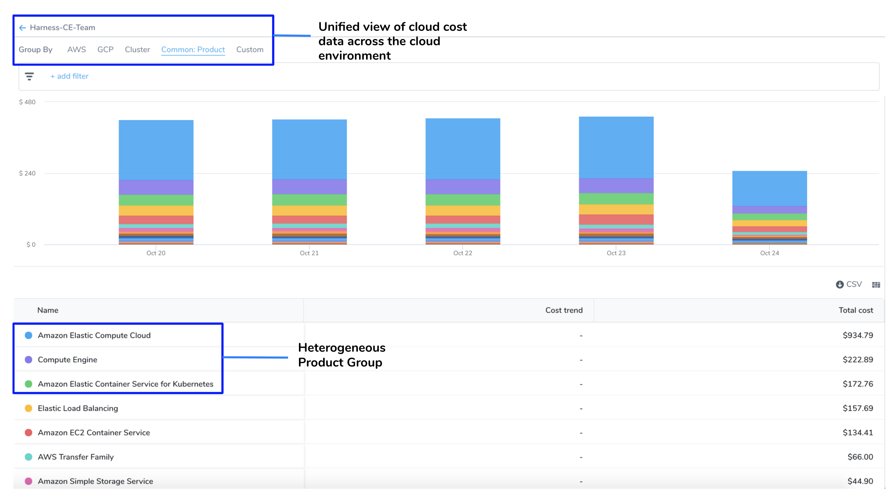

#### Rule-Based Engine

Perspective uses a rule-based engine to organize and display your cloud cost. Each perspective has a set of rules and each rule can have multiple conditions. The following operators are supported for each condition:

* **IN**: The exact match operation used to filter for the exact value specified.
* **NOT IN**: The exact match operation used to filter for all values except the one that  is specified.
* **NULL**: Null means the selected filter has no value. If you select NULL for your filter, then the cost of the selected filter is not included in the perspective.  
  
For example, in **Rules for Perspective**, if you select `Label: kubernetes.io/name` as `NULL`, then your Perspective will not include the cost for the selected label (`kubernetes.io/name`). It will include the cost for all the other resources.
* **NOT NULL**: Not null means that the selected filter has value. If you select NOT NULL for your filter, then only the cost of the selected filter is included in the perspective.  
  
For example, in **Rules for Perspective**, if you select `Label: kubernetes.io/name` as `NOT_NULL`, then your perspective will list the cost of the selected label only (`kubernetes.io/name`). It will not include the cost of any other resources.

#### Default Fields

You can create a Perspective for your resources using default rules and filters. The default fields are used to group the resources. The following are the supported default fields:

* **AWS**: CE allows you to view your AWS costs at a glance, understand what is costing the most, and analyze cost trends. CE displays the data for all your Amazon Web Services (ECS, EC2, and so on). For more information, see [Analyze Cost for AWS](/article/244q2uv4or-analyze-cost-trends-for-aws#step_analyze_aws_cost).
* **GCP**: CE allows you to view your Google Cloud Platform (GCP) costs, understand what is costing the most, and analyze cost trends. CE displays data for all your GCP products (such as Compute Engine, Cloud Storage, BigQuery, and so on), projects, SKUs, and location. For more information, see [Analyze GCP Cost](/article/oo4vs4exhz-analyze-cost-for-gcp#step_analyze_gcp_cost).
* **Azure**: CE allows you to view your Azure costs at a glance, understand what is costing the most, and analyze cost trends. CE displays the data for all your Azure services (Storage account, Virtual machines, Containers, and so on). For more information, see [Analyze Cost for Azure](/article/wvag8xht5o-analyze-cost-for-azure).
* **Cluster**: For more information on Group by filters, see [Analyze Cost Across Clusters](/article/4rq26sszja-analyze-cost-trends-across-clusters#group_by_and_filter_options).
* **Region**: Each AWS, GCP, or Azure region you are currently running services in.
* **Product**: Each of your active products with their cloud costs.
* **Label**: Cost organized by the Kubernetes labels used in the workload manifests. This does not apply to ECS clusters. IN GCP, it refers to each [label](https://cloud.google.com/resource-manager/docs/creating-managing-labels) that you are using to organize your Google Cloud instances.

#### Custom Fields

If you want to create a Perspective using your own fields, then the custom field will fit your requirement.

* Custom field provides you the flexibility to create your own fields using formula. The formula uses SQL functions `ONE_OF()`.  

```
CASE  
    WHEN x IS NOT NULL THEN x  
    ELSE y  
END
```
* Custom field lets you manipulate your Perspective using different functions. The output (cloud cost data) is displayed depending on the functions used in the formula.  
  
For example, you create a Custom Field, `workspace` using the formula `ONE_OF(CLUSTER.Namespace,LABEL.ceteam`. When used, the Perspective displays the cloud cost data for your created filter as the following: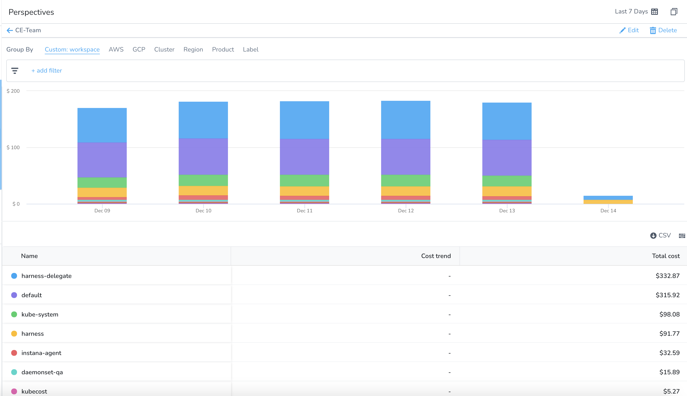

#### Preview

As you add your resources in the **Perspective Builder**, a **Preview** of your Perspective is displayed.

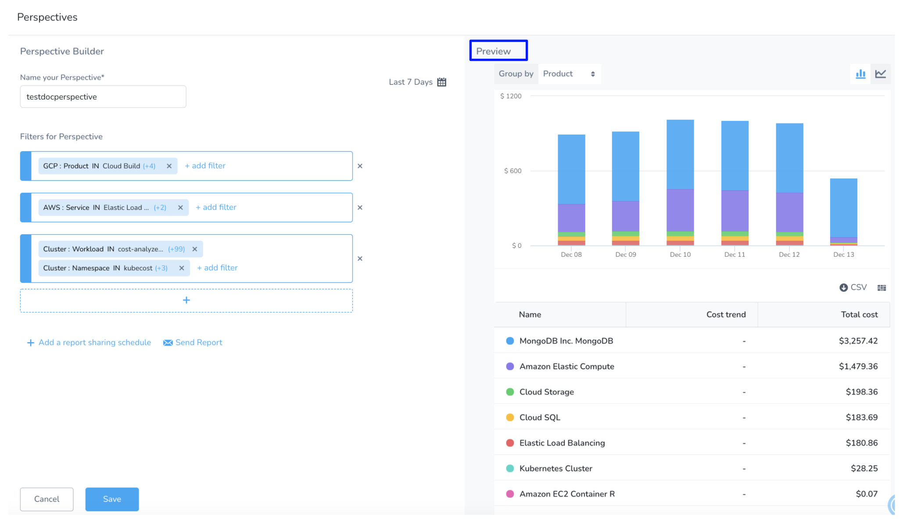The following are the key advantages of Preview:

* Provides a quick visual representation of your resources in the Perspective, without saving it.
* Allows you to Group by your resources in the preview mode itself. You can Group by, **Common**, **Custom** (if Custom Fields are available), **Cluster**, **AWS**, **GCP**, and **Azure**.
* Helps you to review your changes faster.

By default, the resources are **Grouped by** Product in Preview.#### Dynamic Filter Support

Perspective offers dynamic filter support for Group by and Filter settings. The options for these settings are listed based on the filters you select when creating your Perspective.

For example, you have selected AWS and GCP when creating your Perspective.

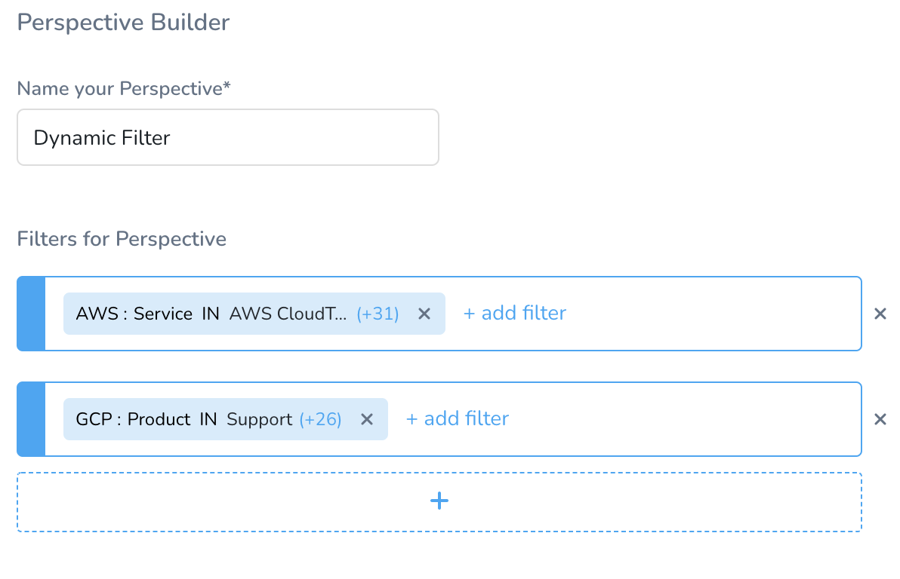When saved, only AWS and GCP Group by and Filters options are listed.

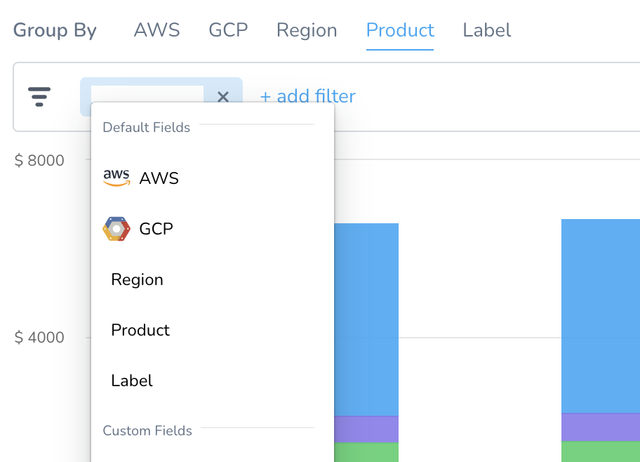### Step: Create a Perspective

You can create a Perspective by grouping your resources the way you wish. For example, if you want to create a perspective for your CFO, first add [default](/article/0yt4i7m7nz-perspectives#option_add_a_filter_using_default_fields) or [custom](/article/0yt4i7m7nz-perspectives#option_add_a_filter_using_custom_field) filters and then further group by Service, Account, Workload, Namespace, etc. that you would want to include in your Perspective. You can create up to 50 Perspectives.

Perform the following steps to create a Perspective:

1. In **Cloud Cost Management**, click **Perspectives**.
2. Click **Create a new perspective**.
3. In **Perspective Builder**, enter a name for your perspective. By default, a unique name is entered in the field. You can edit the pre-populated name of the perspective.Perspective name must not include any special character.
4. In **Perspective Builder**, in **Rules for Perspective**, click **+** and then click **add filter**.  
  
You can add filters using [default fields](/article/0yt4i7m7nz-perspectives#option_add_a_filter_using_default_fields) or you can [create new custom fields](/article/0yt4i7m7nz-perspectives#option_add_a_filter_using_custom_field). As you add your resources in the Perspective Builder, a [Preview](/article/0yt4i7m7nz-perspectives#preview) is displayed of your Perspective.

#### Option: Add a Filter Using Default Fields

Perform the following steps to add filters using default fields.

1. In **Perspective Builder**, in **Rules for Perspective**, click + and then click **add filter**.
2. Select **Cluster**, **AWS**, **GCP**, **Azure**, **Region**, **Product**, or **Label** from the **Default Fields**.
3. Select the filter. Based on your group by selection, the filters are listed.
4. Select the operator. The supported operators are:
* **IN**: The exact match operation used to filter for the value specified.
* **NOT IN**: The exact match operation used to filter for the value that is not specified.
* **NULL**: Null means the selected filter has no value. If you select NULL for your filter, then the cost of the selected filter is not included in the perspective.  
  
For example, in **Rules for Perspective**, if you select `Label: kubernetes.io/name` as `NULL`, then your Perspective will not include the cost for the selected label (`kubernetes.io/name`). It will include the cost for all the other resources.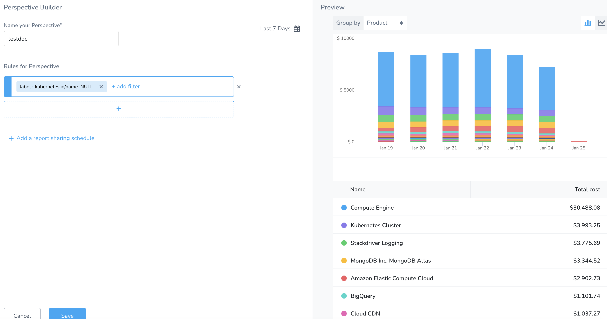

* **NOT NULL**: Not null means that the selected filter has value. If you select NOT NULL for your filter, then only the cost of the selected filter is included in the perspective.

For example, in **Rules for Perspective**, if you select `Label: kubernetes.io/name` as `NOT_NULL`, then your perspective will list the cost of the selected label only (`kubernetes.io/name`). It will not include the cost of any other resources.

1. Select value for your filter. You can select multiple values. You can also filter and customize your result using the search option.
2. Once you have added all the filters, you can [add a report sharing schedule](/article/nlxsj1coe5-share-report-in-cost-perspectives).
3. Click **Save**. The cost data for your selection is displayed.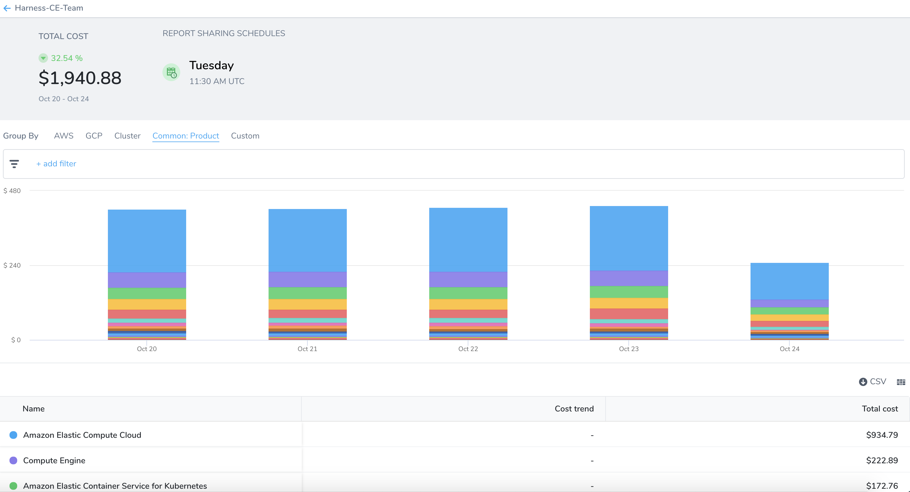

#### Option: Add a Filter Using Custom Field

If you don't want to create a Perspective using Default Fields, but instead looking to create your own fields, then the custom field will fit your requirement.

Custom field provides you the flexibility to create your own fields using a formula. The formula uses SQL functions `ONE_OF()`.

Perform the following steps to create a custom field and use them:

1. In **Perspective Builder**, in **Rules for Perspective**, click **+** and then click **add filter**.
2. Select **Create new custom field**.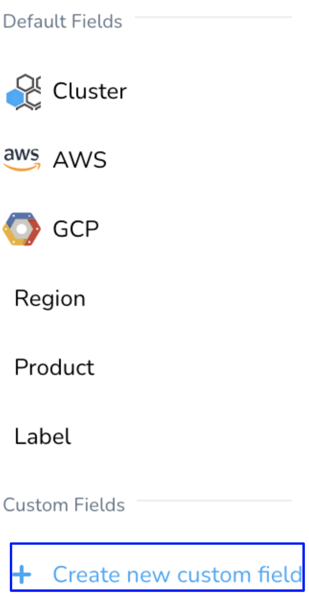
3. In **Custom Field**, in **Enter the name for the custom field**, enter a name.
4. In **Formula**, enter a formula to create your custom field. The formula uses SQL function `ONE_OF()`.
5. Select a function from the list. Use the `Space bar` to list the functions.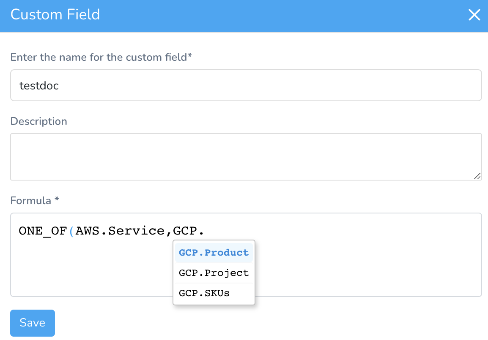
6. You can use first-class entities to create the custom field. For example, `ONE_OF(AWS.Service,GCP.Product)`. Use the `Space bar` to list the functions.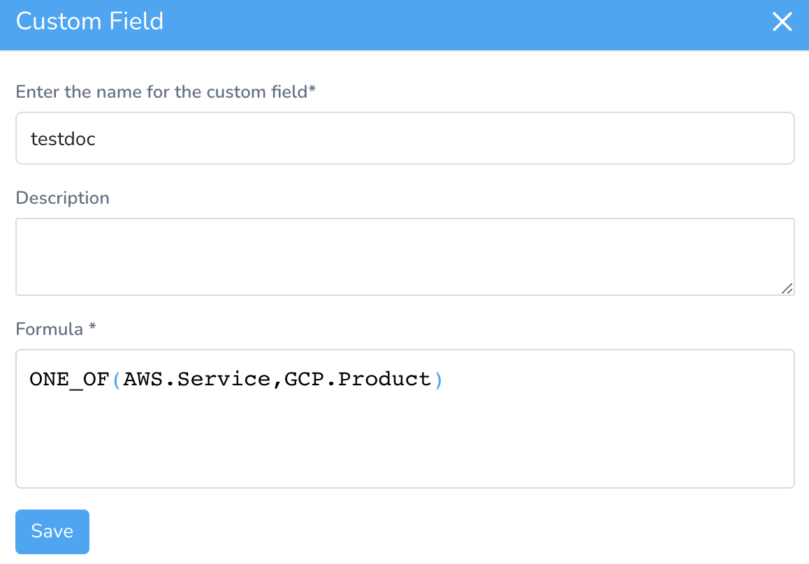
7. Click **Save**. The field is added under **Custom Fields**.
8. Click on the Custom Field that you created, for example, testdoc.
9. Select the Operator. The supported operators are:
	* **IN**: The exact match operation used to filter for the exact value specified.
	* **NOT IN**: The exact match operation used to filter for the exact value that is not specified.
10. Click **Save** to save the Perspective. You can **Group by** the **Custom** filter in **Preview** mode before saving the Perspective.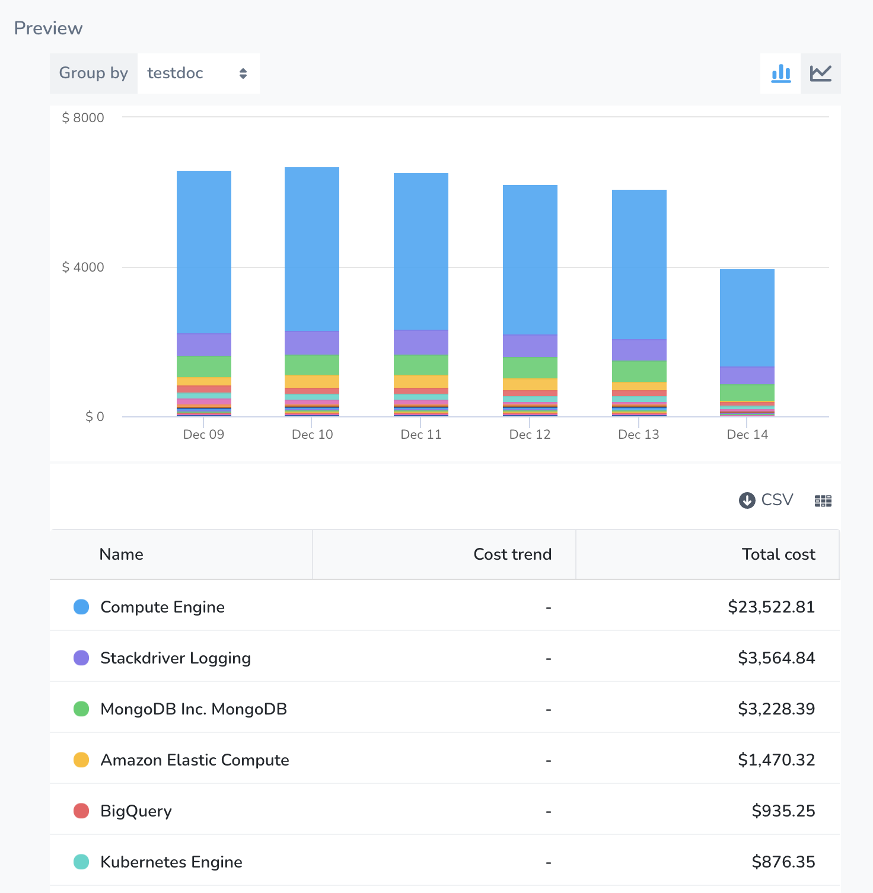
11. Select the Custom field in the Perspective for which you want to view the cost data.

You can also [edit](/article/0yt4i7m7nz-custom-views#edit_a_custom_view), [clone](/article/0yt4i7m7nz-custom-views#clone_a_custom_view), and [delete](/article/0yt4i7m7nz-custom-views#delete_a_custom_view) Perspectives.

### Step: Edit a Perspective

To edit a Perspective, perform the following steps:

1. In **Cloud Cost Management**, click **Perspective****s**. All the Perspectives that you have created are listed.
2. Select the Perspective that you want to edit.
3. Click on the more options button (...) and click **Edit**. The **Perspective Builder** settings appear.
4. Follow the steps in add filters using [default fields](/article/0yt4i7m7nz-perspectives#option_add_a_filter_using_default_fields) or [create new custom fields](/article/0yt4i7m7nz-perspectives#option_add_a_filter_using_custom_field) to edit the settings.

### Step: Clone a Perspective

To clone a Perspective, perform the following steps:

1. In **Cloud Cost Management**, click **Perspective****s**. All the Perspectives that you have created are listed.
2. Select the Perspective that you want to clone.
3. Click on the more options button (...) and click **Clone**.
4. Enter name. By default, the name is populated. You can edit the field.
5. Click **Submit**.

### Step: Delete a Perspective

To delete a Perspective, perform the following steps:

1. In **Cloud Cost Management**, click **Perspective****s**. All the Perspectives that you have created are listed.
2. Select the Perspective that you want to delete.
3. Click on the more options button (...) and click **Delete**.
4. Click **Confirm Delete**.

### Perform Root Cost Analysis Using Perspectives

Perspectives allow you to view your costs at a glance, understand what is costing the most, and analyze cost trends across all your clusters, AWS, GCP, and Azure in a single-pane view.

1. In **Cloud Cost Management**, click **Perspectives**. All the Perspectives with name, time period, filters used, and last edited on details are listed.
2. Click the Perspective for which you want to analyze the cost.
3. Use the Group by settings to view the cloud cost of your Perspective.
4. You can further customize your selection by using **Filter** settings.  
  
The Group by options are dynamically listed based on the filters used in your Perspective. For example, if you have selected AWS, GCP, and Custom for creating your Perspective, then only AWS, GCP, and Custom **Group by** and **Filter** options are listed.
5. The cost data for custom fields are displayed under the **Custom** tab.

### Next Steps

* [Share Your Cost Perspective Report](/article/nlxsj1coe5-share-report-in-cost-perspectives)
* [Perform Root Cost Analysis](/article/v7eaaq98vo-perform-root-cause-analysis)
* [Optimize Kubernetes Costs with Resource Recommendations](/article/ikxjmkqi03-recommendations)

