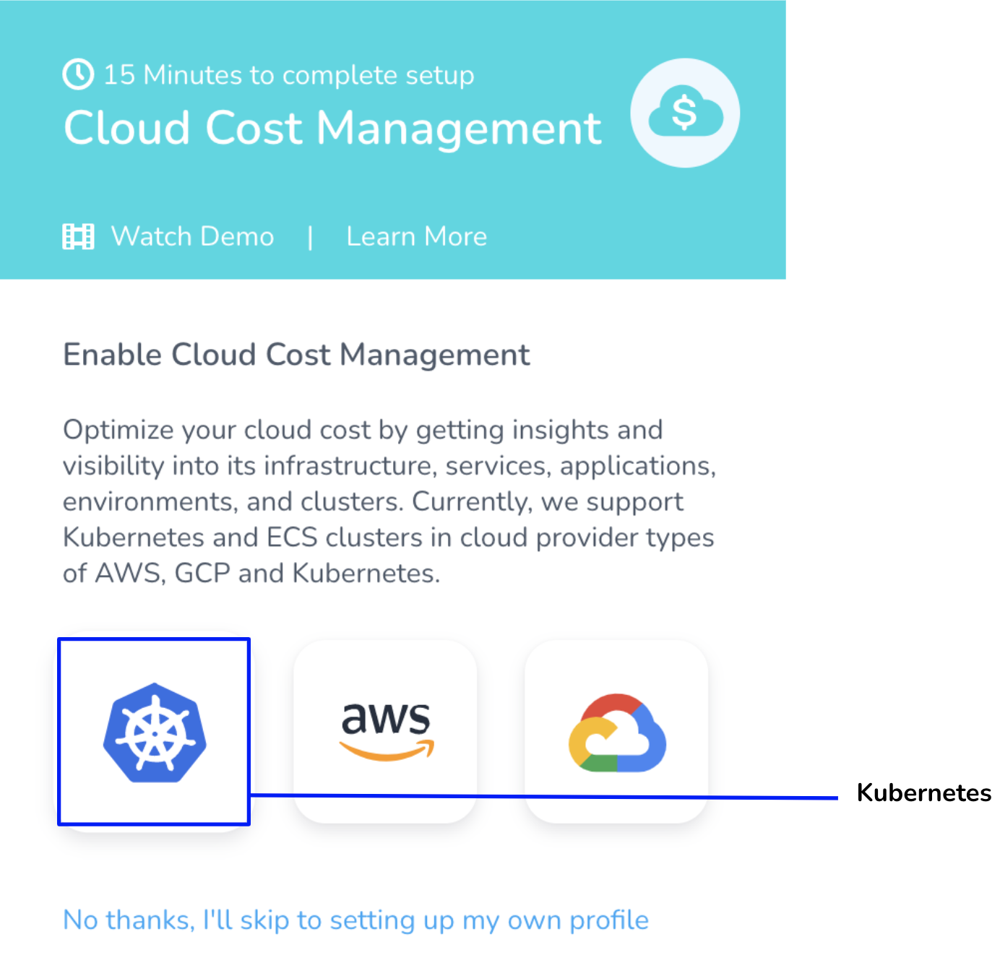
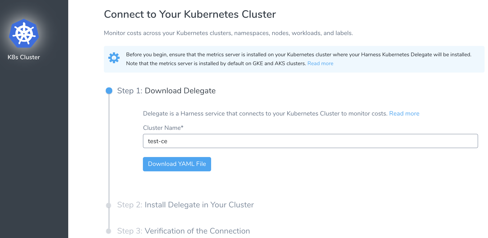
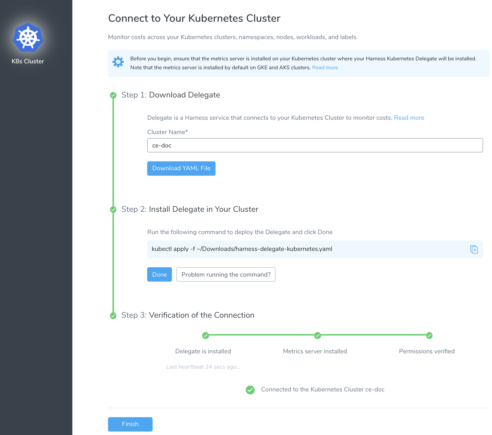
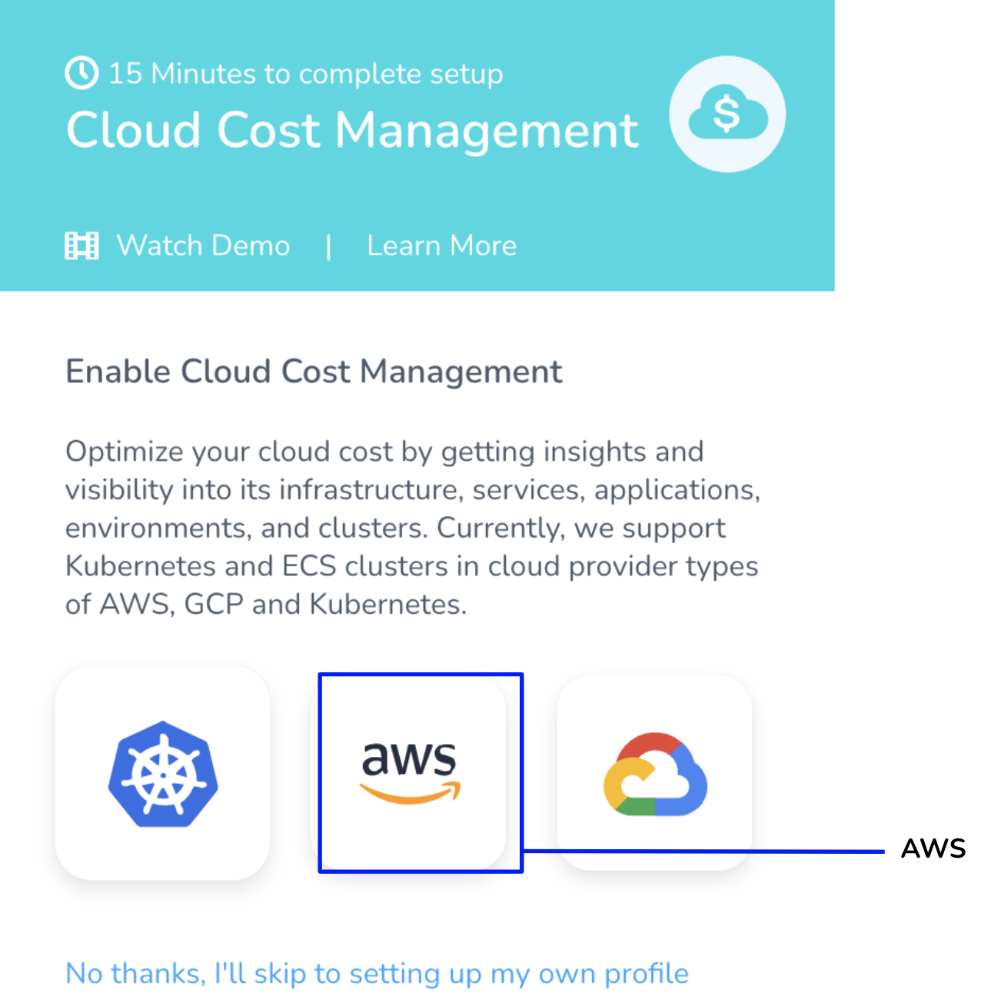
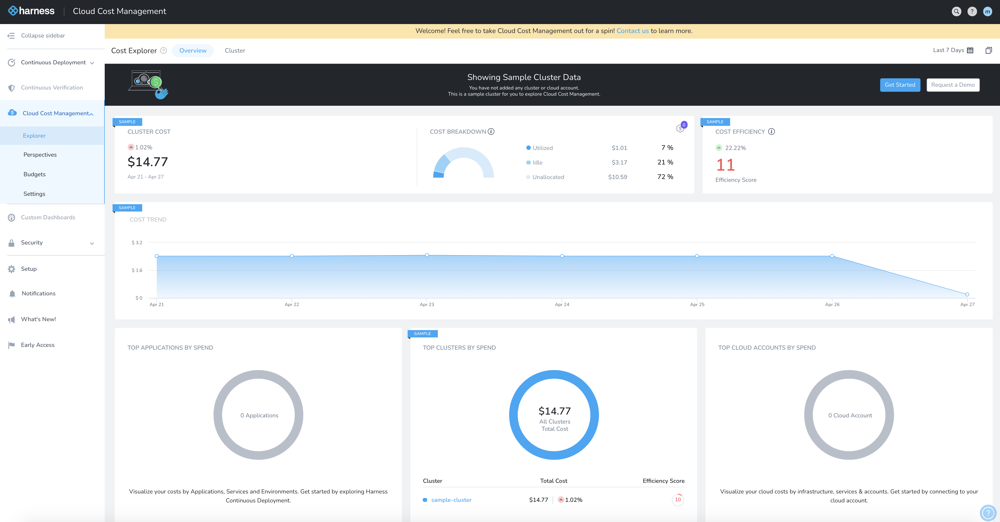
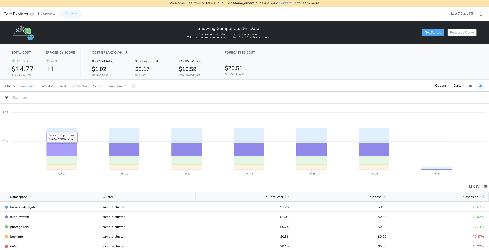
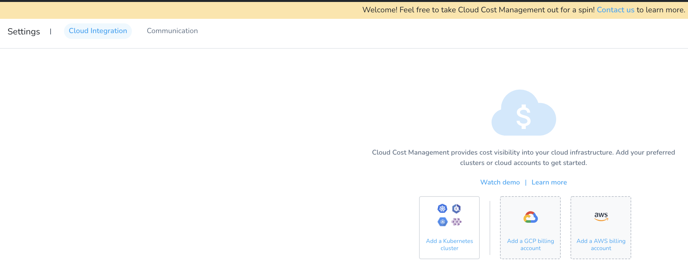

Harness Cloud Cost Management (CCM) is a solution that provides engineers and DevOps granular detail of their resource consumption hourly. CCM is designed to bring cloud cost analysis and management into the hands of the engineers consuming cloud resources. It empowers your teams to monitor the costs of your cloud infrastructure and microservices in real-time.

Harness CCM trial edition is a free 15-day trial of almost all Harness Professional features. During the trial period, you can enable Cloud Cost Management for a maximum of two clusters and one cloud account (AWS or GCP).

Once the trial period ends, it provides an additional 15-days grace period. However, during the grace period, you will not be able to drill down into the details of your costs.

Whether you are new to Harness or an existing Harness user, feel free to take Cloud Cost Management out for a spin.

## New User

If you are new to Harness and want to sign up for the CCM trial edition, perform the following steps:

1. In [Harness](https://harness.io/), click **Get Started** or **Try Harness**.
2. In **Get Started**, enter your details and sign up.
   
     
3. Select **Cloud Cost Management**.
   
     
4. In **C****loud Cost Management**, select the cluster or cloud account for which you want to enable Cloud Cost Management. You can add the following:
	1. **Kubernetes**: For detailed instructions, see [Set Up Cost Visibility for Kubernetes](/docs/first-gen/cloud-cost-management/setup-cost-visibility/enable-continuous-efficiency-for-kubernetes.md).
	2. **AWS**: For detailed instructions, see [Set Up Cost Visibility for AWS](/docs/first-gen/cloud-cost-management/setup-cost-visibility/enable-continuous-efficiency-for-aws.md).
	3. **GCP**: For detailed instructions, see [Set Up Cost Visibility for GCP](/docs/first-gen/cloud-cost-management/setup-cost-visibility/enable-cloud-efficiency-for-google-cloud-platform-gcp.md).
   
     

### Set Up Cost Visibility for Kubernetes

Harness CCM monitors cloud costs of your Kubernetes clusters, namespaces, nodes, workloads, and labels. This topic describes how to enable Cloud Cost Management (CCM) for Kubernetes.

#### Prerequisites

* **System Requirements**: Ensure that you meet the following system requirements:
	+ ​Minimum 1 CPU.
	+ Minimum 8GB RAM — There is a cap of 4GB per Delegate, but when the Delegate is updating there might be two Delegates running. Hence, the minimum is 8GB.
	+ Ensure that you provide the minimum memory for the Delegate and enough memory for the host/node system. For example, an AWS EC2 instance type such as m5a.xlarge has 16GB of RAM, 8 for the Delegate, and 8 for the remaining operations.
	+ Minimum 6GB Disk space.
	+ For more information, see [System Requirements](https://docs.harness.io/article/lwynqsgxt9-delegate-requirements-and-limitations#system_requirements).
* Metrics Server must be running on the Kubernetes cluster where your Harness Kubernetes Delegate will be installed. For more information, see [Install Kubernetes Metrics Server](/docs/first-gen/cloud-cost-management/setup-cost-visibility/enable-continuous-efficiency-for-kubernetes.md).

Metrics Server is installed by default on GKE and AKS clusters, however, you need to install it on the AWS EKS cluster.#### Step: Connect Your Kubernetes Cluster to CCM

Once you enable CCM, for the first cluster the data is available within a few minutes for viewing and analysis. However, you will not see the idle cost because of the lack of utilization data. CCM generates the last 30 days of the cost data based on the first events.  
  
From the second cluster onwards, it takes about 2–3 hours for the data to be available for viewing and analysis.1. In **Cloud Cost Management**, click Kubernetes.

  
1. In **Download Delegate**, enter the name that will appear in CCM Explorer to identify this cluster.
   
     

2. Click **Download YAML file**.The YAML file has all the access defined to enable the Harness Kubernetes Delegate to monitor your cluster costs. It also has the Service account details to install and run the Harness Kubernetes Delegate with ClusterRole to access resource metrics.
3. In the Terminal you used to connect to the Kubernetes cluster, run the following command:  
  
`kubectl apply -f ~/Downloads/harness-delegate-kubernetes.yaml`  
Ensure that you are connected to the Kubernetes cluster.
3. Click **Done**.  
  
Once the Delegate is connected to your Kubernetes cluster, the status turns green.

  
4. Click **Finish**.  
  
The Kubernetes cluster is now listed under **Added Kubernetes Clusters**. Once CCM has data, the cluster is listed in **Cost Explorer**.

### Set Up Cost Visibility for AWS

Harness Cloud Cost Management (CCM) monitors cloud costs using your Amazon Web Services (AWS). Connect your AWS account to Harness to get insights into your expenses across your cloud infrastructure and AWS services, such as EC2, S3, RDS, Lambda, and so on.

1. In **Cloud Cost Management**, click AWS.
   
     
2. For detailed instructions on how to enable CCM for your AWS services (such as EC2, S3, RDS, Lambda, and so on), see [Set Up Cost Visibility for AWS](/docs/first-gen/cloud-cost-management/setup-cost-visibility/enable-continuous-efficiency-for-aws.md).

### Set Up Cost Visibility for GCP

Harness Cloud Cost Management (CCM) monitors cloud costs using your GCP products, projects, SKUs, and location. As a first step, you connect Harness to your GCP account to get insights into your cloud infrastructure and GCP services, Compute Engine Cloud Storage, BigQuery, etc. 

1. In **Cloud Cost Management**, click GCP.
   
     
2. For detailed instructions on how to enable CCM for your GCP account, see [Set Up Cost Visibility for GCP](/docs/first-gen/cloud-cost-management/setup-cost-visibility/enable-cloud-efficiency-for-google-cloud-platform-gcp.md).

### Sample Cluster Data

If you wish to enable CCM for your cluster and cloud accounts later, you can explore CCM using sample cluster data. To do so, perform the following steps:

1. Click **No thanks, I'll skip to setting up my own profile**.
   
     
2. In **Cloud Cost Management** click **Explorer**. The **Sample Cluster Data** is displayed.
   
     
3. Click **Cluster** to understand and analyze the cost across sample clusters. For more information, see [Analyze Cost for Kubernetes](/docs/first-gen/cloud-cost-management/root-cost-analysis/analyze-cost-trends-across-clusters.md).
   
     
4. Now if you are interested to get started with CCM, click **Get Started** to enable CCM for your clusters or cloud accounts. You can add the following accounts:
	1. **Kubernetes**: For detailed instructions, see [Set Up Cost Visibility for Kubernetes](/docs/first-gen/cloud-cost-management/setup-cost-visibility/enable-continuous-efficiency-for-kubernetes.md).
	2. **AWS**: For detailed instructions, see [Set Up Cost Visibility for AWS](/docs/first-gen/cloud-cost-management/setup-cost-visibility/enable-continuous-efficiency-for-aws.md).
	3. **GCP**: For detailed instructions, see [Set Up Cost Visibility for GCP](/docs/first-gen/cloud-cost-management/setup-cost-visibility/enable-cloud-efficiency-for-google-cloud-platform-gcp.md).
   
     

