Harness Cloud Cost Management (CCM) monitors the cloud costs of your Amazon Web Services (AWS). Connect your AWS account to Harness to get insights into your expenses across your cloud infrastructure and AWS services, such as EC2, S3, RDS, Lambda, and so on. Harness uses a secure, cross-account role with a restricted policy to access the cost and usage reports and resources for cost analysis.


## Before You Begin

* [Cloud Cost Management Overview](/docs/first-gen/cloud-cost-management/concepts-ccm/b-cloud-cost-management-overview.md)
* [AWS Access Permissions](/docs/first-gen/cloud-cost-management/setup-cost-visibility/enable-continuous-efficiency-for-aws.md#review-aws-access-permissions)
* The same connector cannot be used in FirstGen and NextGen. NextGen Connectors are recommended for the best experience of CCM capabilities and features. For information on creating an AWS connector in the NextGen see [Set Up Cloud Cost Management for AWS](/docs/cloud-cost-management/1-onboard-with-cloud-cost-management/set-up-cloud-cost-management/set-up-cost-visibility-for-aws.md).

After enabling CCM, it takes about 24 hours for the data to be available for viewing and analysis.### Prerequisites

Create an organization that starts with your AWS account as the master account. When you create an organization, you can choose whether the organization supports all features (recommended) or only consolidated billing features. For more information, see [Creating an organization](https://docs.aws.amazon.com/organizations/latest/userguide/orgs_manage_create.html).

## AWS Access Permissions

* If you have a [consolidated billing process](https://docs.aws.amazon.com/awsaccountbilling/latest/aboutv2/useconsolidatedbilling-procedure.html) enabled, then CCM needs read-only access to the cost and usage reports (CUR) stored in the S3 bucket in the master or payer account. This gives access to the cost data for all the accounts (linked/member) in the organization.
* If you don't have consolidated billing enabled at the organization level then you can create the CUR at a linked account level.
* If you don't have access to your master account, contact your IT or security teams to get the following permissions.  

	+ **Master Account**: The following permissions are needed:
		- Provides access to your S3 bucket:  
		  
		
		```
		 "s3:GetBucketLocation",  
		 "s3:ListBucket",  
		 "s3:GetObject"
		```
		- Validates CUR parameters:  
		  
		
		```
		"cur:DescribeReportDefinitions"
		```
		- Provides access to all the linked accounts:  
		  
		
		```
		"organizations:Describe*",  
		  
		 "organizations:List*"
		```
		- For more information on the policies, see [AWS master account template](https://continuous-efficiency.s3.us-east-2.amazonaws.com/setup/v2/masterAccount.json).
	+ **Stack Set** (optional): Provide the following permissions to the stack set deployed in your master account. For more information on the policies, see [AWS linked account template](https://continuous-efficiency.s3.us-east-2.amazonaws.com/setup/v2/linkedAccount.json).  
	  
	
	```
	"eks:Describe*",  
	"eks:List*",  
	"ecs:ListServices",  
	"ec2:DescribeInstances",  
	"cloudwatch:GetMetricData",  
	"ecs:ListTasks",  
	"ecs:ListContainerInstances",  
	"ecs:DescribeTasks"
	```
* You can also limit visibility into specific accounts:
	+ Contact the Harness Support team to whitelist or blacklist those accounts for which you want to limit visibility.
	+ Deploy stack set to those linked accounts for which you want to limit visibility into event collection and watching clusters. However, it is recommended to [deploy a stack set](//docs/first-gen/cloud-cost-management/setup-cost-visibility/enable-continuous-efficiency-for-aws.md#step-2-specify-stackset-details) to the entire organization.

## Connect to Your AWS Master Account

To enable CCM for your AWS services (such as EC2, S3, RDS, Lambda, and so on), you simply need to connect Harness to your AWS accounts.

Perform the following steps to connect to your AWS master account:

1. In **Cloud Cost Management**, click **Settings** and then click **Cloud Integration**.
2. In **Cloud Integration**, click **Add a AWS billing account**.
   
     
3. Connect to your **AWS Master Account**. This involves the following steps:
   
    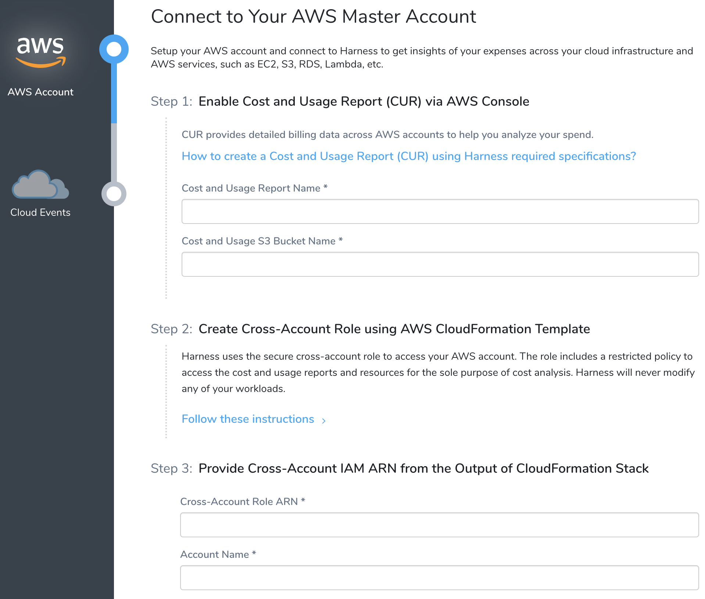

### Step 1: Enable Cost and Usage Report (CUR) via AWS console

CUR provides detailed billing data across AWS accounts to help you analyze your spend.

You need to enter the **cost and usage report name** and **cost and usage S3 bucket name** in Harness. To get these details, do the following:

1. Log into your **AWS Master Account** via AWS console. To launch the AWS console, click **How to create a Cost and Usage Report (CUR) using Harness required specifications?** and click **Launch AWS Console**.
   
     
2. In **AWS Cost and Usage Reports**, click **Create Report**.
   
     
3. Enter the **Report Name**. This is the CUR name that you need to enter in Harness.
4. In **Additional report details**, select the checkbox **Include resource IDs** to include the IDs of each individual resource in the report.
5. In **Data refresh settings**, select the checkbox **Automatically refresh your Cost & Usage Report when charges are detected for previous months with closed bills**.
6. Click **Next**.  
  
When you are done with the **Report content** step, it will look something like this:

  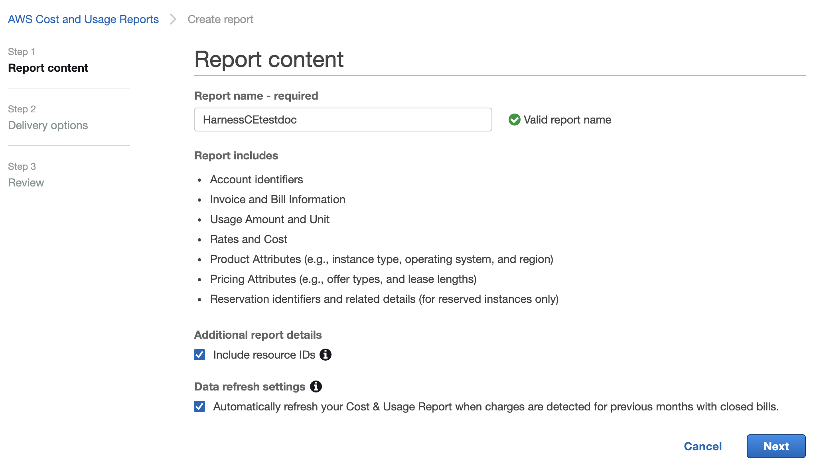
    
7. In the **S3 bucket**, click **Configure**.
8. In **Configure S3 Bucket**, in **Create a bucket**, enter **S3 bucket name**. This is the cost and usage S3 bucket name that you need to enter in Harness. For more information on S3 bucket naming requirements, see [Amazon S3 Bucket Naming Requirements](https://docs.aws.amazon.com/awscloudtrail/latest/userguide/cloudtrail-s3-bucket-naming-requirements.html).
     
9.  Select **Region** from the drop-down list and click **Next**. It is recommended to select **US East** (**N. Virginia**).
    
	  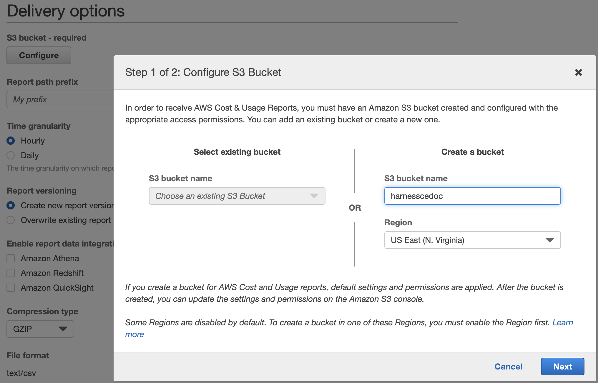
	    
10. In **Verify policy**, select the checkbox **I have confirmed that this policy is correct** and click **Save**.
    
	  
11. Enter the report path prefix that you want prepended to the name of your report.
12. Select **Hourly** in **Time granularity**.
13. Select **Overwrite Existing Report** in **Report versioning**.
14. Do not select any value in **Enable report data integration for**.
15. Select **GZIP** in the **Compression type**.
16. Click **Next**.  
  
When you are done with the **Delivery options** step, it will look something like this:

  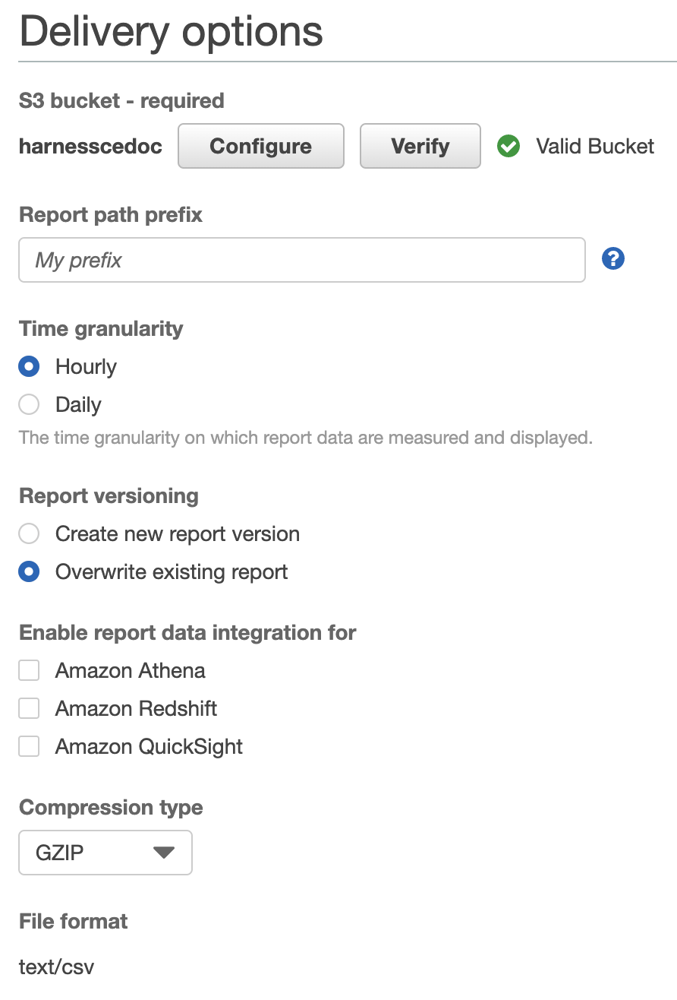
  
17. Review your report details and click **Review and Complete**.
    

	    
18. Enter the **Cost and Usage Report Name** (as entered in step 3) and **Cost and Usage S3 Bucket Name** (as entered in step 8) in Harness.
    
	  

### Step 2: Create Cross-Account IAM Role using the AWS CloudFormation Template

Harness uses the secure cross-account role to access your AWS account. The role includes a restricted policy to access the cost and usage reports and resources for cost analysis. Harness will never modify any of your workloads.

1. Click **Follow these instructions** and click **Launch Template**. You can review the template before launching it. To review, click **View Template**.Ensure that you are logged into your AWS master account. The [master account](https://docs.aws.amazon.com/organizations/latest/userguide/orgs_getting-started_concepts.html) is the account that creates the organization.
2. In **Quick create stack**, in **Capabilities**, select acknowledgment, and click **Create stack**.
   
     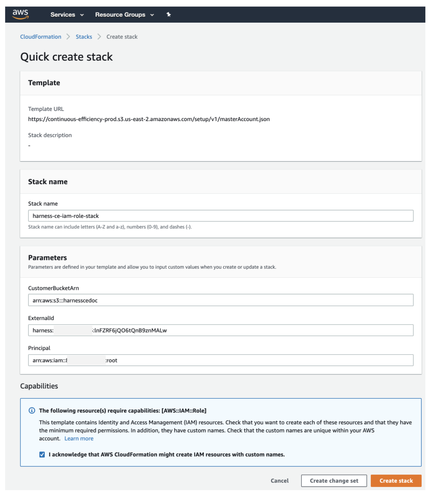
3. In the **Stacks** page, from **Outputs** tab copy **Value**.
   
     

#### Step 3: Provide Cross-Account IAM ARN from the Output of CloudFormation Stack

1. Enter the **Cross-Account Role ARN** that you copied from the **Output**s tab (previous step) in Harness.
2. Enter the **Account Name**.
   
     
3. Click **Save & Continue**.  
When you are done, it will look something like this:

  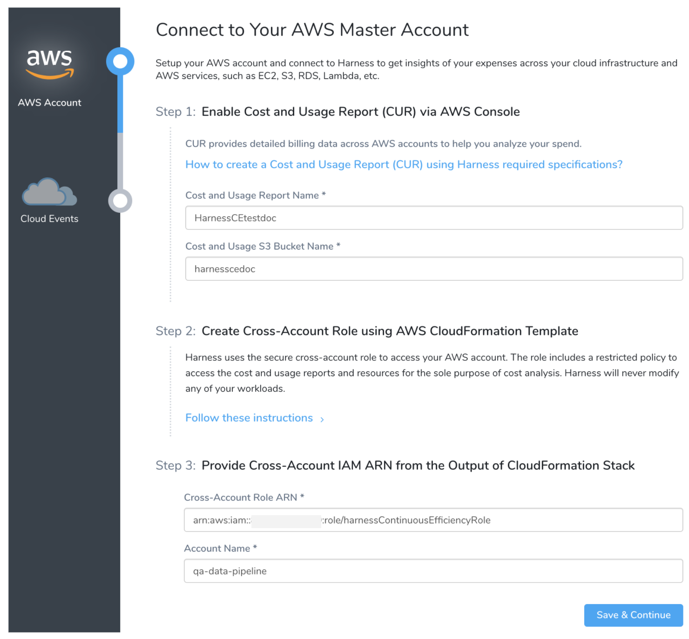

## (Optional): Provide Access to Member Accounts

With access to AWS member accounts, CCM provides cost impact data on member accounts events.

Once setup, the list of the member accounts linked to your AWS master account along with their status is displayed. To provide access to member accounts you need to create an IAM Role using the CloudFormation Template provided in the CCM AWS setup. This IAM role provides access to member accounts.

The ECS clusters are monitored without creating the connectors. Providing access to linked accounts creates an IAM role to monitor ECS clusters.1. Click **Follow these instructions** and click **Launch Template**. The StackSets settings appear.  
  
StackSets provides IAM access across linked member accounts.Ensure that you are logged into your AWS master account. The [master account](https://docs.aws.amazon.com/organizations/latest/userguide/orgs_getting-started_concepts.html) is the account that creates the organization.

### Step 1: Choose a Template

1. In **Prerequisite - Prepare template**, select **Template is ready**.
2. In the **Specify template**, select the **Amazon S3 URL** and enter the following URL and click **Next**.  
  
`https://continuous-efficiency-prod.s3.us-east-2.amazonaws.com/setup/v1/linkedAccount.json`

  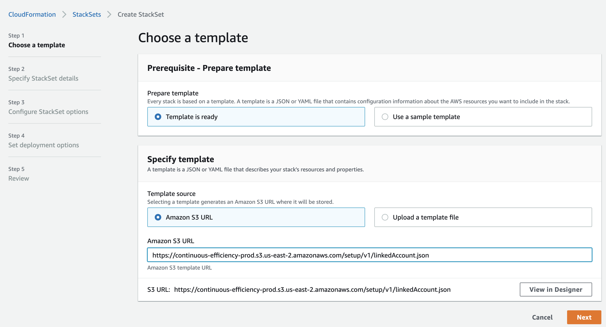

### Step 2: Specify StackSet Details

1. Enter **Stack set name** `harness-ce-iam-stackset`.
2. In **Parameters**, in **ExternalID** enter the External ID. Copy the external ID from Harness. The external ID is generated dynamically for your account, for example, `harness:111111111111:lnFZRF6jQO6tQnB9xxXXXx` .
   
     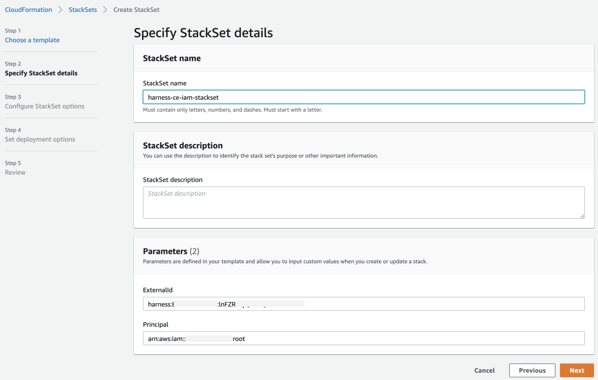
3. Click **Next**.

### Step 3: Configure StackSet Options

In **Permissions**, select **Service-managed permissions** and click **Next**.

Ensure that [All features](https://docs.aws.amazon.com/organizations/latest/userguide/orgs_manage_org_support-all-features.html) feature set is enabled in your AWS organization.
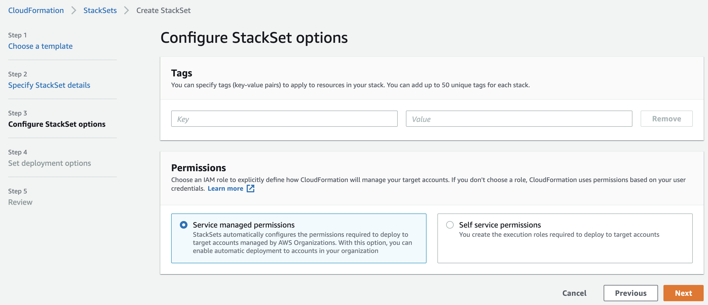

### Step 4:  Set Deployment Options

1. In **Deployment targets**, select **Deploy to organization** (recommended). You can select **Deploy to Organizational Units (OUs)** to limit the monitoring clusters to a particular OU or a subset of linked accounts.
2. In **Automatic deployment**, select **Enabled**.
3. In **Account removal behavior**, select **Delete Stacks**.
4. Select a **region** from the drop-down list and click **Next**.
   
     

### Step 5: Review

Review the details, select acknowledgment, and click **Submit**.

1. In Harness, click **Verify Access** to check the status of the connected member accounts. The following status is displayed:  
  
**Connected**: Harness has access to your linked member accounts.  
**Not Connected**: Harness does not have access to your linked member accounts.  
**Not Verified**: Harness is not able to verify linked member accounts.

  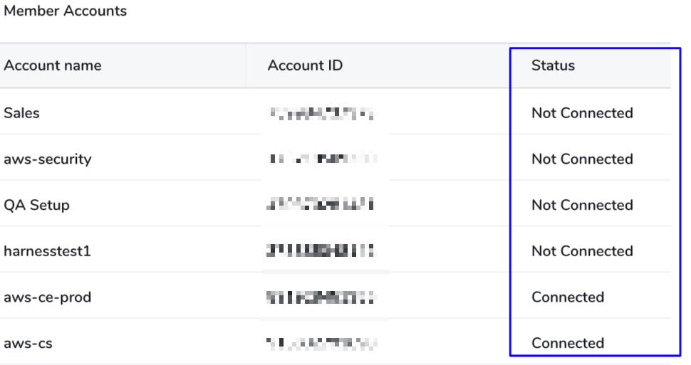
2. To modify any of the master account settings, click **Back**.
   

	   
3. When you have provided access to Harness for all of the member accounts you want to analyze, click **Done**.
4. The connected AWS master account along with the member account details are displayed.
   
     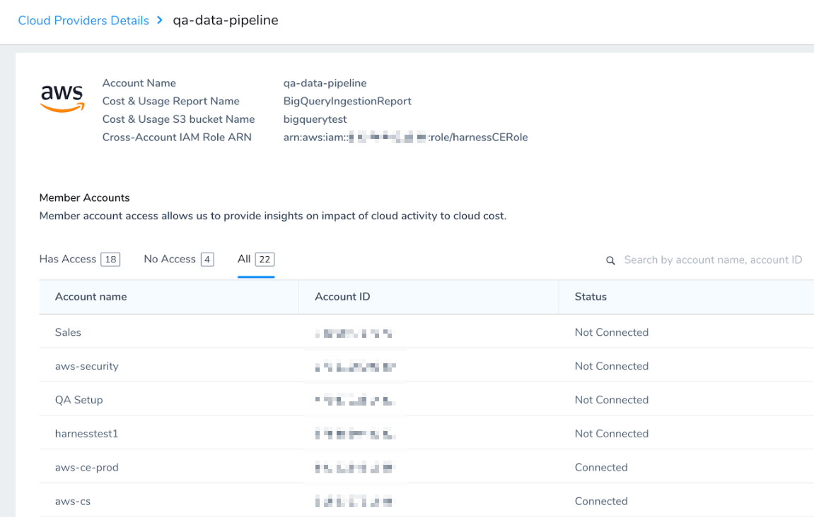
5. Use **Has Access**, **No Access**, or **All** filters to sort the members accounts for which Harness has the access.
   
     

The AWS Cloud Provider is now listed under **Efficiency Enabled**.

As noted earlier, after enabling CCM, it takes about 24 hours for the data to be available for viewing and analysis in **Cost Explorer**.

### Troubleshooting

If you get **Linked Accounts are in NOT\_CONNECTED state** error, try the following:

1. Log in to the AWS linked account.
2. Check if `harnessContinuousEfficiencyRole` role exists.
	1. If the role exists, check if in the **Trust relationships**:
		1. In **Trusted entities**, the account value is updated `891xxxxxxx55`.
		2. In **Conditions**, the values for **Condition**, **Key**, and **Value** are updated. The condition of `StringEquals` on `sts:ExternalId` = *`<Your Harness AccountId>`*.
   
     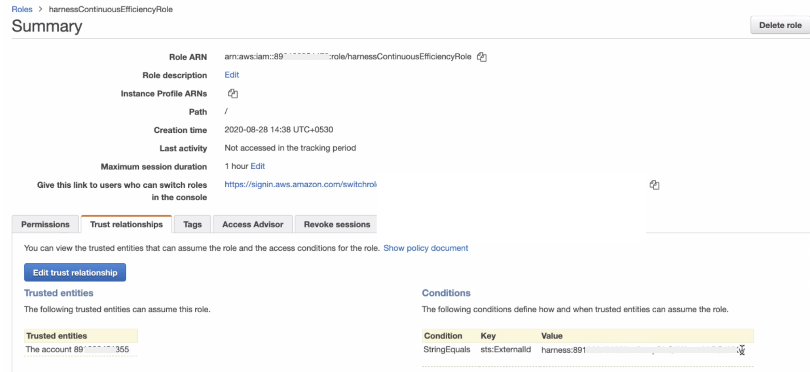
	2. If the role does not exist, go to the stack creation and create a stack to create the IAM Role.


