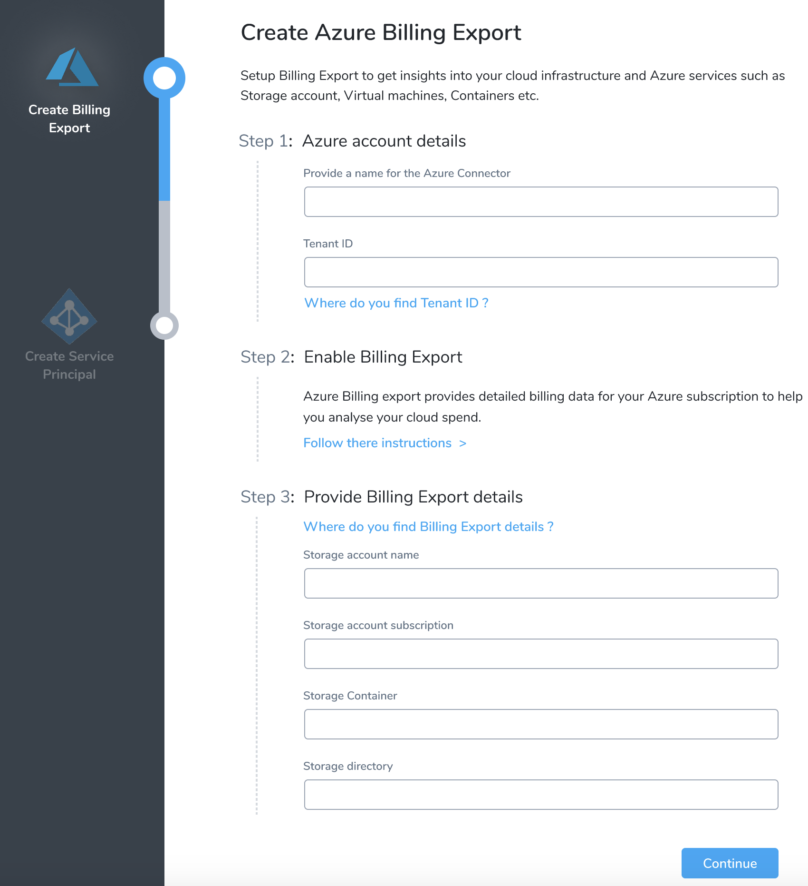
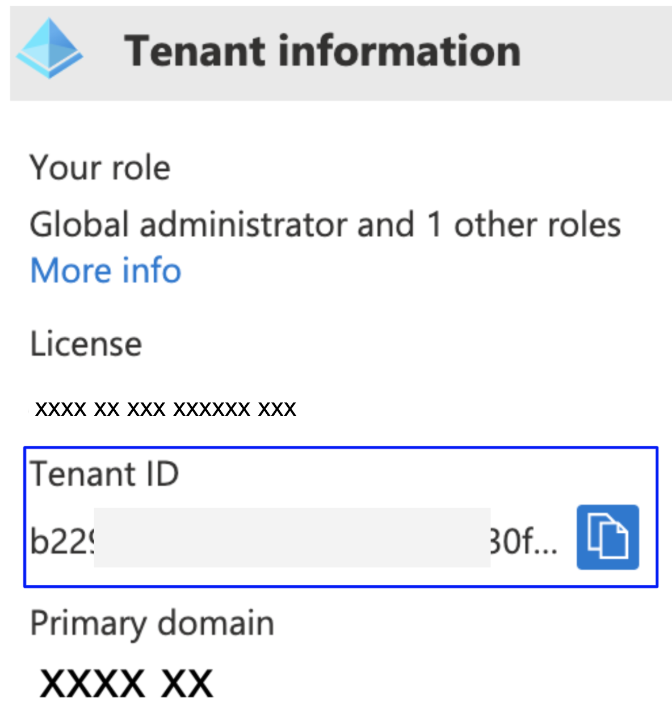
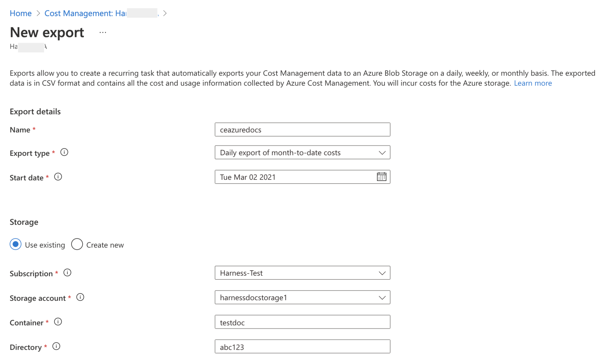
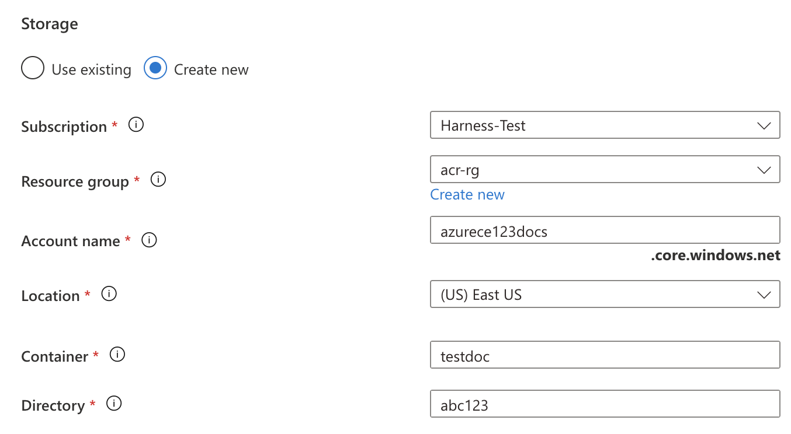
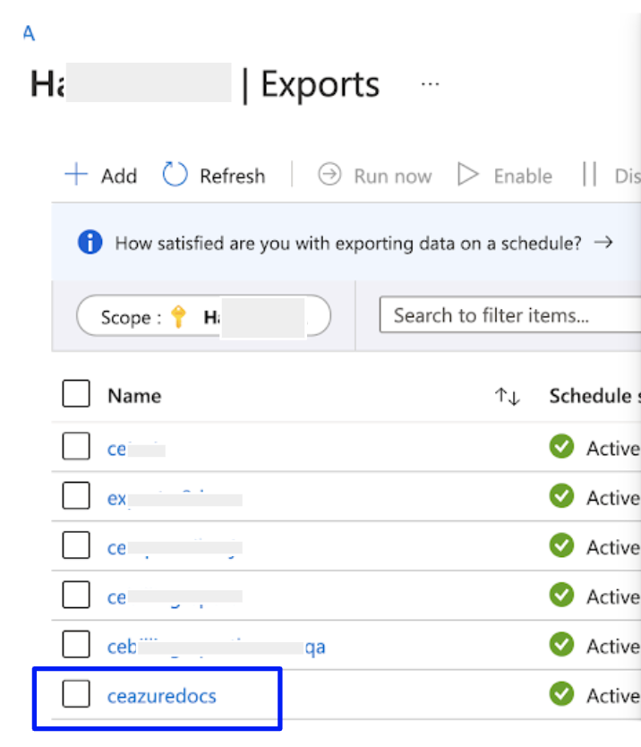
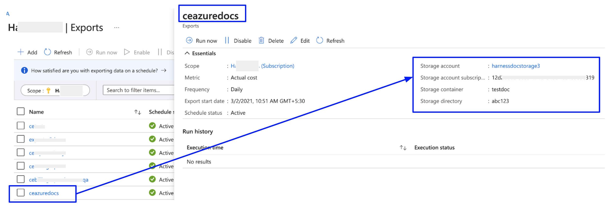
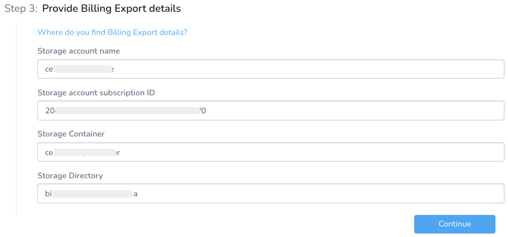
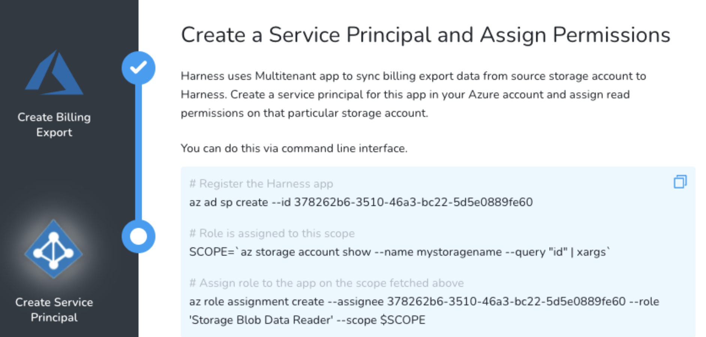
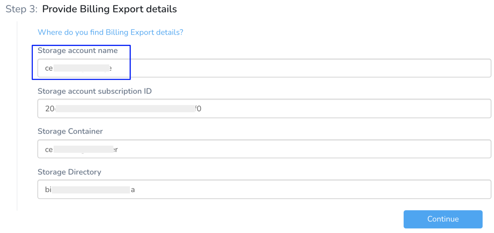

Harness Cloud Cost Management (CCM) monitors the cloud costs of your Azure services. Connect your Azure account and set up Billing Export to get insights into your cloud infrastructure and Azure services such as Storage account, Virtual machines, Containers, and so on.

Currently, CCM supports one Azure account with one or multiple subscriptions. To view the cloud cost of all the subscriptions in your Azure account, set up a billing export for each subscription in the same storage account, container, and directory with a unique report name.

In this topic:

* [Before You Begin](https://docs.harness.io/article/7idbmchsim-set-up-cost-visibility-for-azure#before_you_begin)
* [Connect CCM to Your Azure Account](https://docs.harness.io/article/7idbmchsim-set-up-cost-visibility-for-azure#connect_ccm_to_your_azure_account)
* [Create a Service Principal and Assign Permissions](https://docs.harness.io/article/7idbmchsim-set-up-cost-visibility-for-azure#create_a_service_principal_and_assign_permissions)
* [Next Steps](https://docs.harness.io/article/7idbmchsim-set-up-cost-visibility-for-azure#next_steps)

### Before You Begin

* [Cloud Cost Management Overview](/article/rr85306lq8-continuous-efficiency-overview)
* [Cost Explorer Walkthrough](/article/eeekdk75q2-cost-explorer-walkthrough)
* The same connector cannot be used in FirstGen and NextGen. NextGen Connectors are recommended for the best experience of CCM capabilities and features. For information on creating an Azure connector in the NextGen see [Set Up Cloud Cost Management for Azure](https://ngdocs.harness.io/article/v682mz6qfd-set-up-cost-visibility-for-azure).

After enabling CCM, it takes about three hours for the data to be available for viewing and analysis.### Connect CCM to Your Azure Account

To enable CCM for your Azure services (such as Storage account, Virtual machines, Containers, and so on), you simply need to connect Harness to your Azure account.

Perform the following steps to connect to your Azure account:

1. In **Cloud Cost Management**, click **Settings** and then click **Cloud Integration**.
2. In **Cloud Integration**, click **Add an Azure billing account**.
3. Connect to your **Azure Account**. This involves the following steps:

#### Step 1: Provide Azure Account Details

You need to provide a name for your connector and enter the tenant ID of your Azure Active Directory (AD).

1. Enter a name for the Azure Connector.
2. Enter Tenant ID of your Azure AD account. A tenant represents an organization. It's a dedicated instance of Azure AD that an organization or app developer receives at the beginning of a relationship with Microsoft.  
  
Each Azure AD tenant is distinct and separate from other Azure AD tenants.  
  
To find your tenant ID, do the following:  

	1. Click **Where do you find Tenant ID?**. and then click **Launch Azure Active Directory**.
	2. Copy the tenant ID from the **Tenant information**.If you don't find the tenant ID in the Azure console, run the `az account show` command using Azure CLI.
3. Enter the **Tenant ID** in Harness.  
  
When you're done, it will look something like this:

#### Step 2: Enable Billing Export for Azure Subscription

Before enabling billing export for your Azure subscription, review the following permissions:

* Owner: Can create, modify, or delete scheduled exports for a subscription.
* Contributor: Can create, modify, or delete their own scheduled exports. They can also modify the name of scheduled exports created by others.
* Reader: Can schedule exports that they have permission to.

Perform the following steps to enable the billing export:

1. Click **Follow these instructions>**.
2. Click **Launch Azure Billing Exports**.
3. In the Azure Cost Management portal, in **Settings**, in **Exports**, click **Add** to create a new export.
4. In **Export details**, provide the following details:
	1. Enter **Name** for your export.
	2. In **Export type**, select **Daily export of month-to-date costs**.
	3. In the **Start date**, leave the date as the current date.  
	  
	For example, if you are creating a new export on March 1, 2021, select the date as **Mon Mar 01 2021**.
5. In the **Storage**, you can select **Use existing** or **Create new**.
	1. If you select **Use existing**, enter the following details:
		1. In **Subscription**, select the **Subscription** of your storage account.
		2. In the **Storage account**, select the storage account where the data needs to be exported.
		3. In **Container**, enter the container name where the report is to be stored.
		4. In **Directory**, enter the directory path where the export is to be stored.
	2. If you select **Create new**, enter the following details:
		1. In **Subscription**, select the **Subscription** of your storage account.
		2. In the **Resource group**, select the group to place the storage account. You can also create a new resource group.  
		  
		A resource group is a container that holds related resources for an Azure solution.
		3. In **Account name**, enter the name for your storage account.
		4. In **Location**, select the region for your storage account.
		5. In **Container**, enter the container name where the report is to be stored.
		6. In **Directory**, enter the directory path where the export is to be stored.
6. Once you are done, click **Create**.  
  
Your export report is listed in the **Exports** list.
7. Click the export that you created in the previous step and click **Run now**.

#### Step 3: Provide Billing Export Details

You need to provide the details of the export report that you created in the [enable export billing step](/article/7idbmchsim-set-up-cost-visibility-for-azure#step_2_enable_billing_export_for_azure_subscription) in Harness. Perform the following steps to fetch the report details:

1. Click **Where do you find Billing Export details?**.
2. Click **Launch Azure Console**.
3. In the Azure Cost Management portal, click the billing export that you created in the [enable export billing step](/article/7idbmchsim-set-up-cost-visibility-for-azure#step_2_enable_billing_export_for_azure_subscription).Enter the following details in Harness:
4. In the **Storage account name**, enter the account name.
5. In **Storage account subscription ID**, enter the subscription ID.
6. In **Storage Container**, enter the container name.
7. In **Storage Directory**, enter the directory name.
8. Once you are done, click **Continue**.

### Create a Service Principal and Assign Permissions

Once you have set up the billing export, the next step is to sync your billing data report with Harness. Harness uses a multi-tenant app to sync billing export data from the source storage account to Harness. This involves the following steps:

* Register the Harness CE application into your Azure account.
* Provide read permissions to the storage account in which the billing data export is available.

All the commands documented in this section are mandatory to execute.#### Prerequisites

* Make sure that you have the **Application Administrator** role assigned for your Azure AD. Users in this role can create and manage all aspects of enterprise applications, application registrations, and application proxy settings. See [Application Administrator](https://docs.microsoft.com/en-us/azure/active-directory/roles/permissions-reference#application-administrator).
* Many Azure CLI commands act within a subscription. Ensure that you have selected the right subscription before executing the commands. If you need to switch the subscription, use the following command:  
  
`az account set -s <`*`subs id/name`*`>`  
  
For more information, see [Manage Subscriptions](https://docs.microsoft.com/en-us/cli/azure/manage-azure-subscriptions-azure-cli).

#### Step 1: Create a Service Principal

Run the following **bash** commands using your **bash** terminal or Azure cloud shell:

1. `az ad sp create --id <>`: Creates a service principal.  
  
**Required Parameter**  
`--id`  
This is a common ID for Harness CCM client application. Use `0211763d-24fb-4d63-865d-92f86f77e908`If you see the following error proceed with [Step 2: Assign Permissions to the Storage Account](/article/7idbmchsim-set-up-cost-visibility-for-azure#step_2_assign_permissions_to_the_storage_account).  
  
`Another object with the same value for property servicePrincipalNames already exists.`  
  
The error means that your Harness CE application is already registered into your Azure account.#### Step 2: Assign Permissions to the Storage Account

Run the following **bash** commands using your **bash** terminal or Azure cloud shell:
2. `SCOPE=`az storage account show --name <storage account name> --query "id" | xargs``: Provides scope for your storage account. Each role assignment in Azure needs a scope on which the permissions or role is applied. The output of this command is used in the next step.  
  
**Required Parameter**  
`--name`  
The name of your storage account.  
  
Here's a screenshot with the Storage account name for your reference.**Response**  

```
$ SCOPE=`az storage account show --name test --query "id" | xargs`  
  
$ echo $SCOPE  
/subscriptions/XXXXXXX-XXXX-XXXX-XXXX-XXXXXXXXXXXX/resourceGroups/<resourcegroupname>/providers/Microsoft.Storage/storageAccounts/<storage account name>
```
3. `az role assignment create --assignee 0211763d-24fb-4d63-865d-92f86f77e908 --role 'Storage Blob Data Reader' --scope $SCOPE`: Provides Storage Blob Data Reader permission to the Harness application on the scope fetched in the previous step.  
  
**Required Parameter**  
`--assignee`  
  
This is the ID of the Harness CCM client application. Use `0211763d-24fb-4d63-865d-92f86f77e908`
4. Once you are done, click **Finish** in Harness.Upon clicking the **Finish** button, Harness performs the input validation. The validation may take a few seconds.  
  
If the process throws an `Authorization permission mismatch` error, wait for a few more seconds and click the **Finish** button again.

### Next Steps

* [Cost Explorer Walkthrough](https://docs.harness.io/article/eeekdk75q2-explorer-walkthrough)
* [Analyze Cost for Azure](https://docs.harness.io/article/wvag8xht5o-analyze-cost-for-azure)

