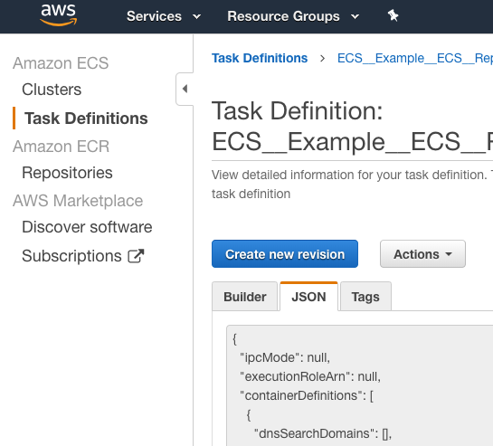
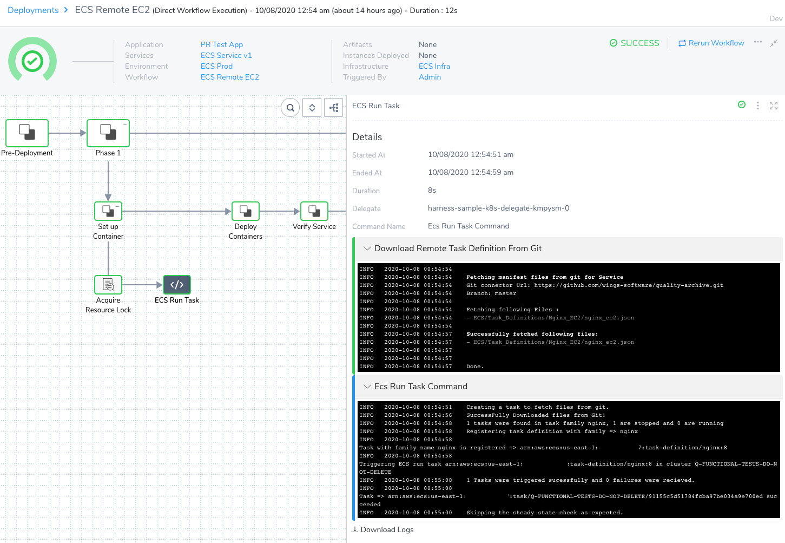
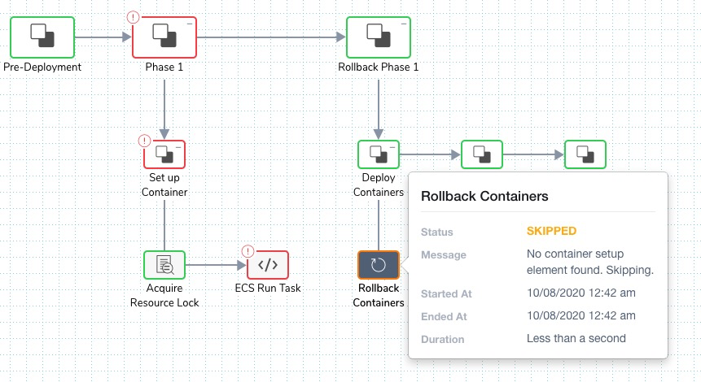

In addition to deploying tasks as part of your [standard ECS deployment](https://docs.harness.io/article/j39azkrevm-aws-ecs-deployments), you can use the ECS Run Task step to run individual tasks separately as a step in your ECS Workflow.

The ECS Run Task step is available in all ECS Workflow types.

For more information, see [Running tasks](https://docs.aws.amazon.com/AmazonECS/latest/developerguide/ecs_run_task.html) from AWS.An example of when you run a task separately is a one-time or periodic batch job that does not need to keep running or restart when it finishes.

### Before You Begin

* [AWS ECS Quickstart](https://docs.harness.io/article/j39azkrevm-aws-ecs-deployments)
* [ECS How-tos](https://docs.harness.io/category/aws-ecs-deployments)
* [Deploy Multiple ECS Sidecar Containers](deploy-multiple-containers-in-a-single-ecs-workflow.md)

### Supported Platforms and Technologies

See [Supported Platforms and Technologies](https://docs.harness.io/article/220d0ojx5y-supported-platforms).

### Limitations

In the ECS Run Task Workflow step's **Inline** text area, you cannot enter multiple task definitions. You can enter multiple task definitions using the **Remote** option, described in this topic.

### Review: Running ECS Tasks

The ECS Run Task step is independent of the Harness Service, but it inherits configurations like ECS Launch Type, Cluster, etc., from the Infrastructure Definition in the Workflow. 

The ECS Run Task step is the same as use the [run-task command](https://docs.aws.amazon.com/cli/latest/reference/ecs/run-task.html) in the AWS ECS CLI.

The ECS Run Task step has two stages:

1. Harness registers the task you define in the Workflow, and verifies the registration.
2. Harness triggers the task, and determines if it was triggered successfully.

The output in the Workflow deployment looks something like this:


```
Creating a task to fetch files from git.  
SuccessFully Downloaded files from Git!  
1 tasks were found in task family nginx, 1 are stopped and 0 are running  
Registering task definition with family => nginx  
Task with family name nginx is registered => arn:aws:ecs:us-east-1:1234567891011:task-definition/nginx:12  
Triggering ECS run task arn:aws:ecs:us-east-1:1234567891011:task-definition/nginx:12 in cluster Q-FUNCTIONAL-TESTS-DO-NOT-DELETE  
1 Tasks were triggered sucessfully and 0 failures were recieved.  
Task => arn:aws:ecs:us-east-1:1234567891011:task/Q-FUNCTIONAL-TESTS-DO-NOT-DELETE/e04a7c7428414a69abf5bf2f801a12ce succeeded  
Skipping the steady state check as expected.
```
if you are new to ECS task scheduling and running tasks manually, review the following topics from AWS:

* [Scheduling Amazon ECS tasks](https://docs.aws.amazon.com/AmazonECS/latest/developerguide/scheduling_tasks.html)
* [Running tasks](https://docs.aws.amazon.com/AmazonECS/latest/developerguide/ecs_run_task.html)
* [RunTask API](https://docs.aws.amazon.com/AmazonECS/latest/APIReference/API_RunTask.html)

### Step 1: Add ECS Run Task to Workflow

This step assumes you have an existing Harness ECS Workflow. If you have not created one, see [AWS ECS Quickstart](https://docs.harness.io/article/j39azkrevm-aws-ecs-deployments) and [AWS ECS Deployments](https://docs.harness.io/category/aws-ecs-deployments)how-tos.

1. In your ECS Workflow, in the **Set up Container** section, click **Add Step**.
2. Select **ECS Run Task**.
3. In the ECS Run Task settings, enter a name.

### Step 2: ECS Task Family Name

1. Enter a family name.

When Harness registers the task definition, it will use this family name.

The first task definition that is registered into a particular family is given a revision of 1, and any task definitions registered after that are given a sequential revision number.

If the task definition you enter later uses the `family` parameter, the value provided in that parameter will override the family name you enter in the **ECS Run Task** step.

### Option 1: Add Inline Task Definition

The Task Definition must follow the syntax described by AWS in [RegisterTaskDefinition](https://docs.aws.amazon.com/AmazonECS/latest/APIReference/API_RegisterTaskDefinition.html).

1. In **Add Task Definition**, click **Inline**.
2. Enter the task definition.

For example, here is a task definition from the [AWS sample repo](https://github.com/aws-samples/aws-containers-task-definitions/blob/master/nginx/nginx_ec2.json):


```
{  
  "requiresCompatibilities": [  
    "EC2"  
  ],  
  "containerDefinitions": [  
    {  
      "name": "nginx",  
      "image": "nginx:latest",  
      "memory": 256,  
      "cpu": 256,  
      "essential": true,  
      "portMappings": [  
        {  
          "containerPort": 80,  
          "protocol": "tcp"  
        }  
      ],  
      "logConfiguration": {  
          "logDriver": "awslogs",  
          "options": {  
              "awslogs-group": "awslogs-nginx-ecs",  
              "awslogs-region": "us-east-1",  
              "awslogs-stream-prefix": "nginx"  
          }  
      }  
    }  
  ],  
  "volumes": [],  
  "networkMode": "bridge",  
  "placementConstraints": [],  
  "family": "nginx"  
}
```
If you have an existing Task Definition, you can paste it into the JSON. You can obtain the Task Definition from the ECS console:



You can also obtain the Task Definition using the AWS CLI ( [describe-task-definition](https://docs.aws.amazon.com/cli/latest/reference/ecs/describe-task-definition.html)):

`aws ecs describe-task-definition --task-definition ecsTaskDefinitionName`

The task definitions support Harness [Workflow variables](https://docs.harness.io/article/766iheu1bk-add-workflow-variables-new-template) and any other [Harness variables](https://docs.harness.io/article/9dvxcegm90-variables) available at the point when the ECS Task Run step is executed.

### Option 2: Add Remote Task Definition

The Task Definition must follow the syntax described by AWS in [RegisterTaskDefinition](https://docs.aws.amazon.com/AmazonECS/latest/APIReference/API_RegisterTaskDefinition.html).1. In **Add Task Definition**, click **Remote**.
2. In **Source Repository**, select the Harness Source Repo Provider you added. See [Add Source Repo Providers](https://docs.harness.io/article/ay9hlwbgwa-add-source-repo-providers).
3. In **Commit ID** , select **Latest from Branch** or **Specific Commit ID**.
4. In **Branch/Commit ID** (required), enter the branch or commit ID for the remote repo.
5. In **File Path**, enter the repo path to the task definition file.  
For example, if the repo you set up in your Source Repo Provider is **https://github.com/aws-samples/aws-containers-task-definitions**, and the file containing your task definition is at the path **aws-samples/****aws-containers-task-definitions/nginx/nginx\_ec2.json**, you would enter **nginx/nginx\_ec2.json**.

When you deploy the Workflow, the output of the ECS Run Task step shows the git fetch:


```
Fetching manifest files from git for Service  
Git connector Url: https://github.com/wings-software/quality-archive.git  
Branch: master  
  
Fetching following Files :  
- ECS/Task_Definitions/Nginx_EC2/nginx_ec2.json  
  
Successfully fetched following files:  
- ECS/Task_Definitions/Nginx_EC2/nginx_ec2.json  
  
Done.
```
The task definitions support Harness [Workflow variables](https://docs.harness.io/article/766iheu1bk-add-workflow-variables-new-template) and any other [Harness variables](https://docs.harness.io/article/9dvxcegm90-variables) available at the point when the ECS Task Run step is executed.

#### Multiple Task Definitions

In **File Path**, you can enter multiple task definitions, separated by commas:


```
ECS/Task_Definitions/Task_Definitions_EC2/nginx_ec2.json,ECS/Task_Definitions/Task_Definitions_EC2/wildfly_ec2.json
```
### Option 3: Skip Steady State Check

If you do not select this option, Harness will not check to see if the task was triggered.

If you do select this option, Harness will poll the ECS task to see if it triggered successfully.

### Step 3: Set Timeout

Enter a timeout for the step. Keep in mind the nature of your ECS task and whether it will take a long time to run.

If you did not select Skip Steady State Check, and you have a brief timeout, Harness might check for steady state before your task is completed. This will result in a failure.

You cannot use Harness variable expressions in this setting. They are supported in Basic and Canary Workflow ECS Service Setup steps when using Replica Scheduling.

### Step 4: Deploy Workflow

When you deploy the Workflow, the ECS Task Run steps shows a successful deployment:



Here is an example of the output from a deployed ECS Run Task step:


```
Creating a task to fetch files from git.  
SuccessFully Downloaded files from Git!  
1 tasks were found in task family nginx, 1 are stopped and 0 are running  
Registering task definition with family => nginx  
Task with family name nginx is registered => arn:aws:ecs:us-east-1:12345678910:task-definition/nginx:12  
Triggering ECS run task arn:aws:ecs:us-east-1:12345678910:task-definition/nginx:12 in cluster Q-FUNCTIONAL-TESTS-DO-NOT-DELETE  
1 Tasks were triggered sucessfully and 0 failures were recieved.  
Task => arn:aws:ecs:us-east-1:12345678910:task/Q-FUNCTIONAL-TESTS-DO-NOT-DELETE/e04a7c7428414a69abf5bf2f801a12ce succeeded  
Skipping the steady state check as expected.
```
### Review: Rollbacks

ECS returns [exit codes](https://docs.aws.amazon.com/AmazonECS/latest/APIReference/API_Container.html#ECS-Type-Container-exitCode) from the container. These are standard [Docker exit status codes](https://docs.docker.com/engine/reference/run/#exit-status). The exit code 0 means success. A non-zero exit code indicates failure.

Harness checks these codes as part of deployment to determine success of failure.

If the ECS Run Task step fails, Harness rolls back the Workflow according to its [Failure Strategy](https://docs.harness.io/article/vfp0ksdzg3-define-workflow-failure-strategy-new-template).

Once a rollback occurs, the resources created by the ECS Run Task step still need to be explicitly cleaned up.

You can delete the resources created by adding a [Shell Script step](https://docs.harness.io/article/1fjrjbau7x-capture-shell-script-step-output) in **Rollback Steps**. For example, using the AWS ECS CLI [delete-service](https://docs.aws.amazon.com/cli/latest/reference/ecs/delete-service.html) command.

If you want to execute AWS CLI commands, ensure that the Delegate host has the AWS CLI installed via a Delegate Profile. See [Common Delegate Profile Scripts](https://docs.harness.io/article/nxhlbmbgkj-common-delegate-profile-scripts).

The **Rollback Containers** step in **Rollback Steps** only applies to the core service deployed by the Workflow. If a Workflow containing only an ECS Task Run step fails, the **Rollback Containers** step is skipped.



### Review: Tags Support

Currently, this feature is behind a Feature Flag. Contact [Harness Support](mailto:support@harness.io) to enable the feature. Harness will remove Feature Flags for Harness Professional and Essentials editions. Once the feature is released to a general audience, it's available for Trial and Community Editions.You can add ECS tags to your task definition just as you would in the AWS console or CLI.

You can use Harness [Workflow variables](https://docs.harness.io/article/766iheu1bk-add-workflow-variables-new-template) in both keys and values.

For example:


```
...  
  "cpu" : "128",  
  "memory" : "256",  
  "tags" : [  {  
    "key": "4713abcd",  
    "value": "þþÿÿ"  
  },  
  {  
    "key": "6422abcd",  
    "value": "þþÿÿ"  
  },  
  {  
    "key": "7592abcd",  
    "value": "þþÿÿ"  
  },  
  {  
    "key": "${workflow.variables.foo}",  
    "value": "${workflow.variables.bar}"  
  }  
],  
  "inferenceAccelerators" : [ ]  
}  
...
```
When the ECS task definition is registered, you will see the tags in AWS.

Tags must meet the ECS requirements. See [tags](https://docs.aws.amazon.com/AmazonECS/latest/APIReference/API_RegisterTaskDefinition.html#API_RegisterTaskDefinition_RequestSyntax) in RegisterTaskDefinition from AWS.

### Configure As Code

To see how to configure the settings in this topic using YAML, configure the settings in the UI first, and then click the **YAML** editor button .

