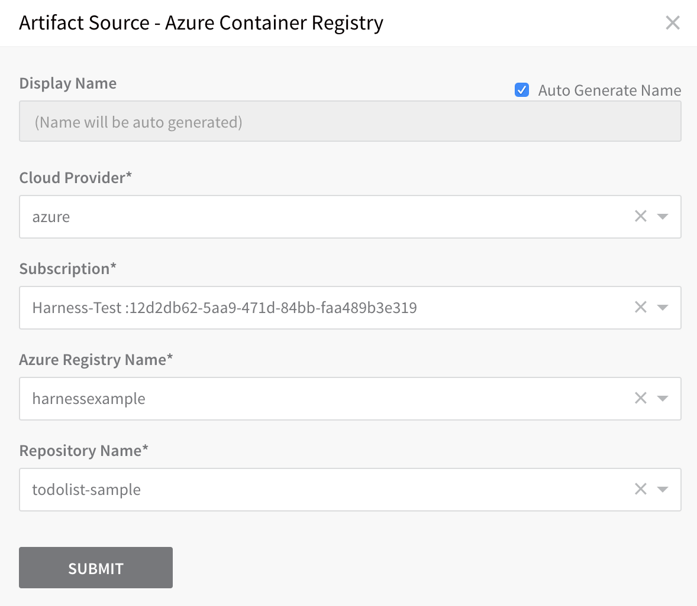
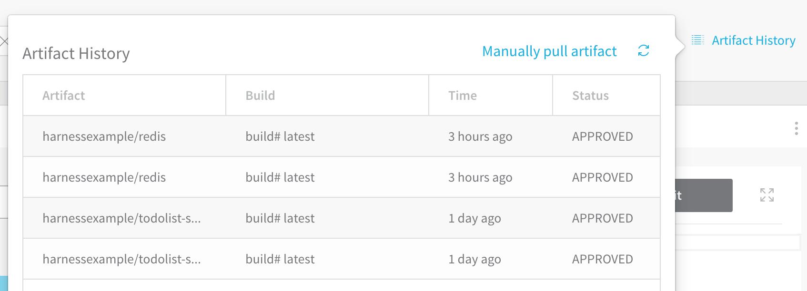
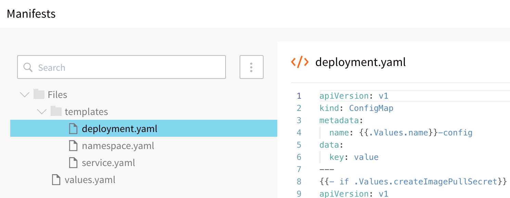

This content is for Harness [FirstGen](../../../../getting-started/harness-first-gen-vs-harness-next-gen.md). Switch to [NextGen](https://docs.harness.io/article/m7nkbph0ac).This topic describes how to set up the Harness Kubernetes Service and Artifact Source for an Azure deployment:

* [Application Setup](2-service-and-artifact-source.md#application-setup)
* [Harness Service Setup](2-service-and-artifact-source.md#harness-service-setup)
* [Next Step](2-service-and-artifact-source.md#next-step)

### Application Setup

The following procedure creates a Harness Application for a AKS Kubernetes deployment using an ACR repository.

An Application in Harness represents a logical group of one or more entities, including Services, Environments, Workflows, Pipelines, Triggers, and Infrastructure Provisioners. Applications organize all of the entities and configurations in Harness CI/CD. For more information, see [Application Components](https://docs.harness.io/article/bucothemly-application-configuration).

To create the Harness Application, do the following:

1. In **Harness**, click **Setup**.
2. Click **Add Application**. The **Application** dialog appears.
3. Give your Application a name that describes your microservice or app. For the purposes of this guide, we use the name **ACR-to-AKS**.
4. Click **SUBMIT**. The new Application is added.
5. Click the Application name to open the Application. The Application entities are displayed.


### Harness Service Setup

There are different types of Harness Services for different deployment platforms. The Kubernetes type includes Kubernetes-specific settings.

To add the Kubernetes Service, do the following:

1. In your new Application, click **Services**. The **Services** page appears.
2. In the **Services** page, click **Add Service**. The **Service** dialog appears.
3. In **Name**, enter a name for your Service, such as **Todolist-ACR**.
4. In **Description**, enter a description for your service.
5. In **Deployment Type**, select **Kubernetes**.
6. Click the **Enable Kubernetes V2** checkbox. This setting configures the Service with the latest Harness Kubernetes Service settings.
7. Click **SUBMIT**. The new Service is displayed.

Next, we will walk through how to set up the Kubernetes manifest file and use the Service features.

#### Add ACR Artifact Source

An Artifact Source in a Service is the microservice or application artifact you want to deploy.

For this Azure deployment, the Artifact Source uses the Azure Cloud Provider you set up for your Harness account to connect to ACR (as described in [Azure Cloud Provider](1-harness-account-setup.md#azure-cloud-provider)), and selects a Todo List sample app Docker image as the artifact.

To add an Artifact Source to this Service, do the following:

1. In the Service, click **Add Artifact Source**, and select **Azure Container Registry**. The **Artifact Source** dialog appears.
2. Configure the following fields and click **SUBMIT**.
* **Cloud Provider** - Select the Azure Cloud Provider we set up earlier.
* **Subscription** - Select the Subscription set up in your ACR container registry. To locate the Subscription in ACR, click **Overview**, and see **Subscription**.
* **Azure Registry Name** - Select the registry you want to use.
* **Repository Name** - Select the repository containing the Docker image you want to use.

When you are finished, the Artifact Source dialog will look something like this:



You can add multiple Artifact Sources to a Service and view the build history for each one by clicking **Artifact History**.



#### Add Manifests

The **Manifests** section of Service contains the configuration files that describe the desired state of your application in terms of Kubernetes object descriptions.



##### What Can I Add in Manifests?

You can add any Kubernetes configuration files, formatted in YAML, such as object descriptions, in one or more files.

As you can see, you can use Go templating and Harness built-in variables in combination in your Manifest files. For information about the features of **Manifests**, see [Define Kubernetes Manifests](../../kubernetes-deployments/define-kubernetes-manifests.md).

For this guide, we will use the default manifests, with one important change for ACR: we will edit the Kubernetes **imagePullSecret** setting.

##### Pull an Image from a Private ACR Registry

To pull the image from the private ACR registry, Harness accesses that registry using the credentials set up in the Harness [Artifact Server](https://docs.harness.io/article/7dghbx1dbl-configuring-artifact-server), but your AKS cluster might not have the needed permissions. To solve this problem, the default values.yaml file contains `dockercfg: ${artifact.source.dockerconfig}`.

1. n your Harness Kubernetes Service, in **Manifests**, click **values.yaml**.
2. Verify that `dockercfg` key exists, and uses the `${artifact.source.dockerconfig}` expression to obtain the credentials:


```
dockercfg: ${artifact.source.dockerconfig}
```
1. Click the **deployment.yaml** file.
2. Verify that the Secret object is inside an `if` argument using `dockercfg` and the `{{.Values.dockercfg}}` value:


```
{{- if .Values.dockercfg}}  
apiVersion: v1  
kind: Secret  
metadata:  
  name: {{.Values.name}}-dockercfg  
  annotations:  
    harness.io/skip-versioning: "true"  
data:  
  .dockercfg: {{.Values.dockercfg}}  
type: kubernetes.io/dockercfg  
---  
{{- end}}
```
With these requirements met, the cluster import the credentials from the Docker credentials file in the artifact.

That's it. In your AKS cluster at deployment runtime, Kubernetes will use the dockercfg credentials to obtain the Docker image from ACR.

When you create an AKS cluster, Azure also creates a service principal to support cluster operability with other Azure resources. You can use this auto-generated service principal for authentication with an ACR registry. If you can use this method, then only the Kubernetes Cloud Provider is needed and the `createImagePullSecret` setting can be left as `false`. In this guide, we create separate connections for AKS and ACR because, in some instances, you might not be able to assign the required role to the auto-generated AKS service principal granting it access to ACR. For more information, see [Authenticate with Azure Container Registry from Azure Kubernetes Service](https://docs.microsoft.com/en-us/azure/container-registry/container-registry-auth-aks) from Azure.Now we can set up the deployment Environment to tell Harness where to deploy the Docker image.

##### Notes

* When you are using a public repo, the `dockercfg: ${artifact.source.dockerconfig}` in values.yaml is ignored by Harness. You do not need to remove it.
* If you want to use a private repo and no imagePullSecret, then set `dockercfg` to empty in values.yaml.
* **Legacy imagePullSecret Method** — Previously, Harness used a `createImagePullSecret` value in values.yaml that could be set to `true` or `false`, and `dockercfg: ${artifact.source.dockerconfig}` to obtain the credentials. If `createImagePullSecret` was set to `true`, the following default Secret object in deployment.yaml would be used:


```
{{- if .Values.createImagePullSecret}}  
apiVersion: v1  
kind: Secret  
metadata:  
  name: {{.Values.name}}-dockercfg  
  annotations:  
    harness.io/skip-versioning: "true"  
data:  
  .dockercfg: {{.Values.dockercfg}}  
type: kubernetes.io/dockercfg  
---  
{{- end}}
```
This legacy method is still supported for existing Services that use it, but the current method of using the default values.yaml and deployment.yaml files is recommended.

#### Namespace Variable

Before we set up the deployment Environment, let's look at one more interesting setting, click **values.yaml** and locate the `namespace` setting:


```
namespace: ${infra.kubernetes.namespace}
```
Next, click the **namespace.yaml** file to see the variable referenced in values.yaml:


```
{{- if .Values.createNamespace}}  
apiVersion: v1  
kind: Namespace  
metadata:  
  name: {{.Values.namespace}}  
{{- end}}
```
The `${infra.kubernetes.namespace}` variable is a Harness built-in variable and it references the Kubernetes cluster namespace value enter in the Harness Environment, which you will create later.

The `${infra.kubernetes.namespace}` variable let's you enter any value in the Environment **Namespace** setting and, at runtime, the Kubernetes Namespace manifest uses that name to create a namespace.

#### Config Variables and Files

For the purpose of this guide, we don't use many of the other Service settings you can use. For information on the Config Variables and Files settings, see [Configuration Variables and Files](https://docs.harness.io/article/eb3kfl8uls-service-configuration#configuration_variables_and_files).

### Next Step

* [3 - Azure Environment](3-azure-environment.md)

