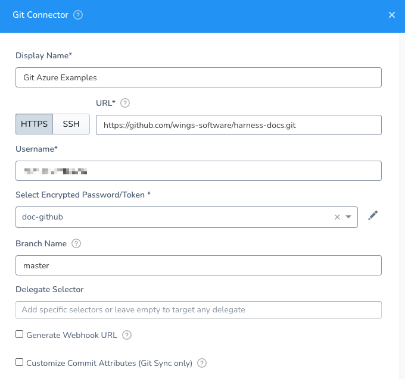

This topic describes how to add your Azure ARM templates to Harness using Harness Infrastructure Provisioners. This involves providing the Git repo location of the ARM template and setting its scope in Harness.

Once you've added the template as an Infrastructure Provisioner, you can do the following:

* **Target the Azure infrastructure:** use the Infrastructure Provisioner in a Harness Infrastructure Definition. Next, you add this Infrastructure Definition to a Workflow to define the ARM template's resources as the target infrastructure for the deployment. See [Target an Azure ARM Provisioned Infrastructure](target-azure-arm-or-blueprint-provisioned-infrastructure.md).
* **Provision the Azure infrastructure:** use the Infrastructure Provisioner in a Harness Workflow to provision the Azure resources. This will run your ARM template and create its Azure resources. These resources could be the target infrastructure for a deployment from the Infrastructure Definition or simply other Azure resources. See [Provision using a Harness ARM Infrastructure Provisioner](provision-using-the-arm-blueprint-create-resource-step.md).

In this topic:

* [Before You Begin](#before_you_begin)
* [Visual Summary](#visual_summary)
* [Supported Platforms and Technologies](#undefined)
* [Step 1: Add Harness Delegate](#step_1_add_harness_delegate)
* [Step 2: Add Source Source Provider](#step_2_add_source_source_provider)
* [Step 3: Add the Infrastructure Provisioner](#step_3_add_the_infrastructure_provisioner)
* [Configure As Code](#configure_as_code)

### Before You Begin

* Get an overview of provisioning with ARM in [Azure ARM and Blueprint Provisioning with Harness](../../concepts-cd/deployment-types/azure-arm-and-blueprint-provision-with-harness.md).
* [Set Up Your Harness Account for Azure ARM](set-up-your-harness-account-for-azure-arm.md)
* [Infrastructure Provisioners Overview](../../model-cd-pipeline/infrastructure-provisioner/add-an-infra-provisioner.md)

### Visual Summary

The following video shows you how to add an ARM template from [Azure's ARM templates GitHub account](https://github.com/Azure/azure-quickstart-templates) to Harness as a Harness Infrastructure Provisioner.

### Supported Platforms and Technologies

See [Supported Platforms and Technologies](https://docs.harness.io/article/220d0ojx5y-supported-platforms).

### Step 1: Add Harness Delegate

Make sure you have set up a Harness Delegate as described in [Set Up Your Harness Account for Azure ARM](set-up-your-harness-account-for-azure-arm.md).

The Delegate must be able to connect to your Git provider to add the ARM template, and to pull it at deployment runtime.

### Step 2: Add Source Source Provider

Harness Source Repo Providers connect your Harness account with your Git platform accounts.

For Azure ARM templates, you add a Harness Source Repo Provider and connect it to the Git repo for your ARM templates.

For steps on setting up a Source Repo Provider, see [Add Source Repo Providers](https://docs.harness.io/article/ay9hlwbgwa-add-source-repo-providers).

For example, here an Azure ARM template created my Azure and hosted on Harness' Docs repo at `https://github.com/wings-software/harness-docs/101-vm-simple-windows/azuredeploy.json`.

Here is a Harness Source Repo Provider that uses the URL of the repo and the master branch:

Next, you use this Source Repo Provider as the source of your Harness Infrastructure Provisioner.

### Step 3: Add the Infrastructure Provisioner

In your Harness Application, click **Infrastructure Provisioners**.

Click **Add Infrastructure Provisioner**, and then click **ARM Template**.

In **Azure Resource Type**, click **ARM**.

Enter a name and description.

In **Scope**, enter the scope for the template. The schema link in the template identifies the template scope:

* Resource group: `"$schema": "https://schema.management.azure.com/schemas/2019-04-01/deploymentTemplate.json#"`
* Subscription: `"$schema": "https://schema.management.azure.com/schemas/2018-05-01/subscriptionDeploymentTemplate.json#"`
* Management group: `"$schema": "https://schema.management.azure.com/schemas/2019-08-01/managementGroupDeploymentTemplate.json#"`
* Tenant: `"$schema": "https://schema.management.azure.com/schemas/2019-08-01/tenantDeploymentTemplate.json#"`

In **Source Type**, select **Git Repository** or **Template Body**.

If you select **Template Body**, paste the template in **Template Body**, and click **Submit**.

If you are using templates from a third-party, ensure that the templates are formatted correctly.If you select **Git Repository**, select the Harness Source Repo Provider you set up to connect Harness to your Git repo.

In **Commit**, enter the branch or commit ID for the repo.

Enter the branch name or commit ID.

In **File Path**, enter path to the template JSON file in the Git repo. You don't need to enter the repo name, as that is set up in the Harness Source Repo Provider.

Let's look at an example:

* I have a Harness Source Repo Provider for the repo `https://github.com/wings-software/harness-docs`.
* My template is located at `https://github.com/wings-software/harness-docs/blob/main/101-vm-simple-windows/azuredeploy.json`.
* In **File Path**, I enter `101-vm-simple-windows/azuredeploy.json`.

Click **Submit**.

The Infrastructure Provisioner is added.

Now you can use the Infrastructure Provisioner, you can:

* **Target the Azure infrastructure:** use the Infrastructure Provisioner in a Harness Infrastructure Definition. Next, you add this Infrastructure Definition to a Workflow to define the ARM template's resources as the target infrastructure for the deployment. See [Target an Azure ARM Provisioned Infrastructure](target-azure-arm-or-blueprint-provisioned-infrastructure.md).
* **Provision the Azure infrastructure:** use the Infrastructure Provisioner in a Harness Workflow to provision the Azure resources. This will run your ARM template and create its Azure resources. These resources could be the target infrastructure for a deployment or simply other Azure resources. See [Provision using a Harness ARM Infrastructure Provisioner](provision-using-the-arm-blueprint-create-resource-step.md).

### Configure As Code

To see how to configure the settings in this topic using YAML, configure the settings in the UI first, and then click the YAML editor button.

