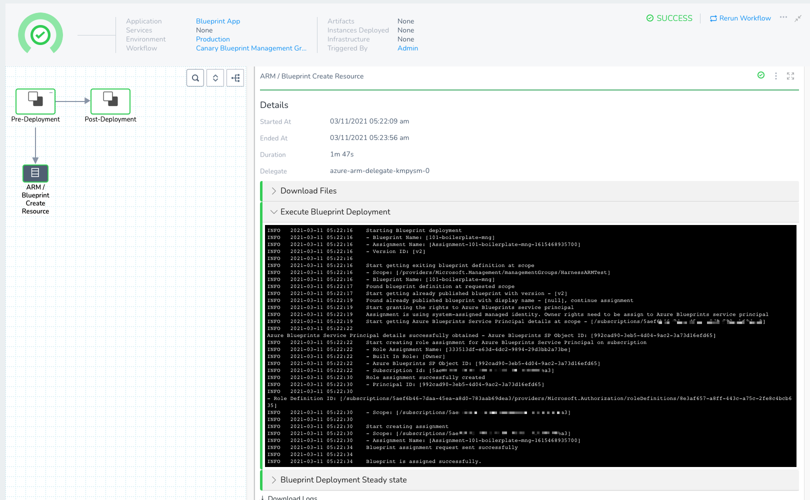

You can provision Azure resources using Blueprint definitions in your Harness Workflows. Harness can provision the resources by themselves or as part of a Workflow performing other deployment steps.

Harness takes a Blueprint definition [you set up as a Harness Infrastructure Provisioner](add-azure-blueprints-to-harness.md), publishes it using the version specified in assign.json file and creates the assignment.

In this topic:

* [Before You Begin](provision-using-azure-blueprint-definitions.md#before-you-begin)
* [Visual Summary](provision-using-azure-blueprint-definitions.md#visual-summary)
* [Limitations](provision-using-azure-blueprint-definitions.md#limitations)
* [Step 1: Add the Infrastructure Provisioner](provision-using-azure-blueprint-definitions.md#step-1-add-the-infrastructure-provisioner)
* [Step 2: Add ARM/Blueprint Create Resource Step to Workflow](provision-using-azure-blueprint-definitions.md#step-2-add-arm-blueprint-create-resource-step-to-workflow)
* [Step 3: Deploy the Workflow](provision-using-azure-blueprint-definitions.md#step-3-deploy-the-workflow)
* [Configure As Code](provision-using-azure-blueprint-definitions.md#configure-as-code)

### Before You Begin

* [Set Up Your Harness Account for Azure Blueprint](set-up-harness-for-azure-blueprint.md)
* [Add Azure Blueprints to Harness](add-azure-blueprints-to-harness.md)
* For a conceptual overview of provisioning with ARM and Blueprints, see [Azure ARM and Blueprint Provisioning with Harness](../../concepts-cd/deployment-types/azure-arm-and-blueprint-provision-with-harness.md).

### Visual Summary

Here's a short video showing how to provision Azure infrastructure using Blueprint definitions and Harness:

You can use Azure Blueprint definitions in Harness to provision any resources.

1. **ARM Infrastructure Provisioner**: add your Azure Blueprint definition as a Harness Infrastructure Provisioner.
2. **Workflow Provisioner Step**: create a Canary Workflow or Multi-Service Workflow and add an **ARM/Blueprint Create Resource** step in its **Pre-deployment Steps** to provision the resources you need. You can use the Workflow to deploy anything else, or just omit any further phases and steps.
3. **Deploy:** the Workflow will provision the resource according to your Blueprint definitions.

When you run the Workflow, it can provision the resources without deploying anything else.

### Limitations

* See [Azure Resource Management (ARM) How-tos](../azure-arm/azure-arm-and-blueprint-how-tos.md).
* Unlike other provisioners supported by Harness, Azure Blueprint definitions cannot be added to Infrastructure Definitions. Blueprint definitions cannot be used as deployment targets in Harness Workflows. You can simply use them in a Workflow to provision resources.  
You can use ARM templates to provision deployment target environments. See [Provision and Deploy to ARM Provisioned Infrastructure](../azure-arm/target-azure-arm-or-blueprint-provisioned-infrastructure.md).

### Step 1: Add the Infrastructure Provisioner

A Harness Infrastructure Provisioner connects Harness to the Git repo where your Blueprint definition is located.

To set up a Harness Infrastructure Provisioner for a Blueprint, follow the steps in [Add Azure Blueprints to Harness](add-azure-blueprints-to-harness.md).

### Step 2: Add ARM/Blueprint Create Resource Step to Workflow

Canary, Multi-Service, and Blue/Green Workflow types contain a pre-deployment section where you can provision infrastructure using your Harness Infrastructure Provisioner.

Let's look at a Canary Workflow.

In a Canary Workflow, in **Pre-deployment Steps**, click **Add Step**.

Click **ARM/Blueprint Create Resource** and then click **Next**.

In **Overview**, in **Provisioner**, select the Infrastructure Provisioner for your Blueprint.

In **Azure Cloud Provider**, enter the Cloud Provider for Harness to use when connecting to Azure and provisioning with the Blueprint.

The Azure service account used with the Cloud Provider must have the Azure permissions needed to provision the resources in your Blueprint. See **Azure Blueprint** in [Add Microsoft Azure Cloud Provider](https://docs.harness.io/article/4n3595l6in-add-microsoft-azure-cloud-provider).In **Timeout**, enter at least 20m. Provisioning Azure resources can take time.

Click **Submit**.

### Step 3: Deploy the Workflow

Here's an example of a Canary Workflow deployment that uses the ARM/Blueprint Create Resource step:

In the **ARM/Blueprint Create Resource** step's **Execute Blueprint Deployment** section, you can see the Blueprint assignment created:


```
Starting Blueprint deployment   
- Blueprint Name: [101-boilerplate-mng]   
- Assignment Name: [Assignment-101-boilerplate-mng-1615468935700]   
- Version ID: [v2]  
  
Start getting exiting blueprint definition at scope   
- Scope: [/providers/Microsoft.Management/managementGroups/HarnessARMTest]   
- Blueprint Name: [101-boilerplate-mng]  
Found blueprint definition at requested scope  
Start getting already published blueprint with version - [v2]  
Found already published blueprint with display name - [null], continue assignment  
Start granting the rights to Azure Blueprints service principal  
Assignment is using system-assigned managed identity. Owner rights need to be assign to Azure Blueprints service principal  
Start getting Azure Blueprints Service Principal details at scope - [/subscriptions/0000000-0000-0000-0000-0000000000]  
Azure Blueprints Service Principal details successfully obtained - Azure Blueprints SP Object ID: [992cad90-3eb5-4d04-9ac2-3a73d16efd65]  
Start creating role assignment for Azure Blueprints Service Principal on subscription  
- Role Assignment Name: [333513df-e63d-4dc2-9894-29d3bb2a73be]   
- Built In Role: [Owner]   
- Azure Blueprints SP Object ID: [992cad90-3eb5-4d04-9ac2-3a73d16efd65]   
- Subscription Id: [0000000-0000-0000-0000-0000000000]  
Role assignment successfully created   
- Principal ID: [992cad90-3eb5-4d04-9ac2-3a73d16efd65]   
- Role Definition ID: [/subscriptions/0000000-0000-0000-0000-0000000000/providers/Microsoft.Authorization/roleDefinitions/8e3af657-a8ff-443c-a75c-2fe8c4bcb635]   
- Scope: [/subscriptions/0000000-0000-0000-0000-0000000000]  
  
Start creating assignment   
- Scope: [/subscriptions/0000000-0000-0000-0000-0000000000]   
- Assignment Name: [Assignment-101-boilerplate-mng-1615468935700]  
Blueprint assignment request sent successfully  
  
Blueprint is assigned successfully.
```
In the **Blueprint Deployment Steady state** section you can see the deployment reach steady state:


```
Deployment Status for - [Assignment-101-boilerplate-mng-1615468935700] is [creating]  
Deployment Status for - [Assignment-101-boilerplate-mng-1615468935700] is [creating]  
Deployment Status for - [Assignment-101-boilerplate-mng-1615468935700] is [waiting]  
Deployment Status for - [Assignment-101-boilerplate-mng-1615468935700] is [waiting]  
Deployment Status for - [Assignment-101-boilerplate-mng-1615468935700] is [waiting]  
Deployment Status for - [Assignment-101-boilerplate-mng-1615468935700] is [deploying]  
Deployment Status for - [Assignment-101-boilerplate-mng-1615468935700] is [succeeded]  
  
Deployment Jobs:  
  
- Job Id: [DeploymentJob:b71b6336:2D49f4:2D42e9:2Db4ae:2Db2a25dc6e991]  
- Job Kind: [system]  
- Job State: [succeeded]  
- Job Created Resource IDs: [/subscriptions/0000000-0000-0000-0000-0000000000/providers/Microsoft.Authorization/roleAssignments/3ce1a35a-9c05-4ad2-c74a-a076e4fbd79a]  
- Job Result Error: []  
  
- Job Id: [DeploymentJob:32907ca6:2D7416:2D454e:2Db6ea:2Dd42c1c68290b]  
- Job Kind: [azureResource]  
- Job State: [succeeded]  
- Job Created Resource IDs: [/subscriptions/0000000-0000-0000-0000-0000000000/providers/Microsoft.Authorization/roleAssignments/9a0111c8-f675-0c97-6805-4b43332bd0ae]  
- Job Result Error: []  
  
- Job Id: [DeploymentJob:ea8b2d3e:2Df7ce:2D4960:2D913f:2D67015c335de9]  
- Job Kind: [azureResource]  
- Job State: [succeeded]  
- Job Created Resource IDs: [/subscriptions/0000000-0000-0000-0000-0000000000/resourceGroups/mng-001]  
- Job Result Error: []  
  
- Job Id: [DeploymentJob:e0827aea:2Df93f:2D4763:2D90a2:2D0ff88e8329cd]  
- Job Kind: [azureResource]  
- Job State: [succeeded]  
- Job Created Resource IDs: [/subscriptions/0000000-0000-0000-0000-0000000000/resourcegroups/mng-001/providers/Microsoft.Authorization/policyAssignments/cc9921013c83e1da9876c1d0ca898a33a4ef0a94fba55a900e6ee41da3373387]  
- Job Result Error: []  
  
- Job Id: [DeploymentJob:4bfd4524:2Dc4c4:2D45cb:2D9d28:2D37e0b6552ecf]  
- Job Kind: [azureResource]  
- Job State: [succeeded]  
- Job Created Resource IDs: []  
- Job Result Error: []  
  
- Job Id: [DeploymentJob:3b954a5f:2D2bb6:2D40ee:2D9939:2D4b1bf8f4b1b1]  
- Job Kind: [system]  
- Job State: [succeeded]  
- Job Created Resource IDs: []  
- Job Result Error: []  
  
Blueprint Deployment - [Assignment-101-boilerplate-mng-1615468935700] completed successfully
```
Now you've provisioned the Azure infrastructure and deployed to it using a single Workflow.

### Configure As Code

To see how to configure the settings in this topic using YAML, configure the settings in the UI first, and then click the YAML editor button.

