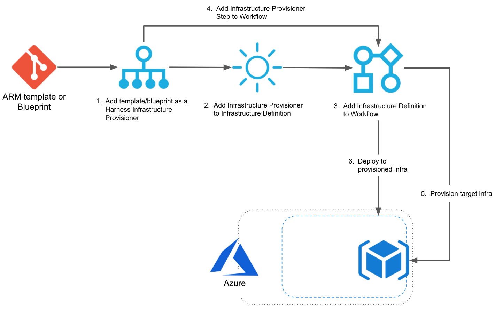

Harness has first-class support for [Azure Resource Manager (ARM) templates](https://docs.microsoft.com/en-us/azure/azure-resource-manager/templates/overview) and Azure [Blueprints](https://docs.microsoft.com/en-us/azure/governance/blueprints/overview) as infrastructure provisioners.

You can use ARM templates to provision the deployment target environment in Azure, or to simply provision any Azure infrastructure.

You can use Blueprints to provision Azure resources that adhere to your organization's standards, patterns, and requirements. You can package ARM templates, resource groups, policy and role assignments, and much more into a Blueprint. See [this video](https://www.youtube.com/watch?v=cQ9D-d6KkMY) from Microsoft Developer for more details.

This topic provides a high-level summary of how to use Harness to provision a target environment using ARM, or to simply provision resources using ARM or Blueprint.

Looking for How-tos? See [Azure Resource Management (ARM) How-tos](../../azure-deployments/azure-arm/azure-arm-and-blueprint-how-tos.md).

### Provision and Deploy to the Same Infrastructure using ARM

Here's a short video showing how to provision and deploy to the same Azure infrastructure using ARM and Harness:

<!-- Video:
https://harness-1.wistia.com/medias/rpv5vwzpxz-->
<docvideo src="https://www.youtube.com/embed/WfPE9wk4tM0?feature=oembed" />

Here's a visual summary of how you use your Azure ARM templates in Harness to provision infra and then deploy to it:

1. **ARM Infrastructure Provisioner**: add your Azure ARM template as a Harness Infrastructure Provisioner. You add it by connecting to the Git repo for the ARM template. You also set the scope (Resource group, Tenant, etc). You can also enter the ARM template inline without connecting to a Git repo.
2. **​Infrastructure Definition**: define a Harness Infrastructure Definition using the Infrastructure Provisioner. This setup identifies the ARM template's resources as a deployment target.
3. **Workflow Setup:** when you create your Workflow, you select the Infrastructure Definition you created, identifying it as the target infrastructure for the Workflow deployment.
4. **Workflow Provisioner Step:** in the Workflow pre-deployment section, you add a **ARM/Blueprint Create Resource** step that uses the ARM Infrastructure Provisioner you set up. The Workflow will build the infrastructure according to your ARM template.
5. **Pre-deployment**: the pre-deployment steps are executed and provision the infrastructure using the **ARM/Blueprint Create Resource** step.
6. **Deployment:** the Workflow deploys to the provisioned infrastructure defined as its target Infrastructure Definition.

### General Provisioning using ARM and Blueprint

Here's a short video showing how to provision Azure infrastructure using ARM and Harness:

<!-- Video:
https://harness-1.wistia.com/medias/rpv5vwzpxz-->
<docvideo src="https://www.youtube.com/embed/_thro1sA6ek?feature=oembed" />

Here's a short video showing how to provision Azure infrastructure using Blueprint and Harness:

<!-- Video:
https://harness-1.wistia.com/medias/rpv5vwzpxz-->
<docvideo src="https://www.youtube.com/embed/cGjZCoz3HrY?feature=oembed" />

You can use Azure ARM templates/Blueprint definitions in Harness for general Azure provisioning.

1. **ARM/Blueprint Infrastructure Provisioner**: add your Azure ARM template or Blueprint definition as a Harness Infrastructure Provisioner.
2. **Workflow Provisioner Step**: create a Workflow and add an **ARM/Blueprint Create Resource** step in its pre-deployment section that uses the Infrastructure Provisioner. You can use the rest of the Workflow to deploy services, or just omit any further phases and steps.
3. **Deploy:** the Workflow will build the Azure resources according to your ARM template/Blueprint definition.

### Limitations

For ARM, see [Azure Resource Management (ARM) How-tos](../../azure-deployments/azure-arm/azure-arm-and-blueprint-how-tos.md).

### Azure Roles Required

See **Azure Resource Management (ARM)** in [Add Microsoft Azure Cloud Provider](https://docs.harness.io/article/4n3595l6in-add-microsoft-azure-cloud-provider).

See **Azure Blueprint** in [Add Microsoft Azure Cloud Provider](https://docs.harness.io/article/4n3595l6in-add-microsoft-azure-cloud-provider).

### Permissions Summary

You need to give Harness permissions in your Azure subscription so Harness can provision using ARM/Blueprint. These are the same permissions you'd need to grant Harness for existing static infrastructures.

As a summary, you'll need to manage the following permissions:

* **Delegate** - The Harness Delegate will require permissions to create resources in Azure. It'll use the credentials you provide in the Harness Azure Cloud Provider.
* **Azure** **Cloud Provider** - The Harness Azure Cloud Provider must have permissions for the resources you are planning to provision using ARM/Blueprint.  
See [Add Microsoft Azure Cloud Provider](https://docs.harness.io/article/4n3595l6in-add-microsoft-azure-cloud-provider).
* **Git Repo** - You'll add the Git repo where the ARM templates or Blueprints are located to Harness as a Source Repo Provider. For more information, see  [Add Source Repo Providers](https://docs.harness.io/article/ay9hlwbgwa-add-source-repo-providers).

#### Harness User Group Permissions Required

To set up a Harness ARM/Blueprint Provisioner, your Harness User account must belong to a User Group with the following Application Permissions:

* **Permission Type:** `Provisioners`.
* **Application:** one or more Applications.
* **Filter:** `All Provisioners`.
* **Action:** `Create, Read, Update, Delete`.

### No Artifact Required

You don't need to deploy artifacts via Harness Services to use Azure ARM/Blueprint provisioning in a Workflow.

You can simply set up an Azure ARM/Blueprint Provisioner and use it in a Workflow to provision infrastructure without deploying any artifact.

### Service Instances (SIs) Consumption

Harness Service Instances (SIs) aren't consumed and no other licensing is required when a Harness Workflow uses Azure ARM/Blueprint to provision resources.

When Harness deploys artifacts via Harness Services to the provisioned infrastructure in the same Workflow or Pipeline, SIs licensing is consumed.

### Next Steps

* [Azure ARM and Blueprint How-tos](../../azure-deployments/azure-arm/azure-arm-and-blueprint-how-tos.md)

