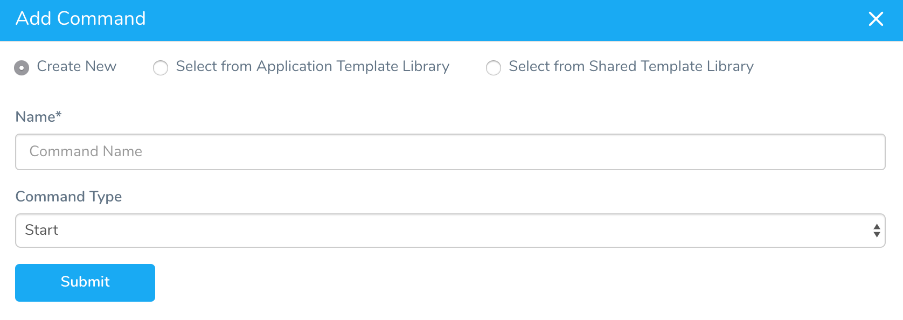

This content is for Harness [FirstGen](../../../../getting-started/harness-first-gen-vs-harness-next-gen.md). Switch to [NextGen](https://docs.harness.io/article/1re7pz9bj8).Harness includes an account-wide Template Library, called the Shared Template Library, and an Application-wide Template Library.

Only members of a Harness User Group with the **Manage Template Library** permission may create, edit, and delete Account and Application-level templates. Members of a User Group with this permission disabled can view and link to templates only.In this topic:

* [Before You Begin](https://docs.harness.io/article/dv7ajeroou-account-and-application-templates#undefined)
* [Shared Template Library and Application Template Library](https://docs.harness.io/article/dv7ajeroou-account-and-application-templates#shared_template_library_and_application_template_library)
* [Template YAML](https://docs.harness.io/article/dv7ajeroou-account-and-application-templates#template_yaml)
* [Next Steps](https://docs.harness.io/article/dv7ajeroou-account-and-application-templates#next_steps)

### Before You Begin

* [Add a Service](https://docs.harness.io/article/eb3kfl8uls-service-configuration)
* [Add a Workflow](https://docs.harness.io/article/m220i1tnia-workflow-configuration)

### Shared Template Library and Application Template Library

The Shared Template Library is available from **Setup** and the Application Template Library is available in each Application.


Using templates from either source works the same way, and both options are available in Harness components, but Application templates may be used within their Application only.

For example, when you click **Add Command** in the Service, you see the option to select a template from the Application or Shared Template Library.



### Template YAML

When you look at the code for an Application containing Services or Workflows using linked templates, the YAML for the template information of the command is displayed like this:


```
- type: SHELL_SCRIPT  
      name: DocExample  
      properties:  
        sweepingOutputScope: null  
        connectionAttributes: null  
        publishAsVar: false  
        commandPath: null  
        scriptType: BASH  
        host: null  
        scriptString: echo "Hello" ${name}  
        timeoutMillis: 600000  
        sshKeyRef: null  
        executeOnDelegate: true  
        sweepingOutputName: null  
        tags: ''  
      templateUri: AccountName/DocExample:latest  
      templateVariables:  
      - name: name
```
### Next Steps

* [Create an HTTP Workflow Step Template](https://docs.harness.io/article/dv7ajeroou-account-and-application-templates)
* [Create a Shell Script Workflow Step Template](https://docs.harness.io/article/lfqn3t83hd-create-a-shell-script-workflow-step-template)
* [Create a Service Command Template](https://docs.harness.io/article/kbmz9uc7q9-create-a-service-command-template)
* [Add Service Command Templates into Command Units](https://docs.harness.io/article/mfoy0hrw8y-add-service-command-templates-into-command-units)
* [Link Templates to Services and Workflows](https://docs.harness.io/article/xd70p7rmqd-link-templates-to-services-and-workflows)

