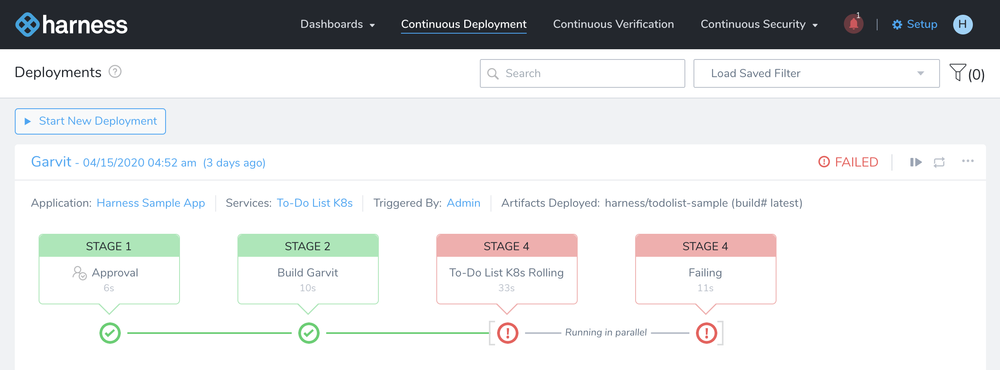
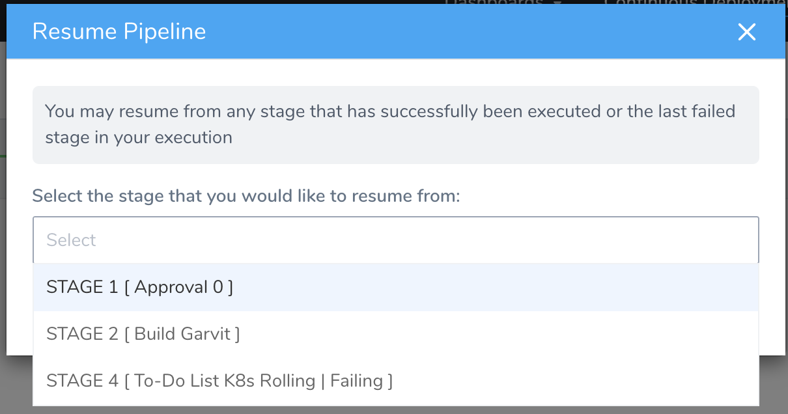

This content is for Harness [FirstGen](../../../../getting-started/harness-first-gen-vs-harness-next-gen.md). Switch to [NextGen](https://docs.harness.io).You can resume Pipeline deployment executions that meet the following criteria:

* Failed
* Aborted
* Expired
* Rejected

You cannot resume Successful or Paused executions.Pipeline deployments might not be completed for many reasons, such as changes to resource access. In these cases, rerunning an entire Pipeline can be costly and also time-consuming.

Harness provides an option to resume your Pipeline deployment from any previously executed stage.

The stages after the resumed stage are executed. Stages preceding the stage you selected are not executed again.

### Before You Begin

* [Pipelines](https://docs.harness.io/article/zc1u96u6uj-pipeline-configuration)
* [Create Pipeline Templates](https://docs.harness.io/article/60j7391eyy-templatize-pipelines)
* [Pipeline Skip Conditions](https://docs.harness.io/article/6kefu7s7ne-skip-conditions)

### Limitations

You can't modify any of the below mentioned settings:

* **You cannot change mandatory settings when you resume:** You cannot change **Start New Deployment** inputs, variables and Artifacts that are passed when you started your deployment.
* You can resume a Pipeline that failed, expired, aborted, or was rejected.
* The Pipeline and the Workflows used in the Pipeline can't be changed.
* The templatization can't be changed.
* You cannot add any new stage or change any of the existing stages.

**Aborting** and **Rollback** are different. When you abort, Harness does not clean up any deployed resources or rollback to a previous release and infrastructure.

### Review: Permissions

To resume a Pipeline, a Harness User must belong to a User Group that has the following Application Permissions:

* **Permission Type:** Deployments, **Action:** Execute Pipeline
* **Permission Type:** Deployments, **Action:** Execute Pipeline, **Application:** &lt;Application&gt;
* **Permission Type:** Deployments, **Action:** Execute Pipeline, **Environment:** &lt;Environment Type&gt;, **Application:** &lt;Application&gt;, but only to &lt;Environment Type&gt;

### Step: Resume Pipeline

1. From the **Continuous Deployment**, go to your **Deployments**.

1. Click on the failed deployment that you would want to resume and click on the **Resume Pipeline** icon.

1. In **Resume Pipeline**, select the stage from where you want to resume your Pipeline deployment and click **Resume**.

Harness will execute the stage you choose and all the subsequent stages.

#### Multiple Workflow Sets Running in Parallel

Resume capability runs at the stage level. Even if you have multiple Workflow sets running in parallel, they belong to the same stage. In that case, the resume option is run for the whole set and the full stage gets resumed.

For example, in the following image, **To-Do List K8s Rolling** and **Failing** are set up to execute in parallel. They belong to the same stage, STAGE 4. Even if one of them fails, both the stages will rerun when you resume the Pipeline deployment.

### Option: View Execution History

1. To view the execution history, go to the **Deployments** page.
2. Click on the  history button to view the execution history. It lists the detail of the previous executions.

You can click on the previously failed execution to view its detail.

**Continuous Deployment** page lists only the most recent Pipeline executions that have been resumed.