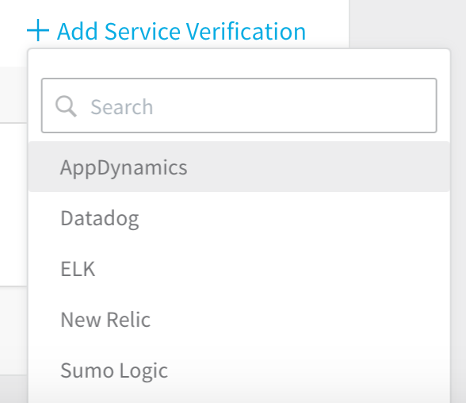
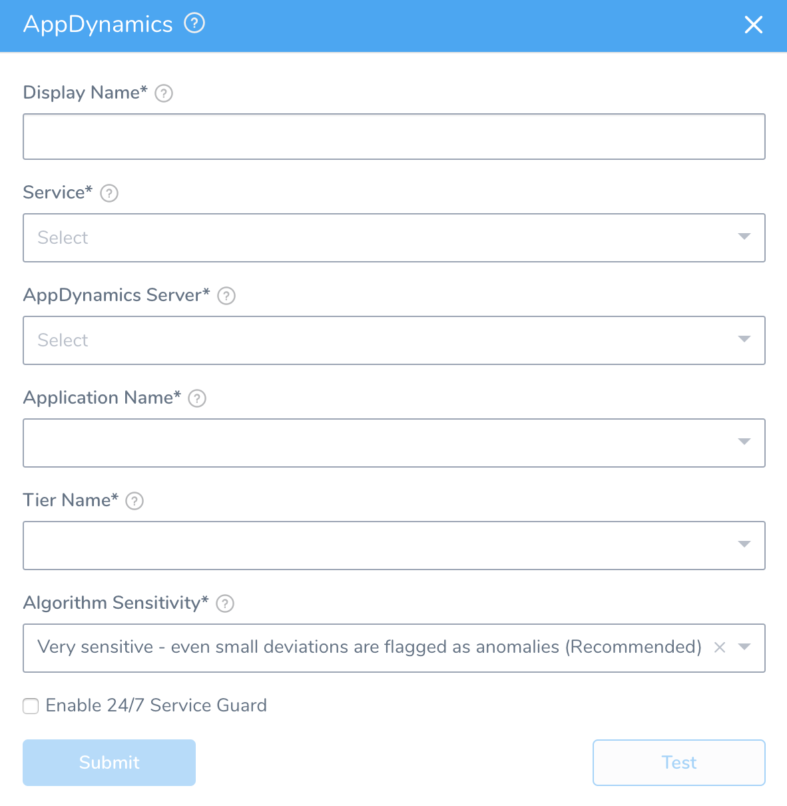
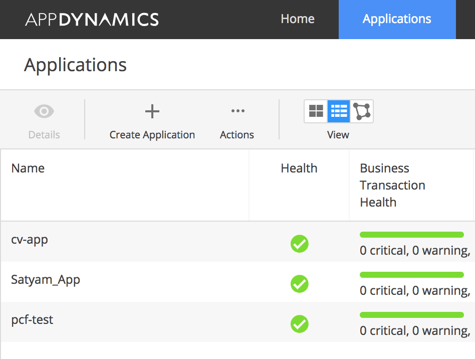
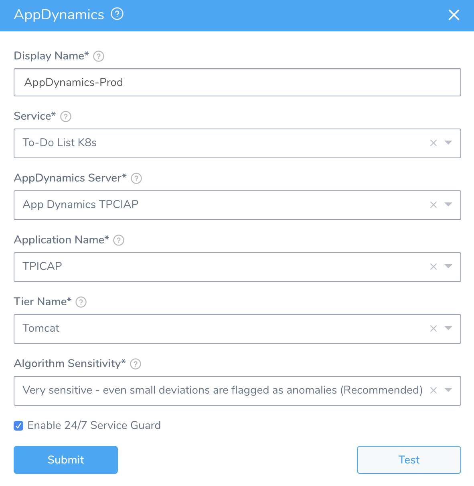

Enabling AppDynamics in Harness 24/7 Service Guard helps Harness monitor your live applications, catching problems that surface minutes or hours following deployment. 

### Before You Begin

* See the [24/7 Service Guard Overview](../continuous-verification-overview/concepts-cv/24-7-service-guard-overview.md).
* Set up a Harness Application, containing a Service and Environment. See [Create an Application](https://docs.harness.io/article/bucothemly-application-configuration).For 24/7 Service Guard, you do not need to add an Artifact Source to the Service, nor configure its settings. You simply need to create a Service and name it. It will represent your application for 24/7 Service Guard.
* Add AppDynamics monitoring to Harness 24/7 Service Guard in your Environment. See [Add AppDynamics as a Verification Provider](1-app-dynamics-connection-setup.md).

### Step 1: Add AppDynamics Verification

To set up 24/7 Service Guard for AppDynamics, do the following:

1. In your Harness Application, click **Environments**.
2. In **Environments**, ensure that you have added an Environment for the Service you added. For steps on adding an Environment, see [Environments](https://docs.harness.io/article/n39w05njjv-environment-configuration).
3. Click the Environment for your Service. Typically, the **Environment Type** is **Production**.
4. In the **Environment** page, locate **24/7 Service Guard**.
5. In **24/7 Service Guard**, click **Add Service Verification**, and then click **AppDynamics**.The **AppDynamics** dialog appears.

### Step 2: Display Name

Enter a name that will identify this service on the **Continuous Verification** dashboard. Use a name that indicates the Environment and monitoring tool, such as **AppDynamics Prod**.

### Step 3: Service

Select the Harness Service to monitor with 24/7 Service Guard.

### Step 4: AppDynamics Server

Select the [AppDynamics Verification Provider](1-app-dynamics-connection-setup.md) to use.

### Step 5: Application Name

Select the Application Name used by the monitoring tool. In **AppDynamics**, the applications are listed in the **Applications** tab.

### Step 6: Tier Name

The **Tier Name** drop-down is populated with tiers from the application you selected. Pick the tier from which you want usage metrics, code exceptions, error conditions, and exit calls. In **AppDynamics**, the tiers are displayed in the **Tiers & Nodes** page.

### Step 7: Algorithm Sensitivity

Specify the sensitivity to determine what events are identified as anomalies. See [CV Strategies, Tuning, and Best Practices](../continuous-verification-overview/concepts-cv/cv-strategies-and-best-practices.md).

### Step 8: Enable 24/7 Service Guard

Select this check box to turn on 24/7 Service Guard for AppDynamics.

If you simply want to set up 24/7 Service Guard support, but not enable it, leave this check box empty.The dialog will now look something like this:

### Step 9: Test and Save

1. Click **Test**. Harness verifies the settings you entered.
2. Click **Submit**.

AppDynamics is now configured for 24/7 Service Guard.

### Step 10: Examine Verification Results

To see the running 24/7 Service Guard analysis, click **Continuous Verification**.

The 24/7 Service Guard dashboard displays the production verification results.

For information on using this dashboard, see the [24/7 Service Guard Overview](../continuous-verification-overview/concepts-cv/24-7-service-guard-overview.md).

### Limitations

For 24/7 Service Guard, the queries you define to collect logs are specific to the Application or Service that you want monitored. (Verification is Application/Service level.) This is unlike Workflows, where verification is performed at the host/node/pod level.

### Next Step

* [Verify Deployments with AppDynamics](3-verify-deployments-with-app-dynamics.md)

