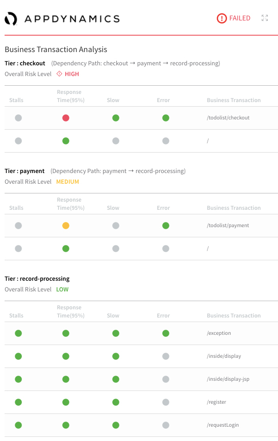

This topic introduces you to integrating AppDynamics with Harness' Continuous Verification features. Once integrated, you can use AppDynamics to monitor your deployments and production applications using Harness' semi-supervised machine-learning functionality. Sections in this topic:

* [Integration Overview](#integration_overview)
* [Setup and Verification Preview](#setup_preview)
* [Next Step](#next_step)

If you are looking for How-tos, see:

* [Add AppDynamics as a Verification Provider](../../appdynamics-verification/1-app-dynamics-connection-setup.md)
* [Monitor Applications 24/7 with AppDynamics](../../appdynamics-verification/2-24-7-service-guard-for-app-dynamics.md)
* [Verify Deployments with AppDynamics](../../appdynamics-verification/3-verify-deployments-with-app-dynamics.md)
* [Templatize AppDynamics Verification](../../appdynamics-verification/templatize-app-dynamics-verification.md)
* [Set AppDynamics Environment Variables](../../appdynamics-verification/app-dynamics-environment-variables.md)

### Integration Overview

AppDynamics enables you to monitor and manage your entire application-delivery ecosystem, from client requests straight through to your networks, backend databases, and application servers.

Harness Continuous Verification integrates with AppDynamics to verify your deployments and live production applications using the following Harness features:

* **24/7 Service Guard** - Monitors your live, production applications.
* **Deployment Verification** - Monitors your application deployments, and performs automatic rollback according to your criteria.

|  |  |
| --- | --- |
| **Microservices Environment using AppDynamics** | **Harness Verification and Impact Analysis** |
|  |  |

Harness does not support [AppDynamics Lite](https://www.appdynamics.com/lite/). If you set up AppDynamics with Harness using an AppDynamics Pro Trial account and the trial expires, you will be using AppDynamics Lite and it will not work with Harness.  
  
If you require more flexibility than the standard integration outlined here, you also have the option to [AppDynamics as a Custom APM](../../custom-metrics-and-logs-verification/connect-to-app-dynamics-as-a-custom-apm.md).
### Setup and Verification Preview

You set up AppDynamics and Harness as follows:

1. **AppDynamics** – These instructions assume that you are already using AppDynamics to monitor your application.
2. **Harness Application** – Create a Harness Application with a Service and an Environment. We do not cover Application setup in this sequence. See [Create an Application](https://docs.harness.io/article/bucothemly-application-configuration).
3. **​Verification Provider Setup** – In Harness, you connect Harness to your AppDynamics account, adding AppDynamics as a [Harness Verification Provider](../../appdynamics-verification/1-app-dynamics-connection-setup.md).  
  
A Verification Provider is a connection to monitoring tools such as AppDynamics. Once Harness is connected, you can use Harness 24/7 Service Guard and Deployment Verification with your AppDynamics data and analysis.
4. **​24/7 Service Guard Setup** – In the Environment, set up 24/7 Service Guard to monitor your live, production application.

After completing this setup, you'll be able to [verify deployments](deployment-verification-results.md) as follows:

1. Add a Workflow to your Harness Application, and deploy your microservice or application to your configured Environment.
2. After you have run a successful deployment, you then add verification steps to the Workflow using your Verification Provider.
3. Harness uses semi-supervised machine-learning and AppDynamics analytics to analyze your future deployments, discovering events that might be causing your deployments to fail. You can use this information to set rollback criteria, and to improve your deployments.

### Next Step

* [Add AppDynamics as a Verification Provider](../../appdynamics-verification/1-app-dynamics-connection-setup.md)

