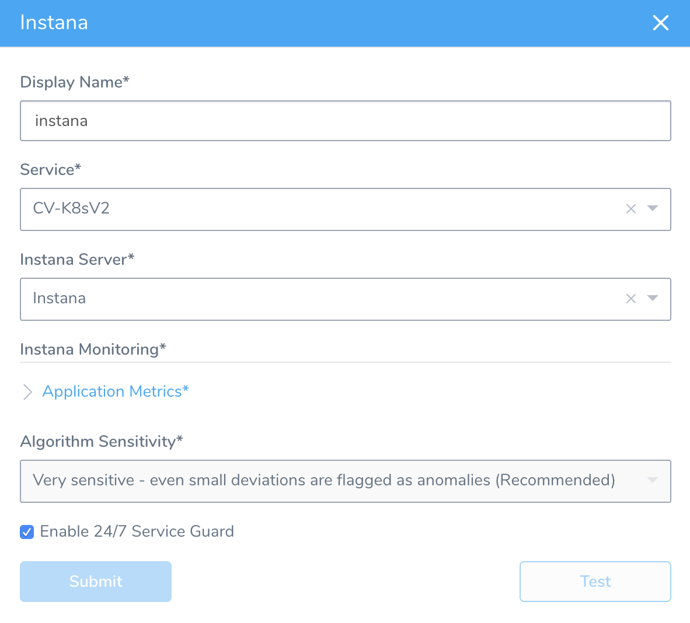
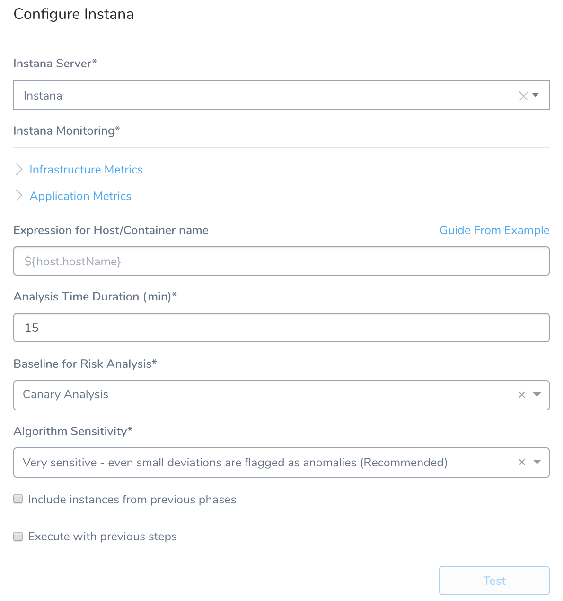
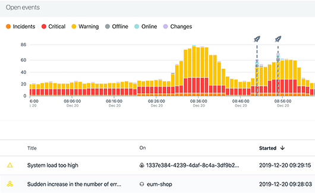
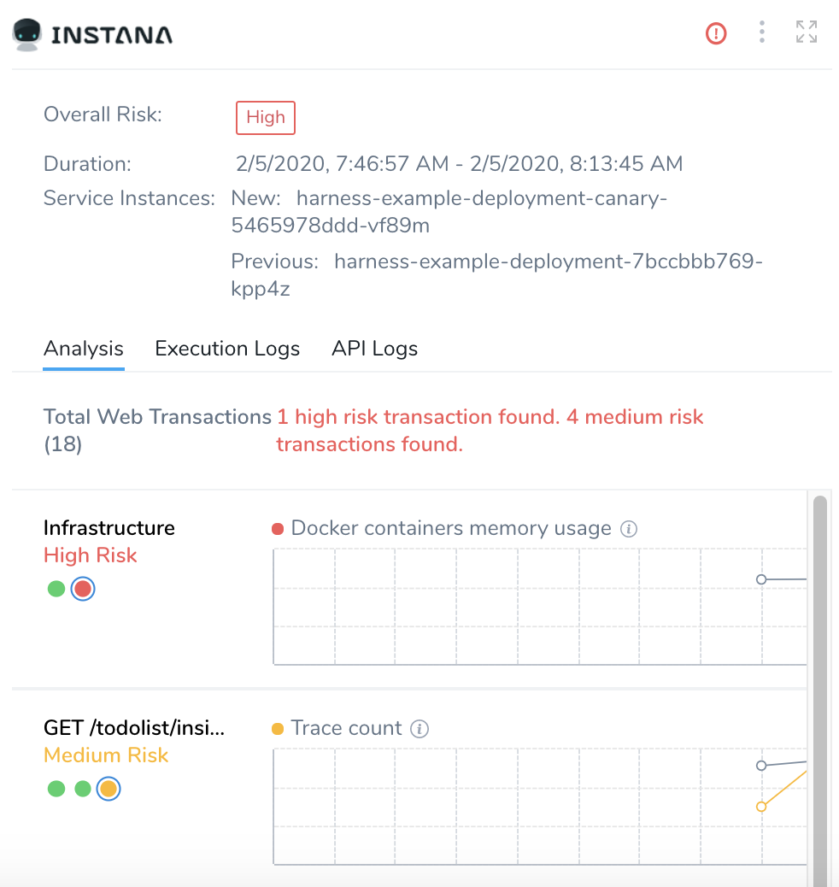

This guide describes how to set up Harness Continuous Verification features on Instana, and how to use Instana to monitor your deployments and production applications using Harness' unsupervised machine-learning functionality.

Walk through this guide in the following order:

1. [Instana Connection Setup](../../instana-verification/instana-connection-setup.md)
2. [24/7 Service Guard for Instana](../../instana-verification/instana-service-guard.md)
3. [Verify Deployments with Instana](../../instana-verification/instana-verify-deployments.md)

### Integration Overview

Instana provides continuous, full-stack performance observability of all your server and application components, collecting metrics with 1-second data granularity. Instana automatically collects logs from all your services, applications, and platforms.

Harness Continuous Verification integrates with Instana to verify your deployments and live production applications using the following Harness features:

* **24/7 Service Guard** - Monitors your live, production applications.
* **Deployment Verification** - Monitors your application deployments, and performs automatic rollback according to your criteria.  
  

|  |  |
| --- | --- |
| **Instana 24/7 Service Guard** |  **Instana Workflow Verification** |
|  |  |

This guide describes how to set up and use these Harness Continuous Verification monitoring features.

|  |  |
| --- | --- |
| **Analysis with Instana** | **Harness Analysis** |
|  |  |

### Setup Preview

You set up Instana and Harness in the following way:

1. **Instana** – Monitor your application using Instana. In this article, we assume that you are using Instana to monitor your application already.
2. **​Verification Provider Setup** – In Harness, you connect Harness to your Instana account, adding Instana as a **Harness Verification Provider**.
3. **Harness Application** – Create a Harness Application with a Service and an Environment. We do not cover Application setup in this sequence. See [Application Components](https://docs.harness.io/article/bucothemly-application-configuration).
4. **​24/7 Service Guard Setup** – In the Environment, set up 24/7 Service Guard to monitor your live, production application.
5. ​**Verify Deployments**:
	1. Add a Workflow to your Harness Application and deploy your microservice or application to the [Infrastructure Definition](https://docs.harness.io/article/n39w05njjv-environment-configuration#add_an_infrastructure_definition) in your Environment.
	2. After you have run a successful deployment, you next add verification steps to the Workflow using your Verification Provider.
	3. Harness combines semi-supervised machine-learning with Instana metrics to analyze your future deployments—discovering events that might be causing your deployments to fail. Then you can use this information to set rollback criteria and improve your deployments.

### Next Step

* [1 – Instana Connection Setup](../../instana-verification/instana-connection-setup.md)

