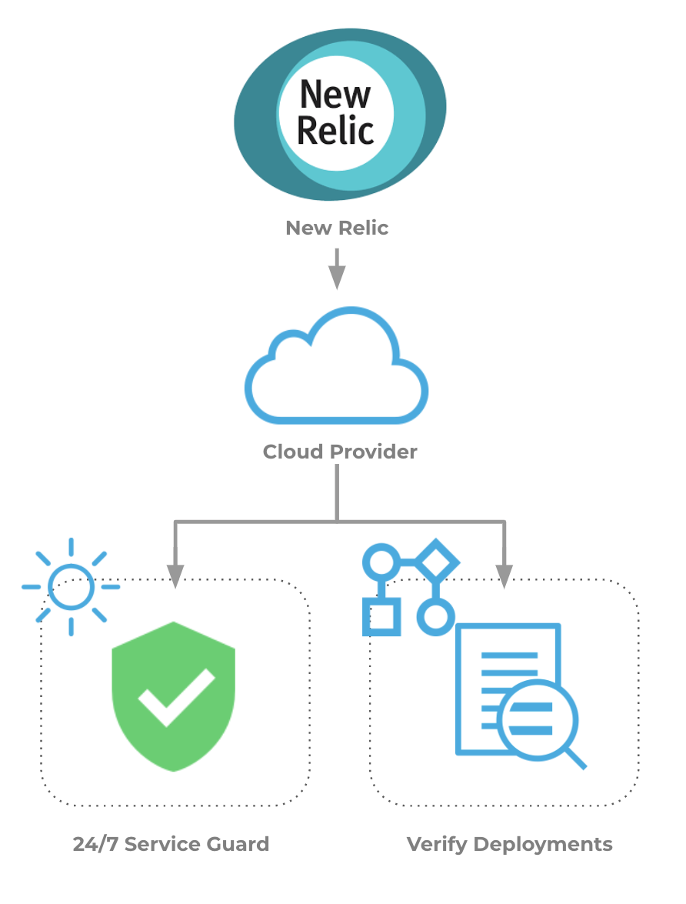

This topic describes how to set up Harness' Continuous Verification features, and monitor your deployments and production applications using its unsupervised machine-learning functionality, on New Relic.

In this topic:

* [Visual Summary](#visual_summary)
* [Integration Process Summary](#integration_process_summary)
* [Next Steps](#next_steps)

### Visual Summary

New Relic delivers real-time and trending data about application performance. New Relic can determine whether a performance blocker comes from the app itself, CPU availability, database loads, or another source.

Harness Continuous Verification integrates with New Relic to verify your deployments and live production applications using the following Harness features:

* **24/7 Service Guard**- Monitors your live, production applications.
* **Deployment Verification**- Monitors your application deployments, and performs automatic rollback according to your criteria.

This document describes how to set up these Harness Continuous Verification features and monitor your deployments and production applications using its unsupervised machine-learning functionality.

Verification analysis is limited to **Web** **Transactions** only. In **New Relic**, in your application, click **Transactions**, and in **Type**, click **Web.**

|  |  |
| --- | --- |
| **Web Transactions in New Relic** | **Web Transactions analyzed in Harness** |
|  |  |

### Integration Process Summary

You set up New Relic and Harness in the following way:

1. **New Relic**- Monitor your application using New Relic. In this article, we assume that you are using New Relic to monitor your application already.
2. **​Verification Provider Setup** - In Harness, you connect Harness to your New Relic account, adding New Relic as a **Harness Verification Provider**.
3. **Harness Application**- Create a Harness Application with a Service and an Environment. We do not cover Application setup in this sequence. See [Application Checklist](https://docs.harness.io/article/bucothemly-application-configuration).
4. **​24/7 Service Guard Setup** **-** In the Environment, set up 24/7 Service Guard to monitor your live, production application.
5. ​**Verify Deployments**:
	1. Add a Workflow to your Harness Application and deploy your microservice or application to the service infrastructure/[Infrastructure Definition](https://docs.harness.io/article/n39w05njjv-environment-configuration#add_an_infrastructure_definition) in your Environment.
	2. After you have run a successful deployment, you then add verification steps to the Workflow using your Verification Provider.
	3. Harness uses unsupervised machine-learning and New Relic analytics to analyze your future deployments, discovering events that might be causing your deployments to fail. Then you can use this information to set rollback criteria and improve your deployments.

### Next Steps

* [Connect to New Relic](../../new-relic-verification/1-new-relic-connection-setup.md)
* [Monitor Applications 24/7 with New Relic](../../new-relic-verification/2-24-7-service-guard-for-new-relic.md)
* [New Relic Deployment Marker](../../new-relic-verification/3-new-relic-deployment-marker.md)
* [Verify Deployments with New Relic](../../new-relic-verification/4-verify-deployments-with-new-relic.md)
* [Troubleshoot New Relic](../../new-relic-verification/5-troubleshooting-new-relic.md)

