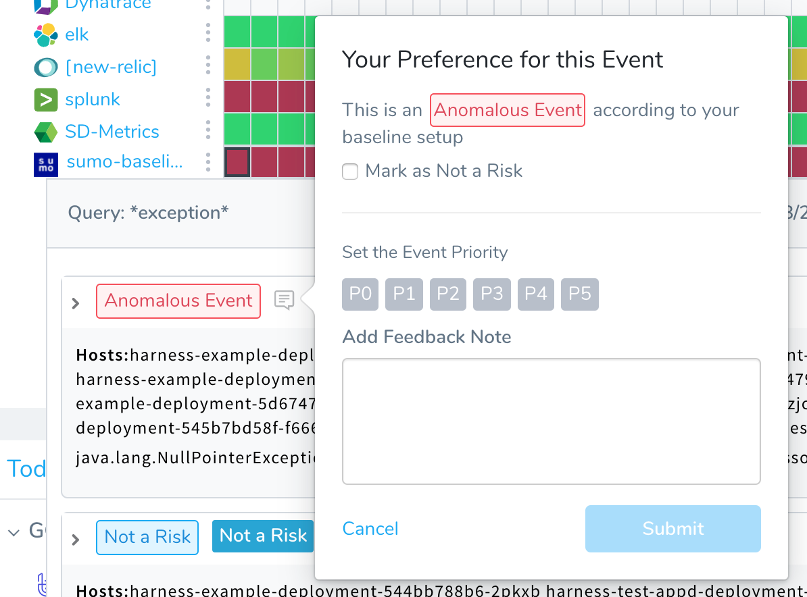

This topic covers the rationale for Harness' Continuous Verification approach, and the benefits of adopting it.

 [« Previous](what-is-cv.md) [Next »](when-verify.md)Sections in this topic:

* [Visual Introduction](#visual_summary)
* [Static Rules Versus Dynamic Data](#static)
* [Let the Machine Learn](#learning)
* [Benefits of Harness' Learning Approach](#dynamic)
* [Rich Ecosystem](#ecosystem)
* [Next Up](#next_steps)

### Visual Introduction

Harness Continuous Verification watches your applications over time—learning normal behavior, and alerting you to anomalies. Rather than writing static (and brittle) rules, you focus your effort on correcting and tuning this ongoing learning, which improves its anomaly detection.

### Static Rules Versus Dynamic Data

In traditional application performance monitoring, you either manually watch dashboards, or write rules to define risk. But once you adopt continuous delivery, these approaches won't scale.

Rules-based alerting relies on static rules, but with continuous delivery, your application data is highly dynamic. Your environment changes at accelerating velocity; the entropy of your system increases; and things break.

### Let the Machine Learn

Ideally, then, performance monitoring under continuous delivery should be configuration-free: Users should not need to add rules at all.

This implies a machine learning–based approach. Over time, unsupervised ML models models can analyze data from multiple monitoring providers, and can then predict your system's future behavior, identify anomalies, and respond to those anomalies.

### Benefits of Harness' Learning Approach

Harness' semi-supervised ML takes this approach a step further. You can tune Harness' learning engine to generate alerts targeted to *your* service and environment. Compared to coarse, basic rules, this provides a much more flexible basis for pausing or rolling back deployments.

Given the requirement for fast failure detection (low mean time to detect, or MTTD), and the vast amount of log data that can be generated by monitoring your services, Harness' semi-supervised ML drastically improves your MTTR (mean time to respond) to failures.

### Rich Ecosystem

Harness supports the vast majority of monitoring providers, bringing them together in one place for combined visibility.

Our simple and intuitive dashboards include a heat-map and time-series views. These interfaces also offer deep linking into your deployment system and your verification providers, for further debugging.

### Next Up

Next, consider:

* [When Does Harness Verify Deployments?](when-verify.md)

