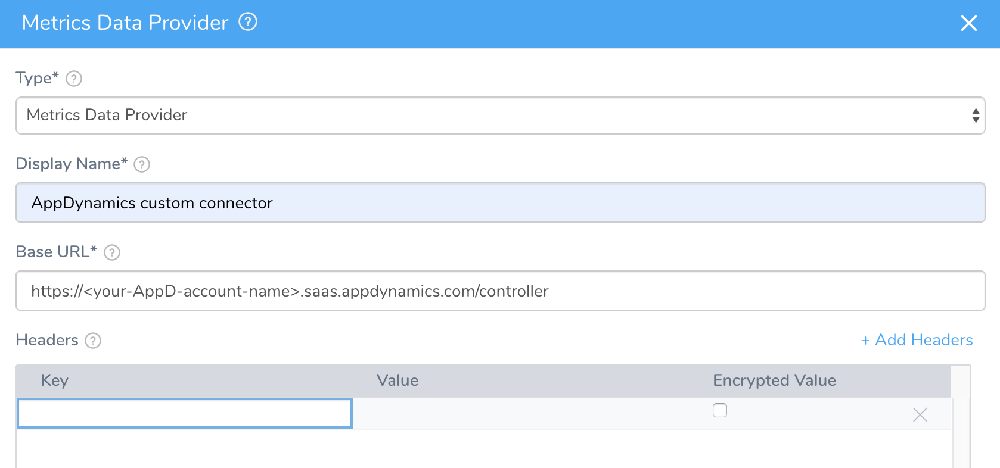
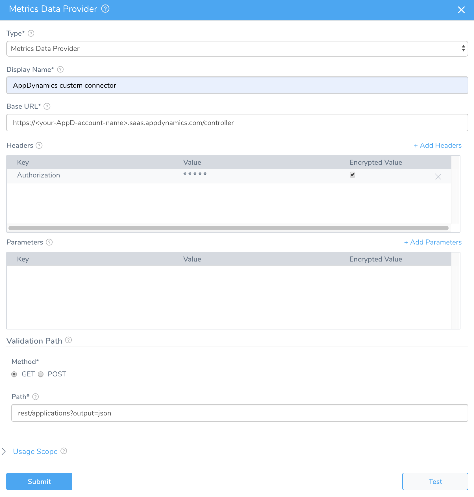

As an alternative to Harness' [standard AppDynamics integration](../continuous-verification-overview/concepts-cv/app-dynamics-verification-overview.md), you can use this guide to add AppDynamics to Harness as a custom APM. This approach enables you to expand monitoring beyond Business Transactions, to cover specific metrics of interest (for example, JVM data).

In this topic:

* [Before You Begin](#before_you_begin)
* [Step 1: Add AppDynamics as a Custom Verification Provider](#step_1_add_app_dynamics_as_a_custom_verification_provider)
* [Step 2: Display Name](#step_2_display_name)
* [Step 3: Base URL](#step_3_base_url)
* [Step 4: Headers](#step_4_headers)
* [Step 5: Validation Path](#step_5_validation_path)
* [Step 6: Test and Submit](#step_6_test_and_submit)
* [See Also](#see_also)

### Before You Begin

* See [Custom Verification Overview](custom-verification-overview.md).

### Step 1: Add AppDynamics as a Custom Verification Provider

To add a Custom Metrics Provider using AppDynamics, do the following:

1. In Harness Manager, click **Setup** > **Connectors** > **Verification Providers**.
2. Click **Add Verification Provider**. From the drop-down, select **Custom Verification**.  
  
   This opens the **Metrics Data Provider** settings.
   
   
   
3. In **Type**, select **Metrics Data Provider**, as shown above.

### Step 2: Display Name

In **Display Name**, give the Verification Provider an arbitrary name. (You will use this name to select this provider in a Workflow.)

### Step 3: Base URL

In **Base URL**, enter: `https://<your-AppDynamics-account-name>.saas.appdynamics.com/controller/`

Ensure that you include the forward slash at the end of the URL.

### Step 4: Headers

In **Headers**, click **Add Headers**, and add the following row:

|  |  |  |
| --- | --- | --- |
| **Key** | **Value** | **Encrypted Value** |
| Authorization | Enter a base 64–encoded version of this string, representing your AppDynamics credentials:`<username>@<account-name>:<password>`You can also use an Open Authorization (OAuth) token-based authentication. Instead of the above credentials combination, enter your token.For more information about generating the token, see [AppDynamics API Clients documentation](https://docs.appdynamics.com/display/PRO45/API+Clients). | Checked |

### Step 5: Validation Path

In **Validation Path**, enter `rest/applications?output=json`.

The settings will now look something like this:

### Step 6: Test and Submit

1. Click **Test** to verify your custom verification provider.
2. If the test succeeds, click **Submit** to save the custom verification provider.

### See Also

* [Verify Deployments with AppDynamics as a Custom APM](verify-deployments-with-app-dynamics-as-a-custom-apm.md)

