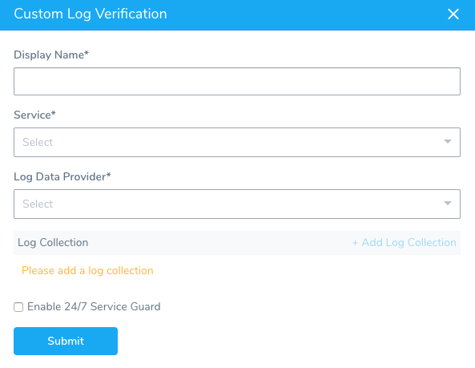
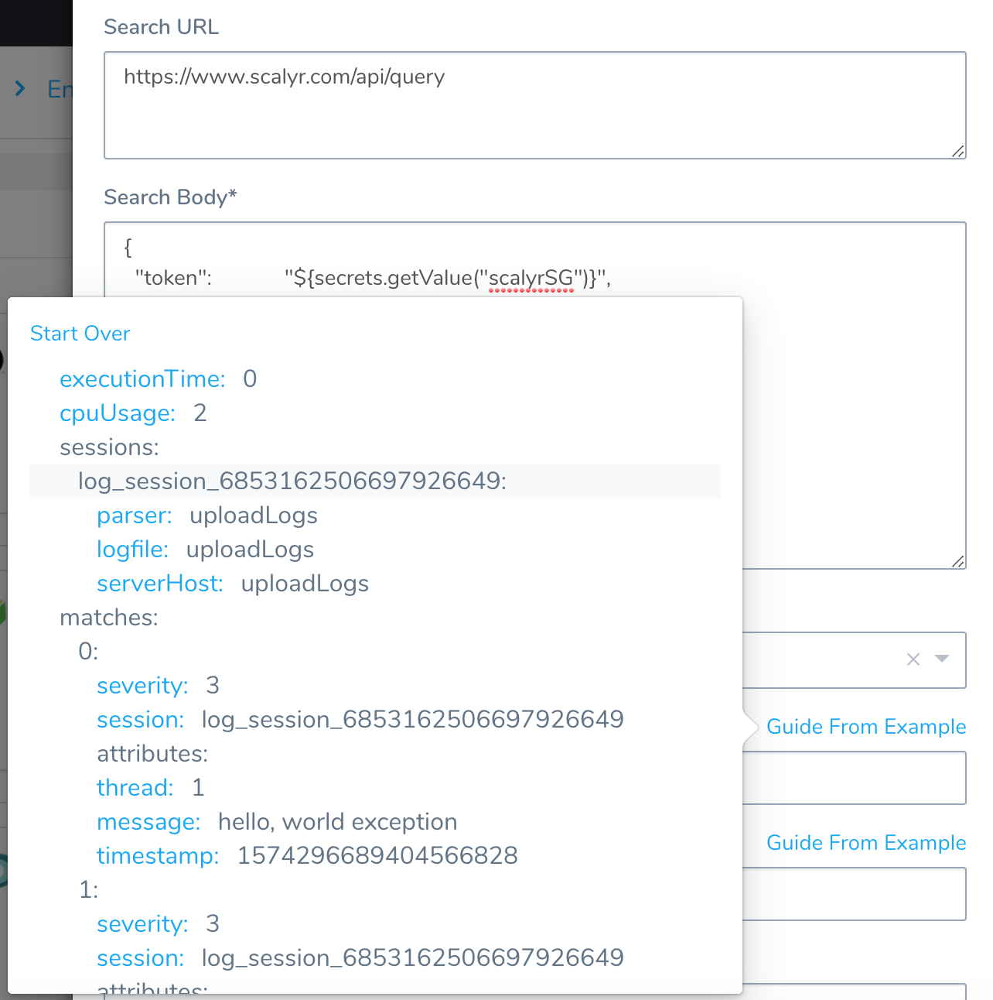
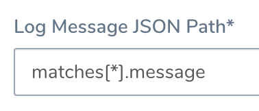
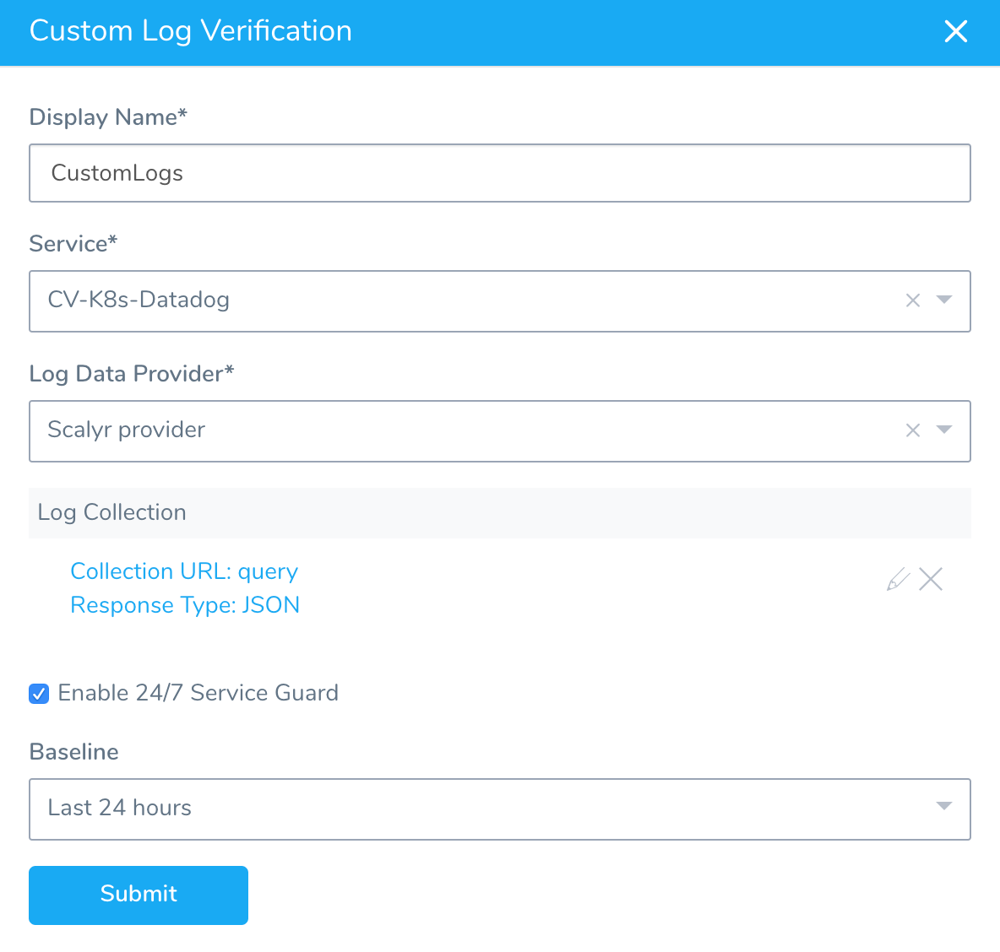

Harness 24/7 Service Guard monitors your live applications, catching problems that surface minutes or hours following deployment. For more information, see  [24/7 Service Guard Overview](../continuous-verification-overview/concepts-cv/24-7-service-guard-overview.md).

While Harness supports [all of the common logging tools](https://docs.harness.io/category/continuous-verification), you can add your Custom logging to Harness 24/7 Service Guard in your Harness Application Environment. For a setup overview, see  [Connect to Custom Verification for Custom Logs](connect-to-custom-verification-for-custom-logs.md).

This section assumes you have a Harness Application set up, containing a Service and Environment. For steps on setting up a Harness Application, see  [Application Components](https://docs.harness.io/article/bucothemly-application-configuration).In this topic:

* [Before You Begin](#before_you_begin)
* [Step 1: Set up 24/7 Service Guard for Custom Logs](#step_1_set_up_24_7_service_guard_for_custom_logs)
* [Step 2: Display Name](#step_2_display_name)
* [Step 3: Service](#step_3_service)
* [Step 4: Log Data Provider](#step_4_log_data_provider)
* [Step 5: Log Collection](#step_5_log_collection)
* [Step 6: Request Method](#step_6_request_method)
* [Step 7: Search URL](#step_7_search_url)
* [Step 8: Search Body](#step_8_search_body)
* [Step 9: Response Type](#step_9_response_type)
* [Step 10: Log Message JSON Path](#step_10_log_message_json_path)
* [Step 11: Service Instance JSON Path](#step_11_service_instance_json_path)
* [Step 12: Regex to Transform Hostname](#step_12_regex_to_transform_hostname)
* [Step 13: Timestamp JSON Path](#step_13_timestamp_json_path)
* [Step 14: Timestamp Format](#step_14_timestamp_format)
* [Step 15: Enable 24/7 Service Guard](#step_15_enable_24_7_service_guard)
* [Step 16: Baseline](#step_16_baseline)

### Before You Begin

* See [Custom Verification Overview](custom-verification-overview.md).
* See [Connect to Custom Verification for Custom Logs](connect-to-custom-verification-for-custom-logs.md).

### Step 1: Set up 24/7 Service Guard for Custom Logs

To set up 24/7 Service Guard for custom logs, do the following:

1. Ensure that you have added your Custom Verification provider as a Harness Verification Provider, as described in  [Verification Provider Setup](../appdynamics-verification/2-24-7-service-guard-for-app-dynamics.md#verification-provider-setup).
2. In your Harness Application, ensure that you have added a Service, as described in  [Services](https://docs.harness.io/article/eb3kfl8uls-service-configuration). For 24/7 Service Guard, you do not need to add an Artifact Source to the Service, or configure its settings. You simply need to create a Service and name it. It will represent your application for 24/7 Service Guard.
3. In your Harness Application, click **Environments**.
4. In **Environments**, ensure that you have added an Environment for the Service you added. For steps on adding an Environment, see  [Environments](https://docs.harness.io/article/n39w05njjv-environment-configuration).
5. Click the Environment for your Service. Typically, the **Environment Type** is **Production**.
6. In the **Environment** page, locate **24/7 Service Guard**.[](./static/monitor-applications-24-7-with-custom-logs-94.png)
7. In **24/7 Service Guard**, click **Add Service Verification**, and then click **Custom Log Verification**.The **Custom Log Verification** dialog appears.

Fill out the dialog. The dialog has the following fields.

For 24/7 Service Guard, the queries you define to collect logs are specific to the application or service you want monitored. Verification is application/service level. This is unlike Workflows, where verification is performed at the host/node/pod level.

### Step 2: Display Name

Enter a name for this 24/7 Service Guard monitoring. This name will identify the monitoring in the **Environment** page and in **24/7 Service Guard** under **Continuous Verification**.

### Step 3: Service

Select the Harness Service that represents the production application you are monitoring with the custom log provider.

### Step 4: Log Data Provider

Select the Custom Logs Provider you added, described in  [Connect to Custom Verification for Custom Logs](connect-to-custom-verification-for-custom-logs.md).

### Step 5: Log Collection

Once you have added log collection details, this section will list the collection settings.

### Step 6: Request Method

Select **GET** or **POST**. If you select **POST**, **Search Body** field is mandatory. In **Search Body**, you can enter any HTTP body to send as part of the query.

### Step 7: Search URL

Enter the API query that will return a JSON response. In the remaining settings, you will map the keys in the JSON response to Harness settings to identify where data such as the hostname and timestamp are located in the JSON response.

The **Search URL** is automatically filled with the URL from the Custom Log Provider you selected in **Log Data Provider**:

[](./static/monitor-applications-24-7-with-custom-logs-98.png)

For some custom logging tools, you will need to augment your Base URL with `query` or some other setting. For example: `https://www.scalyr.com/api/query`.

### Step 8: Search Body

You can enter any JSON search input for your query. For example, here is a log query for logs in Scalyr:


```
{  
  "token":           "${secrets.getValue("scalyrSG")}",  
  "queryType":         "log",  
  "filter":            "exception",  
  "startTime":         "${start\_time}",  
  "endTime":           "${end\_time}",  
  "maxCount":          "10",  
  "pageMode":          "tail",  
  "priority":          "low"  
}
```
You can see that the token field uses a Harness Encrypted Text secret containing the token, referenced using the syntax `${secrets.getValue("secret-name")}`.

[](./static/monitor-applications-24-7-with-custom-logs-100.png)

### Step 9: Response Type

In **Response Type**, select **JSON**.

### Step 10: Log Message JSON Path

To use **Guide From Example**, your **Search URL** or **Search Body** must contain the start and end time placeholders `${start_time}` and `${end_time}`.

Where the start and end time placeholders are required depends on your custom logs provider. For example, some providers will need them in the Search Body and other in the Search URL.

Click **Guide From Example**. A popup appears, preset for you to query the provider.

[](./static/monitor-applications-24-7-with-custom-logs-102.png)

You can change the start and end times. By default, they are set for the last 30 minutes.

Click **SEND**. The JSON response is displayed.

[](./static/monitor-applications-24-7-with-custom-logs-104.png)

Click the **message** field. The JSON path is added to **Log Message JSON Path**:

[](./static/monitor-applications-24-7-with-custom-logs-106.png)

### Step 11: Service Instance JSON Path

Click **Guide From Example** to locate the JSON path for the service instance. If the JSON returned by your query does not have the path, then leave **Service Instance JSON Path** empty.

### Step 12: Regex to Transform Hostname

If the JSON value returned requires transformation in order to be used, enter the regex expression here. For example: If the value in the host name JSON path of the response is `pod_name:harness-test.pod.name` and the actual pod name is simply `harness-test.pod.name`, you can write a regular expression to remove the `pod_name` from the response value.

### Step 13: Timestamp JSON Path

Click **Guide From Example** to locate the JSON path for the timestamp, and click the timestamp label.

[](./static/monitor-applications-24-7-with-custom-logs-108.png)

### Step 14: Timestamp Format

Enter a timestamp format. The format follows the  [Java SimpleDateFormat](https://docs.oracle.com/javase/8/docs/api/java/text/SimpleDateFormat.html). For example, a timestamp syntax might be **yyyy-MM-dd'T'HH:mm:ss.SSSX**. If you leave this field empty, Harness will use the default range of 1 hour previous (now - 1h) to now.

### Step 15: Enable 24/7 Service Guard

Select **Enable 24/7 Service Guard** to enable monitoring.

### Step 16: Baseline

When you select **Enable 24/7 Service Guard**, you can select a baseline time interval for monitoring.

When you have added your Log Collection your Custom Log Verification will look something like this:



The Custom Logs Verification is added to 24/7 Service Guard:

