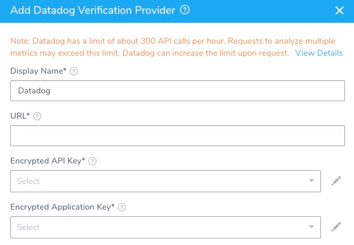
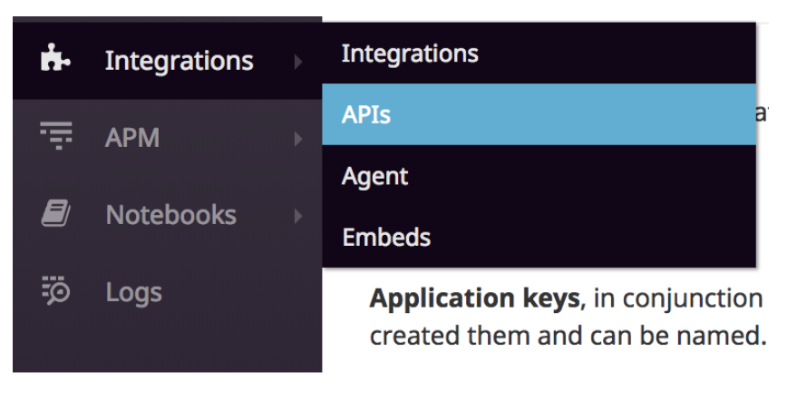

The first step in using Datadog with Harness is to set up a Datadog Verification Provider in Harness.

A Harness Verification Provider is a connection to monitoring tools such as Datadog. Once Harness is connected, you can use Harness 24/7 Service Guard and Deployment Verification with your Datadog data and analysis.

In this topic:

* [Before You Begin](#before_you_begin)
* [Step 1: Add Datadog Verification Provider](#step_1_add_datadog_verification_provider)
* [Step 2: Display Name](#step_2_display_name)
* [Step 3: URL](#step_3_url)
* [Step 4: Encrypted API Key](#step_4_encrypted_api_key)
* [Step 5: Encrypted Application Key](#step_5_encrypted_application_key)
* [Step 6: Usage Scope](#step_6_usage_scope)
* [Next Steps](#next_steps)

### Before You Begin

* Set up a Harness Application, containing a Service and Environment. See  [Create an Application](https://docs.harness.io/article/bucothemly-application-configuration).
* See the  [Datadog Verification Overview](../continuous-verification-overview/concepts-cv/datadog-verification-overview.md).

### Step 1: Add Datadog Verification Provider

To add Datadog as a verification provider:

1. Click **Setup**.
2. Click **Connectors**, and then click **Verification Providers**.
3. Click **Add Verification Provider**, and select **Datadog**. The **Datadog** dialog for your provider appears.
4. Complete the following fields of the **Add Datadog Verification Provider** dialog.

You need Datadog Admin access to create the API key needed to connect Harness to Datadog.

### Step 2: Display Name

Enter a display name for the provider. If you are going to use multiple providers of the same type, ensure you give each provider a different name.

### Step 3: URL

Enter the URL of the Datadog server. 

Simply take the URL from the Datadog dashboard, such as `https://app.datadoghq.com/`, and add the API and version (`api/v1/`) to the end.

For example, `https://app.datadoghq.com/api/v1/`.

The trailing forward slash after `v1` (`v1/`) in mandatory.

### Step 4: Encrypted API Key

For secrets and other sensitive settings, select or create a new [Harness Encrypted Text secret](https://docs.harness.io/article/ygyvp998mu-use-encrypted-text-secrets).Enter the API key for API calls.

To create an API key in Datadog, do the following:

1. In **Datadog**, mouseover **Integrations**, and then click **APIs**. The **APIs** page appears.
2. In **API Keys**, in **New API key**, enter the name for the new API key, such as **Harness**, and then click **Create API key**.
3. Copy the API key and, in **Harness**, paste it into the **API Key** field.

### Step 5: Encrypted Application Key

For secrets and other sensitive settings, select or create a new [Harness Encrypted Text secret](https://docs.harness.io/article/ygyvp998mu-use-encrypted-text-secrets).Enter the application key.

To create an application key in Datadog, do the following:

1. In **Datadog**, mouseover **Integrations**, and then click **APIs**. The **APIs** page appears.
2. In **Application Keys**, in **New application key**, enter a name for the application key, such as **Harness**, and click **Create Application Key**.
3. Copy the API key and, in **Harness**, paste it into the **Application Key** field.

### Step 6: Usage Scope

Usage scope is inherited from the secrets used in the settings.

Datadog has limit of about 300 API calls per hour. Requests to analyze many metrics can hit the limit. Datadog can increase the limit upon request. For more information, see [Rate Limiting](https://docs.datadoghq.com/api/?lang=python#rate-limiting) from Datadog.

### Next Steps

* [Monitor Applications 24/7 with Datadog Metrics](monitor-applications-24-7-with-datadog-metrics.md)
* [Monitor Applications 24/7 with Datadog Logging](2-24-7-service-guard-for-datadog.md)
* [Verify Deployments with Datadog Logging](3-verify-deployments-with-datadog.md)
* [Verify Deployments with Datadog Metrics](verify-deployments-with-datadog-metrics.md)

