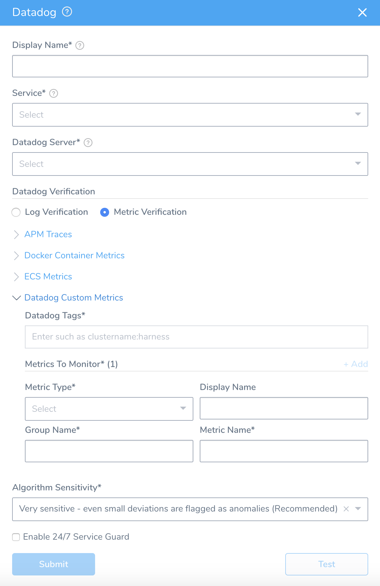

Harness 24/7 Service Guard monitors your live applications, catching problems that surface minutes or hours following deployment. For more information, see [24/7 Service Guard Overview](../continuous-verification-overview/concepts-cv/24-7-service-guard-overview.md).

You can add your Datadog monitoring to Harness 24/7 Service Guard in your Harness Application Environment. For a setup overview, see [Connect to Datadog](1-datadog-connection-setup.md).

This section assumes you have a Harness Application set up and containing a Service and Environment. For steps on setting up a Harness Application, see [Application Checklist](https://docs.harness.io/article/bucothemly-application-configuration).

### Before You Begin

* See the [Datadog Verification Overview](../continuous-verification-overview/concepts-cv/datadog-verification-overview.md).
* Make sure you [Connect to Datadog](1-datadog-connection-setup.md).

### Visual Summary

Here's an example of a Datadog Metrics setup for 24/7 Service Guard setup.

### Step 1: Set Up 24/7 Service Guard

To set up 24/7 Service Guard for Datadog, do the following:

1. Ensure that you have added Datadog as a Harness Verification Provider, as described in [Verification Provider Setup](1-datadog-connection-setup.md#datadog-verification-provider-setup).
2. In your Harness Application, ensure that you have added a Service, as described in [Services](https://docs.harness.io/article/eb3kfl8uls-service-configuration). For 24/7 Service Guard, you do not need to add an Artifact Source to the Service, or configure its settings. You simply need to create a Service and name it. It will represent your application for 24/7 Service Guard.
3. In your Harness Application, click **Environments**.
4. In **Environments**, ensure that you have added an Environment for the Service you added. For steps on adding an Environment, see [Environments](https://docs.harness.io/article/n39w05njjv-environment-configuration).
5. Click the Environment for your Service. Typically, the **Environment Type** is **Production**.
6. In the **Environment** page, locate **24/7 Service Guard**.
  
  
7. In **24/7 Service Guard**, click **Add Service Verification**, and then click **Datadog**. The **Datadog** dialog appears.

   

### Step 2: Display Name

The name that will identify this service on the **Continuous Verification** dashboard. Use a name that indicates the environment and monitoring tool, such as **Datadog**.

### Step 3: Service

The Harness Service to monitor with 24/7 Service Guard.

### Step 4: Datadog Server

Select the Datadog Verification Provider to use.

### Step 5: Metric Verification

Select the Metric Verification option.

### Step 6: APM Traces

In **Datadog Service Name**, enter which service in Datadog you want to monitor. By default, Datadog monitors the servlet hits (number of incoming requests), servlet duration, and errors. Harness will fetch this data for every Web transaction with the service you enter and display it in 24/7 Service Guard as **Errors**, **Hits**, **Request Duration**.

### Step 7: Docker Container Metrics

Select the Docker container infrastructure metrics to monitor.

1. In **Datadog Tags**, enter any tags that have been applied to your metrics in Datadog. These are the same tags used in Datadog Events, Metrics Explorer, etc.

   

   

   Use the Datadog tag format, such as `cluster-name:harness-test`.

2. In **Metrics**, select the Docker metrics to use.

### Step 8: ECS Metrics

1. In **Datadog Tags**, enter any tags that have been applied to your metrics in Datadog. These are the same tags used in Datadog Events, Metrics Explorer, etc. You can find these tags by following the steps in the **Docker Container Metrics** instructions above.
2. In **Metrics**, select the ECS metrics to use.

### Step 9: Datadog Custom Metrics

1. In **Datadog Tags**, enter any tags that have been applied to your metrics in Datadog. These are the same tags used in Datadog Events, Metrics Explorer, etc. You can find these tags by following the steps in the **Docker Container Metrics** instructions above.
2. In **Metric Type**, select the metric to use. To use multiple types, click **Add**.
3. In **Display Name**, enter a name to identify this metric in the Harness dashboards.
4. In Metric Name, enter the metric you want to use. These are the metrics you will see in the Datadog Metrics Explorer **Graph** menu:

#### Always Use Throughput with Error and Response Time Metrics

Whenever you use the Error metric type, you should also add another metric for Throughput with the same Group Name.

Harness analyze errors as error percentage and without the throughput the error number does not provide much information.

The same setup should used with the Response Time metric also. Whenever you set up a Response Time metric, setup a Throughput metric with the same Group Name.

### 

### Step 10: Algorithm Sensitivity

See [CV Strategies, Tuning, and Best Practices](../continuous-verification-overview/concepts-cv/cv-strategies-and-best-practices.md#algorithm-sensitivity-and-failure-criteria).

**Moderately sensitive** is recommended.

### Step 11: Enable 24/7 Service Guard

Enable this setting to turn on 24/7 Service Guard. If you simply want to set up 24/7 Service Guard, but not enable it, leave this setting disabled.

### Step 12: Verify your Settings

1. Click **Test**. Harness verifies the settings you entered.
2. Click **Submit**. The Datadog 24/7 Service Guard is added.

To see the running 24/7 Service Guard analysis, click **Continuous Verification**.

The 24/7 Service Guard dashboard displays the production verification results.

 For more information, see [24/7 Service Guard Overview](../continuous-verification-overview/concepts-cv/24-7-service-guard-overview.md).

### Next Steps

* [Verify Deployments with Datadog Logging](3-verify-deployments-with-datadog.md)
* [Verify Deployments with Datadog Metrics](verify-deployments-with-datadog-metrics.md)
* [CV Strategies, Tuning, and Best Practice](../continuous-verification-overview/concepts-cv/cv-strategies-and-best-practices.md#algorithm-sensitivity-and-failure-criteria)

