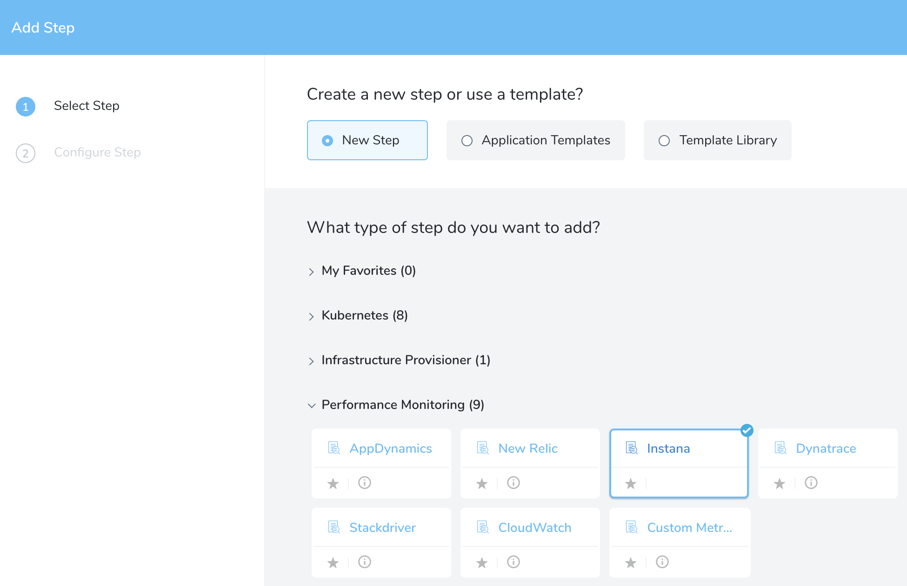
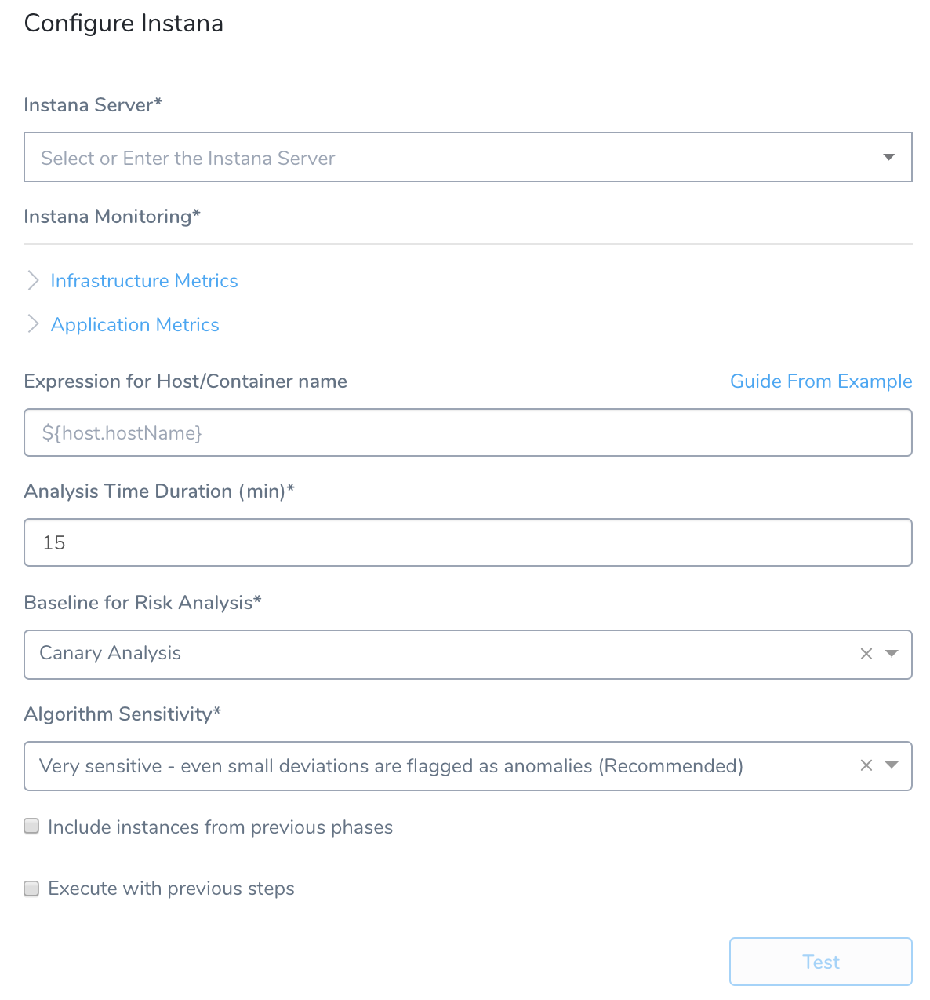
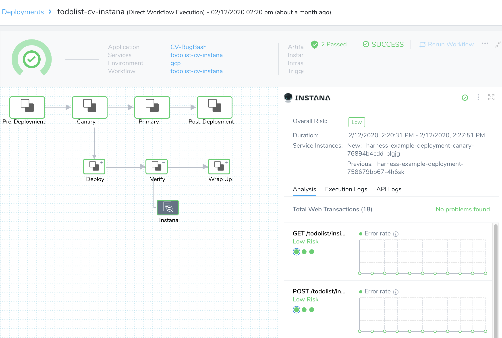

Harness can analyze Instana data to verify, rollback, and improve deployments. To apply this analysis to your deployments, you set up Instana as a verification step in a Harness Workflow, as outined in the following sections:

* [Deployment Verification Setup](../datadog-verification/3-verify-deployments-with-datadog.md#deployment-verification-setup)
* [Harness Expression Support in CV Settings](#harness_expression_support_in_cv_settings)
* [Verification Results](../datadog-verification/3-verify-deployments-with-datadog.md#verification-results)
* [Continuous Verification](../datadog-verification/3-verify-deployments-with-datadog.md#continuous-verification)
* [Next Steps](../datadog-verification/3-verify-deployments-with-datadog.md#next-steps)

In order to obtain the names of the host(s) or container(s) where your service is deployed, add the Verification Provider to your Workflow *after* you have run at least one successful Workflow deployment.

### Deployment Verification Setup

To add an Instana verification step to your Workflow:

1. Ensure that you have added Instana as a Harness Verification Provider, as described in [Instana Connection Setup](instana-connection-setup.md).
2. In your Workflow, under **Verify Service**, click **Add Verification**.
3. In the resulting **Add Step** settings, select **Performance Monitoring** > **Instana**.

   
	 
4. Click **Next** to display the **Configure** **Instana** settings.

   

Next, fill out the settings, which include the following fields.  


|  |  |
| --- | --- |
| **Field** | **Description** |
| **Instana Server** | Select the Instana [Verification Provider](instana-connection-setup.md) to use.You can also enter variable expressions, such as: `${serviceVariable.instana-QA}`. |
| **Infrastructure Metrics** | 
In the **Infrastructure Metrics** pane, you can first select one or more **Docker Metrics** to monitor from Instana:Next, in the **Query** field, you must enter a query corresponding to a [Dynamic Focus](http://docs.instana.io/dynamic_focus/) query in Instana. For example, you might enter: `entity.kubernetes.pod.name:${host}`For background information, see Instana's [Container Monitoring](https://docs.instana.io/infrastructure_monitoring/containers/) documentation. |
| **Application Metrics** | 
In the **Application Metrics** pane, you specify API endpoint metrics to monitor from Instana.First, in the required **Host Tag Filter** field, enter a value in the format: `kubernetes.pod.name`.Optionally, you can also add **Tag Filters**, corresponding to Filters applied to your metrics on Instana's **Analytics** tab > **Filters**.To do so:
	1. Click **Add** to display a **Tag Filters** row, as shown below.
	2. In the **Name** field, enter the Instana Filter's name, such as `kubernetes.pod.name` or `kubernetes.cluster.name`.
	3. Select an **Operator** to define the threshold or condition for considering this metric anomalous.
	4. Enter a **Value** corresponding to the **Operator**.
	5. To define additional Tag Filters, repeat the above steps. |
| **Expression for Host/Container name** | The expression entered here should resolve to a host/container name in your deployment environment. By default, the expression is `${instance.host.hostName}`.For most use cases, you can leave this field empty, to apply the default. However, if you want to add a prefix or suffix, enter an expression as outlined here.For AWS EC2 hostnames, use the expression `${instance.hostName`}.If you begin typing an expression into the field, the field provides expression assistance.For PCF, you might enter an expression like:
```
${host.pcfElement.displayName}-${host.pcfElement.instanceIndex}
```
...which could yield something like: `harness-example-1`, where the `displayName` is `harness-example` and `instanceIndex` is `1`.When you are setting up the Workflow for the first time, Harness will not be able to help you create an expression, because there has not been a host/container deployed yet.For this reason, you should add the **Verify Step** after you have done one successful deployment. |
| **Analysis Time Duration** | Set the duration for the verification step. If a verification step exceeds the value, the workflow [Failure Strategy](https://docs.harness.io/article/m220i1tnia-workflow-configuration#failure_strategy) is triggered. For example, if the Failure Strategy is **Ignore**, then the verification state is marked **Failed** but the workflow execution continues.See [CV Strategies, Tuning, and Best Practices](../continuous-verification-overview/concepts-cv/cv-strategies-and-best-practices.md). |
| **Baseline for Risk Analysis** | See [CV Strategies, Tuning, and Best Practices](../continuous-verification-overview/concepts-cv/cv-strategies-and-best-practices.md). |
| **Algorithm Sensitivity** | See [CV Strategies, Tuning, and Best Practices](../continuous-verification-overview/concepts-cv/cv-strategies-and-best-practices.md#algorithm-sensitivity-and-failure-criteria). |
| **Include instances from previous phases** | If you are using this verification step in a multi-phase deployment, select this checkbox to include instances used in previous phases when collecting data. Do not apply this setting to the first phase in a multi-phase deployment. |
| **Execute with previous steps** | Check this checkbox to run this verification step in parallel with the previous steps in **Verify Service**. |
5. Click **Test**. Harness verifies the settings you entered.
6. When the test is successful, click **Submit**. The Instana verification step is added to your Workflow.

### Harness Expression Support in CV Settings

You can use expressions (`${...}`) for [Harness built-in variables](https://docs.harness.io/article/7bpdtvhq92-workflow-variables-expressions) and custom [Service](https://docs.harness.io/article/eb3kfl8uls-service-configuration) and [Workflow](https://docs.harness.io/article/766iheu1bk-add-workflow-variables-new-template) variables in the settings of Harness Verification Providers.


Expression support lets you template your Workflow verification steps. You can add custom expressions for settings, and then provide values for those settings at deployment runtime. Or you can use Harness built-in variable expressions and Harness will provide values at deployment runtime automatically.

### Verification Results

Once you have deployed your Workflow (or Pipeline) using the Instana verification step, you can automatically verify cloud application and infrastructure performance across your deployment. For more information, see [Add a Workflow](https://docs.harness.io/article/m220i1tnia-workflow-configuration) and [Add a Pipeline](https://docs.harness.io/article/zc1u96u6uj-pipeline-configuration).

#### Workflow Verification

To see the results of Harness' machine-learning evaluation of your Instana verification: In your Workflow or Pipeline deployment, expand the **Verify Service** step, and then click the **Instana** step to populate the Details panel at right.



### Continuous Verification

You can also see the evaluation in the **Continuous Verification** dashboard. While the Workflow verification view is for the DevOps user who developed the Workflow, the **Continuous Verification** dashboard is where *all* future deployments are displayed for developers and others interested in deployment analysis.

To explore and interpret verification analysis results, see [Verification Results Overview](../continuous-verification-overview/concepts-cv/deployment-verification-results.md).

### Next Steps

* [Configuration as Code](https://docs.harness.io/article/htvzryeqjw-configuration-as-code)
* [Users and Permissions](https://docs.harness.io/article/ven0bvulsj-users-and-permissions)

