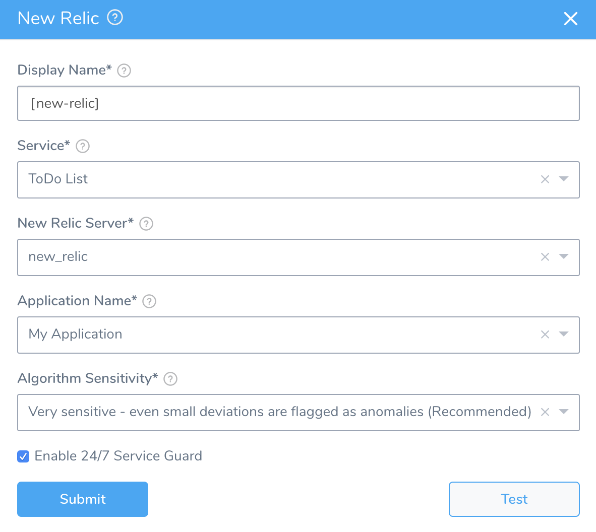
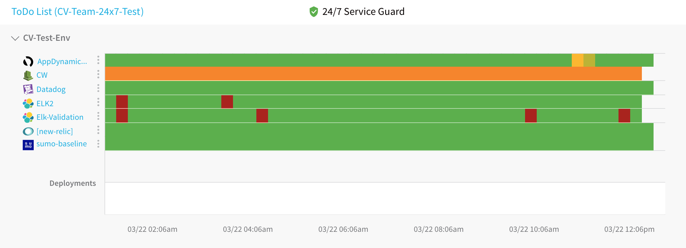

Harness 24/7 Service Guard monitors your live applications, catching problems that surface minutes or hours following deployment. For more information, see [24/7 Service Guard Overview](../continuous-verification-overview/concepts-cv/24-7-service-guard-overview.md).

You can add your New Relic monitoring to Harness 24/7 Service Guard in your Harness Application Environment. For a setup overview, see [Connect to New Relic](1-new-relic-connection-setup.md).

This section assumes you have a Harness Application set up and containing a Service and Environment. For steps on setting up a Harness Application, see [Application Components](https://docs.harness.io/article/bucothemly-application-configuration).

### Before You Begin

* See the [New Relic Verification Overview](../continuous-verification-overview/concepts-cv/new-relic-verification-overview.md).
* See [Connect to New Relic](1-new-relic-connection-setup.md).

### Visual Summary

Here's an example of a 24/7 Service Guard configuration for New Relic.

### Step 1: Set Up 24/7 Service Guard for New Relic

To set up 24/7 Service Guard for New Relic, do the following:

1. Ensure that you have added New Relic as a Harness Verification Provider, as described in [Verification Provider Setup](#verification_provider_setup).
2. In your Harness Application, ensure that you have added a Service, as described in [Services](https://docs.harness.io/article/eb3kfl8uls-service-configuration). For 24/7 Service Guard, you do not need to add an Artifact Source to the Service, or configure its settings. You simply need to create a Service and name it. It will represent your application for 24/7 Service Guard.
3. In your Harness Application, click **Environments**.
4. In **Environments**, ensure that you have added an Environment for the Service you added. For steps on adding an Environment, see [Environments](https://docs.harness.io/article/n39w05njjv-environment-configuration).
5. Click the Environment for your Service. Typically, the **Environment Type** is **Production**.
6. In the **Environment** page, locate **24/7 Service Guard**.

   
   
   
7. In **24/7 Service Guard**, click **Add Service Verification**, and then click **New Relic**.

   
   
8. Fill out the dialog. The dialog has the following fields.

For 24/7 Service Guard, the queries you define to collect logs are specific to the application or service you want monitored. Verification is application/service level. This is unlike Workflows, where verification is performed at the host/node/pod level.

### Step 2: Display Name

The name that will identify this service on the **Continuous Verification** dashboard. Use a name that indicates the environment and monitoring tool, such as **New Relic**.

### Step 3: Service

The Harness Service to monitor with 24/7 Service Guard.

### Step 4: New Relic Server

Select the New Relic Verification Provider to use.

### Step 5: Application Name

Select the Application Name used by the monitoring tool. If your New Relic account contains hundreds or thousands of applications, Harness requests that you enter in the application name. You can just paste in the application name as it appears in the New Relic Applications page **Name** column.

This is the application name used to aggregate data in the New Relic UI. You set both the license and the app name as part of the New Relic installation process.

To find your application, in **New Relic**, click **Applications**. The list of applications is displayed on the **Applications** page.

### Step 6: Custom Thresholds

In the **Custom Thresholds** section, you can define **Ignore Hints**. These are rules that instruct Harness to skip certain metrics/value combinations from verification analysis.

To configure these rules, see  [Apply Custom Thresholds to 24/7 Service Guard](../24-7-service-guard/custom-thresholds-24-7.md).

### Step 7: Algorithm Sensitivity

Specify the sensitivity to determine what events are identified as anomalies.

See [CV Strategies, Tuning, and Best Practices](../continuous-verification-overview/concepts-cv/cv-strategies-and-best-practices.md#algorithm-sensitivity-and-failure-criteria).

### Step 8: Enable 24/7 Service Guard

Enable this setting to turn on 24/7 Service Guard. If you simply want to set up 24/7 Service Guard, but not enable it, leave this setting disabled.

### Step 9: Verify Settings

When you are finished, the dialog will look something like this:

1. Click **Test**. Harness verifies the settings you entered.
2. Click **Submit**. New Relic is configured now configured for 24/7 Service Guard monitoring.

   

To see the running 24/7 Service Guard analysis, click **Continuous Verification**.

The 24/7 Service Guard dashboard displays the production verification results.

For information on using the dashboard, see [24/7 Service Guard Overview](../continuous-verification-overview/concepts-cv/24-7-service-guard-overview.md).

### Next Steps

* [New Relic Deployment Marker](3-new-relic-deployment-marker.md)
* [Verify Deployments with New Relic](4-verify-deployments-with-new-relic.md)

