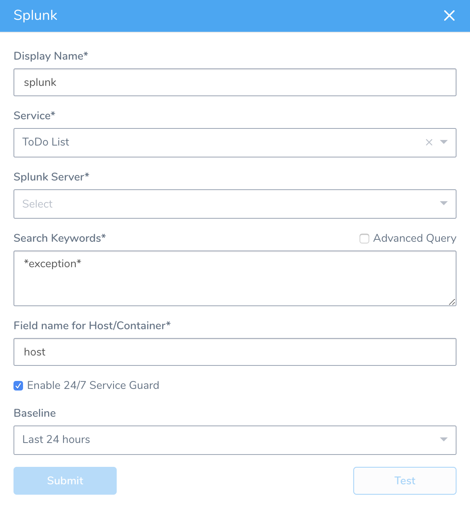

Harness 24/7 Service Guard monitors your live applications, catching problems that surface minutes or hours following deployment. For more information, see [24/7 Service Guard Overview](../continuous-verification-overview/concepts-cv/24-7-service-guard-overview.md).

You can add your Splunk monitoring to Harness 24/7 Service Guard in your Harness Application Environment. For a setup overview, see  [Connect to Splunk](1-splunk-connection-setup.md).


### Before You Begin

* See the [Splunk Verification Overview](../continuous-verification-overview/concepts-cv/splunk-verification-overview.md).
* See [Connect to Splunk](1-splunk-connection-setup.md).

### Visual Summary

Here's an example configuration of 24/7 Service Guard for Splunk.



### Step 1: Set Up 24/7 Service Guard for Splunk

To set up 24/7 Service Guard for Splunk:

1. Ensure that you have added Splunk as a Harness Verification Provider, as described in  [Connect to Splunk](1-splunk-connection-setup.md).
2. In your Harness Application, ensure that you have added a Service, as described in  [Services](https://docs.harness.io/article/eb3kfl8uls-service-configuration). For 24/7 Service Guard, you do not need to add an Artifact Source to the Service, or configure its settings. You simply need to create a Service and name it. It will represent your application for 24/7 Service Guard.
3. In your Harness Application, click **Environments**.
4. In **Environments**, ensure that you have added an Environment for the Service you added. For steps on adding an Environment, see  [Environments](https://docs.harness.io/article/n39w05njjv-environment-configuration).
5. Click the Environment for your Service. Typically, the **Environment Type** is **Production**.
6. In the **Environment** page, locate **24/7 Service Guard**.
7. In **24/7 Service Guard**, click **Add Service Verification**, and then click **Splunk**. The **Splunk** dialog appears.

   
   
8. Fill out the dialog. The dialog has the following fields.

For 24/7 Service Guard, the queries you define to collect logs are specific to the application or service you want monitored. Verification is application/service level. This is unlike Workflows, where verification is performed at the host/node/pod level.

### Step 2: Display Name

The name that will identify this service on the **Continuous Verification** dashboard. Use a name that indicates the environment and monitoring tool, such as **Splunk**.

### Step 3: Service

The Harness Service to monitor with 24/7 Service Guard.

### Step 4: Splunk Server

Select the Harness Verification Provider you configured using your Splunk account.

### Step 5: Search Keywords

Enter a search term or query. To search for all exceptions, use asterisks (\*) around **exception**, for example, **\*exception\***. For more information, see [Retrieve events from the index](http://docs.splunk.com/Documentation/Splunk/7.2.0/SearchTutorial/Startsearching#Retrieve_events_from_the_index) from Splunk.

When you enter a search such as **\*exception\***, at runtime Harness will generate a query containing your search and information Harness needs to perform monitoring, such as the information following **\*exception\*** below:


```
search *exception* host = ip-172-31-81-88 | bin _time span=1m |  
    
  
    
cluster t=0.9999 showcount=t labelonly=t|  
    
  
    
table _time, _raw,cluster_label, host |  
    
  
    
stats latest(_raw) as _raw count as cluster_count by _time,cluster_label,host
```
If you want more flexibility in your search, or to repurpose Splunk searches you already have, you can click **Advanced Query** and enter whatever you like in **Search Keywords**. Simply copy and paste your Splunk query into Harness, such as `search index=*prod *exception*`.

Note that you will specify host field name and host/pod/container name in other settings so you do not need to include them in the search query.

### Step 6: Field name for Host/Container

Typically, you will enter **host**. You can enter **host** into the Splunk **Search** field to see the host for your Harness deployment:

[](./static/2-24-7-service-guard-for-splunk-02.png)

### Step 7: Baseline

Select the baseline for comparison.

### Step 8: Execute with previous steps

Check this checkbox to run this verification step in parallel with the previous steps in **Verify Service**.

 For more information, see [24/7 Service Guard Overview](../continuous-verification-overview/concepts-cv/24-7-service-guard-overview.md).

### Troubleshoot: Splunk Connectivity and Service Guard Configuration

If you are able to test the connection while configuring Splunk, but unable to schedule a job while setting up 24/7 Service Guard:

* Make sure the permissions of the Splunk user are granted for REST API.
* If all the permissions are granted, create a new user in Splunk and verify if the CURL call from this user works.
* On Harness On-Prem, make sure the firewall port is open for the Splunk REST API access.

### Next Steps

* [Verify Deployments with Splunk](3-verify-deployments-with-splunk.md)

