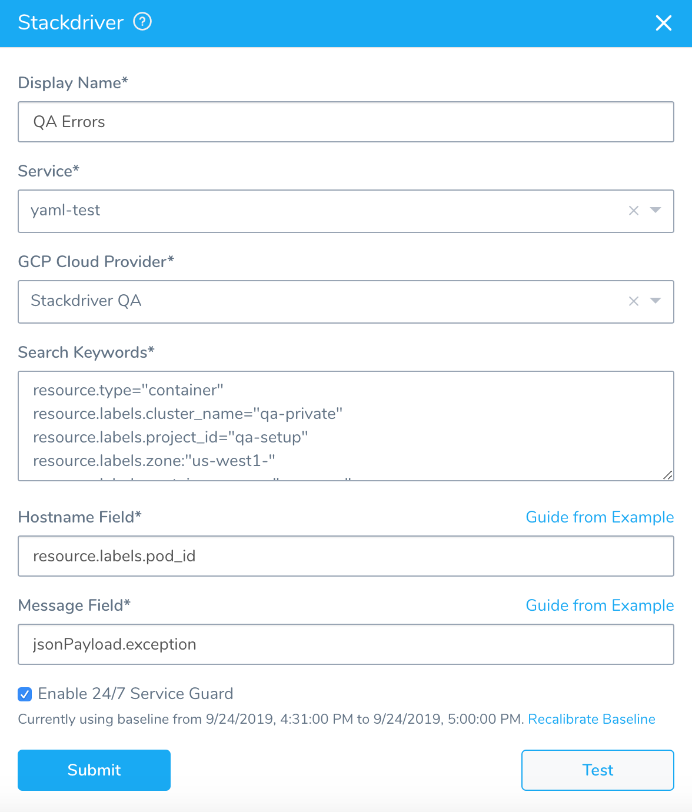
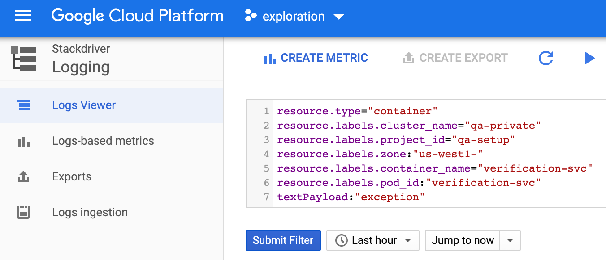
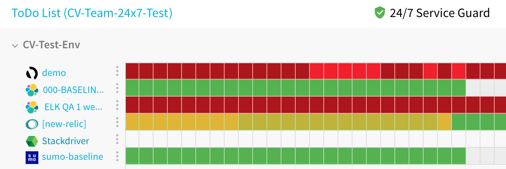

Harness 24/7 Service Guard monitors your live applications, catching problems that surface minutes or hours following deployment.

Once you have set up a Stackdriver Verification Provider in Harness, as described in [Connect to Stackdriver](stackdriver-connection-setup.md), you can add your Stackdriver **Logs** monitoring to Harness 24/7 Service Guard in your Harness Application Environment.


### Before You Begin

* Set up a Harness Application, containing a Service and Environment. See [Create an Application](https://docs.harness.io/article/bucothemly-application-configuration).
* See the [Stackdriver Verification Overview](../continuous-verification-overview/concepts-cv/stackdriver-and-harness-overview.md).


### Visual Summary

Here's an example of a completed Stackdriver Logging setup for verification.




### Step 1: Set up 24/7 Service Guard

To set up 24/7 Service Guard for Stackdriver, do the following:

1. Ensure that you have added Stackdriver as a Harness Verification Provider, as described in  [Connect to Stackdriver](stackdriver-connection-setup.md).
2. In your Harness Application, ensure that you have added a Service, as described in  [Services](https://docs.harness.io/article/eb3kfl8uls-service-configuration). For 24/7 Service Guard, you do not need to add an Artifact Source to the Service, or configure its settings. You simply need to create a Service and name it. It will represent your application for 24/7 Service Guard.
3. In your Harness Application, click **Environments**.
4. In **Environments**, ensure that you have added an Environment for the Service you added. For steps on adding an Environment, see  [Environments](https://docs.harness.io/article/n39w05njjv-environment-configuration).
5. Click the Environment for your Service. Typically, the **Environment Type** is **Production**.
6. In the **Environment** page, locate **24/7 Service Guard**.
7. In **24/7 Service Guard**, click **Add Service Verification**, and then click **Stackdriver Log**. The **Stackdriver Log** dialog appears.


### Step 2: Display Name

The name that will identify this service on the **Continuous Verification** dashboard. Use a name that indicates the environment and monitoring tool, such as **Stackdriver**.


### Step 3: Service

The Harness Service to monitor with 24/7 Service Guard.


### Step 4: GCP Cloud Provider

Select the GCP Cloud Provider to use, as described in [Connect to Stackdriver](stackdriver-connection-setup.md). If you currently connect to GCP via a Kubernetes Cluster Cloud Provider, you must set up a GCP Cloud Provider for access to the Stackdriver data on your cluster.


### Step 5: Search Keywords

Enter search keywords for your query. You can use the same filters you have in GCP **Logs Viewer**.



Simply copy a filter entry into **Search Keywords**:


To use multiple filter entries, place an **AND** between them or use multiline entries. For example:


For advanced filter examples, see [Advanced filters library](https://cloud.google.com/logging/docs/view/filters-library) from GCP.

For information on the log entries used, see [Viewing Logs](https://cloud.google.com/logging/docs/view/overview) from GCP.


### Step 6: Host Name Field

Enter the log field that contains the name of the host/pod/container for which you want logs. You can enter a pod ID or field name for example.

Harness uses this field to group data and perform analysis at the container-level.

For example, the query in **Search Keywords** looks for pods labelled `nginx-deployment`:


```
resource.type="container"  
resource.labels.pod_id:"nginx-deployment-"
```
In **Host Name Field**, you would enter **pod\_id** because it is the log field containing the pod name. In a log, this field will be in the resource section:


```
...  
 resource: {  
  labels: {  
   cluster_name:  "doc-example"      
   container_name:  "harness-delegate-instance"      
   instance_id:  "1733097732247470454"      
   namespace_id:  "harness-delegate"      
 **pod\_id: "harness-sample-k8s-delegate-wverks-0"**   project_id:  "exploration-161417"      
   zone:  "us-central1-a"      
  }  
  type:  "container"     
 }  
...
```

### Step 7: Enable 24/7 Service Guard

Click the checkbox to enable 24/7 Service Guard.


### Step 8: Baseline

Select the baseline time unit for monitoring. For example, if you select **For 4 hours**, Harness will collect the logs for the last 4 hours as the baseline for comparisons with future logs. If you select **Custom Range** you can enter a **Start Time** and **End Time**.

When you are finished, the dialog will look something like this:


### Step 9: Verify Your Settings

1. Click **TEST**. Harness verifies the settings you entered.
2. Click **SUBMIT**. The Stackdriver 24/7 Service Guard is configured.


To see the running 24/7 Service Guard analysis, click **Continuous Verification**. The 24/7 Service Guard dashboard displays the production verification results.



 For more information, see [24/7 Service Guard Overview](../continuous-verification-overview/concepts-cv/24-7-service-guard-overview.md).


### Next Steps

* [Monitor Applications 24/7 with Stackdriver Metrics](monitor-applications-24-7-with-stackdriver-metrics.md)
* [Verify Deployments with Stackdriver Logging](3-verify-deployments-with-stackdriver.md)
* [Verify Deployments with Stackdriver Metrics](verify-deployments-with-stackdriver-metrics.md)

