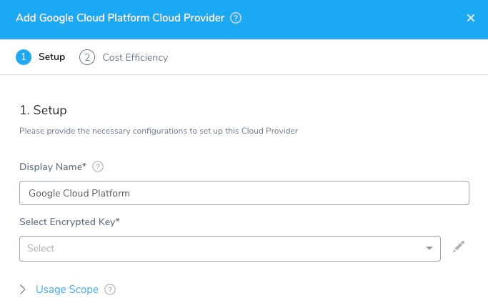

Connect Harness to Stackdriver to have Harness verify the success of your deployments and monitor live microservices. Harness will use your tools for verification and monitoring and use its machine learning features to identify sources of failures.

Most APM and logging tools are added to Harness as Verification Providers. For Stackdriver, you use the Google Cloud Platform account set up as a Harness Cloud Provider.

### Before You Begin

* See [Harness Key Concepts](../../../starthere-firstgen/harness-key-concepts.md).
* See the [Stackdriver Verification Overview](../continuous-verification-overview/concepts-cv/stackdriver-and-harness-overview.md).

### Step 1: Assign Roles and Permissions

The following roles must be attached to the account used to connect Harness and Stackdriver as a Google Cloud Provider:

* **Stackdriver Logs** - The minimum role requirement is **logging.viewer**
* **Stackdriver Metrics** - The minimum role requirements are **compute.networkViewer** and **monitoring.viewer**.

See [Access control](https://cloud.google.com/monitoring/access-control) from Google.

### Step 2: Add GCP Cloud Provider for Stackdriver

To add Stackdriver as a Cloud Provider, follow the steps for adding a [Google Cloud Platform](https://docs.harness.io/article/whwnovprrb-cloud-providers#google_cloud_platform_gcp) Cloud Provider.

1. In Harness, click **Setup**, and then click **Cloud Providers**.
2. Click **Add Cloud Provider** and select **Google Cloud Platform**.

   
   
### Step 3: Provide Google Cloud's Account Service Key File

In **Select Encrypted Key**, select or create a new [Harness Encrypted Text secret](https://docs.harness.io/article/ygyvp998mu-use-encrypted-text-secrets) that contains the Google Cloud's Account Service Key File.

To obtain the Google Cloud's Account Service Key File, see [Creating and managing service account keys](https://cloud.google.com/iam/docs/creating-managing-service-account-keys) from Google.

### Next Steps

* [Verify Deployments with Stackdriver Logging](3-verify-deployments-with-stackdriver.md)
* [Verify Deployments with Stackdriver Metrics](verify-deployments-with-stackdriver-metrics.md)
* [Monitor Applications 24/7 with Stackdriver Logging](2-24-7-service-guard-for-stackdriver.md)
* [Monitor Applications 24/7 with Stackdriver Metrics](monitor-applications-24-7-with-stackdriver-metrics.md)

